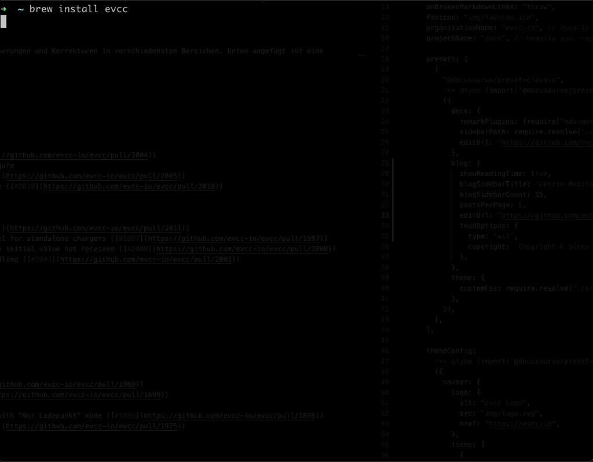

Es hat sich in den letzten Wochen viel getan, und darüber möchten wir heute etwas ausführlicher berichten was es alles in Version 0.71 an Neuem zu entdecken gibt.

## Einfachere Installation

Der Zugang zu **evcc** erforderte bisher doch einige technische Kenntnisse im Umgang mit dem jeweiligen Betriebssystem. Für Linux (Debian, Ubuntu, Raspberry Pi OS) und macOS gibt es nun eine deutlich vereinfachte Installation. So unterstützt **evcc** nun die Installation über die Paketmanager `apt` unter Linux und [`homebrew`](https://brew.sh) unter macOS.

Hierfür haben wir die Installationsanleitungen nochmals überarbeitet und damit die Installation weiter vereinfacht. Schaut doch mal in der [dazugehörigen Dokumentation](/docs/installation/overview) vorbei.

## Einfachere Konfiguration

Auch die Einrichtung von **evcc** war bisher noch sehr technisch geprägt. Seien es die Formatierungsvorgaben von [YAML](https://yaml.org), welches die Synthax der Konfigurations vorgibt, oder die Ausgestaltung und Anpassung der Konfiguration der eigenen Geräte in der Konfigurationsdatei. Für den ein oder anderen sind das doch recht hohe Hürden. Aber das Projektk ist noch jung und das Team überschaubar, vor allem wenn man bedenkt dass dies für die Entwickler "nur" ein Hobby ist.

Um diese Hürden etwas zu minimieren, führen wir mit dieser neuen Version 0.71 von **evcc** eine neue Funktionalität ein: Die geführte Konfiguration mit `evcc configure`.

Mit diesem Kommando lässt sich interaktiv eine funktionierende Konfigurationsdatei für die eigene Installation erstellen! Es gibt sicher hier und da noch einige Probleme und Fehler, aber wir hoffen es ist ein guter erster Schritt in die richtige Richtung.

## Weitere Neuigkeiten

Neben weiteren unterstützten Wallboxen von Alfen und Daheimladen, gibt es eine Reihe von Verbesserungen und Korrekturen in verschiedensten Bereichen. Unten angefügt ist eine komplette (englischsprachige) Liste der Änderungen.

## Changelog

General:

* macOS ([`homebrew`](https://brew.sh)) and Linux (`apt`) packages
* `evcc configure` interactive creation of a evcc.yaml configuration file

Chargers:

* Easee: verschiedene Fehlerkorrekturen fixes
* [6982afd](https://github.com/evcc-io/evcc/commit/6982afd) Add Alfen charger ([#1969](https://github.com/evcc-io/evcc/pull/1969))
* [de031b4](https://github.com/evcc-io/evcc/commit/de031b4) Add DaheimLaden charger ([#1699](https://github.com/evcc-io/evcc/pull/1699))
* [23bf8b5](https://github.com/evcc-io/evcc/commit/23bf8b5) Evse: require remote mode
* [fe49451](https://github.com/evcc-io/evcc/commit/fe49451) openWB: fix implementation to work with "Nur Ladepunkt" mode ([#1895](https://github.com/evcc-io/evcc/pull/1895))
* [cb3c8ef](https://github.com/evcc-io/evcc/commit/cb3c8ef) SMA: improve error handling ([#1975](https://github.com/evcc-io/evcc/pull/1975))

Vehicles:

* [3c0e429](https://github.com/evcc-io/evcc/commit/3c0e429) Bluelink: add charge status and odometer ([#1923](https://github.com/evcc-io/evcc/pull/1923))
* [27c4b7d](https://github.com/evcc-io/evcc/commit/27c4b7d) BMW: check api availability ([#1994](https://github.com/evcc-io/evcc/pull/1994))
* [3477ad3](https://github.com/evcc-io/evcc/commit/3477ad3) Fiat: handle evInfo empty for some vehicles ([#1960](https://github.com/evcc-io/evcc/pull/1960))
* [245721c](https://github.com/evcc-io/evcc/commit/245721c) Nissan: fix api access for added Accept: application/json header ([#1996](https://github.com/evcc-io/evcc/pull/1996))
* [1be3025](https://github.com/evcc-io/evcc/commit/1be3025) Volvo: improve charge state detection
* [f2b6dea](https://github.com/evcc-io/evcc/commit/f2b6dea) Volvo: improve error handling
* [51d412c](https://github.com/evcc-io/evcc/commit/51d412c) VW: add odometer ([#1468](https://github.com/evcc-io/evcc/pull/1468))
* [92b40dc](https://github.com/evcc-io/evcc/commit/92b40dc) Stop using vehicle charge start/stop apis ([#1920](https://github.com/evcc-io/evcc/pull/1920))
* [a20ac87](https://github.com/evcc-io/evcc/commit/a20ac87) Fix vehicle data not removed from UI after disconnect ([#1954](https://github.com/evcc-io/evcc/pull/1954))
* [a45e240](https://github.com/evcc-io/evcc/commit/a45e240) Improve action handling to consistently apply and reset vehicle settings ([#1942](https://github.com/evcc-io/evcc/pull/1942))
* [68a826e](https://github.com/evcc-io/evcc/commit/68a826e) Add resetOnDisconnect

Plugins:

* [0b248d5](https://github.com/evcc-io/evcc/commit/0b248d5) Add javascript and decoding support to the http plugin ([#1944](https://github.com/evcc-io/evcc/pull/1944))
* [4c5020a](https://github.com/evcc-io/evcc/commit/4c5020a) Modbus: add timeout setting ([#1930](https://github.com/evcc-io/evcc/pull/1930))
