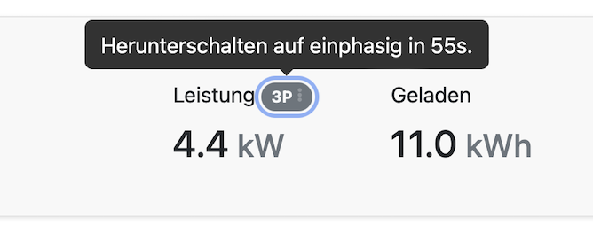

Heute gibt es ein kleines Update hauptsächlich mit einigen Fehlerkorrekturen und weiteren Verbesserungen.

## Timer in der UI

Die Oberfläche zeigt euch nun die im Hintergrund laufenden Timer an:

- Im PV Modus:
  - Wann wird das Laden unterbrochen
  - Wann wird mit dem Laden wieder begonnen
- 1p3p Phasenumschaltung:
  - Wann wird auf 3p hochgeschaltet
  - Wann wird auf 1p heruntergeschaltet

Zusätzlich wird auch angezeigt mit wievielen Phasen geladen wird.

## Zielladen

Die Zielladen Funktionalität ist zurück. Hiermit kann man das EV auf ein bestimmtes Datum und Uhrzeit auf den geewünschten SoC Wert laden.

## Download & Installation

- [Debian, Ubuntu, Raspberry Pi](/docs/installation/linux)
- [macOS Homebrew](/docs/installation/macos)
- [Docker, Synology](/docs/installation/docker)
- [Manuell (inkl. Windows)](/docs/installation/manual)

## Changelog

- [Detaillierte Liste der Änderungen](https://github.com/evcc-io/evcc/releases/tag/0.74)
