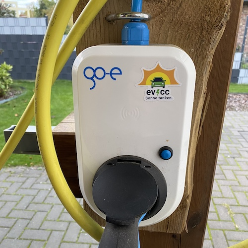
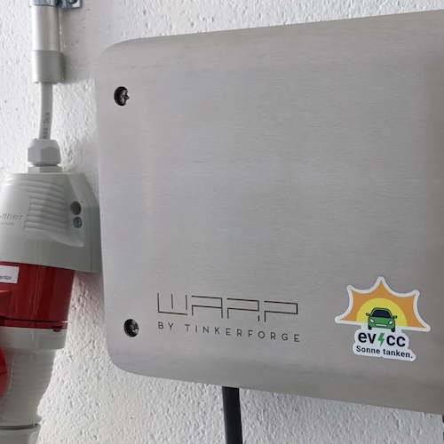
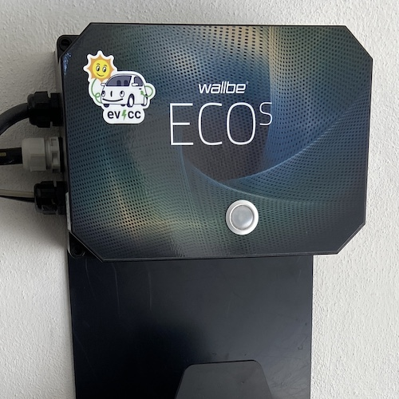
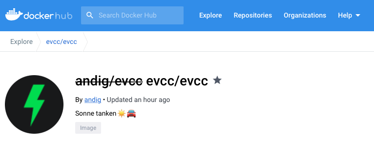

Es sind schon wieder siebzehn Releases seit unserem letzten Update hier im Blog vergangen. Wie immer ist eine Menge passiert. Einige Bugfixes, aber auch viele neue Integrationen und Funktionen sind dazu gekommen. Zu unseren Highlights der letzten Monate in einem späteren Blogartikel mehr.

<!-- truncate -->

## 🌱 Nachhaltige Open Source Entwicklung

evcc hat als kleines Hobbyprojekt angefangen, weil wir unzufrieden mit den bestehenden Lösungen für PV-Überschussladen waren und uns etwas Besseres bauen wollten. Inzwischen macht evcc aber nicht nur unser privates Sonnenladen leichter. Es gibt vermutlich mehrere tausend Installationen, die morgens das Auto wecken, sobald die Sonne auf die heimische PV-Anlage scheint. Der Gedanke macht uns sehr froh.

Genaue Zahlen über unsere Nutzerbasis haben wir nicht. Wir mögen Datensparsamkeit und haben daher auch keine Ambition ein allgemeines Tracking in unsere Webseite oder die Applikation einzubauen. Dennoch können wir anhand von Zahlen aus Docker (bisher >1 Mio. Pulls) und Cloudsmith (aktuell ~4.5k Paketdownloads pro Tag) ziemlich gut erkennen, dass sich Viele im Alltag auf evcc verlassen.

Damit wir das Projekt mit ausreichendem Fokus pflegen und weiterentwickeln können, ist nachhaltige Finanzierung ein wichtiges Thema. Hinter evcc steckt kein großes Unternehmen, kein Wallboxhersteller und wir haben auch keine Lust auf das Startupspiel mit Investoren. Aktuell ist evcc ein Projekt, was wir in unserer Freizeit vorantreiben. Wir sind überzeugt davon, dass es eine gute Idee ist, direkt für euch, die Nutzer zu arbeiten und unabhängig von anderen Verpflichtungen und Zwängen zu sein.

Mit **GitHub's Sponsoring** haben wir eine sehr leichtgewichtige und einfache Lösung gefunden, um finanzielle Unterstützung direkt von Nutzern entgegennehmen zu können. Zudem haben wir dadurch die Möglichkeit, **einige Funktionen exklusiv für Sponsoren** bereitzustellen. Momentan sind dies bestimmte Wallbox-Typen und die Telemetry Funktion, wir können uns aber durchaus vorstellen dieses Modell in Zukunft noch anzupassen.

## 💚 Danke an alle Sponsoren

Aktuell haben wir **über 1.500 Sponsoren** 🥳, die einen monatlichen Beitrag von mindestens $2 zahlen. Das ist ziemlich cool, ein großer Vertrauensbeweis und bestärkt uns darin weiter viel Zeit in das Projekt zu investieren.

Zusätzlich zum Sponsortoken um Funktionen freizuschalten schicken wir allen Unterstützern auch gerne Sticker. Damit könnt ihr Laptop, Raspberry, Wallbox oder euer Ladeequipment verschönern. Den Link zum Stickerformular findet ihr in der evcc UI unten rechts beim Klick auf das Sonnensymbol.

| [@evcc_io](https://twitter.com/evcc_io/status/1489667714411114502)                                                    | [@Ein_Klimawender](https://twitter.com/Ein_Klimawender/status/1589844295992819712)                                        | [@frd9900](https://twitter.com/frd9900/status/1591416016848162816)                                                      |
| --------------------------------------------------------------------------------------------------------------------- | ------------------------------------------------------------------------------------------------------------------------- | ----------------------------------------------------------------------------------------------------------------------- |
|                         |  |                        |
| [@ABBolle](https://github.com/evcc-io/evcc/discussions/4446#discussioncomment-4069333)                                | [@rediculum](https://github.com/evcc-io/evcc/discussions/4446#discussion-4393578)                                         | [@123aerox](https://github.com/evcc-io/evcc/discussions/4446#discussioncomment-4013806)                                 |
|  |         |  |

## 📮 Einmal-Sponsoring

Wir haben schon mehrfach das Feedback bekommen, dass Nutzer Bauchschmerzen mit monatlichen Zahlungen haben und sich eine Möglichkeit der Einmalzahlung wünschen, um ein Sponsortoken zu erhalten. Dies ist nun möglich. Auf der [GitHub Sponsoring Seite](https://github.com/sponsors/evcc-io?frequency=one-time) gibt es jetzt neben den monatlichen auch One-time-Stufen. Folgende Preisstufen haben wir uns überlegt:

- **🌱 $100 - Nachhaltige Entwicklung** Du trägst dazu bei, dass wir auch zukünftig viel Energie in die Weiterentwicklung von evcc investieren können. Außerdem bekommst du **ein unbefristetes Sponsortoken**, mit dem du alle evcc Funktionen nutzen kannst.
- ~**☀️ $150 - Friends & Family** Du bekommst **drei unbefristete Sponsortoken**. Eins für dich und zwei weitere, die du an Freunde oder Familie weitergeben kannst. Du wirst als Sponsor auf [evcc.io](https://evcc.io) erwähnt.~
- **🚛 $1.000 - Multiplikator** Für Elektriker und Solarteure. Du möchtest evcc für mehrere Kunde einsetzen? Schreib uns an [info@evcc.io](mailto:info@evcc.io) und wir finden eine gute Lösung.

Die Ausstellung für die unbefristeten Sponsortoken funktioniert genauso wie der aktuelle Prozess über [sponsor.evcc.io](https://sponsor.evcc.io). Einziger Unterschied ist, dass das Token nicht abläuft.

:::note Update
Wir haben die Sponsorstufen 2026 angepasst. Mehr dazu in unserem [aktuellen Blog-Post](/blog/2026/01/01/highlights-browser-config-ready#sponsoring).
:::

## 🎟️ Contributor-Token

Community-Mitglieder, die über GitHub PRs zu substanziell zu evcc beigetragen haben, können auch ein freies Token erhalten. Wir sind immer froh über Bugfixes, brauchen aber auch dringend Unterstützung im Bereich Dokumentation und [Übersetzung](https://github.com/evcc-io/evcc/discussions/5218).

Was genau eine substantielle Contribution ist, haben wir nicht klar geregelt. Einen Kommafehler rausmachen qualifiziert noch nicht, das Beheben eines fiesen Bugs reicht aber definitiv. Schreib uns einfach eine Mail an [info@evcc.io](mailto:info@evcc.io) mit Verweis auf deinen GitHub Nutzernamen.

## 🚚 GitHub Sponsoring zieht um

Aktuell läuft das GitHub Sponsoring über den Account von [@andig](https://github.com/andig), dem Gründer von evcc. Der Betrag, der nach Ausgaben (Infrastruktur, Sticker, ...) im Monat übrig bleibt, wird über einen Verteilungsschlüssel an alle drei Mitglieder vom Core-Team verteilt. Um diesen Prozess transparenter zu machen, ziehen wir unser GitHub Sponsoring jetzt auf die [evcc-io Organisation](https://github.com/sponsors/evcc-io) um. Wenn ihr bereits Sponsor seid, müsst ihr nichts verändern. Euer Token läuft wie gewohnt weiter und auch der Beitrag findet den Weg an alle Teammitglieder. Wir haben aber alle Links zum Sponsoring auf die Organisation umgestellt. Einmalzahlungen gibt es auch nur dort.

## 🐳 Docker Image zieht um

Im gleichen Zug ziehen wir auch unsere Docker Images um. Bislang wurden die Pakete unter `andig/evcc` veröffentlicht. Nun findet ihr die offiziellen Versionen unter `evcc/evcc`.

An dieser Stelle noch einmal Danke an das Docker Team, die evcc als [Docker-Sponsored Open-Source-Projekt](https://www.docker.com/community/open-source/application/) qualifiziert haben. Dadurch bekommen wir kostenfreien Zugang zu Team-Funktionen von Docker Hub.

---

**Danke für eure Unterstützung!**
evcc Core Team 
[@andig](https://github.com/andig), [@premultiply](https://github.com/premultiply) und [@naltatis](https://github.com/naltatis)
