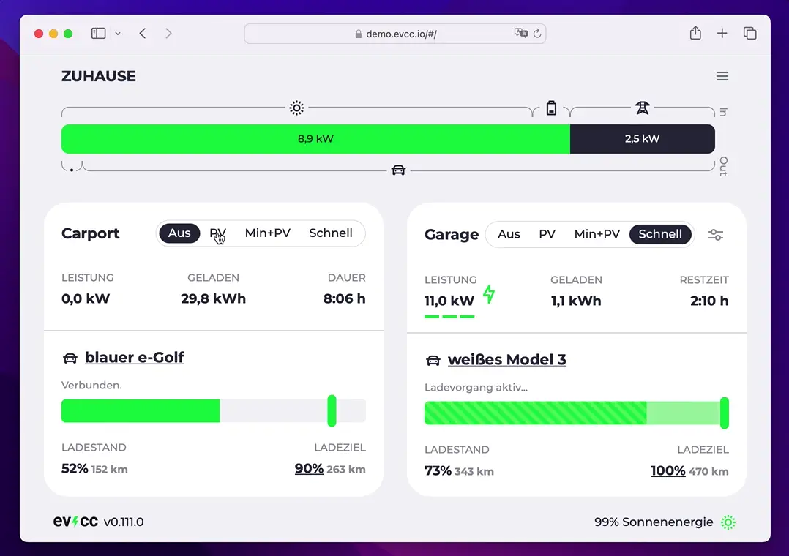

Pünktlich am 11.1. haben wir mit dem Release 0.111 wieder einige neue Funktionen am Start die wir euch hier kurz vorstellen möchten.

<!-- truncate -->

## 🧞‍♂️ Neuer Ladeplaner: Erneuerbaren Netzstrom nutzen

Die Zielladenfunktion gibt es in evcc schon seit einiger Zeit. Damit kannst du eine Zielzeit definieren zu der das verbundene Fahrzeug einen bestimmten Ladestand erreichen soll. Die Funktion ist bspw. praktisch um den Wagen vor längeren Fahrten pünktlich zur Abfahrt aufzuladen.



Die bisherige Ladestrategie war relativ simpel: Die Ladung wird möglichst spät gestartet, sodass der Akku pünktlich zur Abfahrt den gewünschten Stand erreicht hat. Das schont den Akku da er nicht lange auf hohen Ladeständen geparkt wird.

Mit diesem Release wird der Ladeplaner intelligenter und bezieht dynamische Energiepreise und CO₂-Daten mit ein. Damit wird die Ladung auf Zeitfenster geplant in denen besonders viel erneuerbarer Strom im Netz ist. Das spart Geld, entlastet das Stromnetz und reduziert den Bedarf an fossilien Energieträgern.

### 📈 Börsenpreise mit awattar und Tibber

Die stundenabhängigen Tarife von awattar und Tibber haben wir schon länger angebunden. Bislang hatten wir aber nur eine einfache Steuerung, die das Laden unter einem vorher zu konfigurierenden Strompreis freigibt (`cheap`).

Jetzt werden die stündlichen Preise auch in der Ladeplanung verwendet und das Auto lädt dann wenn der Netzstrom besonders günstig ist.

Konfiguration für awattar

```yaml
tariffs:
  grid:
    type: template
    template: awattar
    region: de # or at
```

Konfiguration für Tibber

```yaml
tariffs:
  grid:
    type: template
    template: tibber
    token: "476...963a4" # access token
```

### 📊 Manuelle Zeittarife

Es ist nun auch möglich Zeittarife zu hinterlegen. Hier eine Beispielkonfiguration für günstige Energie zu Nachtzeiten und noch günstigere Energie am Wochenende:

```yaml
tariffs:
  grid:
    type: fixed
    price: 0.294 # EUR/kWh
    zones:
      - days: Mo-Fr
        hours: 2-5
        price: 0.2 # EUR/kWh
      - days: Sa,So
        price: 0.15 # EUR/kWh
```

Auch diese Preisdaten fließen in den neuen Planungsalgorithmus mit ein.

### 🌱 CO₂-Daten von GrünStromIndex und ElectricityMap

Wer keinen dynamischen Stromtarif hat kann dennoch klimaschonen Laden. Dafür binden wir jetzt CO₂-Daten ein. Aktuell haben wir zwei Quellen implementiert. Wir sind aber offen für weitere Vorschläge.

[GrünStromIndex](https://gruenstromindex.de) liefert regionale Vorhersagen über die Sauberkeit des Netzstroms für Deutschland. Du musst lediglich deine Postleitzahl hinterlegen.

```yaml
planner:
  type: template
  template: grünstromindex
  zip: 12349
```

[Electricity Map](https://app.electricitymaps.com/map) liefert weltweite Vorhersagen. Für die Nutzung in evcc benötigt Ihr ein Token und den URL Präfix. Diese Daten bekommst du mit dem [kostenlosen Account im API portal](https://api-portal.electricitymaps.com/).

```yaml
planner:
  type: template
  template: electricitymaps
  uri: https://api-access.electricitymaps.com/2w...1g/
  token: Rp...D2
  zone: DE
```

## Ausblick

Für eines der nächsten Releases arbeiten wir an einer visuellen Aufbereitung des Ladeplans. Dann kannst du auch die vom Algorithmus errechneten Zeitfenster und die konkrete Kosten- oder CO₂ Ersparnis sehen.

## Weitere neue Funktionen

Dieses Release enthält neben den üblichen kleinen Verbessungen und Bugfixes auch noch ein paar weitere neue Funktionen:

- 🔋🪫 Bessere Unterstützung von mehreren Hausakkus [#5598](https://github.com/evcc-io/evcc/pull/5598)
- 🌞 Unterstützung für FoxESS [#5721](https://github.com/evcc-io/evcc/pull/5721)
- 🔌 Unterstützung für den Tesla Wall Connector 3 [#5341](https://github.com/evcc-io/evcc/pull/5341)
- 🚙 Unterstützung für Volvo Fahrzeuge [#5681](https://github.com/evcc-io/evcc/pull/5681)
- 🏳️‍🌈 Drei neue UI Sprachen

**Danke für eure Unterstützung!**<br />
evcc Core Team<br />
[@andig](https://github.com/andig), [@premultiply](https://github.com/premultiply) und [@naltatis](https://github.com/naltatis)
