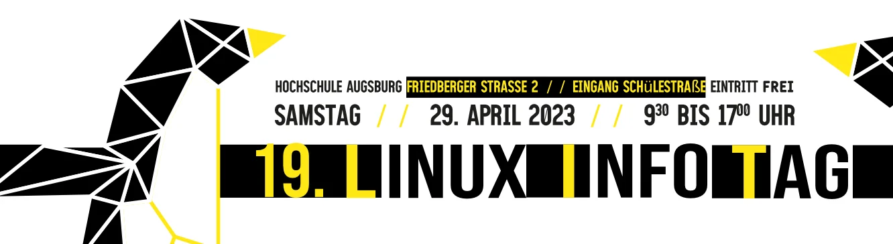
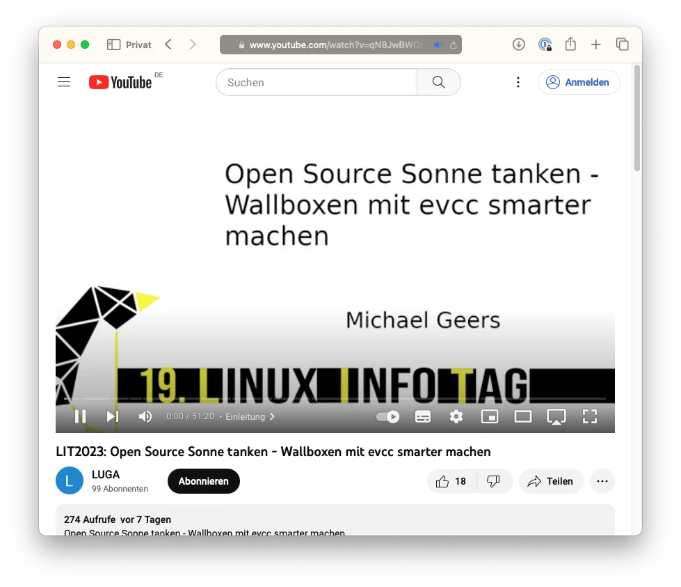

Ende April fand, nach einer langen Coronapause, der [19. Linux Infotag](https://www.luga.de/static/LIT-2023/) statt. Der Infotag ist eine Open-Source-Community-Veranstaltung, die von der [Linux User Group Augsburg e.V. (LUGA)](https://www.luga.de/) organisiert wird.

<!-- truncate -->

## Video-Aufzeichnung ist jetzt verfügbar

Neben vielen anderen spannenden Themen hatten wir dieses Jahr die Möglichkeit unser Projekt vorzustellen. Inzwischen ist auch die Video-Aufzeichnung verfügbar.

[YouTube: Open Source Sonne tanken - Wallboxen mit evcc smarter machen](https://www.youtube.com/watch?v=qN8JwBWOlzw)

Neben der allgemeinen Einführung in das Thema E-Autos mit eigenem Sonnenstrom laden ging es auch um smartes Netzladen und ich habe Einblicke in den Entwicklungsprozess und unser Finanzierungsmodell gegeben. Schau also gerne mal rein.

Die Folien zum Talk findet ihr auf [Speaker Deck.](https://speakerdeck.com/naltatis/open-source-sonne-tanken-wallboxen-mit-evcc-smarter-machen) 👇

