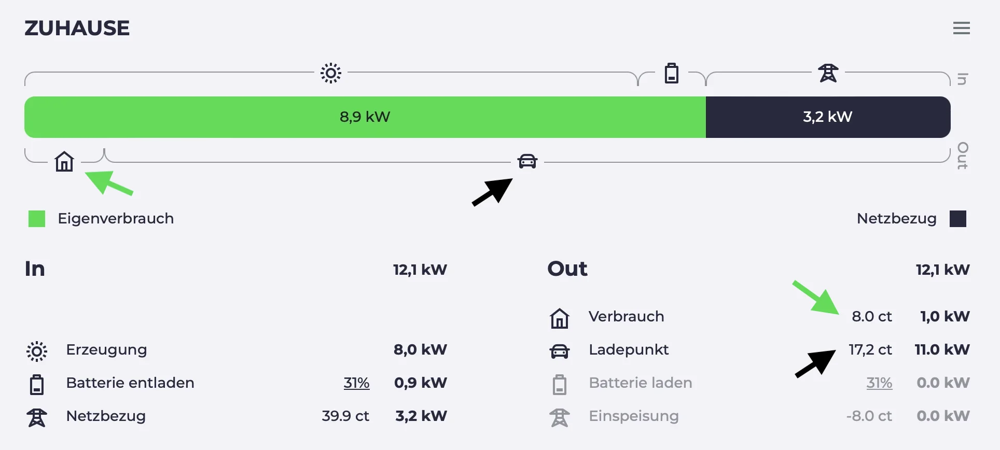

import Video from "../../src/components/Video";
import batterysettingsVideo from "./batterysettings.mp4";
import batterysettingsPoster from "./batterysettings.webp";
import chargingplanVideo from "./chargingplan.mp4";
import chargingplanPoster from "./chargingplan.webp";
import chargingsessionsVideo from "./chargingsessions.mp4";
import chargingsessionsPoster from "./chargingsessions.webp";
import dynamicpricesVideo from "./dynamicprices.mp4";
import dynamicpricesPoster from "./dynamicprices.webp";
import minsocVideo from "./minsoc.mp4";
import minsocPoster from "./minsoc.webp";
import sessionvaluesVideo from "./sessionvalues.mp4";
import sessionvaluesPoster from "./sessionvalues.webp";

Seit dem letzten Blog-Artikel hat sich einiges getan. Wir haben viele neue Funktionen hinzugefügt und einige Fehler behoben. In diesem Artikel werden wir ein paar der neuen Funktionen hervorheben.

## Visualisierung Ladeplanung

Die Ladeplanung gibt es bei evcc ja schon etwas länger.
Du gibst an, wann dein Fahrzeug wie voll sein soll und evcc sucht die besten Zeiträume zum Laden.
Seit einigen Releases ist der Algorithmus keine Blackbox, da wir das Planungsergebnis grafisch darstellen.

<Video src={chargingplanVideo} poster={chargingplanPoster} />

{/* truncate */}

Zur Funktionsweise des Algorithmus:

1. Überschüssige Sonnenenergie wird priorisiert
2. Zeiten mit günstigem Netzstrom (wenn [dynamischer Stromtarif](/docs/features/dynamic-prices) existiert)
3. Zeiten mit sauberem Netzstrom (wenn [CO₂-Schnittstelle](/docs/features/co2) konfiguriert ist)
4. Zeitfenster kurz vor Abfahrt

**Ausblick:** Aktuell experimentieren wir mit PV-Prognosedaten von [Solcast](https://solcast.com/).
Dadurch kann der Algorithmus noch bessere Entscheidungen treffen.
Liegt das Ladeziel bspw. am Tag, kann es sinnvoll sein, das Fahrzeug nicht komplett mit günstigem Nachstrom zu laden, sondern Platz für Überschussenergie am Tag zu lassen.

## Mindestladung über UI einstellbar

Die Mindestladung-Funktion existiert bei evcc schon seit Ewigkeiten.
Sie ist hilfreich, wenn du mal mit wenigen Prozenten nach Hause kommst und sichergehen willst, dass du immer genug Reichweite für bspw. ein unerwartetes Ereignis hast.

Bislang konnte sie aber nur über die Konfigurationsdatei oder per API eingestellt werden.
Inzwischen geht das auch über die UI unter **Plan** > **Ankunft** > **Min. Ladung %**.

Die Einstellungen werden pro Fahrzeug gespeichert und bleiben auch nach einem Neustart oder Update erhalten.

<Video src={minsocVideo} poster={minsocPoster} />

## Smartes Netzladen

Reicht der eigene PV-Überschuss mal nicht aus, kannst du auch Netzstrom nutzen, wenn er besonders günstig oder sauber ist.
Klickst du im Energieflussdiagramm auf den Netzstrompreis bzw. die CO₂-Emissionen, öffnet sich der Dialog **Smartes Netzladen**.

Dort kannst du einen Schwellwert für den Preis bzw. die CO₂-Emissionen einstellen.
Wird dieser Wert unterschritten, wechselt evcc bei allen Ladepunkten im PV-Modus zeitweise auf schnelles Laden.

<Video src={dynamicpricesVideo} poster={dynamicpricesPoster} />

Voraussetzung für diese Funktion ist natürlich, dass du entweder einen dynamischen Strompreis oder eine CO₂-Schnittstelle konfiguriert hast.

Eine weitere kleine Neuerung ist auch, dass du bei den meisten dynamischen Strompreisen nun auch die Möglichkeit hast auf die Preiswerte der API um Angaben um **prozentuale bzw. feste Abgaben** zu korrigieren (`charges` / `tax`).
Tibber und Octopus Energy (UK) liefern bereits Werte inkl. Abgaben.
Bei Awattar, Nordpool Estonia und Energinet kann man diese nun ergänzen.

Übrigens: Falls du einen dynamischen Stromtarif hast, der noch nicht unterstützt ist, aber eine Schnittstelle bietet, dann mach gerne einen GitHub Issue dazu auf.

## Batterieeinstellungen

Ein großer Vorteil den evcc gegenüber anderen Überschussladeregelungen hat, ist die Berücksichtigung des Hausakkus.
Über den Konfigurationswert [`prioritySoc`](/docs/features/battery) kann geregelt werden, ob überschüssige Sonnenenergie **zuerst in den Hausakku oder das Fahrzeug** geladen werden soll.

Generell versucht evcc im PV-Modus das Umlanden von Hausakku in Fahrzeugakku zu verhindern, um unnötige Wechselverluste zu vermeiden.
Mit dem Wert [`bufferSoc`](/docs/features/battery) kannst du jedoch bewusst **einen Anteil des Hausakkus zur Ladeunterstützung** freigeben.

Zudem kannst du festlegen, dass der Ladevorgang **automatisch startet**, sobald der Akku einen bestimmten Ladestand überschritten wurde ([`bufferStartSoc`](/docs/features/battery)).
Die Autoladung startet dann, auch wenn die Sonne nicht scheint.

<Video src={batterysettingsVideo} poster={batterysettingsPoster} />

## % Sonne, Preis, CO₂ pro Ladevorgang

Auf für die Freunde der Datenanalyse gibt es eine neue Funktion.
Wir erfassen nun den Anteil an eigener Sonnenenergie (in %), den Preis (gesamt und pro kWh), die Ladedauer und die durchschnittlichen CO₂-Emissionen pro Ladevorgang.
Zwischen diesen Werten kannst du direkt am Ladevorgang wechseln.

<Video src={sessionvaluesVideo} poster={sessionvaluesPoster} />

## Neue Berechnung Sonnenanteil

Falls ihr festgestellt habt, dass der Anteil an Sonnenenergie seit einer der letzten Versionen leicht gesunken ist, dann liegt das an unserer neuen Berechnung.
Bislang hat evcc das Verhältnis von Netz- und Eigenenergie immer gleichmäßig auf Hausverbrauch und die Ladevorgänge aufgeteilt.

Wir haben jetzt auf ein neues Modell umgestellt, bei dem der Hausverbrauch zuerst den grünen Strom bekommt und der verbleibende Mix an die Ladevorgänge geht.
Danke an [@MarkusGH](https://github.com/MarkusGH) für die Umsetzung.
Mehr Details zu dem Modell findet ihr [in der Dokumentation](/docs/faq#ersparnisberechnung).

## Übersicht Ladevorgänge

Die neuen Werte haben natürlich auch Einzug in die Übersicht der Ladevorgänge gehalten.
Je nach Konfiguration sind hier jetzt auch Preise und CO₂-Emissionen zu sehen.
Zudem haben wir die Darstellung deutlich überarbeitet und eine **kompakte Tabellendarstellung auf Monatsbasis** gewählt.
Es kann **nach Ladepunkt und Fahrzeug gefiltert** werden.

Wer hier noch mehr Flexibilität braucht, kann natürlich auch auf den CSV-Export zurückgreifen oder sich die Rohdaten gleich per InfluxDB oder MQTT abholen.

<Video src={chargingsessionsVideo} poster={chargingsessionsPoster} />

## Priorisierung von Ladepunkten und Fahrzeugen

Hast du mehrere Ladepunkte kannst du mit der [`priority`](/docs/reference/configuration/loadpoints#priority) Einstellung festlegen, welcher bevorzugt werden soll.
Die Priorisierung kannst du auch vom erkannten Fahrzeug abhängig machen oder per API steuern.
Eine Konfiguration über die UI gibt es aktuell noch nicht.

Die Priorisierungsfunktion ist auch hilfreich, wenn du evcc bspw. zum Steuern weiterer Verbraucher nutzt.
So kannst du bspw. einen [über die Plugin-Schnittstelle angebundenen Heizstab oder eine Wärmepumpe](https://github.com/evcc-io/evcc/pull/9393) so steuern, dass sie nur läuft, wenn das Auto gerade nicht (genug) lädt.

## Ausblick

Unser [Backlog](https://github.com/evcc-io/evcc/issues?q=is%3Aopen+is%3Aissue+label%3Abacklog) ist gut gefüllt.
Dies sind die nächsten großen Themen, die wir angehen wollen:

**Config UI:** Hier sind inzwischen alle Vorbedingungen erfüllt.
Aktuell können im 🧪 Experimental Modus schon Fahrzeuge angelegt werden und der Sprung zur Netz-, PV- oder Batteriekonfiguration ist nicht mehr weit.
Hier ist immer noch viel zu tun, aber das Licht am Ende des Tunnels ist sichtbar.

**Bessere Planung:** Wie oben schon erwähnt arbeiten wir daran gute **PV-Prognosen** in den Planungsalgorithmus und die UI zu integrieren.
Außerdem haben wir inzwischen ein Konzept für die Unterstützung **mehrere Ladepläne**.

**Modus-Überarbeitung:** evcc ist als Anwendung zur PV-Überschussladung gestartet.
Inzwischen spielt auch das Zusammenspiel mit dem Hausakku eine große Rolle.
Auch das Thema **netzdienliches Laden** auf Basis von dynamischen Stromtarifen oder CO₂-Emissionen nimmt immer mehr Fahrt auf.
Daher werden wir unsere Lademodi (aktuell PV und Min+PV) überarbeiten und hier mehr Flexibilität schaffen.

## Weitere neue Funktionen

Das war ein Durchflug auf hoher Ebene und aus Endnutzersicht.
Unter der Haube wird natürlich auch fleißig gewerkelt.

- 🔌 Unterstützung weiterer Wallboxen von 22 neuen Herstellern
- 🌞🔋📟 Unterstützung von Zähler-, PV- und Batteriesystemen von 36 neuen Herstellern
- 🇬🇧 Webseite und Dokumentation in englischer Sprache. Thanks [duckfullstop](https://github.com/duckfullstop) & [carygravel](https://github.com/carygravel) 💚

Für noch mehr Details könnt ihr auch gerne die [Release Notes](https://github.com/evcc-io/evcc/releases) der letzten 49(!) Releases seit Jahresbeginn durchgehen.

**Danke für eure Unterstützung!** 
evcc Core Team 
[@andig](https://github.com/andig), [@premultiply](https://github.com/premultiply) und [@naltatis](https://github.com/naltatis)
