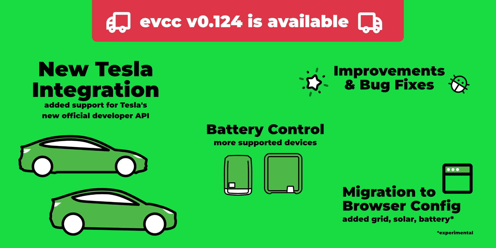
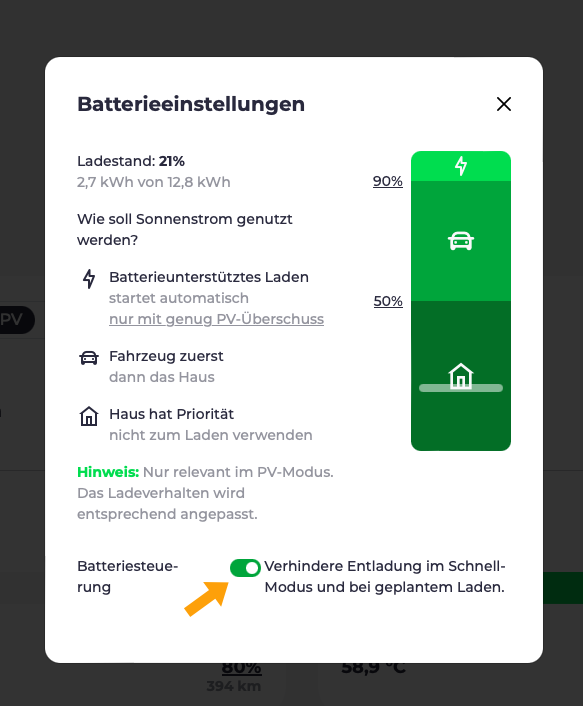
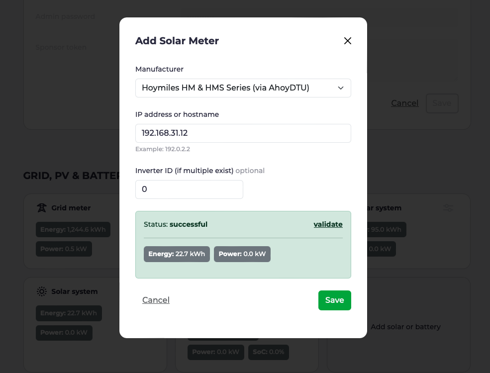

Die Tage werden länger und PV-Überschussladen beginnt wieder Spaß zu machen.
Ein guter Zeitpunkt für ein kurzes Update über die neuesten Entwicklungen bei evcc.

## Neue Tesla Integration

Im [Oktober](https://www.notateslaapp.com/news/1653/tesla-creates-official-apis-for-third-party-services-to-start-charging-for-usage) hat Tesla eine neue [offizielle API](https://developer.tesla.com/docs/fleet-api) vorgestellt.
Zudem wurde angekündigt, dass die alte, [inoffizielle API](https://www.teslaapi.io) Anfang 2024 abgeschaltet wird.
In der vergangenen Woche hat Tesla mit dieser Abschaltung Stück für Stück begonnen.

### Was bedeutet das für mich?

Um die neue API nutzen zu können, musst du zwei Anpassungen in der `evcc.yaml` vornehmen:

1. **Neuer Template-Name:** Da die alte API für einige Nutzer heute noch funktioniert, haben wir uns entschieden vorerst beide Implementierungen parallel anzubieten. Ändere den Template-Namen von `tesla` zu `tesla-command`, um die neue API zu nutzen.

2. **Neue Tokens erzeugen:** Mit der neuen API ist es nun möglich, die erforderlichen `accessToken` und `refreshToken` direkt im Browser zu erzeugen.
Dafür haben wir unter [tesla.evcc.io](https://tesla.evcc.io) eine kleine Webseite bereitgestellt.
Ersetze die alten Tokens in der `evcc.yaml` mit den neu erzeugten.

Die Konfiguration sollte dann wie folgt aussehen:

```yaml
vehicles:
 - name: mytesla
   type: template
   template: tesla-command # change `tesla` to `tesla-command`
   accessToken: ... # generetad by tesla.evcc.io
   refreshToken:  ... # generetad by tesla.evcc.io
   ...
```

Die über [tesla.evcc.io](https://tesla.evcc.io) erzeugten Token können **nur mit den offiziellen evcc Builds** (stable & nightly) verwendet werden.
Grund dafür ist, dass die Tokens aus Teslas neuer Developer API immer an eine 3rd-Party App gebunden sind.

Du kannst dir evcc natürlich auch weiterhin selbst bauen.
Dafür benötigst du aber einen eigenen Tesla Developer Account und musst die Tokens selbst erzeugen.
Mehr Details dazu findest du im entsprechenden [Pull Request](https://github.com/evcc-io/evcc/pull/10802).

### Privatsphäre & Sicherheit

Wie auch bei der alten API läuft die Kommunikation für Datenabfrage (Ladestand, Zustand, ...) und Steuerung (Aufwecken) direkt zwischen deiner lokalen evcc Instanz und der Tesla-Infrastruktur ab.
Lediglich die Token-Erzeugung läuft einmalig über unsere Webseite.
Tokens werden dabei nicht gespeichert, sondern nur im Browser angezeigt.

Für eine erweiterte Steuerung des Fahrzeuges (Ladevorgang direkt am Fahrzeug starten und stoppen) ist eine zusätzlich signierte Anfrage an Tesla erforderlich.
Dies betrifft heute konkret die Nutzer eines Tesla Wall Connectors.
Da wir unseren privaten 3rd-Party-App-Schlüssel nicht ins evcc Binary packen können bzw. dürfen, werden wir für diese Anwendung vermutlich einen [eigenen Service](https://github.com/evcc-io/evcc/pull/11893) bereitstellen, der diese Anfragen signiert und an Tesla weiterleitet.
Dazu aber mehr in einem späteren Release.

### Kosten

Tesla bietet die neue API [aktuell noch kostenlos an](https://developer.tesla.com/docs/fleet-api#membership-tiers).
Allerdings haben sie bereits angekündigt, dass sie in Zukunft für die Nutzung der API Gebühren erheben werden.
Wie Open-Source-freundlich dieses Modell ausfällt, wissen wir bisher nicht.

Daher ist es durchaus möglich, dass wir die Token-Bereitstellung in Zukunft nicht mehr kostenlos anbieten können.
Ggf. werden wir es mit dem existierenden evcc Sponsoring Modell verknüpfen.
Aber mehr dazu, wenn es neue Informationen von Tesla gibt.

## Aktive Batteriesteuerung

Ein großes neues Feature, was mit dem Weihnachts-Release Einzug gehalten hat, ist die aktive Batteriesteuerung.
Diese Funktion ist inzwischen nicht mehr als experimentell markiert.
Zudem sind in den vergangenen Wochen einige neue unterstützte Batterie-Wechselrichter hinzugekommen.
In der Dokumentation siehst du inzwischen auch, [ob dein Wechselrichter unterstützt wird](/docs/devices/meters#features).

### Passive Steuerung

Eine passive Batteriesteuerung bringt evcc schon seit einiger Zeit mit.
Hierbei regelt evcc das PV-Überschussladen so, dass die Hausbatterie nicht ungewollt mit entladen wird.
Im letzten Jahr haben wir einen [Konfigurationsdialog](/blog/2023/10/05/feature-highlights-10-2023#batterieeinstellungen) eingeführt, mit dem die Priorisierung zwischen Fahrzeug- und Hausbatterieladung eingestellt werden kann.
Dieses Modell funktioniert beim reinen Überschussladen auch sehr gut.
evcc kennt dabei lediglich den aktuellen Ladezustand der Hausbatterie und regelt nur die Ladeleistung des Fahrzeuges.
Dieser Mechanismus funktioniert allerdings nicht beim Schnellladen.
Hierfür ist eine aktive Batteriesteuerung erforderlich.

### Entladesperre beim Schnellladen

Standardmäßig probiert die Hausbatterie den gesamten Energieverbrauch des Hauses (inkl. Ladestationen) zu decken.
Abhängig vom aktuellen Strompreis oder erwarteter PV-Erzeugung kann es aber wünschenswert sein, die Energie beim **schnellen Fahrzeugladen** direkt aus dem Netz und nicht aus der Hausbatterie zu beziehen.
Damit bleibt die gesammelte Sonnenenergie in der Hausbatterie und kann bspw. nachts für den Hausverbrauch genutzt werden.

Dies ist unser erster Anwendungsfall für die aktive Batteriesteuerung.
Unterstützt dein Wechselrichter dieses Feature, erscheint im Batterieeinstellungen Dialog eine entsprechende Option.



Ist diese Option aktiv, wird die Hausbatterie beim Schnellladen in einen Sperrmodus versetzt.
In dieser Zeit wird er weder entladen noch geladen.
Diese Sperre ist auch bei [geplantem Laden](/blog/2023/10/05/feature-highlights-10-2023#visualisierung-ladeplanung) und beim [smarten Netzladen](/blog/2023/10/05/feature-highlights-10-2023#smartes-netzladen) aktiv.

### Nächster Schritt: Batterie mit günstigem Netzstrom laden

Die nächste Ausbaustufe für die aktive Batteriesteuerung ist die Möglichkeit, die Hausbatterie mit günstigem Netzstrom zu laden.
Das ist vor allem für Nutzer von dynamischen Stromtarifen an dunkleren Tagen interessant.
Ziel ist es dabei, die Hausbatterie in Niedrigpreisphasen mit Energie aus dem Netz zu füllen und diese Energie dann in Hochpreisphasen zu nutzen.
Die erforderlichen Hardwareintegrationen haben wir bereits umgesetzt.
Daher rechnen wir damit, dass diese Funktion in einem der nächsten Releases verfügbar sein wird.

## Update: Migration zur Browser-Konfiguration

evcc ist ein sehr flexibles und mächtiges System für die eigene Energieoptimierung.
Unsere größte Herausforderung ist es weiterhin, diese Flexibilität mit einer einfachen Einrichtung zu vereinen.
In den letzten Monaten haben wir große Fortschritte im Bereich der Konfiguration gemacht.
Unser Ziel ist es eine reine browserbasierte Inbetriebnahme, ohne `evcc.yaml`, zu ermöglichen.

Hast du im Einstellungsdialog die Option "Experimentelle UI-Funktionen zeigen" aktiviert, kannst du unter "🧪 Device Configuration" unseren aktuellen Entwicklungsfortschritt sehen.
Aktuell können dort Fahrzeuge, Netzzähler, PV- und Batteriesysteme hinzugefügt und bearbeitet werden.
Ladepunkte und Tarife folgen in der nächsten Iteration.
Auch wenn das Ganze noch ein "Work in Progress" ist, freuen wir uns über dein Feedback.



## Kleine Verbesserungen und Fehlerbehebungen

Wie immer enthält dieses Release auch eine Reihe kleinerer Verbesserungen und Fehlerbehebungen.
Für mehr Details schau dir die [Release Notes](https://github.com/evcc-io/evcc/releases/tag/0.124.0) an.

Viele Grüße<br/>
euer evcc Core-Team