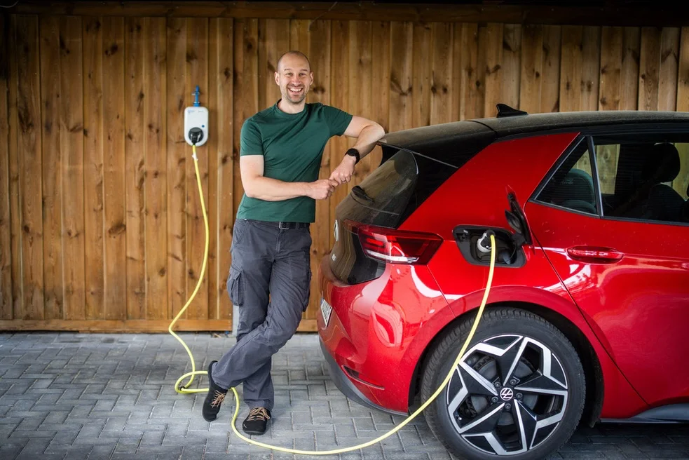
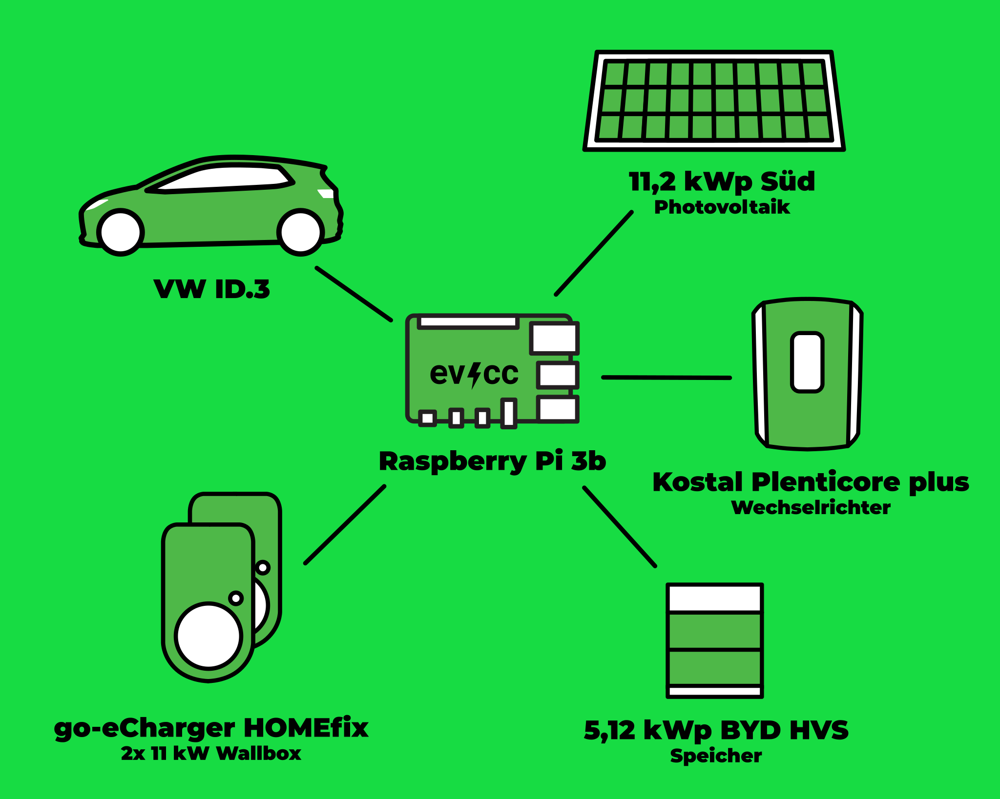

Vor einiger Zeit ist [Detlef Heese](https://hee.se) aus Osnabrück auf uns zugekommen.
Er ist renommierter Fotograf, Elektromobilist und PV-Anlagenbesitzer.
Er hat uns angeboten, das Projekt evcc zu unterstützen und uns mit professionellen Fotos zu versorgen.
Ende letzten Jahres haben wir daher einen [Aufruf auf GitHub](https://github.com/evcc-io/evcc/discussions/10285) gestartet, um interessierte Nutzer zu finden, die sich und ihr evcc-Setup für ein Community-Porträt zur Verfügung stellen.
Dieser Blogbeitrag ist das erste Porträt aus dieser Reihe.

## Der Weg zur E-Mobilität

**Michael:** Hallo Arne, vielen Dank, dass du dir die Zeit für dieses Interview genommen hast. 
Kannst du uns ein wenig über dich erzählen und wie du zur Elektromobilität gekommen bist?

**Arne:** Hallo Michael, ich heiße Arne und komme aus der Kleinstadt Gifhorn. 
Hier wohne ich mit meiner Frau und meinen beiden Kindern in einem Einfamilienhaus. 
Aufgrund der Wallbox-Förderung im Jahr 2021 haben wir angefangen, uns mit der Elektromobilität zu beschäftigen.
Wir haben uns damals kostengünstig und mit ein wenig Eigenleistung gleich zwei Wallboxen installieren lassen. 
Getreu dem Motto: "Haben ist besser als Brauchen!"
Noch bevor die Wallboxen installiert waren, haben wir uns mit dem Gedanken angefreundet, einen unserer beiden Verbrenner durch ein Elektrofahrzeug zu ersetzen.
Sicherlich spielte die Fördermöglichkeit auch hier eine wichtige Rolle.

Kurze Zeit später haben wir einen ID.3 Pure bestellt, der dann auch noch im selben Jahr geliefert wurde.
Und während wir auf den ID.3 gewartet haben, haben wir das Paket dann rund gemacht und auch noch eine 11,2 kWp PV-Anlage beauftragt, die dann Anfang 2022 montiert wurde.
Im letzten Jahr haben wir noch einen kleinen BYD-Speicher der PV-Anlage hinzugefügt, der allerdings hauptsächlich für den Hausverbrauch angeschafft wurde und nur in geringem Umfang für die Ladung des E-Autos benutzt wird.

**Michael:** Das klingt nach einer super Kettenreaktion.
Wie bist du zu evcc und dem Thema PV-Überschussladen gekommen?

**Arne:** Noch bevor die PV-Anlage installiert war, war mir bereits klar, dass ich eine Möglichkeit haben will, mit möglichst viel Strom vom eigenen Dach zu laden.
Erstmal hatte ich die Idee, die Wallbox mit einem eigenen kleinen Script dazu zu bewegen, die Ladung zu starten, wenn genug Überschuss zur Verfügung steht.
Nach ein bisschen Recherche bin ich dann darauf gestoßen, dass es sowas ja bereits gibt: evcc.

## Technische Einblicke

**Michael:** Kannst du uns einige technische Details zu deiner Installation geben?

**Arne:** Gern, hier sind die wichtigsten technischen Details:

| Komponente     | Details                                            |
| -------------- | -------------------------------------------------- |
| **Auto**       | VW ID.3 pure                                       |
| **Wallboxen**  | 2x go-eCharger HOMEfix 11 kW                       |
| **Wechselrichter** | Kostal Plenticore plus 10 Kostal Smart Energy Meter |
| **Solarmodule**   | 28x Trina Vertex S 400Wp (gesamt 11,2 kWp) fast perfekte Südausrichtung auf 45° Dach |
| **Speicher**      | BYD HVS 5.1 (5,12 kWh)                          |
| **Steuerung**  | evcc auf einem RaspberryPi 3b                     |

Daneben betreibe ich auch noch eine ioBroker-Instanz, die allerdings nicht in die Laderegelung involviert ist.

## Was magst du an evcc?

**Michael:** Das sieht wie eine runde Sache aus. Warum hast du dich entschieden, evcc zu nutzen und was gefällt dir an dem Projekt?

**Arne:** Ich habe nicht erwartet, dass wir mit evcc tatsächlich die Autarkie so stark in die Höhe treiben können.
Im laufenden Jahr liegen wir gerade bei einer Autarkie von über 80 % (Stand Anfang August).
Es passt einfach perfekt zu unserer Situation: Arbeit mit Homeoffice-Anteil, zusätzliches Auto im Haushalt, meist nur kurze Fahrstrecken im näheren Umkreis. 
Wir können unser Elektroauto auch mal tagsüber stehen lassen und so die Sonne direkt tanken.
Das Auto wird zu Hause einfach immer an die Wallbox angeschlossen und dank der automatischen Erkennung startet evcc die Ladung, sobald genug Überschuss zur Verfügung steht.
Dadurch ist das Auto auch eigentlich immer geladen und einsatzbereit.
Wir müssen uns im Alltag einfach kaum Gedanken um den Ladestand machen.
Selbst im Winter ist dank der Mindestladung für die täglichen Fahrten immer genug Energie in der Autobatterie.
Einfacher und komfortabler geht es nicht.
Damit habe ich sicherlich auch meiner Frau den Umstieg auf die E-Mobilität erleichtert.

**Michael:** Das klingt wirklich großartig! Vielen Dank, dass du deine Erfahrungen mit uns geteilt hast.

---

Danke auch an Detlef für die tollen Fotos. Wir freuen uns darauf, in zukünftigen Blogbeiträgen noch mehr Geschichten aus unserer Community zu veröffentlichen.

Wenn auch du Interesse hast, dein evcc-Setup in einem Community-Porträt vorzustellen, dann trag dich gerne [hier im Formular](https://airtable.com/appDI3xIiev1DOpMY/shrW1zGH26KElfZOK) ein.