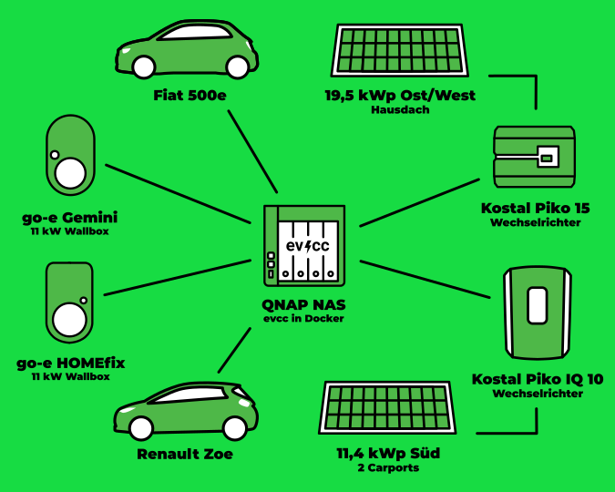

Dies ist der zweite Beitrag in unserer Serie von Community-Porträts.
Fotograf [Detlef](https://hee.se) hat dieses Mal Christian aus Trebbin besucht und ein paar tolle Fotos gemacht.

{/* truncate */}

## Trebbin: Ein Haus, drei Generationen

**Michael:** Hallo Christian, danke, dass du dir die Zeit nimmst.
Erzähl uns doch zunächst etwas über dich und deine Lebenssituation.

**Christian:** Hallo Michael, gern.
Mein Name ist Christian, und ich lebe mit meiner Frau, unseren zwei Kindern und meiner Schwiegermutter in Trebbin in einem Haus, das ursprünglich 1980 gebaut wurde.
Wir haben es 2009 aufgestockt und energetisch saniert, um mehr Platz zu schaffen und den Energieverbrauch zu reduzieren.
Wir wohnen hier als Drei-Generationen-Familie und haben in den letzten Jahren einiges in Richtung Elektromobilität und eigene Energieproduktion unternommen.

**Michael:** Kannst du uns mehr über euren Weg zur Elektromobilität erzählen?

**Christian:** Unsere Reise in die Elektromobilität begann 2019, als ich aufgrund eines Arbeitgeberwechsels regelmäßig mit dem Auto zur Arbeit fahren musste.
Da haben wir uns für einen gebrauchten Smart ED entschieden.
Da alle immer nur mit dem Smart fahren wollten, haben wir unseren Verbrenner durch eine Renault Zoe ersetzt, die im November 2020 geliefert wurde.
Seitdem sind wir komplett elektrisch unterwegs.

**Michael:** Lustig, den Effekt, dass der Elektro-Zweitwagen zum Liebling der Familie wird und der Verbrenner stehen bleibt, habe ich schon öfter gehört.
Und wie sieht es heute aus?
Ist der Smart noch im Einsatz?

**Christian:** Nein, der Smart hat mittlerweile eine neue Besitzerin gefunden.
Anfang dieses Jahres haben wir ihn verkauft und durch einen Fiat 500e Icon ersetzt.
Jetzt fahren wir also den Fiat und die Renault Zoe.
Beide Autos werden mit Strom aus unseren eigenen Photovoltaikanlagen geladen.

## Unterwegs mit kleinen Stromern

**Michael:** Wie nutzt ihr die Elektroautos im Alltag?
Welche Rolle spielt dabei eure Ladeinfrastruktur?

**Christian:** Unsere tägliche Mobilität ist gut organisiert.
Meine Frau pendelt mit der Bahn nach Berlin zur Arbeit, während ich eines der Autos für meine Fahrten nutze.
Die Hobbys der Kinder bringen da deutlich mehr Fahrten mit sich, sodass wir recht viel mit den Autos unterwegs sind, aber das vorwiegend mit Sonnenstrom.
Mit den beiden go-e Chargern, die an den Carports installiert sind, können wir jederzeit laden und sicherstellen, dass die Autos einsatzbereit sind.
Wir stecken nach der Fahrt einfach die Autos an und wenn wir sie brauchen, sind sie wieder geladen. Die Charger werden von den PV-Anlagen gespeist, sodass wir den Strom direkt vom Dach nutzen können.
Die erste PV-Anlage auf dem Hausdach hat 19,47 kWp und die zweite Anlage auf den Carports bringt 11,4 kWp.
Die Anlagen sind so dimensioniert, dass wir den Strom für die Autos und den Haushalt weitestgehend selbst produzieren können.

**Michael:** Wie hat sich evcc in dieses Setup integriert?

**Christian:** Mit der ersten PV Anlage kam auch der Wunsch auf, automatisiert nur mit PV Strom zu laden.
evcc bot als einziges Projekt die Möglichkeit, auch in einem Docker Container zu laufen.
Damit brauchte ich keine neue Hardware kaufen, da im Haushalt schon ein NAS als Backup und Speicher lief.
Für uns war es besonders wichtig, den Stromverbrauch und den Ladestatus der Autos im Blick zu behalten.
In der Nutzung hat sich dann der sehr hohe WAF (Woman Acceptance Factor) in der Familie als Vorteil erwiesen.
So nutzt meine Frau evcc sehr intensiv und meine Schwiegermutter schaut auch gern mal dort nach, ob gerade genug Strom da ist.
Dank evcc schaffen wir es, im Jahresdurchschnitt etwa 85 % des benötigten Stroms für die Autos aus unserer eigenen PV-Anlage zu ziehen.
Das hat unsere Stromautarkie auf 73 % erhöht, und das alles ohne den Einsatz eines Heimspeichers.

## Hohe Autarkie ohne Hausakku

**Michael:** 73 % Stromautarkie ohne Heimspeicher ist wirklich beeindruckend.
Das ist ein Wert, von dem viele träumen.
Wie habt ihr das geschafft?

**Christian:** Die große Dimensionierung der PV-Anlage in Kombination mit der Ost-/West-Ausrichtung hat uns geholfen.
Damit produzieren wir die Energie über den Tag verteilt.
Das ist besonders nützlich für uns, da wir die Autos tagsüber laden können.
evcc kümmert sich dann um die Steuerung der Ladeprozesse, sodass wir uns keine Gedanken machen müssen.
Für uns war es die richtige Entscheidung und wir sind zufrieden mit dem Ergebnis.

**Michael:** Danke für die Einblicke in euer Setup.

---

Danke auch an Detlef für die tollen Fotos.
Nach dem [ersten Blogbeitrag](/blog/2024/08/09/portrait-arne-gifhorn) haben sich auch schon einige weitere Community-Mitglieder gemeldet, die ihre Geschichte teilen möchten.
Es wird also noch mehr spannende Einblicke in unterschiedliche Installationen geben. 🤩
