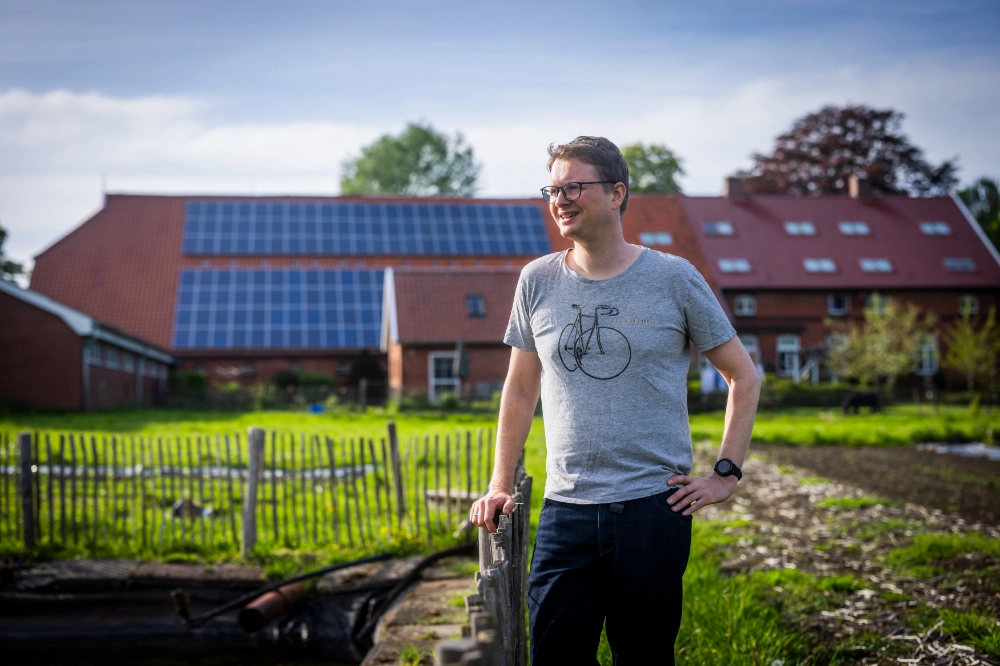
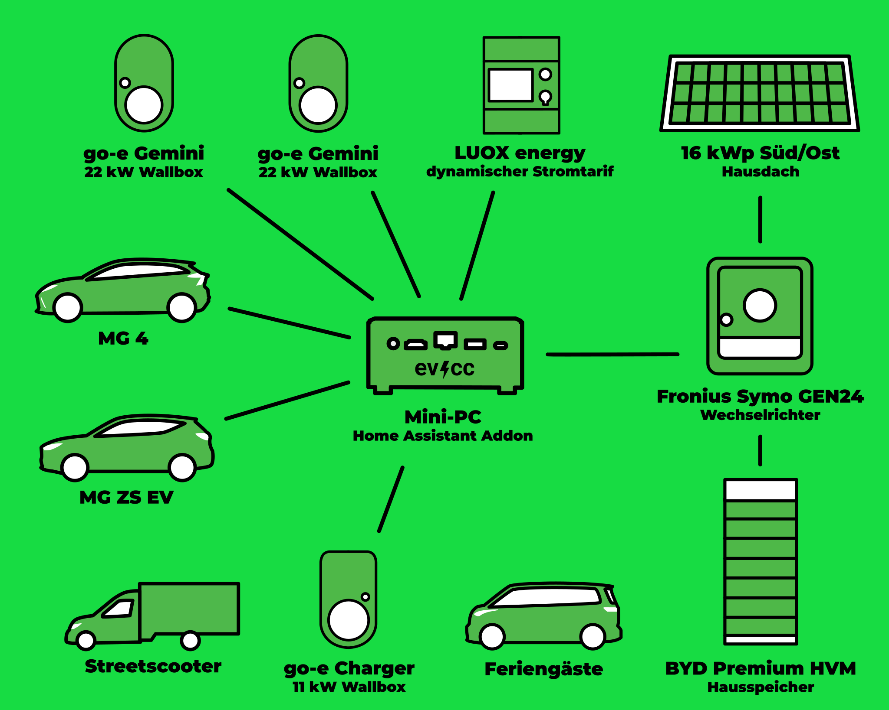
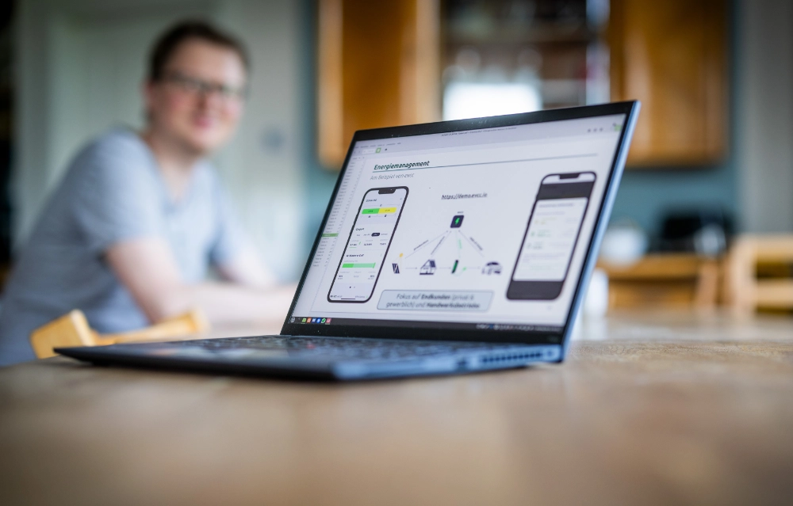

Hier kommt der dritte Beitrag unserer Serie von Community-Porträts.
Fotograf [Detlef](https://hee.se) hat dieses Mal Tjarko aus Großefehn auf dem [Gröönlandhof](https://www.groeoenlandhof.de) besucht.
Dabei sind neben tollen Fotos auch spannende Einblicke entstanden.

**Michael:** Hallo Tjarko, toll, dass du dir die Zeit für ein Community-Portrait nimmst.
Euer Hof, der Gröönlandhof, war vor ein paar Jahren mal im [PV Magazin](https://www.pv-magazine.de/2021/01/15/selbst-ist-der-groeoenlandhof-wallbox-ladesteuerung-selbst-gebaut/) und einige Nutzer*innen haben den Namen vielleicht schon mal gehört.
Vielleicht magst du uns zuerst von dir erzählen? 

**Tjarko:** Ja, gern.
Vor sechs Jahren haben wir den denkmalgeschützten, elterlichen Hof zu einem Mehrgenerationen-Plusenergie-Hofprojekt, dem Gröönlandhof, umgebaut.
Seitdem leben wir hier zusammen mit anderen Menschen und betreiben unter anderem auch eine Solidarische Landwirtschaft.
Auf dem Hof gibt es mit dem Streetscooter einen elektrischen Lieferwagen und zwei elektrische PKWs.
Angefangen haben wir mit einer Renault Zoe, die aber mittlerweile ersetzt wurde durch einen MG ZS und MG 4.
Versorgt wird das Ganze von mehreren PV-Anlagen.

{/* truncate */}

**Michael:** Gutes Stichwort „PV-Anlagen“.
Vielleicht können wir hier in die technischen Details abbiegen.
Wie sieht euer Setup aus? 

**Tjarko:** Also, wie gesagt, wir haben zwei Volleinspeise-Anlagen, die bald in die Eigenversorgung kommen und eine 16 kWp PV-Anlage in Süd-Ost-Ausrichtung, die wir schon heute für den Eigenbedarf nutzen.
In Planung ist auch eine weitere 16 kWp PV-Anlagen in Süd-West-Ausrichtung.
Das Ganze wird über einen Fronius Symo Wechselrichter und ein großen Hausspeicher von BYD mit 22 kWh verteilt.
An verschiedenen Orten auf dem Hof haben wir drei Ladepunkte: zwei Go-e Charger mit 22 kW und einen Go-e Charger mit 11 kW.
Die Ladepunkte haben wir über das integrierte Lastmanagement auf maximal 22 kW in Summe begrenzt.
Für alle Fahrzeuge haben wir RFID-Chips erstellt, sodass man mit evcc sehr gut die Ladevorgänge nachvollziehen kann.
Da auch immer mehr Gäste (Hofbesucher, Feriengäste, etc.) mit dem E-Auto kommen, gibt es auch einen RFID-Chip für Gastfahrzeuge.
In den vergangenen zwei Jahren haben wir es geschafft 45 % des Ladestroms über Sonnenenergie zu decken!

Hardware-technisch hatte ich evcc zunächst zum Testen auf einem Synology NAS mit Docker betrieben, aber nun läuft es auf einem Mikro-PC als Add-On in Home Assistant.
Ich finde, das ist einfacher und komfortabler und bietet durch Home Assistant noch mehr Möglichkeiten für Automatisierung.
Zudem kommen alle Hofbewohner über die Home Assistant App super mit der Bedienung zurecht.

| Komponente                | Details                                                                 |
|---------------------------|-------------------------------------------------------------------------|
| **Autos**                 | MG 4, MG ZS, Streetscooter, Autos der Feriengäste                       |
| **Wallboxen**             | go-e Charger (11 kW, 2x 22 kW)                                          |
| **Hybridwechselrichter**  | Fronius Symo GEN24 10.0 Plus                                            |
| **Solaranlage**           | 16 kWp Süd/Ost-Ausrichtung                                              |
| **Speicher**              | BYD Premium HVM (22,1 kWh)                                              |
| **Steuerung**             | evcc auf Mini-PC als Home Assistant Add-On                              |
| **Dynamischer Stromtarif**| LUOX energy (vormals Lumenaza)                                          |
| **In Planung**            | 16 kWp Süd/West (neue Anlage) 27 kWp Anlage (Volleinspeise zu Eigenversorgung) 25 kWp Anlage (Volleinspeise zu Eigenversorgung) |

Einen dynamischen Stromtarif haben wir von LUOX energy (vormals Lumenaza), da hier auch kleine Photovoltaikanlagen in die Direktvermarktung aufgenommen werden können.

Auf der To-do-Liste steht jetzt nur doch die Integration der Homematic Funkthermostate, um in der Heizperiode mit evcc die Raumtemperatur bei Solarüberschüssen anzuheben.
Da in den nächsten Jahren noch einmal zwei PV-Anlagen (27 kWp und 25 kWp) aus der Volleinspeisung in die Eigenversorgung kommen, wird das eine runde Sache.

**Michael:** Voll stark, das klingt, als ob viele Dinge aus eurem Alltag integriert sind in eine nachhaltige Energieversorgung, nicht nur das Laden eines Autos.
Magst du uns etwas über deinen Hintergrund erzählen? Warum hast du dich mit dem Thema auseinandergesetzt? Wie bist du auf evcc gestoßen?

**Tjarko:** Ich selbst bin Ingenieur für Regenerative Energiesysteme und habe mich privat und beruflich schon lange um das Thema Energieerzeugung, Speicherung und Management gekümmert.
Da ich selbst als Forscher Open Data und Open-Source-Projekte veröffentlicht habe, bin ich generell sehr begeisterungsfähig für das Thema.
Auf evcc bin ich direkt auf GitHub gestoßen und habe schnell das Potenzial gesehen.
Vor allem, dass evcc schon lange vor vielen anderen Lösungen auch den Ladestand von Fahrzeugen berücksichtigen konnte, war für mich ein großer Pluspunkt.

**Michael:** Tjarko, du bist evcc-Nutzer der ersten Stunde – was fasziniert dich an dem Projekt? Und was würdest du dir vielleicht für die Zukunft wünschen?

**Tjarko:** evcc war immer ganz vorn dabei, möglichst viel Hardware einzubinden und gleichzeitig alle Funktionen in der Bedienung sehr verständlich zu halten.
Größter Pluspunkt für mich ist zukünftig, dass es lokal im Netzwerk läuft und damit auch viele Speichersysteme ansteuern kann.
Neben dem bereits umgesetzten Feature „Entladesperre bei günstigen Strompreisen“ kann damit seit Kurzem auch das „Laden des Speichers aus dem Netz“ realisiert werden.
Dies werden cloudbasierte Lösungen nie in dem Umfang wie evcc herstellerübergreifend können.

Mein größter Wunsch ist, dass die Konfiguration über das Webinterface vollständig möglich ist und es zudem eine und mehrere Firmen gibt, die evcc zusammen mit Hardware in Umlauf bringen, sodass noch viel mehr Nutzer:innen von evcc profitieren können.

**Michael:** Dann schauen wir mal, wie schnell dieser Wunsch in Erfüllung geht.
Vielen Dank für deine Zeit und alles Gute!
