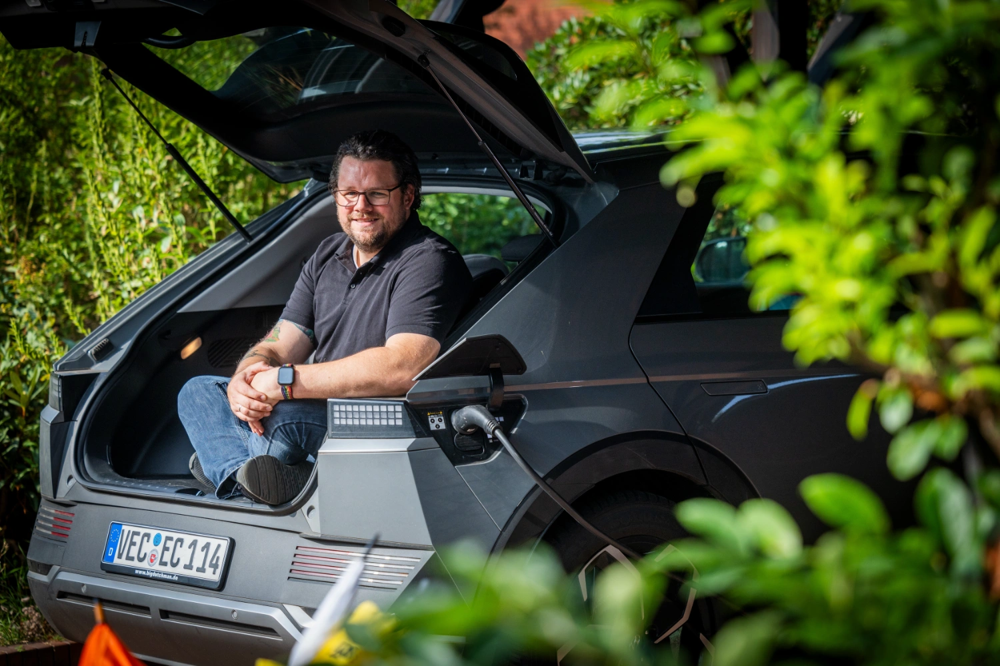
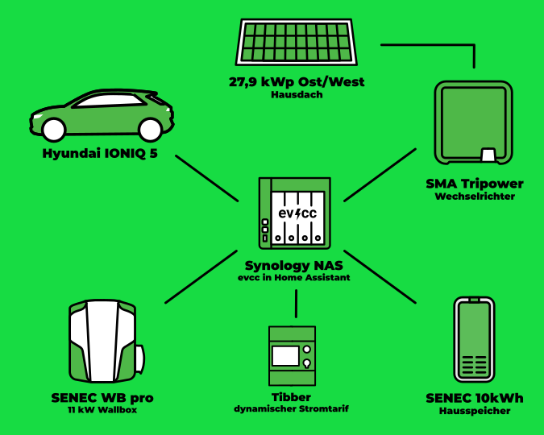
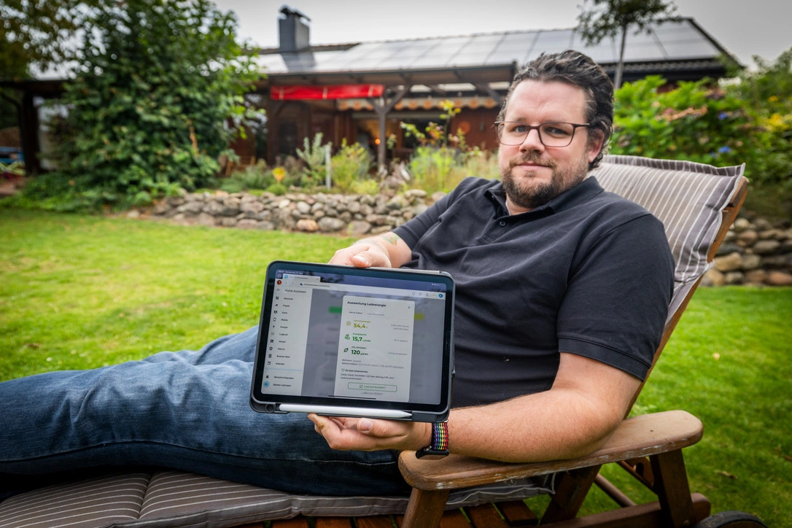

In unserer Serie von Community-Porträts war der Fotograf [Detlef](https://hee.se) vor Kurzem bei Bastian aus Alhorn, Großenkneten.

{/* truncate */}

## „Wenn, dann jetzt!“

**Michael:** Hallo Bastian, wie schön, dass du da bist.
Erzähle ein wenig über dich und wie du zum Thema Elektroauto und PV-Überschussladen gekommen bist.

**Bastian:** Ja, gerne.
Also, ich heiße Bastian und wohne mit meiner Frau und meinen beiden Kindern in der Gemeinde Großenkneten im Landkreis Oldenburger Land.
Das war für uns vom Standort perfekt, da wir nah an größeren Städten sind (Vechta, Oldenburg, Bremen), aber das Haus dennoch preislich erschwinglich war.
Auch die Infrastruktur des Ortes hat alles fußläufig erreichbar, was wir so brauchen, unter anderem zwei Einkaufsmärkte, alle Schulformen und einen Kindergarten.
Nachdem wir unser Haus aus dem Jahr 1978 bezogen haben, habe ich mich relativ zeitnah mit dem Thema PV-Anlage auseinandergesetzt.
Die Dachflächen in einem Bungalow mit Spitzdach sind einfach perfekt dafür.
Und Strom war, für mein Empfinden, zu dem Zeitpunkt schon zu teuer.
„Wenn, dann jetzt“ war die Devise, damit man selbst noch möglichst viel davon hat.
Somit kam sehr zeitnah die große PV-Anlage auf das Ost- und Westdach.

## 28 kWp PV + Dynamischer Stromtarif = 💚

**Michael:** Die Dachflächen zur Stromerzeugung nutzen ist immer eine super Idee.
Danach kam dann das E-Auto?

**Bastian:** Ja genau, vorletztes Jahr hat mein Arbeitgeber dann angekündigt, ein E-Autoleasing ins Leben zu rufen, was dann für uns der ausschlaggebende Punkt war um in die Elektromobilität einzusteigen.
Da wir viel Strom über die großen Dachflächen machen können, ergab es für uns Sinn, das Auto genau damit aufzuladen.
Bei der Suche nach Lösungen stößt man dann im Internet sehr schnell auf evcc.
Das, und die Integration von Frigate, waren für mich dann auch der Grund, letztlich vom ioBroker zum Home Assistant zu wechseln.
Anfang Januar sind wir dann auch noch zu Tibber gewechselt, sodass wir auch im Winter günstig laden können.
Vor 2 Jahren ist noch eine Wärmepumpe hier eingezogen und, wenn es besonders kalt ist, zieht die dann doch fast meinen ganzen PV-Strom.
Da bleibt nicht viel übrig, aber mit Tibber lade ich dann meistens nachts günstig.

## Synology, Home Assistant und evcc

**Michael:** Das kann ich gut nachvollziehen.
Gerade im Winter kann man mit einem dynamischen Stromtarif erheblich sparen.
Wie sieht denn dein aktuelles technisches Setup zu Hause aus?

**Bastian:** Hier die Übersicht der Komponenten, die bei mir mit evcc zusammenspielen:

| **Komponente** | **Details** |
|----------------|-------------|
| **Hardware**   | Synology DS923+ |
| **Software**   | Home Assistant mit evcc Addon |
| **Auto**       | Hyundai IONIQ 5 |
| **Speicher**   | SENEC.Home 2.1 10kWh |
| **Wallbox**    | SENEC.Wallbox pro |
| **Wechselrichter** | SMA Tripower STP 25000TL-30 |
| **PV**         | 27,88 kWp, AXITEC X HC 340 82 Module (40 Ost, 42 West) |
| **Strom**      | Tibber |

**Michael:** Da kommen ja einige unterschiedliche Komponenten zum Einsatz.
Du hattest schon angesprochen, dass du Home Assistant nutzt.
Gibt es noch mehr Integrationen in andere Systeme?

**Bastian:** Ich nutze momentan nur den Home Assistant.
In Verbindung mit evcc möchte ich vor allem wissen, was mich der Strom insgesamt an einem Tag kostet.

**Michael:** Du hast eben erwähnt, dass du evcc bei einer Internetrecherche gefunden hast.
Was war der Grund, warum du dich für das System entschieden hast?

**Bastian:** Ich bin ziemlich schnell auf evcc gestoßen.
Zuerst habe ich es mit den Senec-Mitteln probiert, aber die waren nicht soweit ausschließlich mit PV Strom zu laden.
Daher bin ich dann auf evcc gekommen.
Seit Januar nutze ich außerdem das preissensible Laden in Kombination mit Tibber, was mich relativ günstig durch den Winter gebracht hat.

**Michael:** Welche evcc Funktion gefällt dir am besten?

**Bastian:** Schwierige Frage, aber ich glaube, das automatische Laden zu günstigen Zeiten mag ich am meisten.
Mir gefällt auch, dass evcc sehr bedienerfreundlich ist und eine sehr übersichtliche UI mitbringt.

## Nächstes Ziel: Wärmepumpe

**Michael:** Hast du Wünsche für die zukünftige Entwicklung?

**Bastian:** Ich verfolge das Projekt auf GitHub und bin schon gespannt, wann das Laden in Kombination mit der PV-Prognose kommt oder das Laden mit einem längeren Planer.
Besonders letzteres wird mich noch besser durch den Winter bringen.

Mein nächstes Ziel ist es dann, meine Wärmepumpe zu integrieren.
Da bin ich noch uneins mit mir, ob ich das direkt in evcc mache oder in einem EMS System und wenn, in welchem.
Erst einmal muss ich meine Wärmepumpe erreichen können.
Das ist mit Buderus/Bosch nicht so einfach…

**Michael:** Das klingt doch perfekt.
Bessere Integration für Wärmepumpen steht auch auf unserer Agenda.
Dann hier erst mal danke an dich, dass du das mit uns teilst und alles Gute für die Zukunft!

