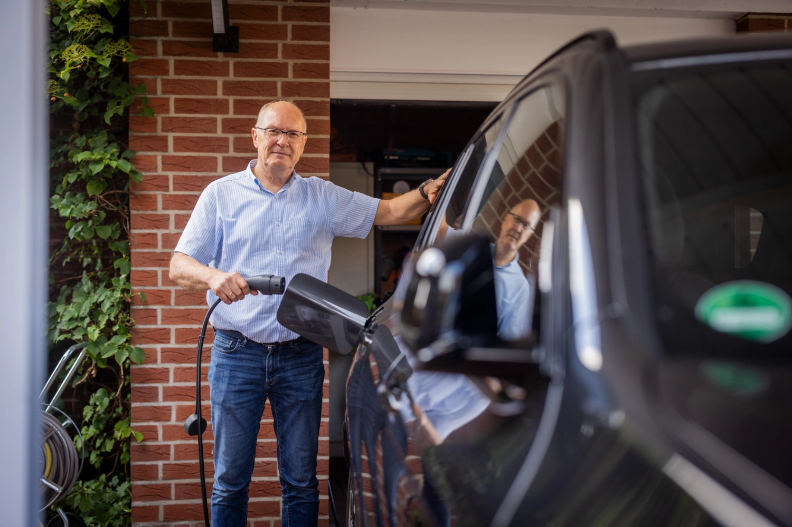
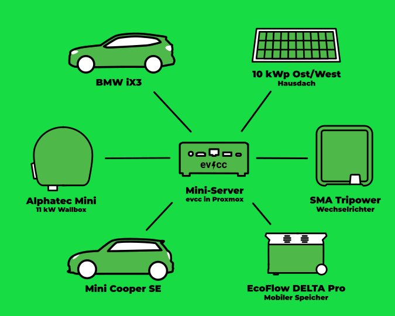

In unserer Serie von Community-Porträts war der Fotograf [Detlef](https://hee.se) zu Besuch bei Andreas in Wettringen im Münsterland.

{/* truncate */}

## Fasziniert von EDV und dabeigeblieben

**Michael:** Hallo Andreas, toll, dass du dich gemeldet hast und wir heute miteinander sprechen.
Erzähl doch mal ein wenig über dich und wie du zum Thema Elektroauto und PV-Überschussladen gekommen bist.

**Andreas:** Ja, hallo Michael.
Also von Hause aus bin ich Apotheker und war 35 Jahre Leiter der Sonnen-Apotheke in Wettringen.
Ich bin verheiratet, habe zwei, mittlerweile erwachsene, Kinder und wir wohnen in einem Einfamilienhaus auf dem Land.
Die Apotheke habe ich Anfang des Jahres verkauft, aber die EDV in der Apotheke, 10 Arbeitsplätze, 5 virtuelle Server, Windows und Linux, habe ich immer selbst verwaltet.
Dieses Wissen konnte ich mitnehmen.
Mit IT oder EDV beschäftige ich mich seit meiner Entlassung aus der Bundeswehr.
Mit dem Entlassungsgeld habe ich meinen ersten Computer, einen Tandy TRS 80, gekauft.
Seitdem bin ich mit der EDV fasziniert und ich bin dabei geblieben.

**Michael:** Wow, du hast also viel technisches Hintergrundwissen und einen guten Überblick, was es braucht um ein Geschäft mit allem drum und dran zu führen.
Wie bist du dann zum Thema Elektromobilität und PV-Überschussladen gekommen?

**Andreas:** Vor drei Jahren habe ich aus Interesse an der Technik einen Mini SE gekauft.
Der Wagen ersetzte einen Mini-Verbrenner.
Da Wallboxen zum damaligen Zeitpunkt noch Mangelware waren, habe ich die genommen, die mir der Installateur empfohlen hat.
Ahnung von der Materie hatte ich zu dem Zeitpunkt noch nicht.
Zwei Monate später wurde dann die 10kW PV Anlage installiert.

Die eine Hälfte der Module ist nach Osten ausgerichtet (4,6 kW), die andere nach Westen (5,4 kW).
Da ich zu dem Zeitpunkt noch keinen Speicher installiert hatte, wollte ich den Überschuss der PV Anlage direkt zum Laden des Minis verwenden.

## Das Manuelle war auf Dauer keine Lösung

**Michael:** Okay, du warst so früh am Thema, dass es noch nicht viele Erfahrungswerte gab und du dir selbst welche gemacht hast.
Hat das mit dem Mini und dem Laden so funktioniert, wie du dir das vorgestellt hast?

**Andreas:** Naja, eine Steuerlogik gab es in meiner Installation nicht, da bin ich bei Sonnenschein, auch früh morgens, zum Auto gegangen und habe es angesteckt.
Das Manuelle war auf Dauer keine Lösung und so habe ich mich auf die Suche nach einer Automatisierung begeben.
Da ich mich schon seit Längerem mit Open Source beschäftige, habe ich ein wenig auf GitHub gestöbert und bin dabei auf evcc gestoßen.
Eine Erstinstallation auf einem bereits laufenden Linux-Server war schnell gemacht.
Die verschiedenen Komponenten wie Wechselrichter, Wallbox und Auto waren schnell integriert.

## Wallbox-Debugging, aber nun läuft's

**Michael:** Das klingt nach einem guten Anfang.
Wie hast du dann weitergemacht?

**Andreas:** Alles funktionierte, nur die Wallbox, eine Alphatec Mini, ließ sich nicht steuern.
Nach einiger Recherche im Forum stellte sich schnell heraus, dass die Steuerung der Wallbox nicht so funktionierte, wie sie sollte.
Eine ordentliche Beschreibung der Befehle gab es wohl auch nicht.
Aber da kann [Premultiply](https://github.com/premultiply) wohl etwas mehr zu sagen.
Nach meiner Kontaktaufnahme mit dem Hersteller ging es schnell, Premultiply bekam eine Testbox und die Firmware der Steuerungsplatine bekam ein Update.
Unkompliziert habe ich die Platine an den Hersteller geschickt und bekam die neue Firmware aufgespielt.
Danach konnte evcc mit der Wallbox sprechen.
Dank dieser Lösung wurde das Problem nicht nur für mich, sondern auch für alle neuen Alphatec-Nutzer effektiv behoben.
Open Source in seiner besten Form!

Eine stufenweise Anpassung der Ladeleistung von 6 bis 16 A war endlich machbar.
Da die Box keine Umschaltung zwischen 1-phasig und 3-phasig erlaubt, kam in die Unterverteilung noch ein Lasttrennschalter.
Jetzt wird normal 1-phasig geladen, mehr Überschuss habe ich meistens einfach nicht.
Nur wenn es schnell gehen muss, oder überhaupt kein Überschuss vorhanden ist, wird manuell auf 3 Phasen geschaltet.
Der Spaß mit evcc konnte beginnen.

**Michael:** Ah, dann hast du an deinem ersten Setup noch einiges optimiert und angepasst.
Wie hat sich das auf die Nutzung ausgewirkt?

**Andreas:** Nach einem Jahr Laufzeit der Anlage konnte ich sehen, dass ich, trotz Elektroauto, ca.
4.500 kW ins Netz gespeist habe.
Also, da würde ein zweites E-Auto doch optimal reinpassen.
Die alte Familienkutsche, auch ein Diesel, wurde in ein Elektisches getauscht.
Jetzt werden zwei Autos mittels evcc geladen, ein Auto hängt immer an der Ladestation.

Für unsere Situation optimal.
Um bei einem Stromausfall wenigstens das eine oder andere Gerät weiter betreiben zu können habe ich mir eine EcoFlow DELTA Pro mit Zusatzakku, zusammen 7,2 kW Speicher, angeschafft.
Mittels einiger Skripte im Home Assistant werden diese bei Überschuss geladen.
Ein Teil des Speichers dient dann in der Nacht zur Verringerung des Strombezugs, der Rest als eiserne Reserve.

| **Komponente**       | **Details**                              |
|----------------------|------------------------------------------|
| **Autos**            | Mini SE, BMW iX3                         |
| **Wallbox**          | Alphatec Mini                            |
| **Wechselrichter**   | SMA Tripower 10                          |
| **Solaranlage**      | 10 kW (4,6 kW Ost, 5,4 kW West)          |
| **Speicher**         | EcoFlow DELTA Pro (7,2 kWh)              |
| **Steuerung**        | evcc auf Ubuntu Server unter Proxmox     |
| **Integrationen**    | Home Assistant                           |

## Hausautomation und Mediaserver

**Michael:** Das klingt nach einer spannenden Reise.
Wie sieht's denn sonst technisch bei dir zu Hause aus?
Nutzt du Integrationen in andere Systeme?

**Andreas:** Oh ja, Hausautomation ist seit Langem ein Thema für mich.
Ursprünglich habe ich mit Homematic Hausautomation angefangen.
Und es kamen immer mehr Komponenten dazu.
Da ich auch andere Hersteller ausprobiert habe, kam schnell der Wunsch alle Komponenten gemeinsam zu verwalten.
Home Assistant war da meine Integration.

Einen Mediaserver betreibe ich auch schon seit zwei Jahrzehnten.
Meine Kinder haben es immer wieder geschafft, die Musikkassetten und CDs so zu beschädigen, dass sie nicht mehr nutzbar waren.
Also habe ich früh begonnen, die analogen Medien zu digitalisieren und zentral zur Verfügung zu stellen.

Zuerst mittels Anwendungen die auf einem NAS liefen später als virtuelle Server auf einem Hypervisor.
Unter Proxmox laufen zurzeit diverse Homelab Anwendungen: evcc, auf einem Ubuntu Server; Plex, als Medienserver, eBlocker, paperlessNGX, Home Assistant.

## Erfüllt alle Bedürfnisse

**Michael:** Nach den anfänglichen Herausforderungen und Optimierungen, klingt es, als wenn du jetzt eine Lösung hast, die gut funktioniert.
Hast du vielleicht noch Wünsche oder Anregungen für die zukünftige Entwicklung von evcc?

**Andreas:** Für mich erfüllt evcc alle Bedürfnisse, ich kann mit den angebotenen Konfigurations- und Auswertungsmöglichkeiten viel anfangen und ich bekomme alle Informationen, die ich benötige.

**Michael:** Vielen Dank für das Gespräch, Andreas.
Es war spannend zu hören, wie evcc in deiner Umgebung funktioniert und wünsche dir weiterhin viel Erfolg mit deinem Setup.
