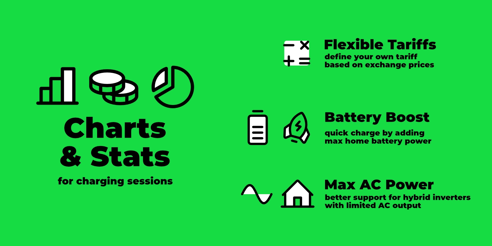
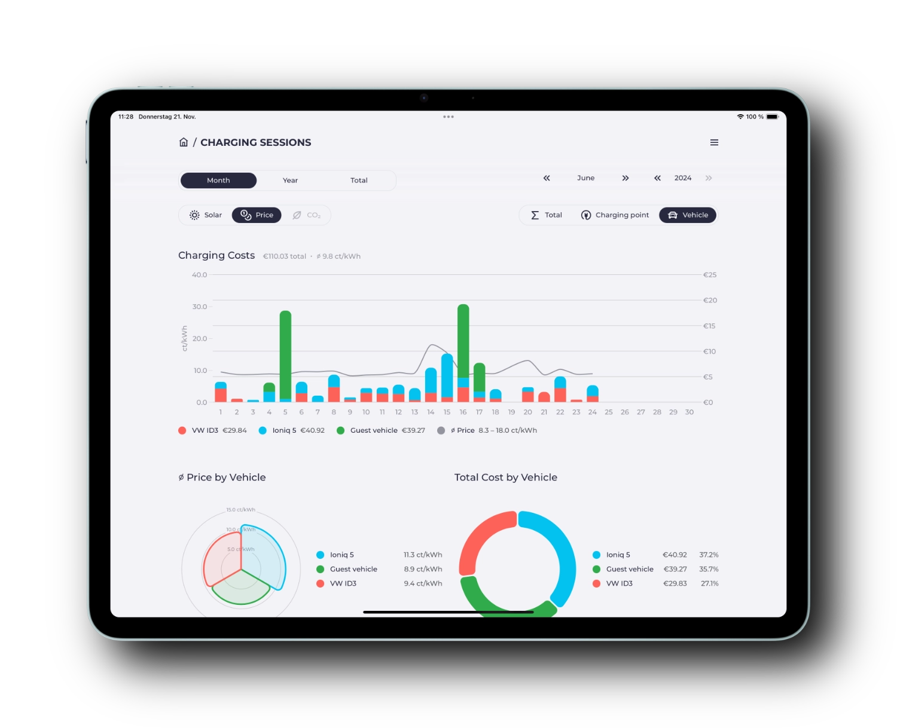
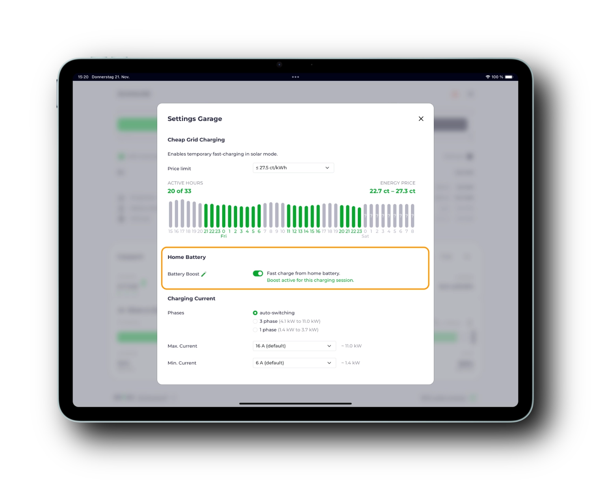

Die Tage werden kürzer.
Ein guter Anlass, um ein kleines Update darüber zu geben, was sich seit dem [letzten Artikel im August](/blog/2024/08/17/highlights-14a-enwg-ocpp-loadmanagement-elli) im Projekt getan hat.

[](/blog/2024/11/22/highlights-charts-stats)

{/* truncate */}

## Grafische Auswertung der Ladevorgänge

Die Übersicht der [Ladevorgänge](/docs/features/sessions) gibt es schon relativ lange.
Neben den Basisdaten wie Energiemenge, Ladezeiten, Fahrzeug und Kilometerständen erfassen wir seit einiger Zeit auch Informationen wie den Anteil an eigenem Sonnenstrom, reale Preise und CO₂-Emissionen.

Bislang waren diese Daten aber nur als Tabelle oder CSV-Export zum selbst auswerten verfügbar.
Nun gibt es schicke Visualisierungen deiner Ladeenergie, Sonnenstromanteile, Kosten und CO₂-Emissionen.


Wenn du mehrere Ladepunkte oder Fahrzeuge hast, kannst du die Daten gruppieren und miteinander vergleichen.
In der Dokumentation erfährst du, wie du die erforderlichen [CO₂-Datenquellen](/docs/features/co2) und [Stromtarife](/docs/features/dynamic-prices) hinterlegen kannst.



## Battery Boost

Die erste Version des oft gewünschten [Battery Boosts](/docs/features/battery#batterie-boost) hat es als experimentelles Feature 🧪 ins Release geschafft.
Diese Funktion ergänzt das klassische PV-Überschussladen.
Bei aktiviertem Boost wird neben der verfügbaren Sonnenenergie auch die Energie aus dem Hausspeicher zum Laden des Fahrzeugs genutzt.
Die Regelung ermittelt dabei automatisch die maximale Ladeleistung, die das Speichersystem bereitstellen kann.



Der Boost kann pro Ladepunkt aktiviert werden und schaltet sich beim Abstecken des Fahrzeugs automatisch wieder ab.

Gerade an sonnigen Tagen kann dies praktisch sein.
Fährst du bspw. mittags spontan mit deinem Auto von zu Hause los, kannst du vor der Abfahrt den Boost aktivieren, um die Energie des gefüllten Hausspeichers ins Fahrzeug zu übertragen.
Du startest mit einem volleren Fahrzeug und deine Hausbatterie hat wieder Platz um die Energie der Nachmittagssonne zu speichern, die du sonst eingespeist hättest.

Zusätzliche Einstellmöglichkeiten wie das Festlegen von Ladegrenzen und eine prominentere Platzierung in der UI (bspw. als Boost Button) haben wir für ein zukünftiges Release auf dem Zettel.

## Flexible Stromtarife

Die Liste der [unterschiedlichen Stromtarife](/docs/tariffs) wächst stetig.
Gerade im nächsten Jahr wird das Thema dynamische Stromtarife weiter an Bedeutung gewinnen.

Digital-first Anbieter wie Tibber, Awattar, Octopus oder Ostrom stellen APIs für den aktuellen Preis und Preisprognosen für den nächsten Tag zur Verfügung.
Diese Preise beinhalten oft bereits Netzentgelte und weitere Kosten.
 
Für dynamische Stromtarife, bei denen der Anbieter keine API anbietet, gibt es die Möglichkeit den Strompreis auf Basis des Day-Ahead-Preises an der Strombörse selbst zu ermitteln.

Eine gute Datenquelle für den Börsenpreis ist die [Energy Charts](https://api.energy-charts.info) Schnittstelle des Fraunhofer ISE.
Diese kann ohne vorherige Anmeldung genutzt werden.

Hier eine Beispielkonfiguration für die deutsche Strompreiszone:

```yaml
tariffs:
  grid:
    type: template
    template: energy-charts-api
    bzn: DE-LU
    charges: 0.22 # fester Aufschlag pro kWh (bspw. 20ct Netzentgelt, 2ct Gebühren)
    tax: 0.19 # prozentualer Aufschlag (bspw. 19% MwSt.)
```

Mit der Formel `(price + charges) * (1 + tax)` wird der Endverbraucherpreis pro kWh berechnet.
Diese Formel war bislang fest hinterlegt.

Für komplexere Tarife, bspw. mit oberer Kostengrenze, gibt es nun auch die Möglichkeit diese Formel selbst anzupassen.
Hier ein Beispiel für einen dynamischen Stromtarif mit einer oberen Kostengrenze von 50ct/kWh:

```yaml
tariffs:
  grid:
    type: template
    template: energy-charts-api
    bzn: DE-LU
    charges: 0.22 # fester Aufschlag pro kWh (bspw. 20ct Netzentgelt, 2ct Gebühren)
    tax: 0.19 # prozentualer Aufschlag (bspw. 19% MwSt.)
    formula: math.Min(0.5, (price + charges) * (1 + tax))
```

Neben dem Börsenpreis (`price`) und den Werten für `charges` und `tax` steht dir auch die [math](https://pkg.go.dev/math) Bibliothek von Go zur Verfügung.

## Hybridwechselrichter mit beschränkter AC-Leistung

Einige Hybridwechselrichter bieten eine höhere DC-Leistung als die AC-Leistung an.
Das heißt, sie können bspw. 10 kW PV-Leistung aufnehmen, aber nur 8 kW AC-Leistung für das Hausnetz bereitstellen.
Die verbleibenden 2 kW werden DC-seitig in der Batterie gespeichert.
Dieser Umstand hat in der Überschussregelung immer wieder zu Problemen geführt, da evcc mit der vollen PV-Leistung rechnet.
Die globale Konfigurationsoption `maxGridSupplyWhileBatteryCharging` (ja, sperriger Name) war der Versuch, diesen ungewollten Nebenwirkungen entgegenzuwirken.

Diese Option haben wir durch eine stabilere Lösung ersetzt.
Alle betroffenen [Wechselrichter-Templates](/docs/devices/meters) (bspw. Fronius, Growatt, SMA, Sungrow, ...) haben jetzt die erweiterte Option `maxAcPower` erhalten.
Darüber kann die maximale AC-Leistung (bspw. `maxAcPower: 8000` für 8 kW) definiert werden.
In der Überschussregelung wird dieser Wert, pro Wechselrichter, korrigierend berücksichtigt.

## Sponsor cocharge: private Wallbox öffentlich anbieten

Wir freuen uns, das Bremer Startup [cocharge](https://cocharge.de/evcc) als neuen Sponsor begrüßen zu dürfen.

[](https://cocharge.de/evcc)

cocharge ermöglicht es privaten Nutzern ihre Ladestation öffentlich zur Verfügung zu stellen.
Deine Wallbox erscheint dann in den Apps der großen Ladekartenanbieter, auf Wunsch mit von dir definierbaren Öffnungszeiten.
Für den Elektroauto-Besitzer funktioniert das Laden und die Abrechnung bei dir wie an jeder anderen öffentlichen Ladestation.
cocharge kümmert sich um die technischen Details, Ansprüche auf THG-Quoten, Roaming-Verträge und die Bürokratie.
**Deine zusätzlichen Einnahmen durch externe Ladevorgänge bekommst du monatlich ausgezahlt.**

Voraussetzung für die Nutzung von cocharge ist eine **eichrechtskonforme Wallbox**, die **OCPP** unterstützt.
Zudem muss der Ladepunkt **öffentlich zugänglich** sein.
Es fallen keine einmaligen oder regelmäßigen Kosten an.
cocharge erhebt lediglich eine 15% Provision für jeden abgewickelten Ladevorgang.

Hast du einen [Dienstwagen](https://cocharge.de/dienstwagen-laden) und eine Ladekarte vom Arbeitgeber, kann diese Lösung doppelt interessant für dich sein.
Du sparst dir nicht nur Bürokratie durch die automatische Abrechnung, sondern kannst auch noch extra verdienen, wenn du mit eigenem Solarstrom oder mit einem dynamischen Stromtarif zu günstigen Zeiten lädst.

cocharge und evcc zusammen nutzen?
Die meisten eichrechtskonformen Wallboxen besitzen neben OCPP auch noch eine lokale Schnittstelle wie bspw. Modbus.
Damit kannst du deine Wallbox öffentlich zur Verfügung stellen und parallel die Ladeleistung über evcc optimieren.

Wenn das für dich interessant klingt, und du einer der ersten Nutzer sein willst, schau doch mal auf [cocharge.de/evcc](https://cocharge.de/evcc) vorbei.

## Viele kleine Neuerungen

Neben den oben genannten Features gab es natürlich auch wieder viele kleine Verbesserungen, Fehlerbehebungen und Unterstützung für neue Wallboxen, Wechselrichter und andere Geräte.
Mehr dazu findest du in den [Release Notes](https://github.com/evcc-io/evcc/releases).

💚 Ein großes Dankeschön geht an alle, die das Projekt durch aktives Mitwirken und durch finanzielles Sponsoring unterstützen.

**Viele Grüße**<br/>
Das evcc Team<br/>
Michael, Andi & Uli