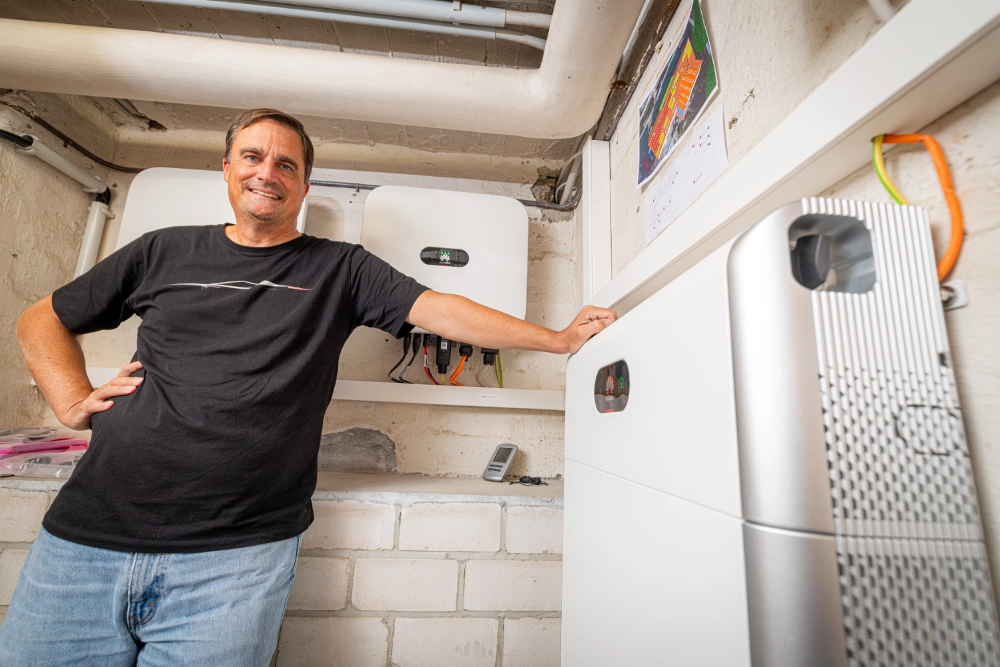

In unserer Serie von Community-Porträts war der Fotograf [Detlef](https://hee.se) dieses Mal zu Besuch bei Olaf in Nordrhein-Westfalen.

{/* truncate */}

## Uns war klar, dass es kein Zurück geben würde

**Michael:** Hallo Olaf, danke, dass du dir die Zeit nimmst, an diesem Format teilzunehmen.
Erzähl doch mal ein wenig über dich und wie du zum Thema Elektroauto und PV-Überschussladen gekommen bist.

**Olaf:** Hallo Michael, gerne.
Ich bin 52 Jahre alt, verheiratet und habe zwei Töchter.
Ich habe in meiner ersten von mir 1998 mitgegründeten Firma im E-Commerce-Bereich u.a. das SysAdmin-Team geleitet und bin auch heute noch als Mitgründer und Berater in verschiedenen Unternehmen aktiv.

Zum Thema "Elektroauto" bin ich vor vier oder fünf Jahren gekommen.
Bis dahin hatte ich mich mit dem Thema noch nicht ernsthaft beschäftigt und war eines der zahlreichen Opfer der ziemlich merkwürdigen Berichterstattung in vielen Medien.
Ich dachte, E-Autos würden leicht brennen und man käme damit nicht sehr weit.
Ich weiß gar nicht mehr genau, welcher Anlass mich dazu gebracht hat, mich mit dem Thema noch mal näher auseinanderzusetzen.
Entweder ein Blogartikel oder der Hinweis von einem Freund, der meinte, dass wir das Thema Klimaschutz jetzt langsam mal richtig angehen müssten.
Aber ab spätestens Anfang 2020 habe ich mich auf diversen YouTube-Kanälen über die bald in Deutschland erhältlichen E-Autos informiert.

Mir war schnell klar, dass für unsere Anforderungen ein Enyaq oder ein Model Y am besten passen würden.
Leider dauerte es dann noch ein bisschen, bis diese Autos endlich verfügbar waren, sodass ich am Ende die Wallboxen schon vor unserem ersten E-Auto am Haus hängen hatte.
Nachdem wir unseren nächsten Sommerurlaub mit dem Enyaq in Spanien verbracht haben und ganz entspannt über 5.500 km vollelektrisch zurückgelegt hatten, war meiner Familie und mir klar, dass es kein Zurück geben würde.
Der andere Verbrenner wurde auch sofort verkauft.
Und wenn man erst einmal im Thema E-Mobilität drin ist, dann ist die Anschaffung einer PV-Anlage zum Überschussladen der nächste logische Schritt.

**Michael:** Stark, du hast dich also aus gegebenem Anlass (aka Klimawandel) mit dem Thema beschäftigt und bist dann immer tiefer eingestiegen.
Jetzt bin ich neugierig: Wie sieht dein technisches Setup zu Hause aus?

**Olaf:** Die PV-Anlage hat 18,92 kWp, davon 6 Panels auf einer etwas flacheren Gaube mit Nordnordwest-Ausrichtung.
Die zwei Wechselrichter kommen von Huawei und ergänzt wird das Ganze noch von einem Huawei LUNA2000 Hausspeicher mit 15 kWh Kapazität.
Als Wallboxen kommen drei Alfen Eve Single Pro-line 22 kW zum Einsatz und evcc läuft auf meiner Synology im Docker.
Es laden also regelmäßig unsere mittlerweile drei Autos mit Sonnenstrom.
Zu dem eben bereits erwähnten Enyaq sind außerdem ein Model Y und, seit anderthalb Jahren, auch ein Fiat 500e dazugekommen.

## Da hat es mich gepackt

**Michael:** Wie bist du auf evcc gestoßen und warum nutzt du es?

**Olaf:** Zuerst haben wir, der Solarteur und ich, versucht, die Alfen Wallboxen durch die Installation eines Smartmeters von Elgris zum Überschussladen zu bewegen.
Wir konnten die Wallboxen zwar dazu bringen, sich die aktuellen Werte vom Smartmeter zu holen und anzuzeigen, aber leider nicht dazu, entsprechend der Werte auch die Ladeleistung zu regeln.
Als der Support von Alfen dann meinte, dass das Feature noch beta sei, habe ich mal geschaut, welche anderen Möglichkeiten zum PV-Überschussladen existieren.
Und dabei bin ich natürlich auch auf evcc gestoßen.
Mir hat vor allem der Ansatz gefallen, dass Geräte unterschiedlicher Hersteller modular eingebunden werden können.
So kann man am Ende jeden Wechselrichter mit jeder Wallbox zum Laufen bekommen.
Auch dass es open source war und ständig weiterentwickelt wird, fand ich gut.
Das hat mich neugierig genug gemacht, um mal die Installation zu versuchen.
Nachdem ich dann erfolgreich die Spitzfindigkeiten der yaml-Datei überwunden hatte und das erste Mal gesehen habe, wie evcc in kleinen Watt-Schritten die Ladeleistung an den aktuellen PV-Überschuss angepasst hat, hat es mich gepackt.

**Michael:** Das kann ich gut verstehen.
Der Software beim Regeln zuzuschauen hat was Faszinierendes.
Vor allem, wenns um die optimale Nutzung des selbst produzierten Stroms geht.
Was ist denn aktuell deine Lieblingsfunktion?

**Olaf:** Meine Lieblingsfunktion ist ganz klar der PV-Modus, der meine Wallboxen nach meinem jeweiligen Bedarf an den aktuellen Überschuss vom Dach anpasst.
Aber auch andere positive Nebeneffekte weiß ich sehr zu schätzen.
Zum Beispiel kann ich dank evcc den Fiat 500e nur noch bis 80 % laden lassen.
Das kann er von Haus aus leider nicht.
Mir gefällt auch, dass ich den momentanen PV-Ertrag viel aktueller angezeigt bekommen kann als in der App von Huawei.
Da wird er leider nur alle 5 Minuten aktualisiert.
Auch den Parameter "Residualleistung" passe ich je nach Bedarf im UI gerne spontan an, um dadurch quasi einen Puffer einzustellen, damit z.B. bei einer Wolke oder dem Anschalten eines größeren Verbrauchers im Haus wirklich gar kein Netzstrom bezogen wird.
Da ist es dann auch egal, wenn während des Ladens der Staubsauger oder ein Föhn ständig ein- und ausgeschaltet wird.
Das regelt dann der Wechselrichter in Sekundenbruchteilen mit dem Hausakku nach.
Denn evcc wird an dem Punkt leider von dem superlangsamen Dongle von Huawei ausgebremst, über den alle Werte ausgelesen werden, was es erforderlich machte, das evcc-Intervall auf 45 Sekunden runterzudrehen.
Aber dank der vielen Einstellmöglichkeiten von evcc findet sich für fast jedes Problem ein guter Workaround und so auch in diesem Falle.

**Michael:** Schön zu sehen, dass evcc hier die Schwächen des Herstellers ausgleicht.
Nutzt du Integrationen in andere Systeme, zum Beispiel Home Assistant, Grafana oder Ähnliches?

**Olaf:** Bisher noch nicht.
Für mich wäre das Neuland und um mich darin einzuarbeiten, fehlt mir leider im Moment die Zeit.
Zudem bin ich ganz zufrieden mit den Funktionen, die evcc bereits von Haus aus mitbringt.

| Komponente          | Beschreibung                                  |
|---------------------|-----------------------------------------------|
| **PV-Anlage**       | 18,9 kWp, teilweise Nordnordwest-Ausrichtung  |
| **Wechselrichter**  | 2x Huawei SUN2000                             |
| **Hausspeicher**    | Huawei LUNA2000 mit 15 kWh                    |
| **Wallboxen**       | 3x Alfen Eve Single Pro-line 22 kW            |
| **Fahrzeuge**       | Skoda Enyaq, Tesla Model Y, Fiat 500e         |
| **Steuerung**       | evcc auf Synology im Docker                   |

**Michael:** Weihnachten steht ja fast vor der Tür.
Wenn du dir was wünschen könntest für die zukünftige Entwicklung von evcc, was wäre das?

**Olaf:** Die vollständige Umstellung der Installation von yaml-Datei auf eine UI wäre ein Riesenfortschritt.
Das würde einiges sehr viel einfacher machen.
Ansonsten wäre tatsächlich die intelligente Ansteuerung von Wärmepumpen noch ein tolles Feature, da wir unsere alte Heizung gegen eine Lambda-Wärmepumpe eintauschen werden.
Und da wäre es natürlich besonders schön, wenn man mit evcc den dicken Pufferspeicher mit Überschuss-Strom richtig warm machen könnte, damit man dann nachts nicht den teureren Strom aus dem Netz beziehen müsste.

**Michael:** Das trifft sich gut.
Im letzten Release haben wir die ersten Wärmepumpen-Integrationen und ein SG-ready Template hinzugefügt.
Hier wird im nächsten Jahr noch einiges passieren.
Vielen Dank noch mal an dich, Olaf, dass du uns dein Setup und deine persönliche Reise zum Thema "e-Mobilität & effizientes Laden" vorgestellt hast.
Ich wünsche dir und deiner Familie eine schöne Weihnachtszeit und weiterhin viel Spaß mit deinem Setup.