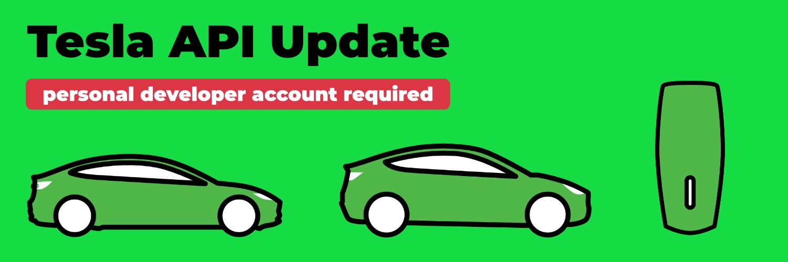
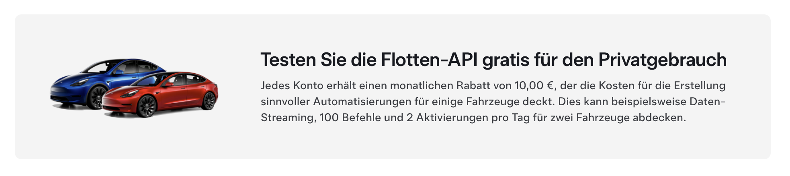

Ab evcc v0.133 wird ein [Tesla Developer Account](https://developer.tesla.com/) benötigt.
Die Nutzung bleibt weiterhin kostenfrei, erfordert jedoch einen zusätzlichen Einrichtungsschritt.

[](/blog/2025/01/20/tesla-api-update)

{/* truncate */}

## Tesla Fleet API wird ab Februar kostenpflichtig

Vor einem Jahr haben wir die [Tesla Fleet API](/blog/2024/02/01/v0.124-new-tesla-api) in evcc integriert.
Tesla war damit der erste Hersteller, der eine offizielle und vor allem offene API für die Kommunikation mit seinen Fahrzeugen bereitgestellt hat.

Tesla hatte bereits bei der Einführung angekündigt, dass diese Schnittstelle später kostenpflichtig werden würde.
Die Preise sind nun bekannt und treten ab dem 1. Februar 2025 in Kraft.
Die Abrechnung erfolgt nutzungsbasiert, wobei die Kosten je nach Art der Anfrage variieren.

Mit [tesla.evcc.io](https://tesla.evcc.io) haben wir bislang einen Dienst bereitgestellt, über den evcc-Nutzer Zugangstoken für die API-Nutzung generieren können.
Die API-Kommunikation dieser Token würde uns ab Februar 2025 in Rechnung gestellt.
Die Kosten pro Nutzer hängen von der Anzahl seiner Fahrzeuge, dem Ladeverhalten und der konkreten Konfiguration des Aktualisierungsintervalls ab.
Bei den meisten Nutzern überschreiten diese Kosten unser "$2 im Monat"-Sponsoring-Modell und wären damit für uns auch nicht tragbar, wenn wir die Tesla-Integration sponsorpflichtig machen würden.

## Kostenloser Freibetrag für Privatnutzer

Tesla bietet Privatnutzern ein monatliches API-Guthaben von 10 €, was für die meisten evcc-Nutzer ausreichen sollte.

[](https://developer.tesla.com/)

Mit der Version 0.133 haben wir die API-Kommunikation zu Tesla so angepasst, dass du deinen eigenen Tesla Developer Account nutzen kannst.
Token, die zuvor mit [tesla.evcc.io](https://tesla.evcc.io) generiert wurden, funktionieren nicht mehr.
Wir haben überlegt unseren bisherigen Token-Generierung-Prozess so zu erweitern, dass du ihn mit deinem eigenen Tesla Developer Account nutzen kannst.
Glücklicherweise hat [myteslamate.com](https://app.myteslamate.com) aber genau diese Funktion bereits implementiert.
Dort kannst du dir mit deinem Developer Account passende **Access- und Refresh-Token** generieren.

## Was ist zu tun?

### Für Tesla-Fahrer

1. Melde dich mit deinen Tesla-Zugangsdaten im [Tesla Developer Portal](https://developer.tesla.com/) an
2. Erstelle eine "Fleet API Application" (Firmendetails und Rechnungsdaten können übersprungen werden)
3. Du erhältst eine **Client ID** und ein **Client Secret**
4. Besuche [myteslamate.com](https://app.myteslamate.com/) und wähle die kostenlose "Fleet API & Telemetry" Option
5. Melde dich mit deinem Tesla-Konto an
6. Gib deine **Client ID** und **Client Secret** ein
7. Im Bereich "free and directly" erhältst du dein **Access- und Refresh-Token**
8. Trage diese Werte in deine evcc-Konfiguration ein

Beispiel:

```yaml {5-7}
vehicles:
  - type: template
    template: tesla
    title: Tesla Model 3
    clientId: aaaaaa-11111-...     # von developer.tesla.com
    accessToken: ey1234567890...   # von myteslamate.com
    refreshToken: EU_1234567890... # von myteslamate.com
```

Auf myteslamate.com findest du eine [detailliertere Erklärung und Anleitung](https://www.myteslamate.com/tesla-api-application-registration/).

Dein verbrauchtes Guthaben kannst du in der [Übersicht im Tesla Developer Portal](https://developer.tesla.com/de_DE/dashboard/) jederzeit nachverfolgen.
    
:::note
Das evcc-Projekt steht in keiner Verbindung zu myteslamate.com.
Wir sind mit [jlestel](https://github.com/jlestel), dem Entwickler von myteslamate.com, in Kontakt.
Die kostenlose Nutzung des Services für evcc-Nutzer ist von ihm explizit erwünscht.
Schau dir vor der Nutzung die [Terms of Service](https://www.myteslamate.com/terms-of-service) und [Privacy Policy](https://www.myteslamate.com/privacy-policy) an.
:::

### Für Tesla Wall Connector Nutzer

Wenn du einen Tesla Wall Connector verwendest, sind zusätzliche Schritte erforderlich, da die Ladekommandos eine signierte Kommunikation benötigen.
myteslamate.com bietet für 12 € pro Jahr einen "Command Proxy" an, der diese Funktion bereitstellt.
Nach der Anmeldung erhältst du einen **Proxy-Token**, den du in deine evcc-Konfiguration eintragen musst.

```yaml {8}
vehicles:
  - type: template
    template: tesla
    title: Tesla Model 3
    clientId: aaaaaa-11111-...     # von developer.tesla.com
    accessToken: ey1234567890...   # von myteslamate.com
    refreshToken: EU_1234567890... # von myteslamate.com
    proxyToken: aaaaa-bbbbb-...    # von myteslamate.com
```

:::warning
Das Proxy-Token ist sehr mächtig.
Es ist empfehlenswert die Berechtigungen bei myteslamate.com auf die nötigsten Funktionen zu beschränken.
Für den evcc-Anwendungsfall sind die Funktionen **Charge Start**, **Charge Stop** und **Set Charging Amps** notwendig.
:::

## Nutzungsdaten

## tesla.evcc.io wird eingestellt

tesla.evcc.io wird im Februar eingestellt.
Alle damit generierten Token werden ihre Gültigkeit verlieren.
Für die weitere Nutzung der Tesla-API ist ein Update auf evcc Version 0.133 erforderlich.

## Weitere Alternativen

Die Tesla-API-Kommunikation in evcc ist nicht myteslamate.com-spezifisch.
Du kannst dir die Token mit der entsprechenden Infrastruktur (öffentliche Callback-URL notwendig) auch selbst generieren und in die oben genannte evcc-Konfiguration eintragen.

Zudem bleibt die alternative Abfrage über Dienste wie [TeslaLogger](https://docs.evcc.io/docs/devices/vehicles#teslalogger), [TeslaMate](https://docs.evcc.io/docs/devices/vehicles#teslamate), [Tessie](https://docs.evcc.io/docs/devices/vehicles#tessie) oder [Tronity](https://docs.evcc.io/docs/devices/vehicles#tronity) weiterhin möglich.

## Fazit

Wir haben mehrere Alternativen für die Tesla-Anbindung diskutiert.
Auch spezielle Services und Preisstufen für Tesla-Nutzer lagen auf dem Tisch.
Wir glauben aber, dass unsere aktuelle Lösung aus Nutzersicht die Beste ist.
Zum einen, weil sie für die meisten Privatnutzer keine zusätzlichen Kosten verursacht.
Die Implementierung bleibt sponsorfrei.
Die API-Kommunikation erfordert keine third-party-Dienste.
Auch Nutzer größerer Fahrzeugflotten können evcc nutzen, wobei bei einer Überschreitung des monatlichen Freibetrags die API-Nutzungsgebühren direkt bei Tesla anfallen.

**Viele Grüße**<br/>
Das evcc Team<br/>
Michael, Andi & Uli