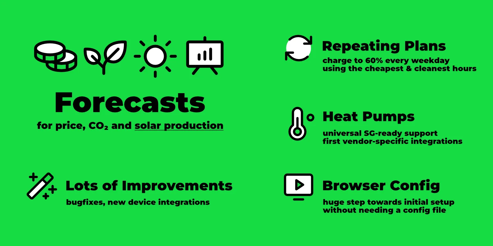
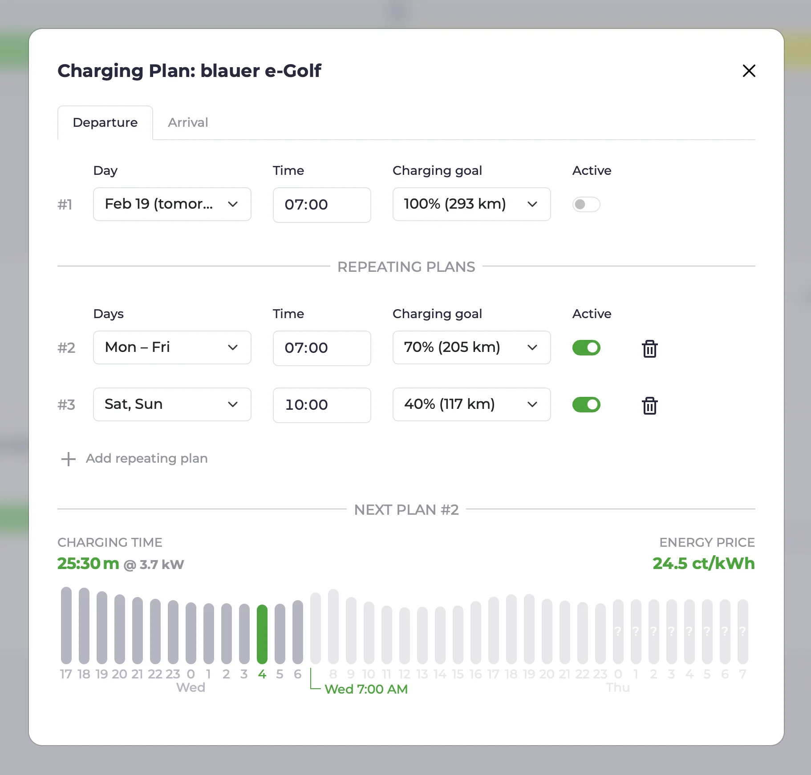

import Video from "../../src/components/Video";
import forecastsVideo from "./forecasts.mp4";
import forecastsPoster from "./forecasts.webp";
import configUiVideo from "./config-ui.mp4";
import configUiPoster from "./config-ui.webp";
import SgreadySvg from "/docs/devices/heating/sgready.svg";

Mit dem [Release von v0.200](https://github.com/evcc-io/evcc/releases) haben wir einen großen Schritt in Richtung Stabilität und Benutzerfreundlichkeit gemacht.
In diesem Blog-Artikel geben wir ein paar Hintergründe zum Versionssprung.
Aus dramaturgischen Gründen aber erst am Ende des Artikels ;)

Zudem stellen wir ein paar neue Funktionen vor, die seit dem [Blog-Artikel im November](/blog/2024/11/22/highlights-charts-stats) hinzugefügt wurden.

{/* truncate */}

## Vorhersagen

[CO₂-optimiertes](/docs/features/co2) und [Preis-optimiertes](/docs/features/dynamic-prices) Laden haben wir schon länger.
Mit [Forecast.solar](https://forecast.solar) und [Solcast](https://solcast.com/free-rooftop-solar-forecasting) haben wir jetzt die ersten beiden PV-Produktionsvorhersagen integriert.
Dafür gibt es in der [Tarif-Konfiguration](/docs/tariffs) jetzt das neue Feld `solar`.

Ist eine PV-Vorhersagequelle hinterlegt, bekommst du in der Energieübersicht die heute noch erwartete PV-Produktion in kWh angezeigt.
Über einen Klick auf diese Zahl oder den neuen Menüpunkt **Vorhersage** gelangst du zu einer neuen Ansicht, die dir die nächsten 48 Stunden der erwarteten PV-Produktion visualisiert.
Diese Visualisierung zeigt auch Preis- und CO₂-Vorhersagen an.

<Video src={forecastsVideo} poster={forecastsPoster} />

Aktuell kann lediglich eine PV-Vorhersage (entspricht einer Dachfläche) hinterlegt werden.
Mit dem nächsten Release fügen wir die Möglichkeit hinzu, Vorhersagen zu kombinieren.

PV-Vorhersagedaten haben aktuell noch keinen Einfluss auf die Ladeplanung, bilden aber die Grundlage für zukünftige Funktionen und Optimierungen.

## Wiederholende Ladepläne

Kennt evcc den Ladestand des Fahrzeuges, können beim Aufladen einige nützliche Funktionen verwendet werden.
Die Funktion, direkt nach dem Anstecken einen [Mindestladestand](/docs/features/limits#mindestladung) herzustellen, gibt es schon länger.
Auch die Möglichkeit, das Fahrzeug über einen [Ladeplan](/docs/features/plans) (Abfahrtszeit und Zielladestand) gezielt günstig und sauber zu laden, ist bereits etabliert.

Aber fast genauso alt ist der Wunsch nach wiederholenden Ladeplänen.
Also einer Möglichkeit wochentagsabhängige Pläne zu erstellen um die man sich nicht ständig kümmern muss.
Ein großer Dank geht hier an [@Maschga](https://github.com/Maschga), der sich diesem großen Thema gewidmet hat.
Das Ergebnis ist echt schick geworden.

Pläne können bei Bedarf (bspw. im Urlaub) deaktiviert werden.
Zeitzonen, Sommer- und Winterzeit werden korrekt berücksichtigt 🤯.
Mehrere wiederholende Pläne sind möglich, und bei eng aufeinanderfolgenden Plänen wird der relevante Plan ausgewählt und die Entscheidung des Planers transparent visualisiert.

Unter [Ladepläne](/docs/features/plans#wiederholende-pläne) erfährst du mehr darüber.

## Wärmepumpen & SG-ready

Die Frage nach einer Wärmepumpenunterstützung ist in den letzten Monaten regelmäßig aufgetaucht.
Wir haben uns bislang bewusst erst einmal auf den Anwendungsfall Elektrofahrzeuge konzentriert, um evcc fokussiert und übersichtlich zu halten.
Die Integration von Wärmeerzeugern war über Methoden wie [Relais, Schaltsteckdosen](/docs/devices/smartswitches#wärmeerzeugung) und die Plugin-Schnittstelle ([Beispiel](https://github.com/naltatis/aton-ctrl)) möglich und wurde auch auch genutzt.

Seit Januar bieten wir ein explizites Modell für Wärmepumpensteuerung an.
Sehr viele Wärmepumpen unterstützen das SG-Ready-Modell.
Über ein schaltbares Relais (bspw. Shelly) kann die Wärmepumpe angewiesen werden, bei Überschuss oder günstigem Netzstrom den Betrieb zu erhöhen.

<SgreadySvg alt="Diagramm für die Steuerung einer Wärmepumpe über ein SG-Ready Relais" style={{ maxWidth: '700px' }} />

Einige Wärmepumpen unterstützen zudem die direkte Kommunikation, bspw. über Netzwerk.
Die Liste dieser Geräte ist noch relativ kurz.
Hast du eine solche Wärmepumpe und weißt, wie man sie ansteuern kann, dann mach gerne ein [GitHub Issue](https://github.com/evcc-io/evcc/issues) auf.

In der Dokumentation findest du weitere Informationen zum Thema [Wärmepumpen & Heizstäbe](/docs/devices/heating).

Die Integration von Wärmeerzeugern in der UI ist funktional, aber noch nicht perfekt.
Themen wie zeitbasierte Auswertungen und eine bessere Darstellung der Wärmepumpe in der Hauptübersicht stehen auf unserer To-do-Liste.

## Config UI: Einrichtung über den Browser

Bei der Entwicklung von evcc war und ist uns stets wichtig, die Oberfläche so einfach und sauber wie möglich zu gestalten.
Uns wird regelmäßig zurückgemeldet, dass sich auch andere Hausmitbewohner (oft Nichtnerds) schnell in der Oberfläche zurechtfinden.
Eine Eigenschaft, die, gerade bei "klassischen" Open-Source-Projekten, nicht immer selbstverständlich ist und auf die wir auch etwas stolz sind.

Ein wichtiger Punkt spielt dabei die starke Vereinheitlichung und das zugrundeliegende Datenmodell.
Ist ein Wechselrichter, Fahrzeug oder eine Wallbox erst einmal konfiguriert, sind die Eigenheiten der Geräte in der UI nicht mehr relevant.

Der größte Schmerzpunkt für viele Nutzer ist allerdings diesen "Alles ist Eingerichtet" Zustand überhaupt zu erreichen.
Bislang war dafür die Verwendung der Kommandozeile und das Editieren einer YAML-Datei notwendig.

Wir arbeiten schon lange daran, auch die Ersteinrichtung über die UI zu ermöglichen.
Über die letzten Jahre und Monate haben wir Stück für Stück einzelne Funktionen wie das Anlegen von Fahrzeugen, Zählern, Wechselrichtern, Tarifen und co. hinzugefügt.
Auch notwendige Themen wie eine Log-Ansicht und ein Authentifizierungssystem sind inzwischen an Board.

Mit v0.200 haben wir den "letzten großen Brocken" in Richtung Einrichtung über die UI ins System gebracht.
**Nun können auch Ladepunkte und Wallboxen, die zentralen Komponenten von evcc, über die UI angelegt und geändert werden.**
Damit sind wir einem stabilen 1.0-Release spürbar näher gekommen.

<Video src={configUiVideo} poster={configUiPoster} />

Die Konfigurationsoberfläche ist immer noch als experimentelles Feature 🧪 gekennzeichnet.
Nicht alle Felder sitzen an der richtigen Stelle, tragen die korrekten Beschreibungen und sind ausgiebig getestet.
Wir freuen uns daher sehr auf eure Rückmeldungen, Anregungen und Bugreports.

Erweiterte Funktionen, wie das Anlegen von Custom-Geräten und bessere Diagnosewerkzeuge, stehen bspw. noch auf der Agenda.
Mehr zum Stand und Fortschritt rund um das Thema findest du im [Epic Issue](https://github.com/evcc-io/evcc/issues/6029).

### Config UI ausprobieren

Wenn du das reine UI-Setup ausprobieren möchtest, kannst du **evcc mit einer leeren `evcc.yaml` starten**.
Du erhältst einen Willkommensscreen und kannst von da aus deine Konfiguration über die UI vornehmen.
Experimentelle Features müssen dafür im UI aktiviert werden.

## Und Vieles mehr ...

Wie in den Highlights-Blog-Artikeln üblich, ist dies nur ein kleiner Ausschnitt aller Themen, an denen gearbeitet wurde.
Seit dem letzten Post im November sind [über 250 Pull Requests](https://github.com/evcc-io/evcc/pulls?q=is%3Apr+is%3Amerged) 🤯 entwickelt, reviewed und erfolgreich gemerged worden.

Die vollständige Liste der Themen findest du in den [Release Notes](https://github.com/evcc-io/evcc/releases) auf GitHub.

**Viele Grüße** 
Das evcc Team 
Michael, Andi & Uli