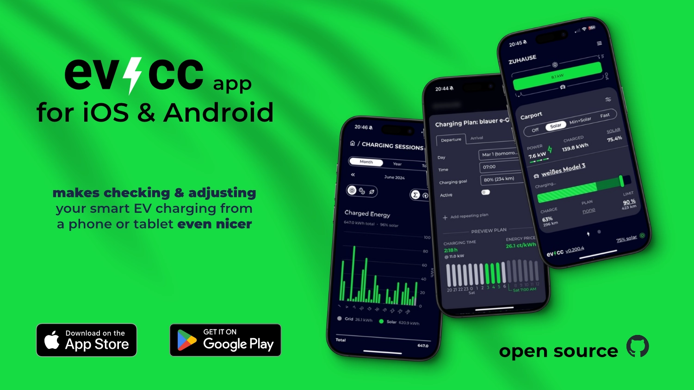

Geschafft!
Die erste Version der evcc App für iOS und Android ist fertig.
Sie kann jetzt im [Apple App Store](https://apps.apple.com/de/app/evcc-io/id6478510176) und [Google Play Store](https://play.google.com/store/apps/details?id=io.evcc.android) heruntergeladen werden.

{/* truncate */}

## Was macht die App?

Die evcc App ist ein nativer Wrapper für die evcc Benutzeroberfläche, der dir ein optimiertes Nutzungserlebnis auf deinem Smartphone oder Tablet bietet.
Sie bringt einige praktische Funktionen mit, die die Bedienung deiner evcc-Installation deutlich komfortabler machen:

### Einfaches Onboarding
- **Automatische Erkennung**: Die App findet evcc-Instanzen in deinem lokalen Netzwerk automatisch über mDNS.
- **Manuelle Einrichtung**: Du kannst deine evcc-Instanz auch manuell über die URL hinzufügen.
- **Demo-Modus**: Neugierig? Probiere die App einfach mit der Demo-Instanz aus.

### Optimierte Benutzeroberfläche
- **Vollbild-Ansicht**: Nutze die evcc UI im Vollbildmodus ohne störende Browser-Elemente.
- **Angepasstes Design**: Die Benutzeroberfläche respektiert die Besonderheiten deines Geräts (Notch, abgerundete Ecken, etc.).
- **Verbesserte Gestensteuerung**: Wische und navigiere intuitiv durch die App, ohne dass Browser-Zoom oder Überscroll-Effekte stören.

### Zuverlässige Verbindung
- **Online/Offline-Erkennung**: Die App zeigt einen Ladebildschirm, wenn deine evcc-Instanz nicht erreichbar ist.
- **Automatische Wiederverbindung**: Sobald deine Instanz wieder verfügbar ist, stellt die App die Verbindung automatisch wieder her.
- **Keine Fehlbedienungen**: Vermeidet irreführende Situationen, in denen die Benutzeroberfläche angezeigt wird, aber bspw. mangels Netzwerk nicht funktionsfähig ist.

### Flexibilität
- **Server wechseln**: Du kannst die konfigurierte URL jederzeit ändern - entweder im Offline-Modus oder über den Menüpunkt "Server wechseln".
- **Helles und dunkles Design**: Die native Benutzeroberfläche passt sich automatisch den Systemeinstellungen deines Geräts an.

Die App ist ein weiterer Schritt, um die Bedienung von evcc noch einfacher und intuitiver zu gestalten.
Du behältst deine Ladestation, PV-Anlage und den Energiefluss in deinem Zuhause jetzt noch besser im Blick - direkt von deinem Smartphone aus.

P.S.: Hast du einen Mac mit Apple Silicon? Dann kannst du die iOS App auch direkt dort verwenden.

## Die Technik dahinter

Bei der Entwicklung der App haben wir auf bewährte Technologien gesetzt.
Im Kern ist die App ein nativer Wrapper um unsere bestehende Web-Ansicht.
Wir haben uns für React Native in Kombination mit Expo entschieden, was uns ermöglicht, die App für iOS und Android mit einer gemeinsamen Codebasis zu entwickeln.
Dies reduziert den Entwicklungsaufwand erheblich und stellt sicher, dass neue Funktionen schnell auf beiden Plattformen verfügbar sind.

Die nativen Komponenten sind in TypeScript geschrieben und auf ein Minimum beschränkt.
Für das Design-System nutzen wir UI Kitten / Eva, was uns hilft, eine konsistente und ansprechende Benutzeroberfläche zu gestalten.

Wie alle unsere Projekte ist auch die App Open Source.
Der Quellcode ist auf [GitHub](https://github.com/evcc-io/app) verfügbar.
Fehlermeldungen, Verbesserungsvorschläge und Pull Requests sind willkommen!

## Wo geht die Reise hin?

Die erste Version der App ist ein wichtiger Meilenstein, aber wir haben noch einige spannende Ideen für die Zukunft:

### Fernzugriff vereinfachen
Aktuell funktioniert die App nur im gleichen Netzwerk wie deine evcc-Installation.
Für den Fernzugriff musst du selbst eine sichere Verbindung herstellen.
Mit VPN-Lösungen wie Wireguard (in Kombination mit einer FritzBox) oder Tailscale (mit On-Demand-Verbindungen und Magic DNS) ist das heute schon möglich, erfordert aber zusätzliche Konfiguration.
Wir haben noch keine konkreten Pläne für eine direkte Integration in die App, aber es ist definitiv ein Thema, um das wir uns in mittlerer Zukunft kümmern wollen.

### Plattformspezifische Funktionen
Die native App bildet die Grundlage für weitere plattformspezifische Funktionen, die mit einer reinen Web-Anwendung nicht möglich wären.
Dazu gehören Push-Benachrichtigungen, um dich über wichtige Ereignisse zu informieren, und Widgets für den Homescreen, die dir einen schnellen Überblick über den aktuellen Status deiner Ladestation und PV-Anlage geben.

💚 Ein großer Dank an alle, die dieses Projekt finanziell oder durch aktive Mitwirkung unterstützen.

🌟 Achja, gebt gerne eine Bewertung im [App Store](https://apps.apple.com/de/app/evcc-io/id6478510176) oder [Play Store](https://play.google.com/store/apps/details?id=io.evcc.android) ab, wenn euch die App gefällt!

**Viele Grüße** 
Das evcc Team 
Michael, Andi & Uli