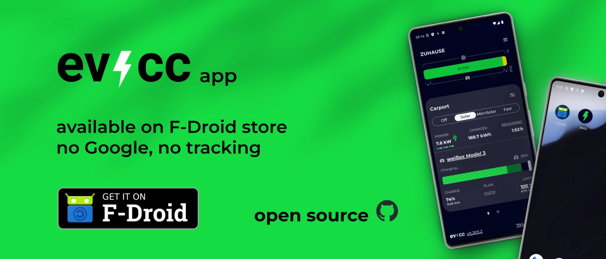

Die [evcc App](/docs/features/app) ist jetzt auch im F-Droid Store verfügbar.
F-Droid ist ein alternativer Android-App-Store, der ausschließlich freie Software ohne proprietäre Abhängigkeiten bereitstellt.

{/* truncate */}

Zusätzlich zum Google Play Store konnten Android-Nutzer die evcc App alternativ als [APK bei GitHub herunterladen](https://github.com/evcc-io/app/releases/latest).
Nun ist sie auch im F-Droid Store verfügbar.
Damit kannst du sie unabhängig von Google-Konto und Google-Infrastruktur nutzen und komfortabel aktualisieren.

Die evcc App ist Open Source und enthält keinerlei Tracking.
Mit der Distribution über F-Droid entfällt auch das potenzielle Tracking der klassischen App-Store Betreiber.

Um zu gewährleisten, dass die App, die du installierst, auch nur das enthält, was du im GitHub Repository siehst, bietet F-Droid die Möglichkeit, die App **reproduzierbar bauen** zu lassen.
Dazu waren einige Anpassungen an unserem Expo-basierten Build-Prozess nötig.
Danke an [Maschga](https://github.com/Maschga) und [linsui](https://gitlab.com/linsui) für die Hilfe!

Hier gehts zum Store: [evcc App im F-Droid Store](https://f-droid.org/de/packages/io.evcc.android/)

Die neue Version 1.0.3 enthält kleinere Fehlerbehebungen und Verbesserungen für iOS Nutzer.
Alle Details findest du in den [Release Notes](https://github.com/evcc-io/app/releases/tag/1.0.3).

**Viele Grüße** 
Das evcc Team 
Michael, Andi & Uli
