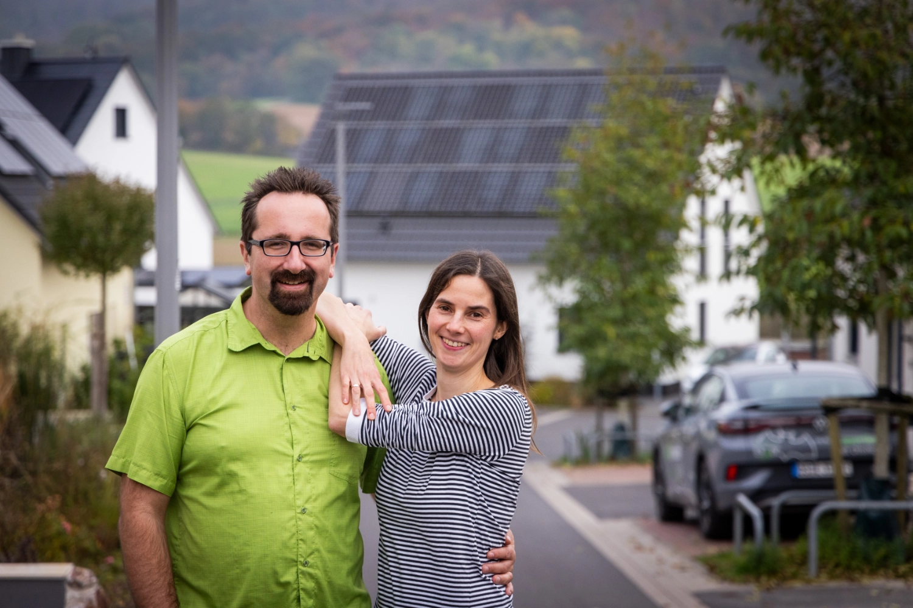
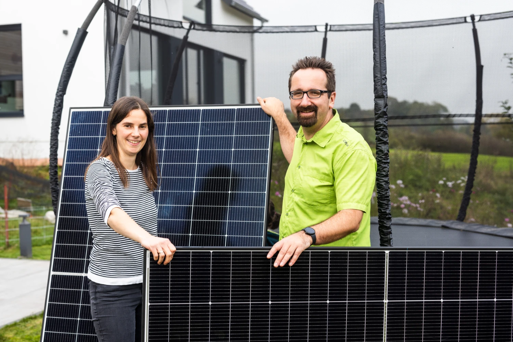
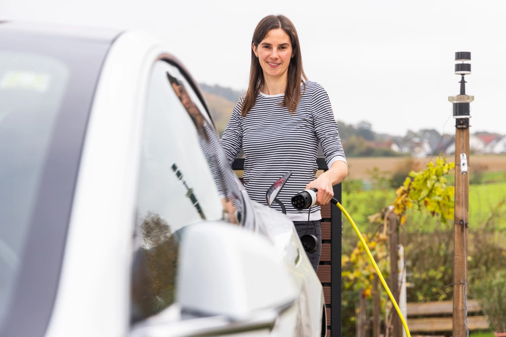
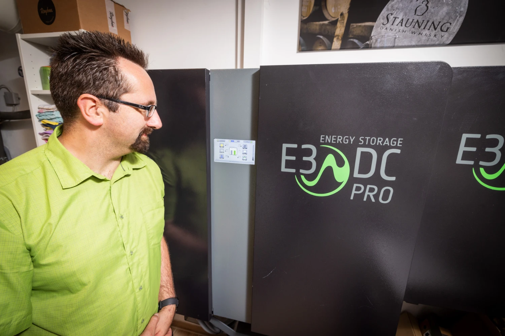
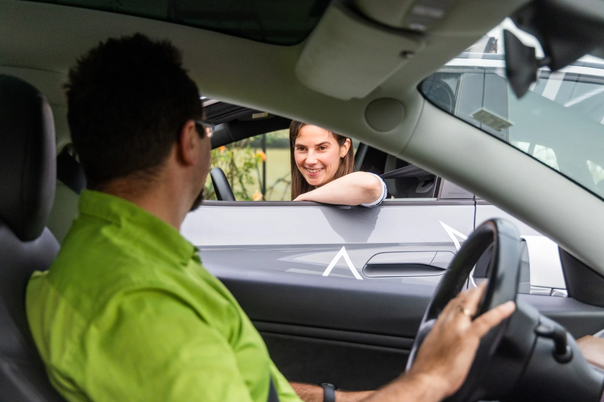
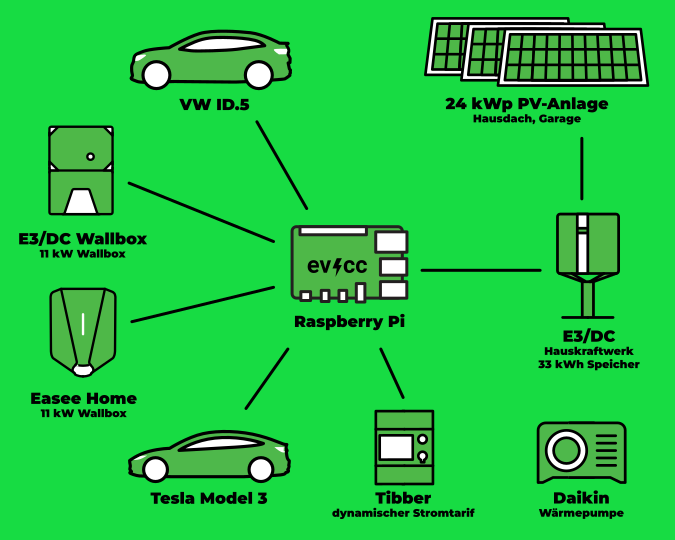
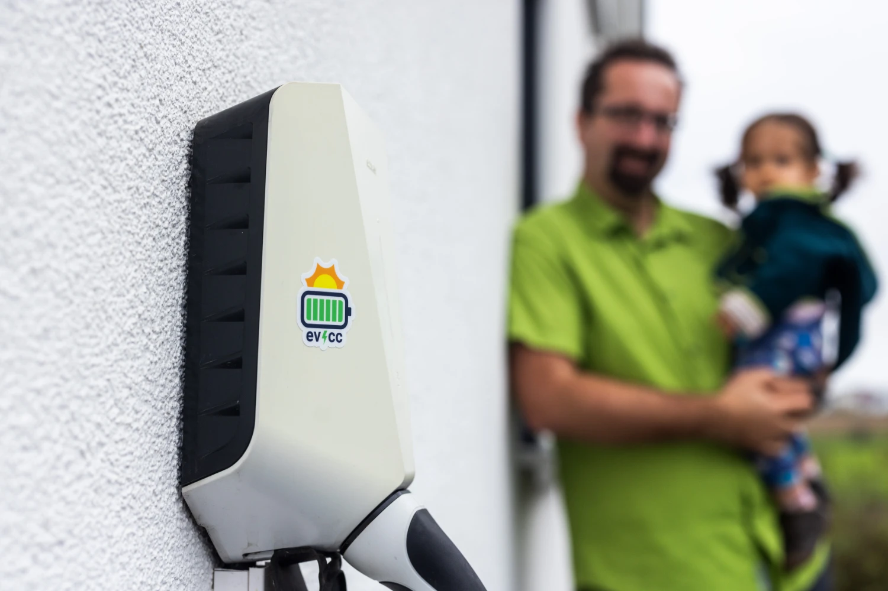

Die Tage werden wieder sonniger.
Ein guter Zeitpunkt für ein neues Community-Porträt.
Dieses Mal war Fotograf [Detlef](https://hee.se) bei Ulrike und Gunther im schönen Städtchen Alzenau in Nordbayern zu Besuch.

{/* truncate */}

## Maximale Dämmung oder maximale PV?

**Michael:** Hi ihr beiden, toll, dass ihr euch für ein Community-Portrait zur Verfügung stellt.
Dann springe ich gleich mal rein ins Thema: Wie begann eure Reise in die Elektromobilität? 

**Ulrike:** Unser Einstiegspunkt in die E-Mobilität kam 2018 in Form eines Nissan Leaf, der gefolgt wurde von einem Model 3.
Zu dem Zeitpunkt wohnten wir noch in einer Mietwohnung.
Das war schon teilweise abenteuerlich, weil wir keinen eigenen Stellplatz hatten und es eine begrenzte Anzahl an Ladepunkten gab.
Mit PV hatten wir schon beim Camping experimentiert.
Dort natürlich in kleinerem Maßstab, um bspw. Handys zu laden.

Beim Hausbau kamen dann beide Themen, die Elektromobilität und die Photovoltaik, zusammen.
Heute erleichtert dies unseren Alltag enorm.
Es ist schon ein schönes Gefühl, morgens immer mit vollgeladenem Auto starten zu können.

**Gunther:** Genau, und beim Fahren begeistert uns die Ruhe und das angenehme Fahrgefühl.
Wie Ulrike schon sagte, war uns bei der Hausplanung schnell klar: Wir brauchen günstigen Strom für das Auto.
Zu Anfang haben wir noch überlegt, ob wir auf maximale Dämmung oder besser auf maximale PV-Leistung gehen.
Letztlich war es günstiger, mehr PV-Module auf dem Ost-West-Dach zu installieren, als das Haus aufwendig zu dämmen.
Jetzt haben wir einen Neubau mit viel PV, wodurch wir Heizung und Autos auch über Schlechtwetterperioden gut versorgen können.

Es ist ein tolles Gefühl, neun Monate im Jahr dank eigenem Strom vom Netz unabhängig zu sein.
Unsere Energiekosten für zwei E-Autos, Wärmepumpe und Haus sind minimal und werden durch die PV-Erweiterung auf der Garage sogar negativ.

## All Electric Haushalt!

**Michael:** Wow, das klingt nach einer sehr konsequenten Umsetzung.
Wie sieht euer Tech-Set-up genau aus?

**Gunther:** Auf dem Hausdach haben wir 10,5 kWp nach West-Nordwest und 8,4 kWp nach Ost-Südost.
Die Nord-Garage hat ca. 5,1 kWp flach aufgeständert mit Ost-/West-Ausrichtung, sodass wir insgesamt auf 24 kWp kommen.
Da wir mit zwei E-Autos zur Arbeit pendeln, haben wir einen großen Speicher mit 33 kWh nutzbarer Kapazität (E3DC Hauskraftwerk).
So können die Autos abends nach der Arbeit mit bis zu 12 kW aus dem Speicher geladen werden, was Flexibilität bei Schlechtwetterphasen gibt.

**Ulrike:** Wir haben bei den Verbrauchern im und ums Haus konsequent "all electric" umgesetzt, damit wir nicht noch zusätzliche Verbraucher mit anderen, fossilen Energieformen haben. 
Das bedeutet zwar einen hohen Strombedarf, aber den können wir durch die maximale Belegung aller Dachflächen gut abdecken.
An der Stelle hilft es auch, keine Angst vor der Belegung der Nordseite zu haben.
Unser großer Batteriespeicher rundet das System ab.

**Gunther:** Dank der vielen Module und des Speichers ist die Anlage sehr wirtschaftlich und wir können Schlechtwetterphasen gut überbrücken.
Von Anfang November bis Mitte Februar beziehen wir Netzstrom, ansonsten sind wir autark.
2024 lag unsere Autarkie bei 75 %. Dieses Jahr streben wir 80 % an!

Zu den PV-Anlagen und den üblichen Verbrauchern im Haus kommt noch eine E3DC-Wallbox, die über das Hauskraftwerk gesteuert wird, und eine Easee Home Wallbox am zweiten Stellplatz. 
Diese wurde später für das zweite E-Auto nachgerüstet und ist eine einfache, ungesteuerte Wallbox.
Hier kommt für uns evcc ins Spiel: Es verleiht der Easee-Wallbox die nötige Intelligenz, um das zweite E-Auto optimal mit Überschussstrom und optimiert zum dynamischen Tibber-Tarif zu laden.

| Komponente | Details |
|------------|---------|
| **PV-Anlage** | 24 kWp (10,5 kWp WNW, 8,4 kWp OSO, 5,1 kWp O/W auf Garage) |
| **Speicher** | 33 kWh (E3DC Hauskraftwerk) |
| **Fahrzeuge** | Tesla Model 3, VW ID.5 |
| **Wallboxen** | E3DC Wallbox (Garage), Easee Home (Stellplatz, via evcc) |
| **Wärmepumpe** | Daikin |
| **Dynamischer Stromtarif** | Tibber |

## Bewusster im Winter, entspannter im Sommer

**Michael:** Wie hat sich dieses Set-up auf euren Umgang mit Energie im Alltag ausgewirkt? 

**Ulrike:** Im Winter und in der Übergangszeit gehen wir bewusster mit Energie um und planen mehr im Voraus: wann wird die Wäsche gewaschen, wann lädt das Auto? 
Und gerade beim Laden nimmt uns evcc für die zweite Wallbox die Denkarbeit ab, was sehr entspannend ist.

Durch den Energieüberfluss im Sommer gehen wir dann in der hellen Jahreszeit viel entspannter mit dem Verbrauch um.
Unser Stromverbrauch ist im Sommer sogar gestiegen.

## Energie-Stammtisch: Wissen vor Ort teilen

**Michael:** Gunther, du engagierst dich im [Energie-Stammtisch Freigericht](https://www.energie-stammtisch-freigericht.de)
Das klingt interessant.
Wie kam es dazu?

**Gunther:** Wir sind eine Gruppe meist technikbegeisterter Menschen, die sich für erneuerbare Energieprojekte in der Region engagieren.
Wir unterstützen bei der Planung von PV-Anlagen, Batteriespeichern, Wärmepumpen und Ladelösungen im Eigenheim und teilen unsere Erfahrungen.
Wir veranstalten Balkonkraftwerk-Workshops und setzen uns für den lokalen Windenergieausbau ein.
Die Arbeit ist sehr motivierend und kommt den Menschen in der Region zugute.
Ich kam selbst über das Thema E-Auto zum Verein und bin inzwischen im Vorstand aktiv.
Auf unserer [Facebook-Präsenz](https://www.facebook.com/share/1RU91S4CHT/) bekommt man tiefere Einblicke in unsere Arbeit.

## evcc: Schick, Echtzeitfähig und Praktisch

**Michael:** Das hört sich nach guten Tipps und Erfahrungen an.
Ein richtig gutes Mittel, um die Energiewende in der eigenen Region voranzubringen und die Mitmenschen mitzunehmen.
Lass uns noch mal über Software sprechen.
Habt ihr eine Lieblingsfunktion in evcc?
Gibt es Verbesserungswünsche?

**Ulrike:** Die sekundengenaue Auflösung von evcc ist toll.
Wir haben im Wohnzimmer ein altes Handy an den Schrank geklebt, das evcc als Display rund um die Uhr anzeigt.
So ist die Energiebilanz immer sekundengenau in Echtzeit sichtbar.
Und eure Benutzeroberfläche ist wirklich schick.
Auch das Überschussladen funktioniert mit evcc hervorragend.

**Gunther:** Verbesserungspotenzial sehe ich bei der Einrichtung, die ich damals nur mithilfe meines Nachbarn geschafft habe.
Die neue webbasierte Einrichtung, an der ihr arbeitet, ist genau die richtige Richtung.
Beim Thema Stabilität, also wenn externe Schnittstellen mal nicht funktionieren, könnte evcc auch noch besser reagieren.

**Ulrike:** Ich schätze besonders, dass ich mich um nichts kümmern muss: Auto anstecken, evcc erledigt den Rest.
Das ist für mich eine echte Erleichterung im Alltag.

**Gunther:** Ansonsten deckt evcc unsere Bedürfnisse bei Automatisierung und Visualisierung gut ab.
Wir sind happy, so ein schön gestaltetes Energiemanagement-Tool zu haben.

**Michael:** Das freut mich, danke für die Rückmeldung.
Vielen Dank für die Einblicke in eure Energiewelt.
Das ist einfach inspirierend!

---

**Wie sieht dein evcc-Set-up aus?**
Wenn du Interesse hast, deine Erfahrungen, deinen Weg und deine Technik in Form eines Community-Porträts zu teilen, dann trag dich gerne [hier im Formular](https://airtable.com/appDI3xIiev1DOpMY/shrW1zGH26KElfZOK) ein.
Wir suchen vor allem für fortgeschrittene Installationen oder von Nutzern außerhalb Deutschlands.
