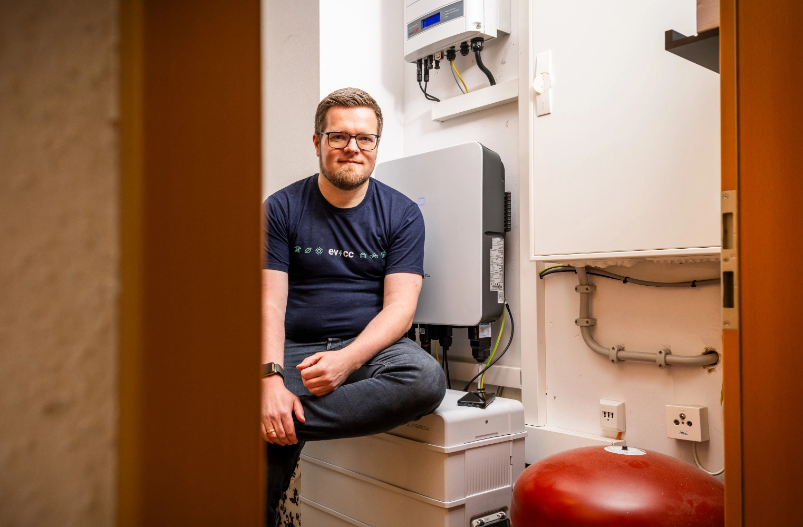

Wir haben in den letzten Monaten viele Nutzer aus der Community kennengelernt.
Das heutige Portrait ist etwas anders: Fotograf [Detlef](https://hee.se) übernimmt die Interviewer-Rolle und spricht mit Michael aus dem evcc Core-Team.

{/* truncate */}

## "Die beste Software bringt nichts, wenn niemand sie kennt"

**Detlef:** Heute drehen wir den Spieß mal um und du bist an der Reihe.
Ich habe dich und das Projekt durch einen Vortrag von dir kennengelernt.
Bist du mit deinem Engagement so etwas wie der "Head of evcc"?

**Michael:** Nein, so würde ich mich nicht beschreiben.
Ich bin zusammen mit [Andi](https://github.com/andig) und [Uli](https://github.com/premultiply) Teil des dreiköpfigen Core-Teams.
Wir treiben das Projekt gemeinsam voran und teilen uns die verschiedenen Aufgaben, die bei einem Open-Source-Projekt dieser Größe anfallen.

Neben meinem Schwerpunkt der UI-Entwicklung, kümmere ich mich auch um unsere Außendarstellung.
Also Themen wie die Webseite, Blogartikel, [Sticker](https://github.com/evcc-io/evcc/discussions/4446), Dokumentation, etwas Social Media und 
den ein oder anderen öffentlichen Auftritt auf Konferenzen oder in YouTube-Videos.
Die beste Software bringt ja nichts, wenn niemand sie kennt.

## Von der naiven Idee zum Core-Team-Mitglied

**Detlef:** Wie war dein erster Kontakt mit evcc?

**Michael:** Wie vermutlich bei den meisten Nutzern. Wir hatten 2020 ein Elektroauto bestellt und ich suchte nach einer Lösung, es mit Überschussenergie aus unserer PV-Anlage zu laden.
Relativ naiv dachte ich, ich kaufe mir eine smarte Wallbox, dann passt das schon.
Die Realität war ernüchternd: herstellergebundene Insellösungen, Cloud-Dienste, proprietäre Angebote - alles nicht das, was ich wollte.

Dann stieß ich auf evcc.
Die Software war minimalistisch, modular und hat mit Go und Vue.js einen spannenden Tech-Stack.
Das Projekt war damals erst wenige Monate alt.
Ich machte schnell erste Contributions und wurde Teil des Core-Teams.
Fast fünf Jahre später ist die Software unglaublich weit gekommen.

## Das Ding mit dem Hundefutter

**Detlef:** Du hast selbst eine Installation am Laufen?
Wie sieht die aus?

**Michael:** Unsere Reise begann 2017 mit einer 9,8 kWp PV-Anlage in Süd-Ausrichtung - damals noch knapp unter der 10 kWp-Grenze.
2023 haben wir dann alle Dachflächen vollgemacht, das Carport und die Nordseite bekamen auch Module.
Insgesamt sind es jetzt 18 kWp plus ein 12,8 kWh Hausspeicher.
Das hat unser Autarkielevel deutlich erhöht.

Aber evcc macht bei uns längst mehr als nur Elektroauto-Laden.
Von März bis Oktober übernimmt ein [evcc-gesteuerter 3 kW Elektroheizstab](https://github.com/naltatis/aton-ctrl) die Warmwasserbereitung - natürlich nur mit PV-Überschuss oder zu Zeiten günstiger Netzstrompreise.
Selbst das E-Bike hängt an einer Steckdose, die nur bei Sonnenschein Energie liefert.

Das ist nicht wirklich wirtschaftlich getrieben.
Unsere Pelletsheizung würde das Wasser sogar etwas günstiger erwärmen, der E-Bike-Verbrauch ist im Vergleich zum Auto verschwindend gering.
Aber mir geht es darum, die neuen evcc-Funktionen auch selbst im Alltag zu verwenden.
Im Englischen gibt es dafür den schönen Ausdruck: [Eat your own dog food.](https://en.wikipedia.org/wiki/Eating_your_own_dog_food)

| Komponente | Details |
|------------|---------|
| **PV-Anlage** | 18,1 kWp gesamt 7,7 kWp Süd SolarEdge 9,0 kWp Nord Sungrow 1,4 kWp Carport Hoymiles & AhoyDTU |
| **Speicher** | 12,8 kWh Sungrow |
| **Fahrzeuge** | Tesla Model 3 |
| **Wallboxen** | Easee Home, Go-e Gemini |
| **Heizstab** | 3 kW TA Aton via PWM |
| **E-Bike** | Shelly 1PM |
| **Dynamischer Stromtarif** | Octopus Energy |

## Community-Power statt Expertenwissen

**Detlef:** evcc unterstützt inzwischen hunderte von Geräten und Diensten.
Hast du die alle im Kopf?

**Michael:** Den Funktionsumfang schon, aber die Details zu einzelnen Integrationen ganz sicher nicht.
Uli und Andi sind die Experten für Geräteanbindungen.
Neue Integrationen entstehen fast immer durch Community-Mitglieder, die das entsprechende Gerät besitzen - manchmal Entwickler mit fertigen Pull Requests, oft auch Nutzer, mit denen wir dann gemeinsam eine Lösung erarbeiten.

Das Schöne ist: Für die Featureentwicklung spielen spezifische Geräteeigenheiten kaum eine Rolle.
Unser einheitliches Datenmodell sorgt dafür, dass der Zugriff auf bspw. Hausbatterien aller Modelle gleich funktioniert.
Bietet ein Gerät Zusatzfunktionen wie Phasenumschaltung oder Steuerbarkeit, erscheinen automatisch weitere Optionen in der Oberfläche.

## Open-Source vs. Herstellerlösungen

**Detlef:** Thema Open-Source: Begeistert dich nach all den Jahren immer noch, dass vieles aus eigenem Interesse entsteht?

**Michael:** Absolut.
Open-Source ist unschlagbar: Wir schaffen eine Art Datenbank, die Schnittstellen zu fast allen Wallboxen, Wechselrichtern und anderen Geräten einheitlich aufbereitet.
Dieser Gedanke von _freiem Wissen_ ist faszinierend und eine unglaublich wertvolle Ressource - auch für andere Projekte.

**Detlef:** Viele Hersteller bieten proprietäre Systeme an, einige Wechselrichter öffnen sich.
Was bedeutet das für euer Projekt?

**Michael:** Du hast recht.
Viele Hersteller integrieren inzwischen intelligente Ladefunktionen.
In einer idealen Welt sollte intelligenter Energieumgang so einfach wie möglich sein.
Tesla macht das mit seiner Powerwall-Wallbox-Fahrzeug-Kombination relativ gut.
Aber sobald man das Ökosystem verlässt - anderes Fahrzeug, Wärmepumpe integrieren - wird es kompliziert.
Hier braucht es Lösungen wie evcc.

**Detlef:** Glaubst du, dass evcc außer bei IT-Freaks Begeisterung finden wird?

**Michael:** Ich glaube schon.
Heute braucht man noch technisches Wissen und etwas Technikliebe.
Aber wir arbeiten daran, die Ersteinrichtung so komfortabel wie eine Fritz!Box-Installation zu machen.
Dadurch wird die Software auch für weniger technisch-versierte Nutzer:innen zugänglich.

Cloud-Services sind natürlich noch einfacher zu benutzen: anmelden, Zugangsdaten eingeben, fertig.
Aber dann bin ich abhängig und muss hoffen, dass verantwortungsvoll mit meinen Daten umgegangen wird und der Dienst stabil läuft.
Eine lokale Lösung in den eigenen vier Wänden gibt mir die volle Kontrolle.
Unabhängigkeit, Stabilität und Datenhoheit sind für mich und viele andere Nutzer:innen ein wichtiges Kriterium.

## Keine Magie, keine Checkbox-Flut

**Detlef:** Bei den Featurewünschen auf GitHub könnt ihr nicht allen gerecht werden.
Wer entscheidet, was in die nächste Version kommt?

**Michael:** Verschiedene Faktoren spielen eine Rolle.
Unsere Leitlinie: Die UI nicht mit erklärungsbedürftigen Einstellungen überladen, aber auch keine "magischen Logiken" implementieren, die Nutzer überraschen könnten.
Diese Ziele widersprechen sich manchmal.
Im Zweifelsfall lehnen wir Featurewünsche ab - aber dank offener Schnittstellen lassen sich viele Logiken auch erst einmal extern mit eigenen Skripten oder Home Assistant umsetzen.

Die Nachfrage spielt natürlich auch eine Rolle.
Wärmeerzeuger haben wir lange nur als Plugin unterstützt, um uns auf unsere Kernfunktionen, das Laden von E-Autos, zu konzentrieren.
Seit Anfang des Jahres haben wir nun aber Wärmepumpen von über 20 Herstellern integriert - einfach weil es so viele Nutzer wünschten und die meisten dafür notwendigen Mechanismen bereits in evcc existierten.

## Keine Roadmap, keine Weltherrschaft

**Detlef:** evcc war für mich immer ein Projekt für marken- und geräteübergreifende Wallbox-Steuerung - heute ist es quasi ein universelles EMS.
Wie siehst du die Zukunft?

**Michael:** Spannende Frage.
Eine offizielle Roadmap gibt es nicht, zumindest nicht in formaler Form.
Das Community-Finanzierungsmodell gibt uns Freiheit: keine externen Zwänge, keine Meilensteine oder Weltherrschaftsziele mit festen Terminen.

Unsere einzige Motivation ist, die Software optimal an Nutzerwünsche anzupassen.
Die Community hält das Projekt am Leben und gibt die Richtung vor.
Ob wir uns "Universelles EMS" nennen und alle Produktvergleichs-Checkboxen abhaken können - das ist letztendlich egal.
Wichtig ist, dass wir Lösungen für die realen Bedürfnisse der Nutzer liefern.

Zur Zukunft: Ein häufig gewünschtes Feature sind Visualisierungen und Statistiken, die über Ladevorgänge hinaus gehen.
Also eine Art "Dashboard" wie man es aus den Apps der Wechselrichterhersteller kennt.
Hier haben wir schon einiges in Planung.

Ein weiteres großes Thema sind Verbesserungen der intelligenten Steuerung.
Hier geht es erst einmal um das Einbeziehen von Produktions- und Verbrauchsprognosen in unsere Regelung.
Gute Integrationsfähigkeit in bestehende Optimierungssysteme und AI-basierten Services sind uns ebenfalls wichtig.
Hier sind wir auch immer auf der Suche nach engagierten Mitstreitern.
Bei Interesse meldet euch gerne bei uns im Slack.

**Detlef:** Vielleicht auch im Namen aller evcc-Nutzer: Vielen Dank, dass du das Projekt so vorangetrieben hast.
Wenn die Sonne scheint, ist es umso schöner, die eigene Energie so wunderbar zu nutzen.

**Michael:** Danke für die Fragen - und die Gelegenheit, mal die andere Seite des Interviews zu erleben!

---

**Community-Porträts gesucht!**
Du hast schon Code zu evcc beigetragen?
Dann melde dich gerne [hier](https://airtable.com/appDI3xIiev1DOpMY/shrW1zGH26KElfZOK).
Wir suchen gerade Porträts von aktiven Community-Mitgliedern.