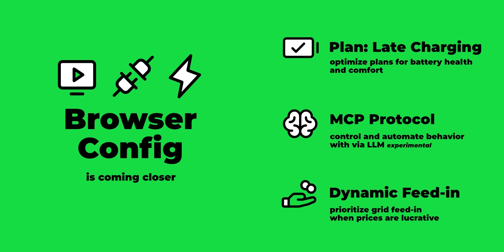

import Video from "../../src/components/Video";
import configUiVideo from "./config-ui.mp4";
import configUiPoster from "./config-ui.webp";

Es ist mal wieder Zeit für einen Neue-Feature-Rundumschlag Blogartikel.
Ich habe eine Hand voll Themen herrausgesucht, die gerade spannend sind.

[](/blog/2025/07/27/highlights-config-ui-mcp-feedin)

{/* truncate */}

Bevor wir zu den Featuren kommen, hier noch eine Ankündigung für alle, die die REST API zur Integration mit anderen Systemen verwenden.

## Vorankündigung: Breaking Change REST API

In einem der kommenden Releases (vmtl. v0.206.0) wird es eine Änderung an der REST API geben.
Die Endpunkte an sich bleiben unverändert, allerdings möchten wir das Antwortformat etwas verschlanken.
Konkret wird die äußere `result`-Ebene entfernt.

Hier ein Beispiel für den Endpunkt `GET /api/state`:

Aktuelle JSON Antwort:

```json
{
  "result": {
    "loadpoints": [...],
    ...
  }
}
```

Zukünftige JSON Antwort:

```json
{
  "loadpoints": [...],
  ...
}
```

Wir haben die Maintainer der populären evcc Integrationen über diese Änderung informiert.
Die notwendigen Anpassungen sind bereits durchgeführt worden.

Uns ist bewusst, dass viele von euch auch eigene Scripte oder Automatisierungen haben, die direkt auf die REST API zugreifen.
Hier müsst ihr natürlich selbst Hand anlegen.
Habt also ein gutes Auge auf die kommenden Release-Notes.
Mehr Details gibt es im entsprechenden [GitHub Issue.](https://github.com/evcc-io/evcc/pull/22299)

## Konfiguration via Browser

Beim Thema Ersteinrichtung via Browser geht es mit großen Schritten voran.
Seit ein paar Wochen ist ein Aufsetzen ohne `evcc.yaml` möglich.
Bislang startete in diesem Zustand immer der [Demo-Modus](https://demo.evcc.io/).

Nun startet die Einrichtung mit einem Auswahldialog:
- Klassische Konfiguration mit `evcc.yaml`
- Browser-basierte Konfiguration (🧪 experimentell)

Im folgenden Video siehst du den Konfigurationsprozess mit mehreren Fahrzeugen, Zählern, PV-/Batterie-Anlagen, Wallbox und Wärmepumpe:

<Video src={configUiVideo} poster={configUiPoster} />

Inzwischen können auch [benutzerdefinierte Geräte (Plugins)](https://docs.evcc.io/docs/devices/plugins) rein über das UI angelegt und bearbeitet werden.


## Ideas
- Pre-Announcement: Breaking Change REST
- Energyflow: expand pv, battery, loadpoints
- Plans: late charging
- Config UI
  - start without evcc.yaml
  - explicit demo mode
  - custom devices / plugins
  - heating vs. charging
- Smart feed-in priority
- General: many heatpump, charger, tariff, ... integrations
