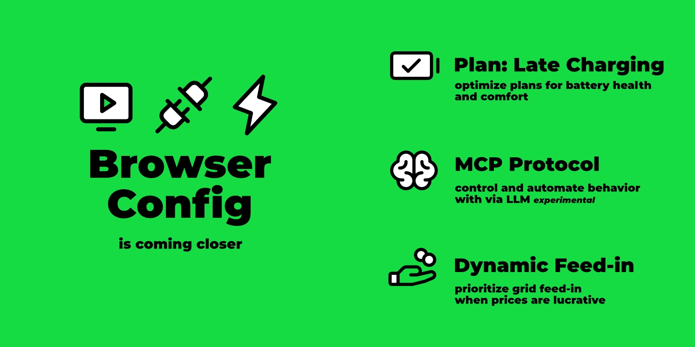
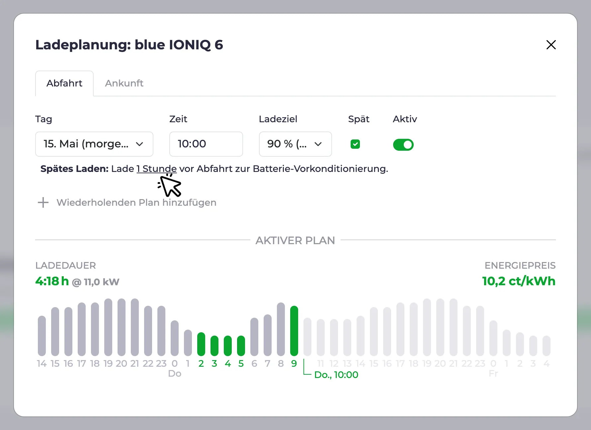
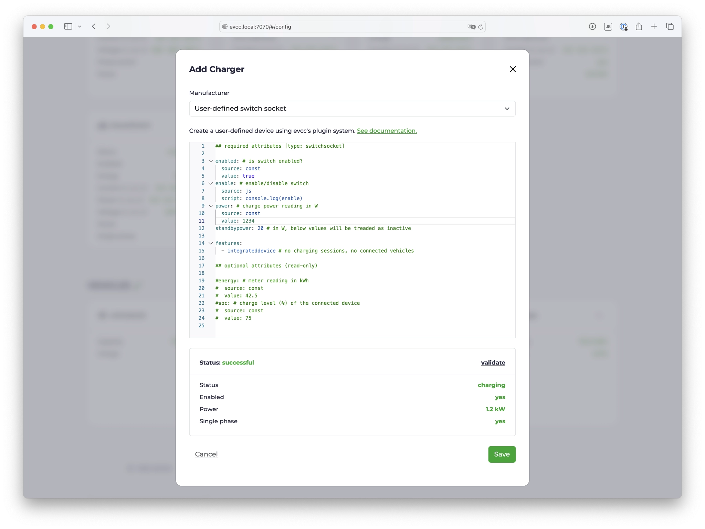
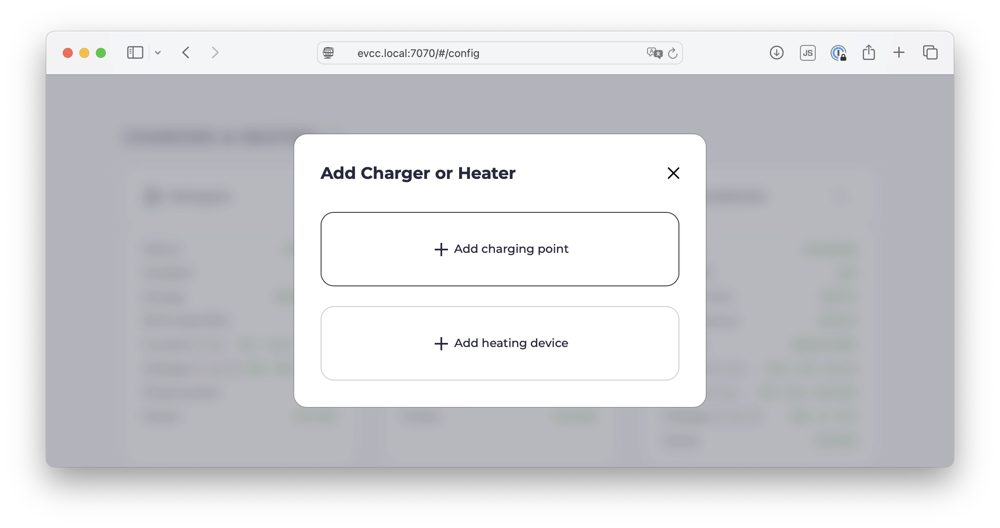
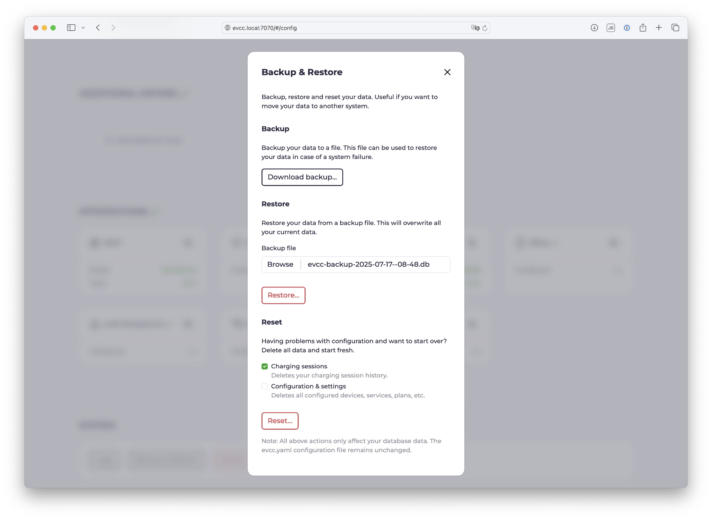
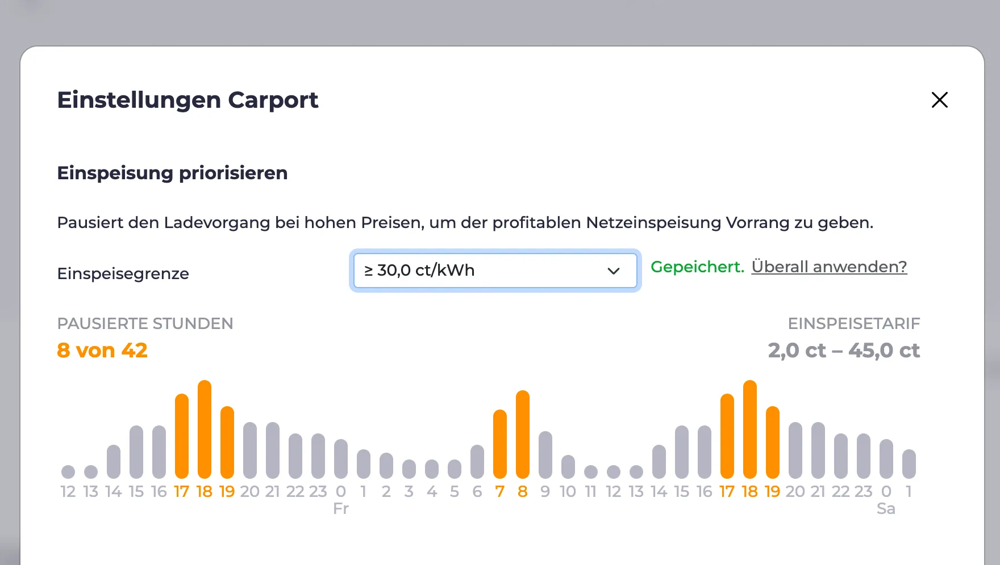

import Video from "../../src/components/Video";
import configUiVideo from "./config-ui.mp4";
import configUiPoster from "./config-ui.webp";
import mcpVideo from "./mcp-integration.mp4";
import mcpPoster from "./mcp-integration.webp";

Zeit für einen neuen Feature-Rundumschlag! Ich habe eine Handvoll spannender Themen herausgesucht.

[](/blog/2025/07/30/highlights-config-ui-feedin-ai)

{/* truncate */}

Bevor wir zu den Features kommen, eine wichtige Ankündigung für alle REST API-Nutzer.

## Breaking Change: REST API

Mit Release v0.207 gibt es eine Änderung an der REST API.
Die Endpunkte bleiben unverändert, das Antwortformat wird jedoch verschlankt.
Konkret wird die äußere `result`-Ebene entfernt.

Hier ein Beispiel für den Endpunkt `GET /api/state`:

Aktuelle JSON Antwort:

```json
{
  "result": {
    "loadpoints": [...],
    ...
  }
}
```

Zukünftige JSON Antwort:

```json
{
  "loadpoints": [...],
  ...
}
```

Die Maintainer der populären evcc Integrationen wurden informiert und haben bereits die notwendigen Anpassungen durchgeführt.

Nutzer mit eigenen Scripten oder Automatisierungen, die direkt auf die REST API zugreifen, müssen diese selbst anpassen.
Mehr Details gibt es im entsprechenden [GitHub Issue.](https://github.com/evcc-io/evcc/pull/22299)

:::note Hinweis zur Migration
Um den Umstieg zu erleichtern haben wir zwei Releases veröffentlicht: **v0.206 und v0.207 sind featuregleich**.
Die API-Änderungen sind **ab v0.207** enthalten.
Sollte das neue Antwortformat Probleme verursachen, kannst du auf v0.206 downgraden.
Du hast damit alle hier beschriebenen neuen Funktionen und kannst deine Scripte und Integrationen in Ruhe auf den Breaking Change vorbereiten.
:::

## Ladeplanung: Spätes Laden

Die Ladeplanung hat eine neue Funktion erhalten: _Spätes Laden_.
Standardmäßig optimiert der Planungsalgorithmus die Ladung so, dass in den günstigsten bzw. saubersten Stunden geladen wird.
Es kann aber auch sinnvoll sein, das Fahrzeug spät, also passend zur eingestellten Zielzeit, zu laden.

Anwendungsfälle sind:

- **Vorkonditionierung**: Gerade im Winter kann es sinnvoll sein, den Fahrzeugakku durch das Laden zur Abfahrtszeit zu erwärmen. Das spart Energie, weil weniger aktive Klimatisierung während der Fahrt notwendig ist.
- **Klimatisierung**: Hast du zur Abfahrtszeit Klimatisierung im Auto aktiviert, stellst du durch diese Einstellung sicher, dass die benötigte Energie über die Wallbox und nicht aus dem Autoakku bezogen wird.
- **Batterieschonung**: Beim Laden auf 100% vor langen Reisen sollte die Batterie nicht lange voll aufgeladen herumstehen.



Neben der Checkbox zum Aktivieren des späten Ladens kannst du auch die Dauer einstellen, die direkt vorher geladen werden soll.
Damit kannst du beispielsweise weiterhin den Großteil preisoptimiert laden, das Auto aber erst, wie im Screenshot oben gezeigt, in der letzten Stunde ganz voll machen.

Mehr Details dazu findest du in der [Dokumentation](/docs/features/plans#spätes-laden).

## Konfiguration via Browser {#config-ui}

Beim Thema Ersteinrichtung via Browser geht es mit großen Schritten voran.
Seit ein paar Wochen ist ein Aufsetzen ohne die Konfigurationsdatei `evcc.yaml` möglich, wobei bislang in diesem Zustand immer der [Demo-Modus](https://demo.evcc.io/) startete.

Nun startet die Einrichtung mit einem Auswahldialog:
- Klassische Konfiguration mit `evcc.yaml`
- Browser-basierte Konfiguration _🧪 experimentell_

Im folgenden Video siehst du den Konfigurationsprozess mit mehreren Fahrzeugen, Zählern, PV-/Batterie-Anlagen, Wallbox und Wärmepumpe:

<Video src={configUiVideo} poster={configUiPoster} />

### Demo-Modus

Um die Oberfläche ohne Konfiguration testen zu können, gibt es weiterhin den Demo Modus.
Dieser kann mit dem [CLI Flag](https://docs.evcc.io/docs/reference/cli/evcc) `--demo` gestartet werden.

In diesem Modus werden die Geräte mit [einfachen Mock-Scripten](https://github.com/evcc-io/evcc/blob/master/cmd/demo.yaml) simuliert.
Zudem ist das Authentifizierungssystem gesperrt und damit auch alle geschützten Funktionen (Konfiguration, Logs, ...) deaktiviert.

### Benutzerdefinierte Geräte (Plugins)

Über die Konfigurationsoberfläche konnten bisher bereits Fahrzeuge, Zähler, PV-, Batteriesysteme, Wallboxen, Tarife, schaltbare Steckdosen und Wärmepumpen angelegt werden.
Basis dafür ist unsere große Bibliothek an Geräte-Templates für inzwischen über 550 Produkte.

Eine weitere Stärke von evcc ist das [flexible Plugin System](/docs/devices/plugins).
Damit können auch exotische Geräte und Integrationen mithilfe von HTTP, Modbus, Script, MQTT, ... verbunden werden.
Diese `custom`-Geräte mussten bislang über die `evcc.yaml` konfiguriert werden.
Nun ist dies auch über die UI möglich – komfortabel mit Syntax-Highlighting, Validierung und Prüfen-Funktion.



### Laden & Heizen

Der Ursprung von evcc ist das intelligente Laden von Elektroautos.
Inzwischen unterstützt das System aber auch eine wachsende Liste von Wärmepumpen und Heizstäben.
Die grundsätzlichen Optimierungsziele wie die effiziente Nutzung von eigener Energie oder kostenoptimiertes Laden aus dem Netz sind in beiden Bereichen identisch.
Im Detail unterscheiden sich jedoch das Regelungsverhalten, die Visualisierungsanforderungen und die Einstellmöglichkeiten.

In der Konfigurationsoberfläche ist der Bereich _Ladepunkte_ daher in _Laden & Heizen_ umbenannt worden.
Auch der Anlegeprozess wurde überarbeitet, um die für den jeweiligen Anwendungsfall relevanten Einstellungen anzuzeigen.

Im [Video oben](#config-ui) (ab 2:10) siehst du die unterschiedlichen Abläufe für Laden und Heizen.
Hier ein Screenshot des ersten Anlegedialogs:



In den kommenden Releases wird es weitere Schritte geben, um das Thema _Heizen_ zum First-Class-Citizen bei evcc zu machen.
Mehr Details dazu findest du hier im [GitHub Issue](https://github.com/evcc-io/evcc/issues/19753).

### Backup & Restore

Jetzt wo immer mehr Funktionen in die UI wandern, stellen sich neue Fragen:

- Wie kann ich meine Konfiguration sichern?
- Wie migriere ich meine Installation auf ein neues System?
- Kann ich die Konfiguration zurücksetzen und von vorne starten?

Um diese Fragen zu beantworten, haben wir eine Backup & Restore Funktion implementiert.
Damit kannst du die evcc-Datenbank auf deinem Rechner sichern, einen gesicherten Stand wiederherstellen oder die Konfiguration löschen und bspw. die Ladehistorie beibehalten.



An dieser Stelle ein großes Shoutout an [@maschga](https://github.com/maschga) für die Unterstützung bei der Umsetzung.

### Ausblick

Die Menge der offenen Todos beim Thema Einrichtung via Browser wird zunehmend kleiner.
Es gibt noch einige Geräte, die sich nicht anlegen lassen, und das Thema Debug-Informationen für GitHub Issues ist noch ausbaufähig.
Zudem gibt es natürlich immer Verbesserungspotential an den bestehenden Funktionen.

Es ist nun jedoch absehbar, dass die Konfiguration via Weboberfläche bald zum neuen Standard wird.
Version 1.0.0 rückt damit immer näher.

Hinweis: Die Konfiguration via `evcc.yaml` wird auch in Zukunft möglich bleiben.

## Dynamische Einspeisung

Mit [dynamischen Stromtarifen](/docs/features/dynamic-prices) kannst du das Lade- und Heizverhalten an die aktuelle Preissituation anpassen.
Dieses Feature gibt es nun auch für die Einspeisung.

Hast du einen Tarif mit [dynamischen Einspeisungspreisen](/docs/features/dynamic-feedin) (bspw. Direktvermarktung, dynamische Netzentgelte, Niederlande, Australien, ...), erscheint im Einstellungsdialog am Ladepunkt die Funktion [Einspeisung priorisieren](/docs/features/dynamic-feedin#einspeisung-priorisieren).



Damit kannst du das Laden oder Heizen in Zeiten pausieren, in denen es lukrativer ist, die Energie ins Netz zu speisen.
Dafür kannst du eine feste Preisgrenze setzen.
Eine Automatisierung über externe Scripte oder Systeme via API ist natürlich auch möglich.

In den kommenden Releases werden wir weitere Features im Bezug auf dynamische Einspeisung implementieren.
Wir experimentieren damit, die Einspeisung in Zeiten mit negativen Preisen zu pausieren und die Produktion abzuregeln.
Mehr dazu [hier](https://github.com/evcc-io/evcc/issues/21747).

## AI-Integration via MCP 🧪

Mit dem [Model Context Protocol](https://de.wikipedia.org/wiki/Model_Context_Protocol) (kurz MCP) ist es möglich, LLMs wie Claude, Gemini und ChatGPT strukturierten Zugriff auf externe Systeme, wie bspw. evcc, zu geben.

Mit dem [CLI Flag](https://docs.evcc.io/docs/reference/cli/evcc) `--mcp` kannst du beim Start von evcc einen experimentellen MCP-Server aktivieren.
Den neuen Endpunkt (bspw. `http://evcc.local:7070/mcp`) kannst du in die Konfiguration deines LLMs aufnehmen.

Das Thema MCP und die verfügbaren Tools sind noch sehr jung und ändern sich stetig.
Wir sehen hier jedoch großes Potential und spannende neue Möglichkeiten – gerade im Bereich Optimierung und Automatisierung mit lokalen Modellen.

Das folgende Video zeigt ein Beispiel im Zusammenspiel von evcc mit Claude Code (Sonnet 4):

<Video src={mcpVideo} poster={mcpPoster} />

Anfrage: _"Der Nutzer möchte mit seinem Tesla morgen um 8 Uhr nach Hamburg fahren."_

Das LLM ...

- ... erkennt den korrekten Ladepunkt: "weißes Model 3"
- ... errechnet die Distanz: Bremen (Title) -> Hamburg (Anfrage)
- ... errechnet den benötigten Ladestand: 90%
- ... erstellt einen Ladeplan: 90% um 8 Uhr für das Tesla Model 3
- ... stellt den Lademodus von "Aus" auf "PV" um, da Pläne nur im (Min+)PV-Modus aktiv sind

Abschließend fragt es die von evcc errechnete Ladeplanung ab und gibt sie an den Nutzer zurück.

Dieses relativ einfache Beispiel zeigt ziemlich gut, in welche Richtung die Reise in Zukunft gehen könnte.
Wir sind gespannt, wie sich das Thema MCP entwickelt.
Probiere gerne selbst aus und teile deine Erfahrungen in den [GitHub Discussions](https://github.com/evcc-io/evcc/discussions).

Mehr Details zum Verwenden von MCP mit bspw. Claude Code findest du in der [Dokumentation](/docs/integrations/mcp).

## Erzeugung, Batterie und Ladepunkte ausklappbar

Hast du mehrere PV- oder Batteriesysteme oder Ladepunkte konfiguriert, kannst du diese nun in der Energieflussansicht ausklappen, um mehr Details zu sehen.
Geräte, die über die Konfigurationsoberfläche erstellt wurden, können dafür mit einem Namen versehen werden.

:::note
Die Benennung von Zählern ist aus technischen Gründen nicht über die `evcc.yaml` möglich.
:::

## Neue Geräte-Unterstützung

Seit Februar haben wir einige neue Geräte-Hersteller hinzugefügt:

- **Wallboxen:** Ampure, Autoaid, Charge Amps, Elecq, eledio, EN+, enercab, EntraTek, Free2Move, Free2move eSolutions, Hardy Barth, Huawei, Kathrein, NRGkick, Plugchoice, Volt Time, ZJ Beny
- **Schaltbare Steckdosen:** Home Assistant
- **Wärmepumpen & Heizstäbe:** alpha innotec, Bosch, Buderus, Bösch, CTA All-In-One, Daikin, Elco, IDM, Junkers, Kermi, Lambda, my-PV, Nibe, Novelan, Roth, Stiebel Eltron, Tecalor, Vaillant, Viessmann, Wolf, Zewotherm
- **Zähler:** Axitec, Bosch, IAMMETER, IOmeter, ORNO, Saia-Burgess Controls (SBC), Sigenergy, Wago  
- **PV-/Batteriesysteme:** Axitec, Bosch, IAMMETER, Marstek, Sigenergy
- **Fahrzeuge:** Toyota

Natürlich wurden auch Bugfixes und Verbesserungen an bestehenden Implementierungen vorgenommen.

## Vieles mehr ...

Dies ist nur ein Auszug.
Die volle Liste der Neuerungen findest du wie gewohnt in den [GitHub Release Notes](https://github.com/evcc-io/evcc/releases).
Großes Dankeschön an alle, die sich aktiv an der Weiterentwicklung von evcc beteiligen.
You rock 🤘.

**Viele Grüße**<br />
Das evcc Team<br />
Michael, Andi & Uli


