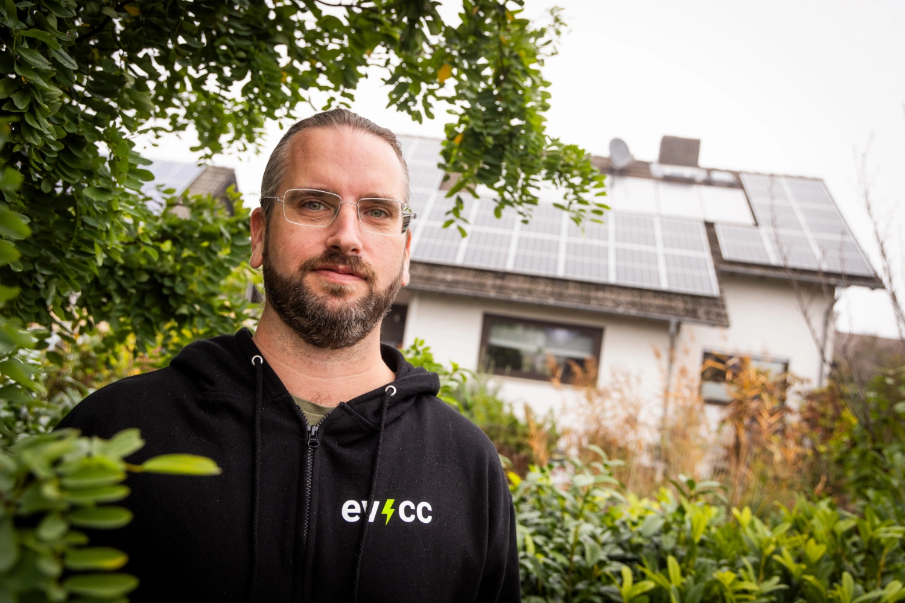
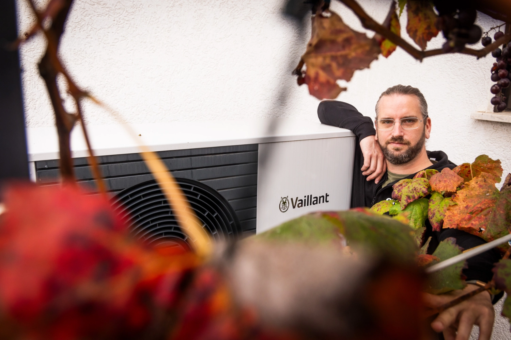
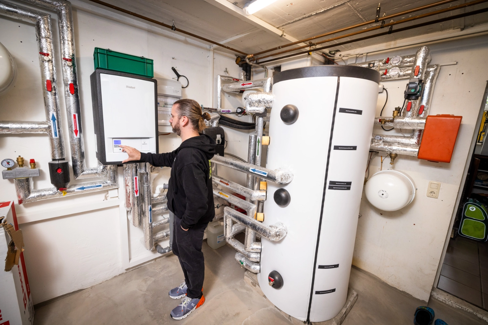
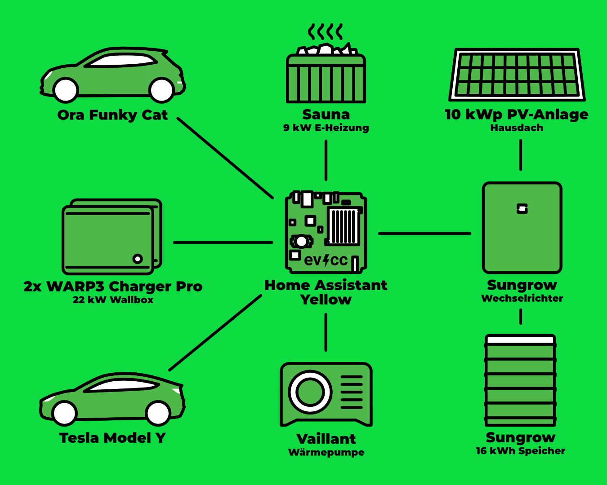
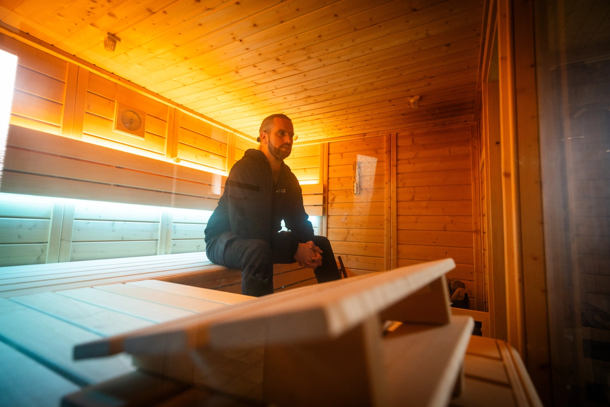

Tobias hat sein Haus in Trebur in Südhessen Schritt für Schritt vom Gasheizungshaushalt in ein weitgehend energieautarkes Smart Home verwandelt.
Fotograf [Detlef](https://hee.se) war zu Besuch und hat Fotos gemacht.

{/* truncate */}

## Energieautarkie statt Gasheizung

**Michael:** Hallo Tobias, wie schön, dass du dir die Zeit nimmst, uns dein Zuhause und das technische Drumherum vorzustellen.
Vielleicht magst du dich kurz vorstellen?

**Tobias:** Hi Michael, toll, dass wir das hier machen.
Also, ich heiße Tobias und bin 41 Jahre alt.
Wie einige meiner Portrait-Vorgänger habe ich einen Hintergrund in Informatik und bin leidenschaftlicher Tüftler, wenn es um Energieeffizienz und smarte Haustechnik geht.
Meine Familie und ich kauften uns vor ein paar Jahren ein freistehendes Einfamilienhaus und brachten seit unserem Einzug vor über 10 Jahren alles nach und nach auf Vordermann.
Wir schauten hierbei immer, wie wir unsere Nebenkosten senken können.
Also quasi eine Schritt für Schritt Wandlung von einem Gasheizungshaushalt zu einem weitgehend energieautarken Smart Home.

**Michael:** Okay, das klingt nach einer Menge Arbeit, aber auch danach, als ob man dann maßgeschneiderte Lösungen bekommt, die genau zu den Gewohnheiten und Lebensbedürfnissen passen.
Hattet ihr nebenbei noch Zeit, euch um andere Sachen zu kümmern?

**Tobias:** Aber klar!
Eine der größeren Herausforderungen war der Austausch unserer Gasheizung durch eine Wärmepumpe.
Wir beauftragten einen deutschlandweit tätigen Handwerksbetrieb mit dem Komplettsystem.
Die Montage lief leider chaotisch: Aus drei geplanten Tagen wurde eine Woche, sie hatten den Elektroanschluss vergessen, und danach traten noch diverse technische Probleme auf – von der falschen Pufferspeicher-Anbindung bis zur überdimensionierten Umwälzpumpe.
Nach mehreren Nachbesserungen, eigener Recherche und der Insolvenz des Betriebs mussten wir die letzten Anpassungen selbst vornehmen.
Heute läuft die Wärmepumpe stabil und effizient mit erneuerbarem Strom vom eigenen Dach – der Weg dahin war steinig, aber es hat sich gelohnt.

## Von Hybrid zu vollelektrisch

**Michael:** Das klingt nach einer echten Geduldsprobe.
Aber gut, dass am Ende alles funktioniert.
Wie seid ihr denn zur E-Mobilität gekommen?

**Tobias:** Vor einigen Jahren schafften wir uns einen Plug-In-Hybrid an, einen VW Passat.
Etwas später folgte die PV-Anlage.
Hier war damals der Wunsch, etwa 10 kWp Leistung zu erreichen, ohne dabei auf die Solarthermie-Anlage zu verzichten.

Der Aufbau der PV-Anlage war erstmal ein bisschen puzzelig, weil der Lieferant direkt zwei Module mehr lieferte und wir dann schauten, wie wir die auch noch unterbringen können.
Na, wenn sie schon mal da sind, dann wollten wir sie auch mitnutzen.
Nachdem die PV-Anlage stand, kam das erste richtige E-Fahrzeug, ein Tesla Model Y, und kurz darauf auch das zweite, ein Ora Funky Cat.
Anfangs hatten wir eine KEBA P-30 Wallbox.
Das lief aber nicht so gut und wir tauschten sie durch einen WARP Charger 2 Pro aus.
Mit dem Einzug des zweiten E-Fahrzeugs installierten wir eine zweite Wallbox.
Um den PV-Überschuss optimal zu nutzen, kam der WARP-Energiemanager dazu, um die Möglichkeit der 1-Phasen/3-Phasen-Umschaltung zu ermöglichen.
Mittlerweile rüsteten wir beide Wallboxen auf die WARP Charger 3 mit eingebauter Phasenumschaltung um, um das System zu vereinfachen.

## Lastmanagement statt Leistungserhöhung

**Michael:** Du deutest es schon an, jetzt kommen wir bestimmt dazu, wo und warum du evcc nutzt …?

**Tobias:** Stimmt, jetzt geht es in die Details.
Anfangs nutzte ich evcc als Docker Container auf einem Proxmox Cluster.
Mit der Zeit beschäftigte ich mich aber immer mehr mit Home Assistant und betrieb mittlerweile nur noch einen Home Assistant Yellow mit POE, CM4 mit 8 GB RAM und einer 1 TB SSD, um auch hier Strom einzusparen.
evcc nutzte ich als AddOn in Home Assistant.

**Michael:** Wie sieht denn euer Set-up aus?

**Tobias:** Unser System besteht im Moment aus einer PV-Anlage mit 10,1 kWp (27x Heckert Solar NeMo), einem 16 kWh Sungrow Speicher, 2 WARP Charger 3 Pro, einer Vaillant Wärmepumpe (Arotherm plus) und einer Sauna (9 kW).
Das Ausbalancieren der verschiedenen Verbraucher, Speicher und Produzenten hat etwas Feintuning erfordert, aber das macht ja auch irgendwie Spaß.

Wir haben in unserer Hausverteilung aktuell eine Direktmessung für den Stromverbrauch.
Das bedeutet, der Zähler kann dauerhaft mit 44 A (30,4 kW) belastet werden.
Also mussten wir uns entscheiden: entweder eine Leistungserhöhung mit Wandlermessung vornehmen oder das Ganze über ein dynamisches Lastmanagement steuern.
Aus Kostengründen haben wir uns erst einmal für das dynamische Lastmanagement entschieden.

Bei der Sauna messen wir aktuell die Leistung nicht aktiv, somit arbeiten wir mit zwei Bereichen in evcc.
Der Bereich (Main) hat ein Stromlimit von 44 A und der Bereich (Einfahrt) von max. 32 A.
Beide Wallboxen teilen sich die 32 A vom Bereich (Einfahrt), damit theoretisch immer eine Wallbox mit 22 kW laden könnte, auch wenn das aktuell kaum ein Fahrzeug unterstützt.
Die Sauna und die Wärmepumpe ordnen wir dem Bereich (Main) zu.
Die haben immer Vorrang vor den beiden Wallboxen.
So stellen wir sicher, dass der Hauptanschluss nie mit mehr als 44 A belastet wird.
Wenn dann doch einmal Sauna und Wärmepumpe auf Vollast laufen, während wir Kekse backen, würde evcc die Ladeleistung unserer Autos zeitweise herunterregeln.

| Komponente           | Details                                                       |
| -------------------- | ------------------------------------------------------------- |
| **PV-Anlage**        | 10,1 kWp (27x Heckert Solar NeMo 3.0 120M)                    |
| **Wechselrichter**   | Sungrow SH10.0RT Hybrid                                       |
| **Speicher**         | Sungrow SBR 16 kWh                                            |
| **Wallboxen**        | 2x WARP Charger 3 Pro                                         |
| **Fahrzeuge**        | Tesla Model Y, Ora Funky Cat                                  |
| **Wärmepumpe**       | Vaillant Arotherm plus vwl 125/6                              |
| **Sauna**            | 9 kW Elektroheizung                                           |
| **Steuerung**        | evcc als Home Assistant AddOn (Home Assistant Yellow mit POE) |

## Vom PV-Magazin zu evcc

**Michael:** Stark, ihr habt zwei Wallboxen, eine Sauna und die üblichen Hausverbraucher, die abgedeckt werden.
Wie bist du auf evcc gekommen?

**Tobias:** Durch einen Artikel im PV-Magazin 2022.
Zu dem Zeitpunkt war uns schon klar, dass wir eine PV-Anlage installieren würden, und wir wollten den Überschuss so optimal wie möglich nutzen.
Damals gab es aber entweder nur sehr teure Lösungen oder Lösungen, die nur im herstellereigenen Kosmos gut funktionierten.

**Michael:** Ja, das war für mich auch ein Grund, warum ich das Projekt so cool finde: die Überschussnutzung.
Welche anderen Funktionen benutzt ihr denn noch, oder ist das eigentlich der Hauptanwendungsfall?

**Tobias:** Naja, bis letztes Jahr hatten wir auch noch Tibber, das heißt, evcc regelte das günstige Laden der Autos.
Mit dem Einbau der Wärmepumpe und den anstehenden Herausforderungen wechselten wir dann erst mal wieder in einen günstigeren, festen Stromvertrag und brauchten ein Lastmanagement.
Da konnte evcc glänzen.
Also nutzen wir es zur Steuerung der Wallboxen, zur Einbindung der Fahrzeuge und zum Lastmanagement.
Die Steuerung der Wärmepumpe konfigurierte ich, nutze sie aber aktuell nicht, weil das mit der Solarthermie keinen Sinn ergibt.

## Wünsche für die Zukunft

**Michael:** Was wünschst du dir von evcc?
In welchem Bereich sollten wir mehr Energie investieren?

**Tobias:** Ich fänd's gut, wenn es eine direkte Einbindung der Vaillant Wärmepumpe über EEBUS oder EBUS gäbe.
Ich glaube, da geht noch was.
Insgesamt kann ich sagen, dass wir viel gelernt und viel geschafft haben.
Ich bin richtig stolz darauf, was wir erreicht haben: das Haus hat ein effizientes (und nachhaltigeres) Heizsystem, die PV-Anlage produziert das, was wir den Tag über brauchen, und gibt uns in Kombination mit dem Pufferspeicher ein hohes Maß an Unabhängigkeit.

**Michael:** Danke, dein Hinweis ist gut.
Und vielen Dank, dass du uns gezeigt hast, wie das bei euch funktioniert.
Ich bin mir sicher, das inspiriert die ein oder andere Person, Änderungen am Set-up vorzunehmen.

---

**Wie sieht dein evcc-Set-up aus?**
Wenn du Interesse hast, deine Erfahrungen, deinen Weg und deine Technik in Form eines Community-Porträts zu teilen, dann trag dich gerne [hier im Formular](https://airtable.com/appDI3xIiev1DOpMY/shrW1zGH26KElfZOK) ein.
Wir suchen vor allem Porträts von außergewöhnlichen Installationen oder von Nutzern außerhalb Deutschlands.
