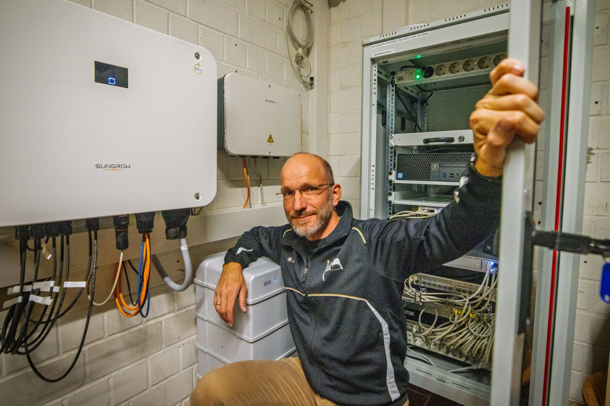
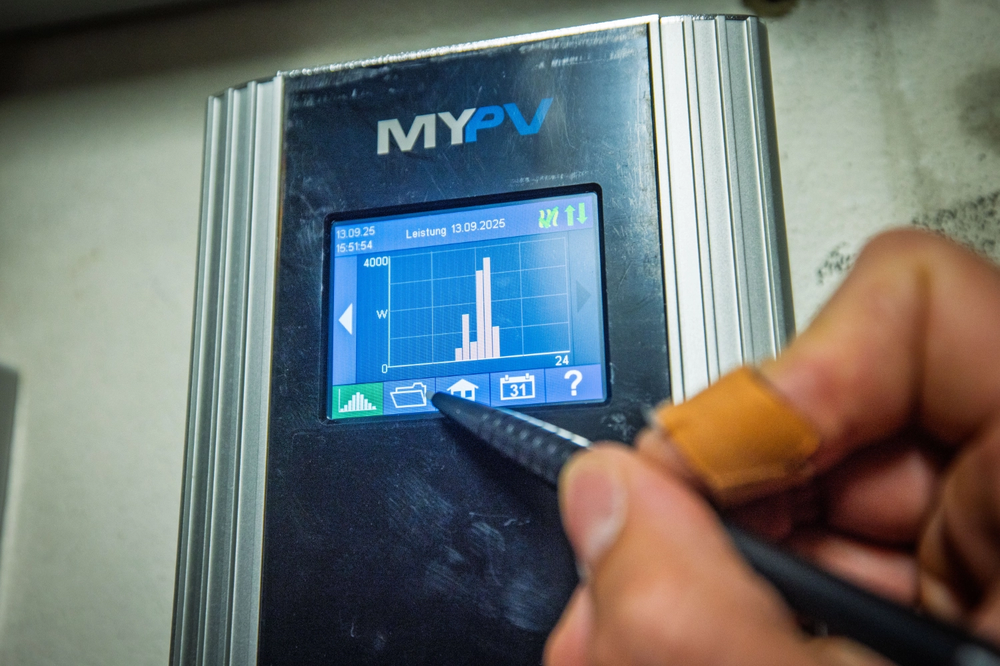
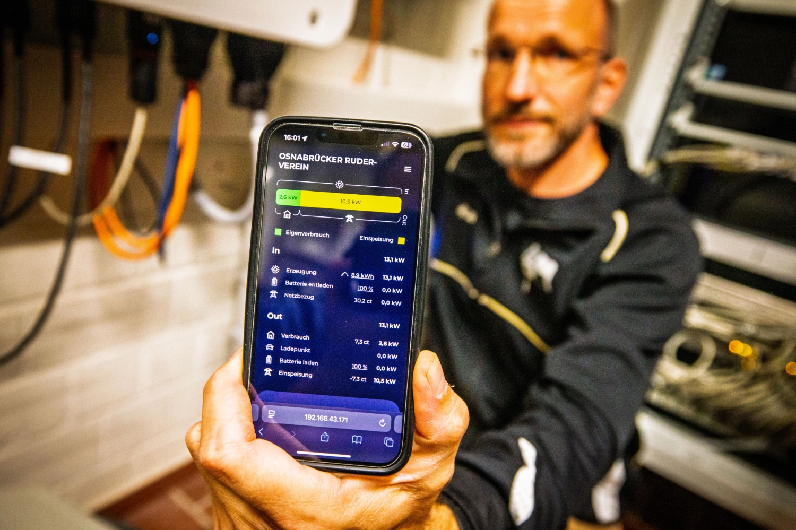
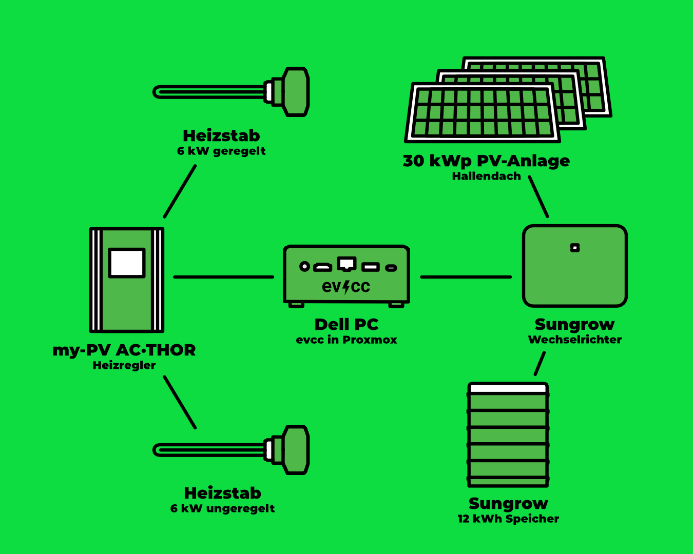
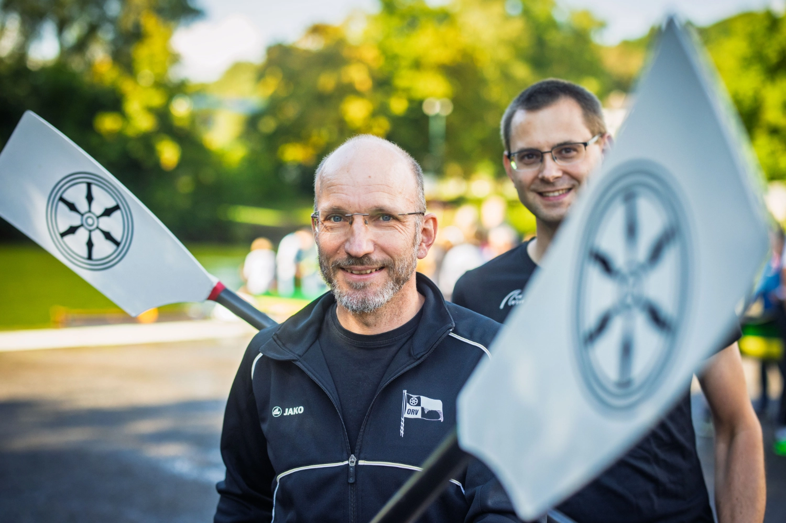
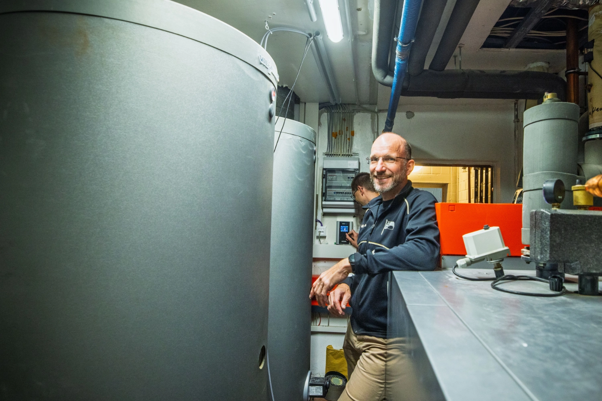

Eine große Bootshalle, Duschen für Dutzende Ruderer und viel Dachfläche: der [Osnabrücker Ruderverein](https://www.orv.de) (ORV) hat mit PV-Strom und evcc einen Weg gefunden, den Energieverbrauch zu senken und gleichzeitig unabhängiger von fossilen Brennstoffen zu werden.
Fotograf [Detlef](https://hee.se) war zu Besuch.

{/* truncate */}

## Von Solarthermie zur PV-Anlage

**Michael (evcc):** Hallo Michael, hallo Markus, toll, dass ihr euch die Zeit nehmt.
Ein großes Bootshallendach: das schreit doch nach einer PV-Nutzung.
Wie konntet ihr den Verein zur Investition überreden?

**Michael (ORV):** Wir hatten bis vor ein paar Jahren eine Solarthermieanlage auf dem Dach, die allerdings einen wirtschaftlichen Totalschaden erlitt.
Im Rahmen einer energetischen Sanierung stand eine PV-Anlage selbstverständlich mit auf der Agenda.
Initialer Auslöser waren die steigenden Strompreise, aber auch die Unabhängigkeit vom Gas.
Da wir viele Arbeiten durch Eigenleistung der Vereinsmitglieder erledigen konnten, war die Investition deutlich geringer, als zunächst veranschlagt.
Das hat die Mitglieder dann auch überzeugt.

**Michael (evcc):** Wie viel von der Dachfläche habt ihr denn belegen können?

**Markus (ORV):** Derzeit sind nur ca. 1/4 der Dachfläche mit einer 30 kWp Anlage belegt.
Aber rechtlich dürfen wir nicht mehr und technisch lasten wir, zumindest theoretisch, den Anschluss aus.
Sofern die Regularien sich entsprechend ändern, würden wir die Anlage gerne in Eigenleistung weiter ausbauen.

## Warmwasser für Dutzende Ruderer

**Michael (evcc):** Wie kam evcc ins Spiel?
Gab's alternative Überlegungen?

**Michael (ORV):** Unser erster Vorsitzender hat seine PV-Anlage zu Hause relativ schnell mit evcc gesteuert, die ersten Erfahrungen waren positiv.
Da lag es nahe, das auch im Verein einzusetzen.

**Michael (evcc):** Und wie sieht euer technisches Setup aus?

**Markus (ORV):** Wir haben eine Sungrow-Anlage mit 29,92 kWp, einen 12 kW Akku, einen My-PV AC-Thor 9s mit einem geregelten 6 kW Heizstab und einem ungeregelten 6 kW Heizstab am Relais.
Jeweils in einem Warmwasserspeicher verbaut.
Die Software läuft auf einem ausgedienten Dell-PC, der sparsame 15 W verbraucht.
Darauf ist Proxmox installiert, Home Assistant läuft in einer VM und evcc in einem Container.
Zusätzlich haben wir im letzten Jahr unser Netzwerk massiv ausgebaut, um ein stabiles und zukunftsorientiertes System zu haben.

**Michael (evcc):** Wie vielen Menschen duschen denn an einem normalen Tag mit eurem PV-Heizstab?
War das Wasser jemals zu kalt?

**Michael (ORV):** Schwer zu sagen, wie viele Menschen am Tag duschen.
Seit wir Wassersparköpfe und Drücker mit Zeitablauf installiert haben, duschen sie auf jeden Fall kürzer.
Das kommt der Gasersparnis zugute.
Zu kalt kann das Wasser nicht werden, weil wir eine Gasheizung haben, die das Wasser erwärmt, sobald 36°C unterschritten werden.

## 5.742 kWh Gas eingespart

**Michael (evcc):** Könnt ihr schon sagen, wie viel Gas durch die Heizstäbe eingespart wurde?

**Markus (ORV):** Wir können mit Home Assistant auswerten, wie hoch der Verbrauch je Heizstab war.
Bis Mitte September haben wir mit mindestens 5.742 kWh PV-Strom Wasser erwärmt.
Das dürfte in etwa der gleichen Menge Gas entsprechen.
Da wir noch in der Erprobung sind, haben wir noch keine Langzeiterfahrung.

**Michael (evcc):** Hättet ihr denn noch Strom für eine Mitglieder-Wallbox oder andere Abnehmer übrig?

**Michael (ORV):** Wir speisen die Überschüsse derzeit ins Stromnetz ein.
Diese sind seit Inbetriebnahme der Heizstäbe jedoch nicht mehr so üppig, dass diese derzeit für signifikante Akkuladungen lohnen würde.
Wir haben Wallboxen trotzdem schon vorgeplant.

| Komponente             | Details                                                              |
| ---------------------- | -------------------------------------------------------------------- |
| **PV-Anlage**          | 29,92 kWp (ca. 1/4 der verfügbaren Dachfläche)                       |
| **Wechselrichter**     | Sungrow                                                              |
| **Speicher**           | 12 kWh                                                               |
| **Warmwassersystem**   | My-PV AC-Thor 9s mit 2x Heizstäben (6 kW geregelt + 6 kW ungeregelt) |
| **Warmwasserspeicher** | 2 Stück                                                              |
| **Steuerung**          | evcc in Container auf Proxmox, Home Assistant in VM                  |
| **Hardware**           | Dell-PC (15 W Verbrauch)                                             |

## Von der Finanzvorstands-Arbeit aufs Wasser

**Michael (evcc):** Michael und Markus, ihr seid die beiden Technikseelen des Osnabrücker Rudervereins: wie oft sehen Vereinsmitglieder euch noch im Boot, oder nur im Technikraum?

**Markus (ORV):** Seit ich im Frühjahr den Posten des Finanzvorstands abgegeben habe, habe ich mir vorgenommen, häufiger aufs Wasser zu gehen.

**Michael (ORV):** Ich habe vor drei Jahren den Vorstandposten für die Liegenschaften übernommen und ja, der Anteil an Arbeit am und für den Verein ist viel höher geworden.
Trotzdem schaffe ich es meistens noch einmal am Wochenende rudern zu gehen.

## Wünsche für die Zukunft

**Michael (evcc):** Habt ihr Wünsche für die Zukunft und Weiterentwicklung von evcc?

**Markus (ORV):** Auf jeden Fall: Eine Funktion, die dafür sorgt, dass morgens und tagsüber primär das Wasser erwärmt wird, aber abends bei Einbruch der Dunkelheit der Akku zu 100% geladen ist, wäre unser nächster Wunsch.
Zum Schonen des Akkus und zum netzdienlichen Einspeisen wäre eine Drosselung der Ladeleistung ebenfalls schön.

**Michael (evcc):** Das sind gute Anregungen.
Vielen Dank für die Einblicke in eure Energiewelt beim Ruderverein.
Das zeigt schön, wie evcc auch in größeren Gemeinschaftseinrichtungen funktionieren kann!

---

**Wie sieht dein evcc-Set-up aus?**
Wenn du Interesse hast, deine Erfahrungen, deinen Weg und deine Technik in Form eines Community-Porträts zu teilen, dann trag dich gerne [hier im Formular](https://airtable.com/appDI3xIiev1DOpMY/shrW1zGH26KElfZOK) ein.
Wir suchen vor allem Porträts von außergewöhnlichen Installationen oder von Nutzern außerhalb Deutschlands.
