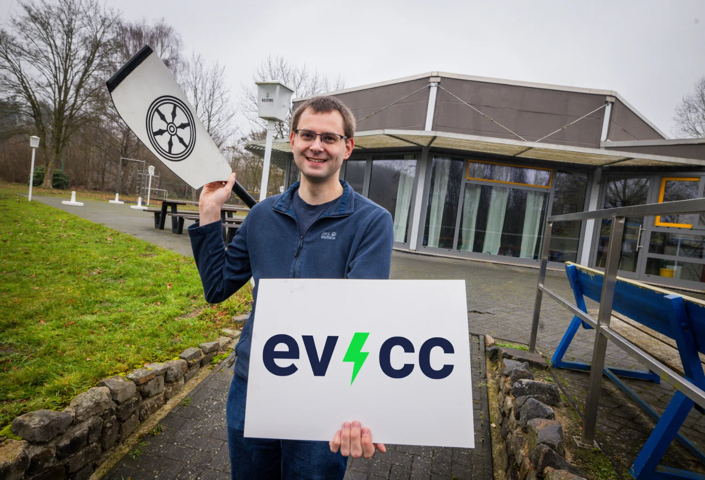
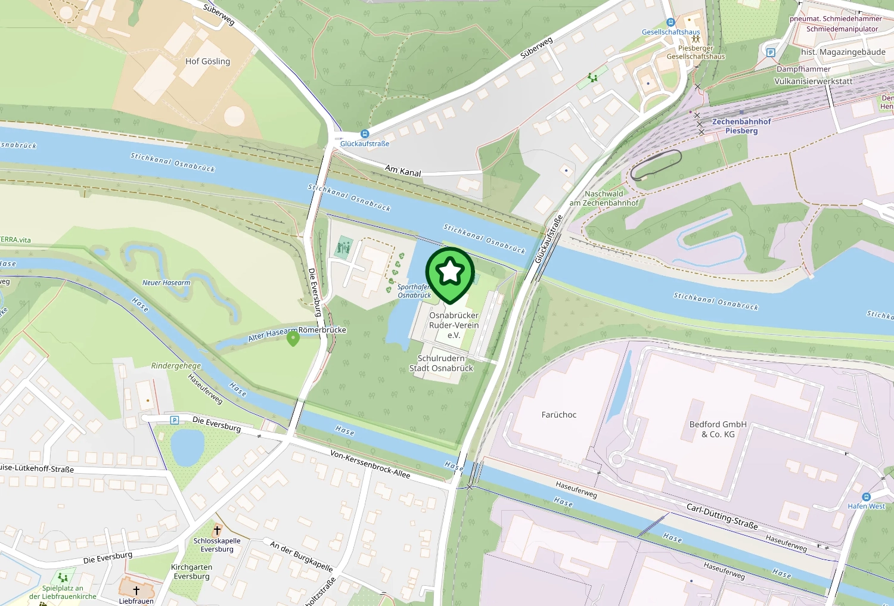

Wir laden euch zum ersten evcc Community Treffen ein!
Am **18. April 2026** treffen wir uns in Osnabrück zum Kennenlernen, Austauschen und gemeinsamen Grillen.
Der [Osnabrücker Ruderverein](https://www.orv.de) stellt uns seine Räumlichkeiten zur Verfügung.

{/* truncate */}

## Was erwartet euch?

Das Treffen findet **nachmittags** statt und bietet Platz für **100 Teilnehmer**.
Wir haben ein lockeres Programm geplant:

- **Kennenlernen**: Gesichter zu GitHub-Nutzernamen zuordnen
- **Austausch**: Diskussionen über eure evcc-Setups und Erfahrungen
- **Netzwerken**: Kontakte mit anderen evcc-Nutzern und Entwicklern knüpfen
- **Grillen**: Gemeinsamer Ausklang mit Grillgut und Getränken

## Anmeldung

Die Anmeldung läuft über das Buchungssystem des Rudervereins.
Es gibt einen **Unkostenbeitrag von 10 €**, der auch das Grillgut abdeckt.

**[Jetzt anmelden →](https://widgets.yolawo.de/w/0/bookables/692e18b1db6c17d85beacfd2?t=1764767521803)**

Bei der Anmeldung könnt ihr optional eure Stadt angeben.
So bekommen wir einen Eindruck, woher ihr anreist.

## Location

**[Auf Google Maps anzeigen →](https://maps.app.goo.gl/75RsYsPpeBuNLsWC6)**

**Osnabrücker Ruderverein e.V.** 
Glückaufstraße 16 
49090 Osnabrück

Der Ruderverein liegt direkt am Stichkanal und bietet eine tolle Atmosphäre für unser Treffen.
Wie ihr im [Community Portrait](/blog/2025/11/29/osnabruecker-ruderverein) lesen könnt, nutzt der Verein selbst evcc für sein Energiemanagement.

Wir freuen uns riesig darauf, endlich ein paar Gesichter zu den GitHub-Nutzernamen zu sehen!
Egal ob Nutzer oder Entwickler, ob du schon lange dabei bist oder gerade erst mit evcc angefangen hast: komm vorbei!

Bei Fragen meldet euch gerne im [GitHub Discussions Thread](https://github.com/evcc-io/evcc/discussions/25787).

**Bis April in Osnabrück!** 
Das evcc Team 
Michael, Andi & Uli
