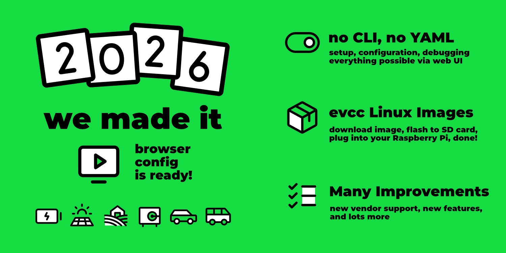
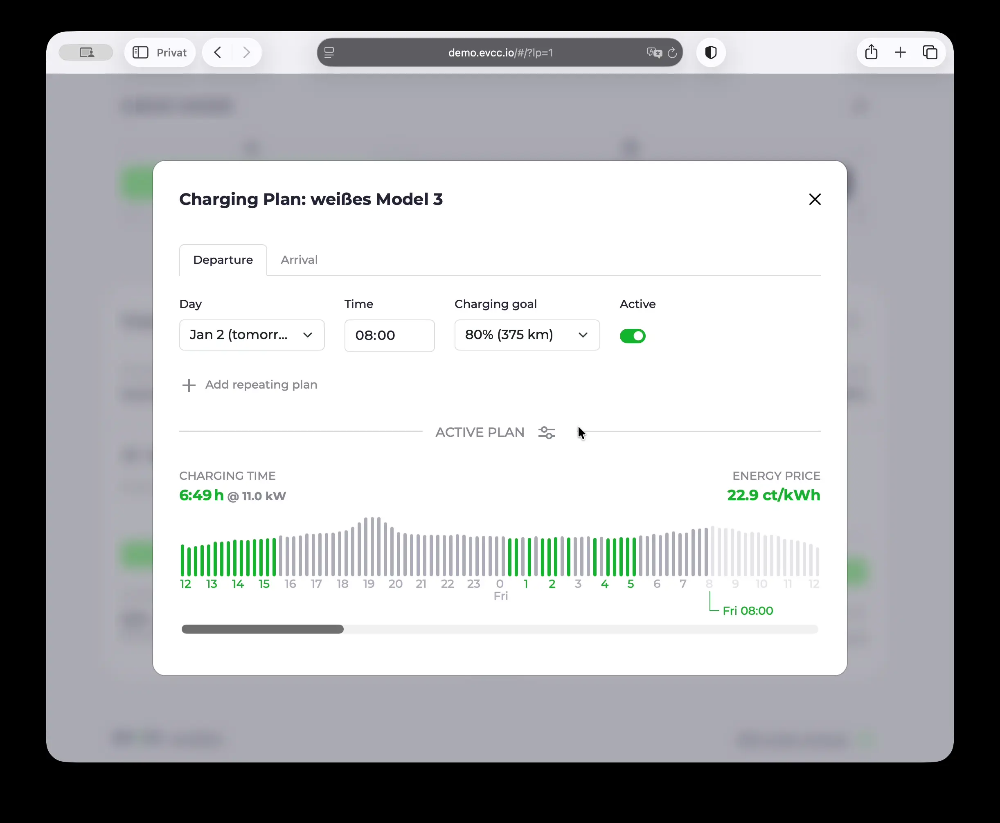
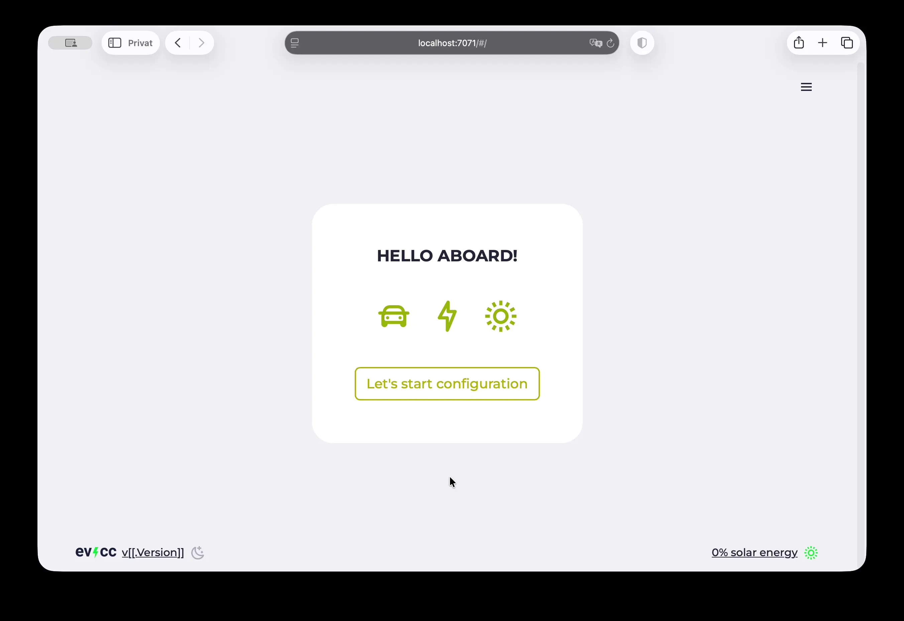
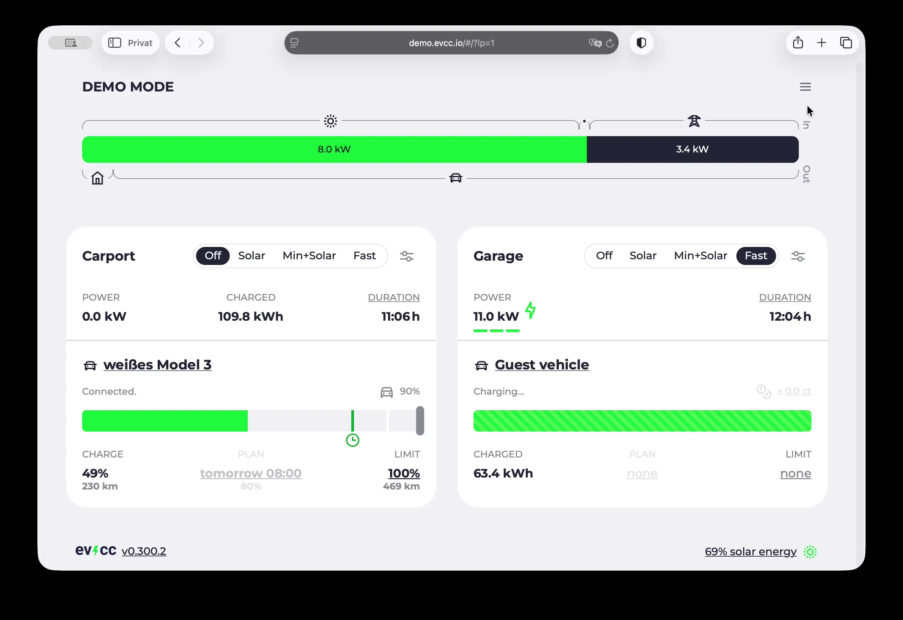

2026 ist da und mit evcc [v0.300](https://github.com/evcc-io/evcc/releases/tag/0.300.2) startet das neue Jahr mit dem vermutlich wichtigsten Meilenstein: Die Konfiguration via Browser ist nicht mehr experimentell.
Das meistgewünschte Feature ist endlich fertig für den Einsatz.
Neue Nutzer können evcc jetzt komplett ohne Kommandozeile oder YAML-Datei einrichten.

In diesem Artikel schauen wir auf die Highlights seit [Juli 2025](/blog/2025/07/30/highlights-config-ui-feedin-ai) und geben einen Ausblick auf das kommende Jahr.

{/* truncate */}

## Konfiguration via Browser

Die Ersteinrichtung von evcc über die Kommandozeile und das Editieren einer YAML-Datei war lange Zeit die größte Hürde für neue Nutzer.
Seit mehreren Jahren arbeiten wir daran, diesen Prozess zu vereinfachen.
Mit v0.300 ist es nun soweit: **Die Konfiguration via Web UI ist jetzt offiziell freigegeben und der empfohlene Weg für neue Nutzer.**

### Was ist neu?

Seit dem letzten Highlight-Artikel haben wir viele Funktionen hinzugefügt und verbessert:

- **Bug-Reporting direkt im Web UI:** Diagnoseinfos können nun direkt über die Oberfläche für GitHub Issues exportiert werden.
- **OCPP Setup:** Der Einrichtungsprozess für OCPP-Wallboxen wurde deutlich vereinfacht.
- **Modbus Proxy UI:** Komfortable Oberfläche für die Modbus-Proxy-Konfiguration.
- **OAuth-Authentifizierung:** UI-basierter Autorisierungs-Flow für BMW, Mini, Viessmann, Home Assistant, Volvo und weitere Dienste.
- **Dynamische Vorschläge:** Intelligente Vorschlagswerte erleichtern die Konfiguration. Wird bspw. für Sensoren und Schalter bei Home Assistant genutzt. Zukünftig auch für Modbus-Einstellungen und Netzwerkgeräte.
- Viele weitere Bugfixes und Verbesserungen.

### Was fehlt noch?

Alle Funktionen sind über die UI konfigurierbar.
An einigen Stellen ist jedoch noch YAML-Syntax erforderlich.

- Tarife und Vorhersagen
- Lastmanagement und HEMS Konfiguration
- Benachrichtigungen ([in Arbeit](https://github.com/evcc-io/evcc/pull/25768))

Dies werden wir in den kommenden Monaten noch anpassen.

### Für bestehende Nutzer

Nutzt du bereits evcc mit einer `evcc.yaml`?
Dann musst du nichts ändern.
Die `evcc.yaml` wird weiterhin unterstützt.

Wenn du zur Web UI wechseln möchtest, kannst du beide Konfigurationsmethoden parallel nutzen und schrittweise migrieren.
Geräte aus der `evcc.yaml` sind in der UI sichtbar, aber nicht bearbeitbar.
Mehr Details zum Migrationsprozess findest du in der [FAQ](/docs/faq#ui-migration).

## evcc Linux Images

Zusammen mit der stabilen Web UI gibt es eine weitere wichtige Neuerung: Ready-to-use [Linux Images](https://github.com/evcc-io/images) für Raspberry Pi und andere Systeme.

Damit ist die Installation nun auch ohne viel technisches Vorwissen möglich:

1. Image herunterladen
2. Auf SD-Karte flashen
3. In den Raspberry Pi stecken
4. Einrichtung direkt im Browser starten

**Komplett ohne Kommandozeile oder YAML-Datei.**

Neben allen Raspberry Pi Versionen wird auch der NanoPi R3S unterstützt.
Die Images basieren auf [Armbian](https://www.armbian.com), wodurch sich neue Single Board Computer Plattformen einfach hinzufügen lassen.

Mehr Details findest du in der [Installationsanleitung](/docs/installation/linux-image) und im [GitHub Repository](https://github.com/evcc-io/images).

## Weiter Highlights

Neben der Web UI gab es in den letzten Monaten viele weitere Neuerungen:

### Tarife: 15-Minuten Preisvorhersagen

Der EPEX Börsenpreis für Strom wird seit Oktober 2025 in 15-Minuten-Intervallen statt stündlich bereitgestellt.
evcc verwendet nun intern durchgehend Viertelstundenslots.
Planungsalgorithmus und Visualisierung sind angepasst.
Viele Tarife und PV-Vorhersagen sind bereits auf das kürzere Intervall umgestellt.

### Planer: Kontinuierliche Ladung

Der Ladeplaner hat eine neue Option erhalten.
Du kannst nun zwischen **kontinuierlich** und **günstigst** wählen.
Die kontinuierliche Planung wählt das beste zusammenhängende Ladefenster aus, um häufige Unterbrechungen zu vermeiden.

### Integration: Home Assistant

Wir hatten [Kontakt zum Home Assistant Team](https://www.linkedin.com/posts/michael-geers_homeassistant-githubuniverse-opensource-activity-7391032971517992960-a9V8) und arbeiten an einer besseren Integration beider Projekte.
Erste Ergebnisse sind bereits sichtbar.
Du kannst Fahrzeuge, Ladegeräte und Zähler auf Basis von Home Assistant Sensoren und Schaltern einrichten.
Dafür verwenden wir den **Autodiscovery** und **OAuth-Mechanismus** von Home Assistant.
Die passenden **Home Assistant Entitäten** werden dir in der Bearbeitungsmaske **vorgeschlagen**.

### Ladepunkte: Sortieren & Ausblenden

Ladepunkte können jetzt in der UI sortiert und ausgeblendet werden.
Die Einstellungen werden pro Browser gespeichert und ermöglichen eine individuelle Ansicht für verschiedene Nutzer.

## Sponsoring: Neue Preise {#sponsoring}

Wir lieben Open Source und sind überzeugt davon, dass das im Projekt angesammelte, offene Wissen ein großer Boost für die Energiewende ist.

Die Software-Entwicklung lebt durch euch - die Community: Wünsche, Ideen, Testing und aktive Beiträge zum Code treiben die Richtung des Projekts.
Betrieb und Fokussierung erfordern jedoch viel Zeit.
Das Projekt ist inzwischen so gewachsen, dass es für uns längst kein kleines Side-Project mehr ist.
Daher ist finanzielle Unterstützung wichtig, um evcc auch langfristig und nachhaltig weiterzuentwickeln und pflegen zu können.

Nach fast 5 Jahren haben wir uns nun entschieden, die Sponsor-Preise zum ersten Mal anzupassen.

### Neue Preise ab 2026

- **Monatliches Sponsoring:** ab $4 (vorher $2)
- **One-time Sponsoring:** ab $150 (vorher $100)

### Warum diese Anpassung?

In den letzten 5 Jahren hat sich viel verändert:

**Dollar-Kurs und Inflation:** Der Dollar-Kurs (GitHub Sponsoring) ist gefallen und die Inflation hat auch unsere realen Kosten erhöht.

**Funktionsumfang:** evcc hat sich enorm weiterentwickelt.
Features wie die Web UI, Linux Images, intelligente Ladeplanung, Wärmepumpensteuerung, PV-Vorhersagen und viele weitere Funktionen sind hinzugekommen.
Was 2020 als reines PV-Überschuss-Tool startete, ist heute eine umfassende Energiemanagement-Plattform.

**Nachhaltigkeit:** Wir haben noch viel vor (siehe Ausblick 2026 unten).
Um evcc langfristig weiterzuentwickeln und die Qualität zu halten, braucht es eine solide finanzielle Basis.

### Du sponsorst bereits?

Für bestehende Sponsoren ändert sich nichts:

- **One-time Sponsorings** (vor 2026 durchgeführt) bleiben selbstverständlich bestehen
- **Monatliche Sponsorings** laufen ohne Preiserhöhung weiter – du zahlst weiterhin den bisherigen Preis
- Freiwillige Erhöhungen sind natürlich willkommen, aber nicht erforderlich

🙌 Danke an alle, die evcc über die Jahre unterstützt haben – ohne euch wäre das Projekt nicht da, wo es heute ist.

Mehr Details findest du in der [Sponsorship-Dokumentation](/docs/sponsorship).

## Neue Geräte-Unterstützung

Seit Juli 2025 wurden **44 neue Hersteller** hinzugefügt.
Die evcc-Gerätebibliothek umfasst nun über **240 Hersteller** und **mehr als 620 Produkte**.

**Wallboxen:** Alpitronic, EV Expert, FoxESS, Neoom, Sigenergy, V2C, Veton

**Wärmepumpen & Heizstäbe:** LG, NIBE

**Zähler:** Aandewiel, B+GE-TECH, Cozify HAN, DDM, EcoFlow, Home Assistant, Lovato, Senergy, Sermatec, Solakon, Strong Energy, Zendure, amsleser.no

**PV-/Batteriesysteme:** ABB, B+GE-TECH, Bernecker Engineering, DDM, DZG, EcoFlow, Home Assistant, Lovato, ORNO, Saia-Burgess Controls (SBC), Schneider Electric, Sermatec, Solakon, Strong Energy, Wago, Weidmüller, amsleser.no, inepro

**Fahrzeuge:** Ford Connect, Home Assistant, Hyundai (US), Subaru

Natürlich wurden auch viele Bugfixes und Verbesserungen an bestehenden Implementierungen vorgenommen.
Details findest du in den [Release Notes](https://github.com/evcc-io/evcc/releases).

## Ausblick 2026

Mit der stabilen Web UI ist ein großer Meilenstein erreicht.
Die Arbeit daran hat viel Zeit in Anspruch genommen.
Wir freuen uns, nun wieder mehr Fokus auf neue Funktionen legen zu können.
Das kommende Jahr wird spannend – hier ein Ausblick auf die geplanten Schwerpunkte:

### Optimierungsalgorithmus

Heute regeln wir einzelne Komponenten oft individuell.
Der Optimizer hat das Ziel, das Gesamtsystem zu optimieren: Paralleles Laden mehrerer Fahrzeuge, Hausbatterien und Verbraucher – basierend auf Preissignalen, PV-Vorhersagen und Hausverbrauchsprognosen.

Seit Mitte 2025 arbeitet eine Gruppe von Leuten an einem Optimierungsalgorithmus für evcc.
Er basiert auf Gleichungssystemen und Statistik.
Produktmarketing würde das vmtl. AI nennen 😉.
Der Optimizer lässt sich heute bereits lesend integrieren und seine Ergebnisse können mit spezieller Konfiguration angezeigt werden.

Die nächsten Schritte:

- **Visualisierung:** Erkenntnisse aus dem Optimizer in der evcc-Oberfläche gezielt dort anzeigen, wo es sinnvoll ist
- **Aktive Steuerung:** Planer, Netzladen und weitere Funktionen basierend auf den Optimizer-Daten steuern

Mehr dazu im [GitHub Issue](https://github.com/evcc-io/evcc/issues/23042).

### Bessere Darstellung für Verbraucher und Wärmeerzeuger

Die Darstellung und Steuerung von **regulären Verbrauchern** (Waschmaschine, Trockner, ...) und **Wärmeerzeugern** soll verbessert werden.

Heute können diese bereits als "Heizen" bzw. "Zusätzliche Zähler" hinzugefügt und im Energieflussdiagramm angezeigt werden.
Geplant ist eine Darstellung als eigene Kachel sowie die Erfassung von zeitbasierten Daten.
Das Konzept der "Mini Loadpoints" existiert bereits seit längerer Zeit – inzwischen sind die meisten Bausteine dafür vorhanden.
Im kommenden Jahr arbeiten wir daran und freuen uns auf mehr Übersichtlichkeit und spezifische Funktionen für diese Geräte.

Details findest du in der [GitHub Discussion](https://github.com/evcc-io/evcc/discussions/7235).

### Zeitbasierte Auswertungen

Aktuell erfassen wir Statistiken nur auf Basis von Ladevorgängen.
Zusätzlich planen wir auch rein zeitbasiert Daten für Verbrauch, Erzeugung, Wärmeproduktion und weitere Metriken zu sammeln.
Dieses lange gewünschte Feature ermöglicht Übersichtsauswertungen, wie man sie aus vielen Hersteller-Apps kennt - aber für alle Geräte in deinem Haus.
Fragen wie "Wie viel Sonnenstrom hat die Wärmepumpe verwendet?" oder "Wie viel Energie haben meine PV-Anlagen heute schon produziert?" sollen damit beantwortet werden können.
Die Darstellung wird ergänzend zur bestehenden, lade-optimierten Ansicht erfolgen.

---

💚 Großes Dankeschön an alle, die das Projekt soweit gebracht haben – durch Mitarbeit, Diskussion, Ideen, Testen und vor allem auch durch finanzielle Unterstützung.

Wir wünschen euch einen guten Start in 2026 und freuen uns, dass die Tage nun wieder länger werden.

**Viele Grüße** 
Das evcc Team 
Michael, Andi & Uli
