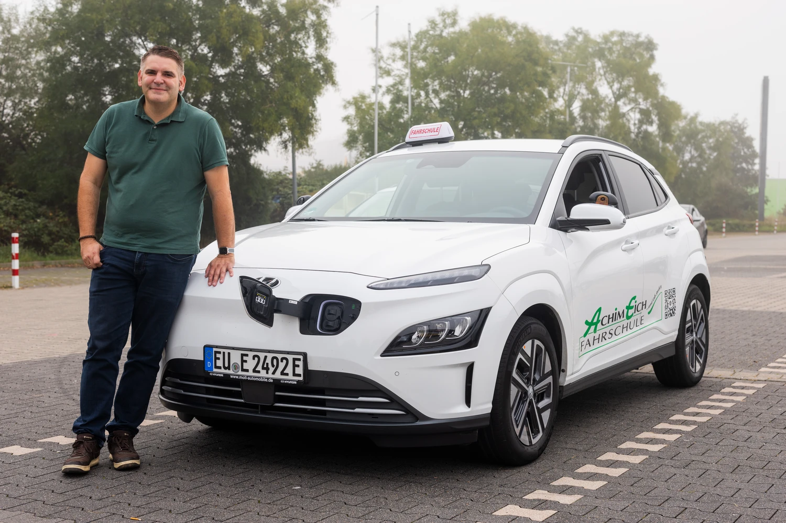
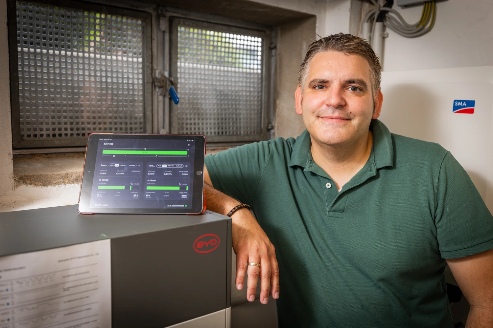

Alex ist Fahrlehrer und nutzt seit Jahren E-Fahrzeuge für die Fahrausbildung.
Mit evcc steuert er zwei Wallboxen für Privat- und Dienstfahrzeug und plant die Integration einer Wolf-Wärmepumpe für sein 5-Parteien-Haus.
Fotograf [Detlef](https://hee.se) war zu Besuch.

{/* truncate */}

## Vom i3-Carsharing zum IONIQ 5

**Michael:** Hallo Alex, toll, dass du dir die Zeit nimmst.
Du bist Fahrlehrer und nutzt E-Autos beruflich.
Wie war dein erster Kontakt mit Elektromobilität?

**Alex:** Hi Michael, gerne.
Mein erster Kontakt mit E-Mobilität war 2015 bei Kurztrips nach Hamburg.
Dort habe ich den BMW i3 bei DriveNow Carsharing kennengelernt.
Technisch spannend mit der CFK-Karosserie und sehr spritzig im Stadtverkehr.
Das hat mich begeistert.

Mitte 2021 kam dann der erste eigene Stromer, ein VW ID.3 im Leasing.
Zu der Zeit habe ich auch beruflich angefangen, E-Fahrzeuge für die Fahrausbildung einzusetzen - ID.3, ID.4, Hyundai Kona.
Seit gut zwei Jahren fahren meine Frau und ich einen Hyundai IONIQ 5.

**Michael:** Was war deine Motivation für den Umstieg?

**Alex:** Mehrere Gründe.
Umweltschutz - weniger Emissionen, weniger Lärm.
Dann das Sparpotenzial: PV-Strom vom eigenen Dach in die Hausbatterie und dann ins Auto.
Und dann der Fahrspaß.
Die elastische Beschleunigung und das leise Fahren sind angenehm.

## E-Autos in der Fahrschule

**Michael:** Du bist seit 17 Jahren Fahrlehrer im Großraum Köln/Bonn.
Wie ist das mit E-Mobilität in deinem Berufsalltag?
Hat sich da in den letzten Jahren was verändert?

**Alex:** Auf jeden Fall.
Die E-Mobilität hat sich in der Fahrschulbranche noch nicht vollständig etabliert, aber die Vorteile werden immer mehr gesehen.
Ich schätze, 15-20 % der Fahrschulautos sind mittlerweile elektrisch - ähnlich wie bei privaten PKW.

Es gibt auch Kollegen, die der neuen Mobilität gegenüber skeptisch sind.
Einige lassen sich von den üblichen Mythen leiten: Rohstoffabbau, Akkuhaltbarkeit, Ladezeiten, Reichweite.
Aber die Skepsis bei Eltern hat in den letzten Jahren spürbar nachgelassen.

**Michael:** Wie reagieren die Fahrschüler?

**Alex:** Viele Eltern fahren mittlerweile selbst elektrisch und sind der neuen Art der Ausbildung gegenüber aufgeschlossen.
Das Stichwort ist B197: 10 Fahrstunden à 45 Minuten Schaltkompetenz, der Rest der Ausbildung und die Prüfung auf Automatik.
Die Schüler finden das gut, weil die Prüfung entspannter abläuft.
Typische Fehlerquellen entfallen: kein Abwürgen, kein Verschalten, kein Zurückrollen beim Berganfahren.
Das spricht sich unter den Schülern herum.

Nur noch ganz selten gibt es Eltern, die auf eine reine Schaltausbildung bestehen.

## Wo ist denn hier der Ölmessstab?

**Michael:** Gibt es lustige Geschichten aus dem Fahrschulalltag mit E-Autos?

**Alex:** (lacht) Oh ja.
Ein Fahrschüler war in der Prüfung etwas aufgeregt und ist mit dem Prüfer zusammen im Motorraum auf die Suche nach dem Ölmessstab gegangen.
So etwas vergisst man nicht.

**Michael:** Wie sieht es mit der Reichweite aus?
Reicht die für einen normalen Fahrschultag?

**Alex:** Absolut.
Wir setzen auf die großen Akku-Varianten mit 64-77 kWh.
Selbst im Winter passt es.
Wenn wir zwischendurch auf das Schaltfahrzeug wechseln für die B197-Ausbildung, kann ich in der Zeit vor der Fahrschule 90 Minuten mit 11 kW nachladen.
Einen DC-Lader musste ich praktisch nie bemühen.

Zu Hause habe ich eine separate Wallbox für den Dienstwagen.
So starte ich immer mit vollem Akku in den Tag.

## Von Tibber Smart Charging zu evcc

**Michael:** Wie bist du auf evcc gestoßen?

**Alex:** Ich habe mich im Frühjahr 2023 mit HEMS-Systemen beschäftigt.
Mein Ziel war zunächst, den dynamischen Stromtarif mit zeitoptimiertem Laden zu verbinden.
Tibber hat mit Smart Charging dafür den Grundstein gelegt.

Nach der Installation der PV-Anlage und des Batteriespeichers reichte diese Steuerung aber nicht mehr aus.
Die Flexibilität von evcc hat mich begeistert: Messaging, Tarifanbindung, vielfältige Unterstützung von Wallboxen und Fahrzeugen.
Die konsequente Weiterentwicklung unterstütze ich gerne.

**Michael:** Welche Funktionen nutzt du konkret?

**Alex:** Ich nutze automatisierte Ladevorgänge für Privat- und Dienstfahrzeug auf einen bestimmten Ladestand am frühen Morgen.
Mein Ziel ist es, dass das System ohne große Eingriffe von außen lauffähig ist.
Man bastelt natürlich gerne am letzten Feinschliff, aber im Alltag soll es einfach laufen.

## Zwei Systeme, zwei Raspberry Pis

**Michael:** Lass uns über dein technisches Setup sprechen.
Du hast ja eine etwas ungewöhnliche Konstellation.

**Alex:** Stimmt, ich betreibe tatsächlich zwei getrennte evcc-Instanzen.
Das erste System ist für meine Wohnung.
Da habe ich eine 14,85 kWp PV-Anlage auf der Nordseite des Dachs, kombiniert mit einem 12,8 kWh BYD-Speicher.
Zwei Easee-Wallboxen sind angeschlossen - eine privat, eine für den Dienstwagen.
Der dynamische Stromtarif läuft über Tibber.

Das System läuft auf einem Raspberry Pi 4 mit Home Assistant und dem evcc-Addon.

| Komponente                 | Details                                 |
| -------------------------- | --------------------------------------- |
| **PV-Anlage**              | 14,85 kWp (Nordausrichtung)             |
| **Wechselrichter**         | SMA Sunny Tripower SE STP10.0-3SE-40   |
| **Speicher**               | BYD HVS 12,8 kWh LFP                    |
| **Wallboxen**              | Easee Home (11 kW), Easee ChargeUp (11 kW) |
| **Fahrzeuge**              | Hyundai IONIQ 5                         |
| **Dynamischer Stromtarif** | Tibber                                  |
| **Steuerung**              | Raspberry Pi 4, Home Assistant, evcc-Addon |

**Michael:** Und das zweite System?

**Alex:** Das zweite System ist für das komplette 5-Parteien-Haus.
Dort habe ich eine 10 kWp Solaranlage auf der Südseite des Dachs und eine Wolf CHA 20/24 Monoblock Luft/Wasser-Wärmepumpe mit SG-Ready Schnittstelle.
Der Stromtarif läuft über Tado/Awattar.

Das läuft auf einem Raspberry Pi 5, ebenfalls mit Home Assistant und evcc-Addon.
Die Wärmepumpe ist noch nicht vollständig in evcc integriert, das ist mein nächstes Projekt.

| Komponente                 | Details                                     |
| -------------------------- | ------------------------------------------- |
| **PV-Anlage**              | 10 kWp (Südausrichtung)                     |
| **Wechselrichter**         | SMA Sunny Tripower STP 10000TL-20          |
| **Wärmepumpe**             | Wolf CHA 20/24 Monoblock, SG-Ready          |
| **Dynamischer Stromtarif** | Tado/Awattar                                |
| **Steuerung**              | Raspberry Pi 5, Home Assistant, evcc-Addon  |

## Planer und Batterie-Boost

**Michael:** Was sind deine Lieblings-Features in evcc?

**Alex:** Ganz klar der Planer für bestimmte Wochentage.
Ich kann für jedes Fahrzeug unterschiedliche Ladezeiten einstellen.
Das läuft komplett automatisch.

Und dann der Batterie-Boost.
Wenn die Hausbatterie voll ist und ich tagsüber, bevorzugt im Sommer, während einer Pause den PV-Strom aus der Hausbatterie direkt ins Auto schieße - das ist genial.

**Michael:** Was wünschst du dir von evcc?

**Alex:** Meine Wunschliste wird durch die konsequente Weiterentwicklung immer kleiner.
Schön wäre eine native Anbindung meiner Wärmepumpe.
Es werden zwei Wolf-Systeme unterstützt, aber noch nicht die CHA.
Die Community bietet bei GitHub immer eine gute Hilfestellung bei auftretenden Problemen.

Die Einbindung von Hausgeräten wie Miele@home oder BSH Home Connect wäre auch eine konsequente Weiterentwicklung, auch wenn es hier nur um wenige kWh geht.
Ich befürworte aber auch die Ansicht, nicht zu sehr den Fokus zu verlieren und sich auf die Kern-Features zu konzentrieren.

**Michael:** Danke für die guten Anregungen.
Und vielen Dank, dass du uns die Einblicke in deinen Fahrschulalltag und dein evcc-Setup gegeben hast.
Das zeigt schön, wie vielfältig E-Mobilität und evcc eingesetzt werden können!

---

**Wie sieht dein evcc-Set-up aus?**
Wenn du Interesse hast, deine Erfahrungen, deinen Weg und deine Technik in Form eines Community-Porträts zu teilen, dann trag dich gerne [hier im Formular](https://airtable.com/appDI3xIiev1DOpMY/shrW1zGH26KElfZOK) ein.
Wir suchen vor allem Porträts von außergewöhnlichen Installationen oder von Nutzern außerhalb Deutschlands.
