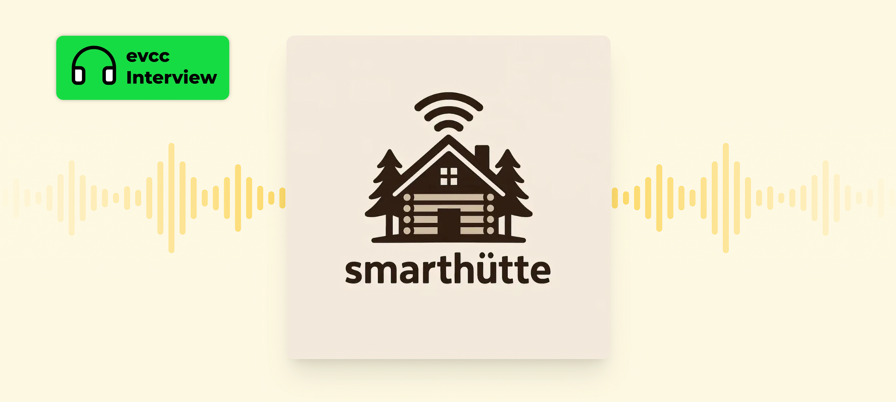

Der [SmartHütte Podcast](https://podcast.smarthuette.de/) ist ein technischer, nerdiger Podcast rund um Smart Home, Self Hosting und andere Technikthemen.
Die Hosts [Andrej Friesen](https://techhub.social/@ajfriesen) und [Thomas Wiebe](https://mas.to/@behweh) sprechen regelmäßig über ihre Erfahrungen mit Home Assistant, Kubernetes, Hosting und allem, was die beiden interessiert.

Ich war zu Gast in der aktuellen Episode und habe über das evcc-Projekt gesprochen.

{/* truncate */}

## Worum geht's?

In der über zweistündigen Episode sprechen wir über die Entstehung von evcc und PV-Überschussladen.
Es geht um Wallboxen und wie smart sie wirklich sind – und welche Probleme entstehen, wenn Hersteller sie zu smart machen wollen.
Es geht um die Herausforderungen der Fahrzeugintegration, Cloud-Abhängigkeiten und den EU Data Act.
Wir diskutieren das Sponsoring-Modell, den Weg von YAML-Konfiguration zur grafischen Oberfläche und wie evcc und Home Assistant sich gegenseitig ergänzen – von der Integration über MQTT bis zur Nutzung von Home Assistant-Entitäten als evcc-Geräte und andersherum.
Außerdem: Prognosen, Optimizer, KI-generierte Pull Requests und die Frage, ab wann man seine Kaffeemaschine wirklich mit PV-Überschuss steuern sollte.

## Jetzt anhören

**[Zur Podcast Episode →](https://podcast.smarthuette.de/episodes/sonne-im-tank-smartes-pv-uberschussladen-mit-michael-geers-vom-evcc-projekt)**

Vielen Dank an Andrej und Thomas für die Einladung und das entspannte Gespräch!
