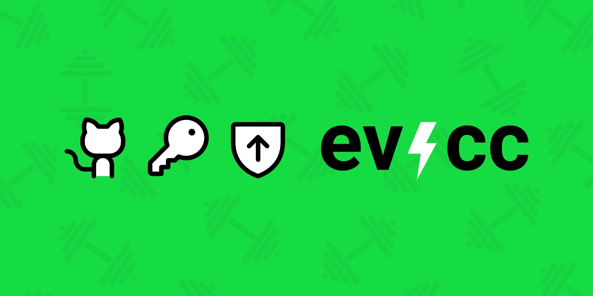
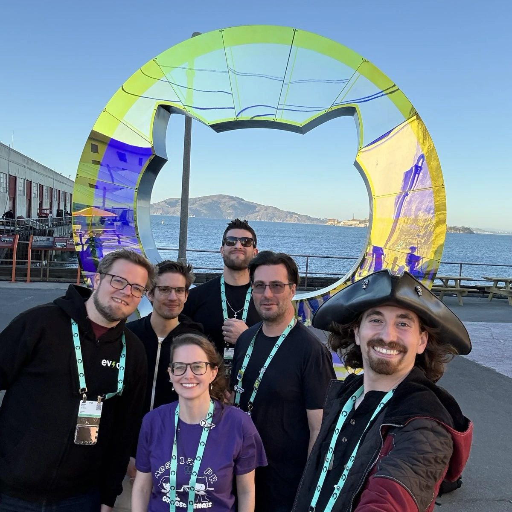

Letzten Sommer hat GitHub uns angesprochen, ob wir am [Secure Open Source Fund](https://github.com/open-source/github-secure-open-source-fund) teilnehmen möchten.
Wir haben uns beworben, wurden vom Komitee ausgewählt und waren zusammen mit 98 Maintainern aus 67 Open-Source-Projekten Teil eines intensiven Security-Programms.

{/* truncate */}

## Das Programm

Die intensive Phase lief über den gesamten September 2025: ca. 20 Sessions, alle synchron über Zoom, mit Abendterminen, die für uns Europäer angenehm lagen.
Die Teilnehmer kamen aus allen Zeitzonen.
Geleitet wurden die Sessions von Experten des [GitHub Security Lab](https://securitylab.github.com/).
Zwischen den Sessions gab es konkrete Aufgaben zu erledigen.
Hausaufgaben, aber die effektive Art.
Das Wertvollste war aber, diese Themen von Leuten erklärt zu bekommen, die sich täglich damit beschäftigen, und sie dann in der Gruppe zu diskutieren.

## Sicherheit ist Training, keine Checkbox

Ein Konzept, das hängen geblieben ist: _Improving Our Security Posture_.
Sicherheit ist keine Checkbox, die man einmal abhakt.
Es ist eher wie Fitness.
Es gibt keine Ziellinie.
Man baut Gewohnheiten auf, trainiert weiter, wird langsam stärker.
Das Programm hat uns dafür einen strukturierten Trainingsplan gegeben.

Die Themen waren breit gefächert.
Es ging um Lizenzklarheit und -kompatibilität.
Wir haben Lizenzprüfungen für unsere Go- und NPM-Abhängigkeiten eingeführt und SBOMs veröffentlicht.
Dazu kam eine [SECURITY.md](https://github.com/evcc-io/.github/blob/main/SECURITY.md) und ein Incident Response Plan.
Auch der CVE-Prozess war Thema.
Bisher hatte ich damit noch nichts zu tun, aber gut, vorbereitet zu sein.
Threat Modelling, Secure-by-Design-Prinzipien und UX-Aspekte beim Entwickeln sicherer Software standen ebenfalls auf dem Programm.
Dazu kamen Sessions zu statischer Analyse mit CodeQL und Fuzzing.

Bei [GitHub Actions Security](https://docs.github.com/en/actions/how-tos/secure-your-work) hätte ich nicht erwartet, wie tief das Thema geht.
Es gibt viele subtile Wege, wie Workflows ausgenutzt werden können.
Wir haben daraufhin unsere eigenen Actions mit Tools wie [actions-permissions](https://github.com/GitHubSecurityLab/actions-permissions) deutlich gehärtet.

Überraschungen gab es auch in der Session zu AI Security.
GitHub hat uns das [Secure Code Game](https://github.com/skills/secure-code-game) vorgestellt: eine Hands-on-Challenge, bei der man Sicherheitslücken in einer Codebase aufspürt.
Die ersten Level decken klassische OWASP-Probleme ab wie SQL Injection und XSS.
Bekanntes Terrain.
In der neuesten Staffel geht es aber darum, Software mit eingebauter LLM-Funktionalität dazu zu bringen, Dinge zu tun, die sie nicht tun sollte.
Dass das mittlerweile die neue Front ist, für die aktiv trainiert wird, fand ich spannend.

## Verschiedene Projekte, verschiedene Perspektiven

Was das Programm besonders gemacht hat, war die Mischung der Projekte im Raum.
Anwendungen wie evcc, [Thunderbird for Android](https://github.com/thunderbird/thunderbird-android), [Mattermost](https://github.com/mattermost/mattermost) und [Mastodon](https://github.com/mastodon/mastodon).
Libraries wie [GoReleaser](https://github.com/goreleaser/goreleaser) (das wir für unsere Releases nutzen), [Mermaid](https://github.com/mermaid-js/mermaid) (das wir in unserer Doku nutzen) und [Node.js](https://github.com/nodejs/node).
Und fundamentale Tools wie [curl](https://github.com/curl/curl) und [ImageMagick](https://github.com/ImageMagick/ImageMagick).

Sicherheit bedeutet je nach Projekt sehr unterschiedliche Dinge.
Eine Anwendung, die bei Leuten zu Hause läuft, hat andere Bedrohungen als eine Library, die in tausenden Projekten steckt.
Zu hören, wie curl über Sicherheit nachdenkt im Vergleich zu Mastodon, war spannend.
Und neben den Inhalten bleibt vor allem das Netzwerk, das man mit den anderen Maintainern aufbaut.

## GitHub Universe

Im Oktober 2025 wurde ich zur GitHub Universe Konferenz nach San Francisco eingeladen ([mehr dazu](https://www.linkedin.com/posts/michael-geers_homeassistant-githubuniverse-opensource-activity-7391032971517992960-a9V8)).
Ich war dort Teil eines Panels zum Secure Open Source Fund am Community Day.
Schön, die anderen Maintainer nach Wochen von Zoom-Sessions auch mal persönlich zu treffen.

Zusammen mit [Gregg Cochran](https://www.linkedin.com/in/greggcochran/) (GitHub), [Christian Grobmeier](https://www.linkedin.com/in/grobmeier/) (Log4j), [Camila Maia](https://www.linkedin.com/in/cmaiacd/) (ScanAPI) und [Carlos Alexandro Becker](https://www.linkedin.com/in/caarlos0/) (GoReleaser) habe ich eine Podcast-Episode über Open-Source-Sicherheit aufgenommen.
Ihr könnt sie euch [auf YouTube ansehen](https://www.youtube.com/watch?v=XmCSHr12CO0) oder [als Audio anhören](https://the-github-podcast.simplecast.com/episodes/live-from-github-universe-inside-the-github-secure-open-source-fund-EV0GufSU).

## Mitmachen

**Du betreust ein Open-Source-Projekt?**
Dann bewirb dich für das Programm.
Der Überblick über Security-Themen ist breit und das Netzwerk an Maintainern, das man aufbaut, ist genauso wertvoll.

**Dein Unternehmen nutzt Open Source** (und das tut es mit ziemlicher Sicherheit): dann unterstützt eure kritischen Abhängigkeiten direkt.
Oder unterstützt den [Secure Open Source Fund](https://github.com/open-source/github-secure-open-source-fund), um das Ökosystem insgesamt zu stärken.
Sicherere Open-Source-Software bedeutet sicherere Software für alle.
