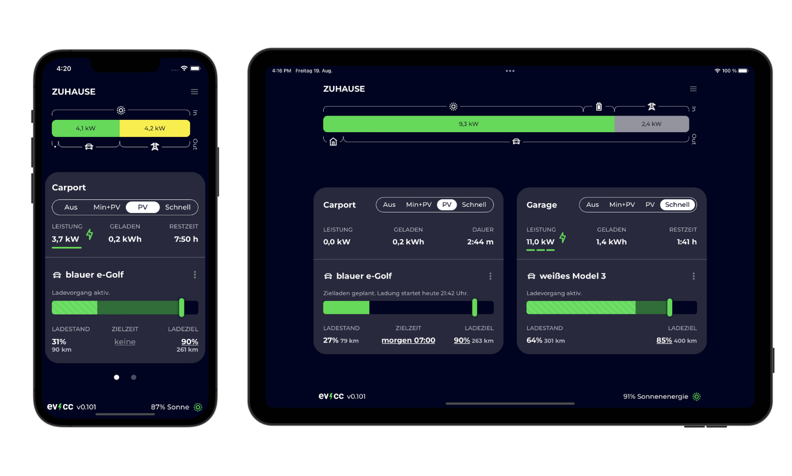

# Einführung

EVCC (Electric Vehicle Charge Controller) ermöglich das Laden von EVs zu optimieren. Es kann eine PV Anlage angebunden werden, um so viel selbsterzeugten Strom wie möglich ins EV zu laden, oder es können auch Anbieter mit dynamischen Strompreisen angebunden werden.

Normalerweise muss die Wallbox dazu mit der bestehenden PV Installation kompatibel sein. EVCC ermöglicht es jedoch dies mit einer Vielzahl von Wallboxen, Strommessgeräten und PV Wechselrichtern, ohne dass diese von Haus aus miteinander kommunizieren könnten.

Dazu wird EVCC auf einem Computer im lokalen Netzwerk installiert, so dass es mit allen notwendigen Geräten kommunizieren kann. EVCC selbst arbeitet dabei vollständig lokal und benötigt selbst keine Cloud Anbindung. Die Software ist sehr genügsam, so dass ein einfaches NAS (Netzwerkspeichergerät) oder ein Raspberry Pi (oder ähnliches) völlog ausreichen.

## Funktionalitäten

- Einfaches und klare Benutzeroberfläche
- Unterstützung von
  - [Wallboxen](/docs/devices/chargers)
  - [PV Anlagen und Strommessgeräten](/docs/devices/meters)
  - [Fahrzeugen](/docs/devices/vehicles)
- [Plugins](/docs/reference/plugins) um nahezu beliebige Wallboxen / Strommmesszähler / Fahrzeuge hinzuzufügen: Modbus (Strommessgeräte und Wechselrichter), HTTP, MQTT, Javascript, WebSockets und shell scripts
- Status [Benachrichtigungen](/docs/reference/notifications) über [Telegram](https://telegram.org), [PushOver](https://pushover.net) und [viele mehr](https://containrrr.dev/shoutrrr/)
- Datenanalyse mit [InfluxDB](https://www.influxdata.com) und [Grafana](https://grafana.com/grafana/)
- Granulare Kontroller der Ladeströme bis in mA Schritten mit unterstützen Wallboxen (z.b. bei smartWB als [OLC](https://board.evse-wifi.de/viewtopic.php?f=16&t=187) bezeichnet)
- REST und MQTT [APIs](/docs/reference/api) zur Integration in andere Heimautomationssysteme (z.B. [HomeAssistant](https://github.com/evcc-io/evcc-hassio-addon))

## Anforderungen

Um EVCC zu verwenden, wird folgendes benötigt:

- eine unterstützte [Wallbox](/docs/devices/chargers)
- ein unterstütztes [Strommessgerät](/docs/devices/meters) für den Netzanschluss, oder unterstützte PV Wechselrichter, oder Strommessgeräte welche die PV Leistung messen.
- optional: einen unterstützten Batteriewechselrichter
- ein unterstützter Computer auf welchem EVCC läuft

Optional:

- ein unterstütztes [Fahrzeug](/docs/devices/vehicles) um den momentanen Ladezustand (SoC) zu erhalten

Über diese Wege sind wir zu erreichen:

- Support, Konfiguration, Fragen zu Geräten: [Community Support Forum](https://github.com/evcc-io/evcc/discussions)
- Chat zu Entwicklungsthemen: [Slack](https://join.slack.com/t/evccgroup/shared_invite/zt-fw52e6lt-tdazCp1LPdPlYuKz3PvTAw).
