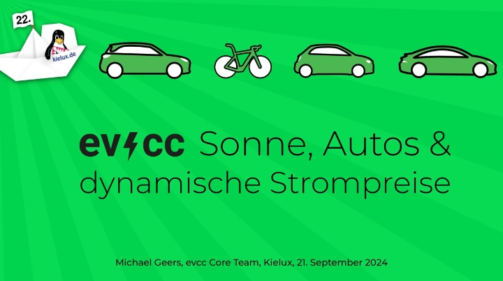
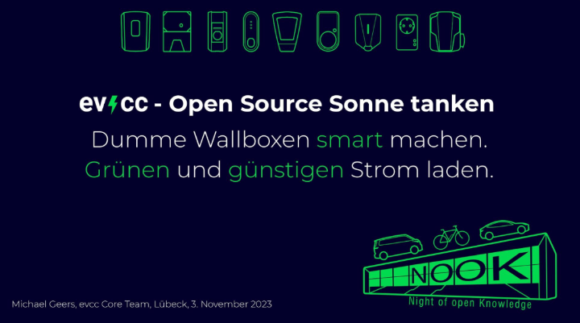
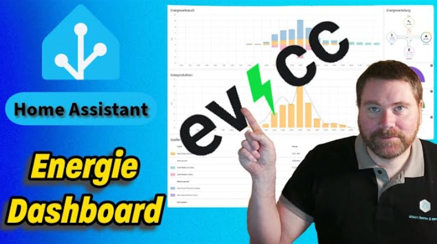

# Einführung

evcc optimiert das Laden deines Elektrofahrzeugs mit selbsterzeugtem Solarstrom oder günstigen Stromtarifen.
Die Software funktioniert herstellerübergreifend mit hunderten von Wallboxen, PV-Anlagen und Fahrzeugen.
evcc läuft lokal auf einem Raspberry Pi oder NAS - keine Cloud erforderlich.

Lerne, wie du [evcc auf deiner Hardware installierst](/docs/installation).

## Funktionalitäten

- Einfache und klare Benutzeroberfläche
- Unterstützung von
  - [Wallboxen und schaltbaren Steckdosen](/docs/devices/chargers)
  - [Erzeugungsanlagen, Batteriespeichern und Energiemessgeräten (Zähler)](/docs/devices/meters)
  - [Fahrzeugen](/docs/devices/vehicles)
- [Plugins](/docs/devices/plugins) um nahezu beliebige Wallboxen / Zähler / Fahrzeuge hinzuzufügen: Modbus, HTTP, MQTT, Javascript, WebSockets und Shell Skripte
- Status [Benachrichtigungen](/docs/reference/configuration/messaging) über [Telegram](https://telegram.org), [PushOver](https://pushover.net) und [viele mehr](https://containrrr.dev/shoutrrr/)
- Datenanalyse mit [InfluxDB](https://www.influxdata.com) und [Grafana](https://grafana.com/grafana/)
- Stufenlose Regelung der Ladeströme mit unterstützten Wallboxen (z. B. bei smartWB als [OLC](https://board.evse-wifi.de/viewtopic.php?f=16&t=187) bezeichnet)
- [REST](/docs/integrations/rest-api)- und [MQTT](/docs/integrations/mqtt-api)-APIs zur Integration in andere Heimautomationssysteme (z. B. [HomeAssistant](/docs/integrations/home-assistant))

## Anforderungen

Um evcc zu verwenden, wird mindestens folgendes benötigt:

- eine unterstützte [Wallbox oder schaltbare Steckdose](/docs/devices/chargers)
- ein unterstütztes [Messgerät](/docs/devices/meters) am Hausanschluss, oder alternativ ein unterstützter PV-Wechselrichter bzw. anderes Messgerät, welches die aktuelle Erzeugungsleistung misst
- ein unterstütztes System auf welchem evcc läuft

Optional:

- ein oder mehrere unterstützte [Fahrzeuge](/docs/devices/vehicles), deren Ladezustand abgerufen wird
- weitere unterstützte Wallboxen, schaltbare Steckdosen, PV-Erzeugungs- und Batteriespeichersysteme
- ein unterstütztes [Energiemanagementsystem](/docs/reference/configuration/hems) (wie z. B. SMA Sunny Home Manager) oder ein dynamischer Stromtarif

Über diese Wege sind wir zu erreichen:

- Support, Konfiguration, Fragen zu Geräten: [Community Support Forum](https://github.com/evcc-io/evcc/discussions)
- Chat zu Entwicklungsthemen: [Slack](https://evcc.io/slack).

:::note
evcc kommt ohne jede Art von Garantie. Du verwendest die Software auf eigenes Risiko. Es liegt in deiner Verantwortung, dass evcc so läuft wie es beabsichtigt ist.
:::

## Videos

### Kieler Open Source und Linux Tage 2024

Projektupdate von [Michael](https://github.com/naltatis) mit kleinem Fokus auf neue Funktionen rund um dynamische Stromtarife. Hier gibts die [Folien zum Vortrag](https://speakerdeck.com/naltatis/evcc-sonne-autos-and-dynamische-stromtarife).

### Night of open Knowledge 2023 in Lübeck

[Michael](https://github.com/naltatis) gibt einen Überblick über den Funktionsumfang und die Möglichkeiten von evcc.

Hier gibts die [Folien zum Vortrag](https://speakerdeck.com/naltatis/evcc-open-source-sonne-tanken).

### Augsburger Linux Infotag 2023

[Michael](https://github.com/naltatis) stellt das Projekt vor, erzählt was zum Arbeitsalltag und zur Finanzierung des Projekts.

### verdrahtet: PV Überschussladen mit evcc

Behandelt die Themen evcc Einrichtung und Grundlagen, Integration mit ioBroker und die Einbindung eines Homematic Schalters.

### haus-automatisierung.com: PV-Überschuss ins E-Auto laden

Behandelt die Themen evcc Einrichtung, Grundlagen und Custom Plugins, Steuerung über MQTT und ioBroker, unterschiedliche Installationsmöglichkeiten.

### smart home & more: evcc mit Home Assistant integrieren

Video-Serie zur Einrichtung und Nutzung von evcc mit Home Assistant.

- [Home Assistant: evcc Basisinstallation und Konfiguration](https://youtu.be/aPq8k2MronY)
- [Home Assistant: Schritt für Schritt - MQTT-Sensor mit Hilfe des MQTT-Explorer einrichten](https://youtu.be/0QQ3y8fgRVA)
- [evcc-Daten nutzen: Effizientes Energiedashboard für Home Assistant](https://youtu.be/V3p5-16U_oU)

## Blogartikel

### hobbyblogging.de

- Einführung in die Grundkonzepte: [evcc - Was soll das sein?](https://hobbyblogging.de/evcc-was-soll-das-sein)
- Einrichtung mit Balkonsolar und smarten Steckdosen: [evcc installieren – So einfach geht’s!](https://hobbyblogging.de/evcc-installieren)

### elefacts.de

- Grundlagen, detaillierte Anleitung für Raspberry Pi Installation, Fernzugriff via Fritz!Box & DynDNS: [evcc Anleitung für intelligentes PV Überschussladen mit vielen Wallboxen](https://www.elefacts.de/test-206-evcc_anleitung_fuer_intelligentes_pv_ueberschussladen_mit_vielen_wallboxen)
- InfluxDB & Grafana: [Von evcc erfasste Daten langfristig speichern und aufbereiten](https://www.elefacts.de/test-208-von_evcc_erfasste_daten_langfristig_speichern_und_aufbereiten)

### the-ninth.com

- [A closer look at the inner workings of evcc](https://www.the-ninth.com/blog/a-closer-look-at-the-inner-workings-of-evcc)
- [Running evcc in our second home with Fronius](https://www.the-ninth.com/blog/running-evcc-in-our-second-home-with-fronius)
- [Running evcc on Synology with Huawei, go-e and VW](https://www.the-ninth.com/blog/running-evcc-synology-huawei-go-e-vw)
- [Comparing evcc and the go-e Controller for solar charging](https://www.the-ninth.com/blog/comparing-evcc-go-e-controller)
