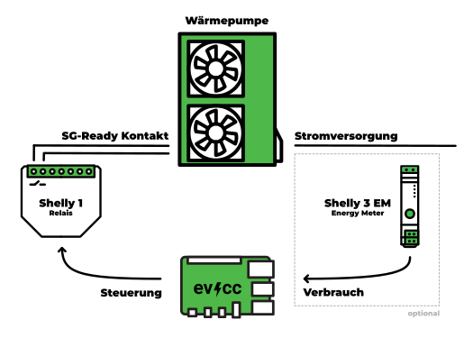

import Tabs from "@theme/Tabs";
import TabItem from "@theme/TabItem";
import SponsorshipRequired from "/docs/_sponsorship_required.mdx";
import PhaseSwitchSupported from "/docs/_phase_switch_supported.mdx";
import DeviceConfig from "/src/components/DeviceConfig";
import DeviceFeatures from "/src/components/DeviceFeatures";

# Wärmeerzeuger

:::warning In Entwicklung
Das Thema Wärmeerzeugung ist noch in der Erprobungsphase.<br/>
Für die hier aufgeführten Geräte wird später ein [Sponsoring erforderlich](/docs/sponsorship) sein.
:::

evcc unterstützt unterschiedliche Arten von Wärmeerzeugern.
Einfache Geräte wie Heizlüfter oder Ventilatoren können über [Smarte Schalter](./smartswitches) ein/ausgeschaltet werden.
Auf dieser Seite erfährst du wie du auch **Wärmepumpen** oder **Heizstäbe** regeln kannst.

## Wärmepumpen

Viele Wärmepumpen unterstützen das SG-Ready Modell um ihren Betrieb an die Energiesituation vor Ort anzupassen.
Neben dem **Normalbetrieb** kann darüber von außen ein **verstärkter Betrieb (Boost)** und ein **Sperrbetrieb (Dimming)** signalisiert werden.

Ist [Überschussstrom vorhanden](/docs/features/solar-charging) oder der [Netzstrom besonders günstig](/docs/features/dynamic-prices) bzw. [sauber](/docs/features/co2), kann evcc die Wärmepumpe anweisen, die Heizleistung zu erhöhen und in den **verstärkten Betrieb (Boost)** zu schalten.

Die Dimming-Funktion wird noch nicht unterstützt.
Wir planen dies über das [Lastmanagement](/docs/features/loadmanagement) zu integrieren.
Damit werden auch die Anforderungen für §14e EnWG abgedeckt.

### direkte Kommunikation

Viele moderne Wärmepumpen bieten API-Schnittstellen an, über die nicht nur der Betriebsmodus gesetzt, sondern auch der Zustand des Gerätes (z.B. Temperatur) abgefragt werden kann.
Unter [Wärmeerzeuger](#wärmeerzeuger) findest du eine Liste aller unterstützten Geräte.

Sollte deine Wärmepumpe eine Schnittstelle haben, die wir noch nicht unterstützen, erstelle gerne ein [GitHub Issue](https://github.com/evcc-io/evcc/issues) mit allen notwendigen Informationen.

### über Relais-Kontakte

Ältere Wärmepumpen verfügen häufig über SG-Ready Relais-Kontakte, über die der Betriebszustand (Normal, Boost, Dimming) signalisiert werden kann.
In unserem Beispiel konzentrieren wir uns auf den Wechsel zwischen Normal- und Boostbetrieb.
Hierfür wird ein steuerbares Relais verwendet, bpsw. ein Shelly 1.
Dieses Relais wird mit den ensprechenden SG-Ready Kontakten der Wärmepumpe verbunden.
Die genaue Verkablung hängt vom Gerät ab und sollte in Absprache mit dem Installateur erfolgen.
Ist PV-Überschuss oder günstige Energie vorhanden schaltet evcc das Relais und gibt der Wärmepumpe das Signal für den verstärkten Betrieb (Boost).

Das folgende Diagramm zeigt den ensprechenden Aufbau:



Möchtest du die Leistung und den Energieverbrauch der Wärmepumpe erfassen, kannst du optional einen Zähler an der Stromversorgung des Geräts installieren.
Im Diagram ist ein Shelly 3EM dargestellt, hier kann aber ein beliebiger [Zähler](./meters) verwendet werden.

Dieses Code-Beispiel zeigt, wie du eine Wärmepumpe mittels Shelly 1 und Shelly 3EM konfigurieren kannst.
Dafür kommt der spezielle Typ `sgready` zum Einsatz.


```yaml
loadpoints:
  - title: Meine Wärmepumpe
    charger: heatpump_control
    meter: heatpump_power

meters:
  - name: heatpump_power
    type: template
    template: shelly-3em # Stromverbrauch der Wärmepumpe
    host: 192.168.0.102

chargers:
  - name: heatpump_control
    type: sgready
    setmode:
      source: switch
      switch:
      - case: 1 # normal
        set:
          source: const
          value: false
          set:
            source: charger
            config:
              type: template
              template: shelly # Boost-Kontakt der Wärmepumpe
              host: 192.168.0.101
      - case: 2 # boost
        set:
          source: const
          value: true
          set:
            source: charger
            config:
              type: template
              template: shelly # Boost-Kontakt der Wärmepumpe
              host: 192.168.0.101
      - case: 3 # dimm (not supported, yet)
        set:
          source: error
          error: ErrNotAvailable
    getmode:
      source: calc
      add:
        - source: const
          value: 1
        - source: charger
          config:
            type: template
            template: shelly # Boost-Kontakt der Wärmepumpe
            host: 192.168.0.101

# [...]
```

:::note
Dieses Code-Beispiel enthält Redundanz und nutzt.
Wir werden später Templates für einfachere Konfigurationen bereitstellen.
:::

## Heizstäbe

Bei Heizstäben gibt evcc die aktuell verfügbare Leistung an das Gerät weiter.
Diese verfügbare Leistung wird, analog zum Ladevorgang eines Fahrzeuges, permanent an die aktuelle Situation angepasst.

evcc bietet einstellbare Limits an, mit denen du deine Wunschtemperatur einstellen kannst.
Dies darf aber nicht als Sicherheitsfunktion verstanden werden.

:::danger
Dein Heizstab muss eine eigene Temperaturlimitierung mitbringen, die bei einer Fehlfunktion von evcc eine Überhitzung verhindert.
:::

---

<!-- AUTO-GENERATED CONTENT BELOW THIS LINE -->

<!-- AUTO-GENERATED FROM TEMPLATE - PLEASE EDIT HERE https://github.com/evcc-io/evcc/tree/master/templates/definition/heating  -->

## Wärmeerzeuger

### my-PV AC ELWA 2

<DeviceConfig code={`chargers:
    - name: my_heating
      type: template
      template: ac-elwa-2
      
      # Modbus TCP
      modbus: tcpip
      id: 1
      host: 192.0.2.2 # Hostname
      port: 502 # Port`}  />


<SponsorshipRequired />

<!-- AUTO-GENERATED FROM TEMPLATE - PLEASE EDIT HERE https://github.com/evcc-io/evcc/tree/master/templates/definition/heating  -->

### Stiebel Eltron

#### LWA/LWZ (SG Ready)

<DeviceConfig code={`chargers:
    - name: my_heating
      type: template
      template: stiebel-lwa
      
      # Modbus TCP
      modbus: tcpip
      id: 1
      host: 192.0.2.2 # Hostname
      port: 502 # Port
      tempsource: # optional`}  />


<!-- AUTO-GENERATED FROM TEMPLATE - PLEASE EDIT HERE https://github.com/evcc-io/evcc/tree/master/templates/definition/heating  -->

#### WPM (SG Ready)

<DeviceConfig code={`chargers:
    - name: my_heating
      type: template
      template: stiebel-wpm
      
      # Modbus TCP
      modbus: tcpip
      id: 1
      host: 192.0.2.2 # Hostname
      port: 502 # Port
      tempsource: # optional`}  />


<!-- AUTO-GENERATED FROM TEMPLATE - PLEASE EDIT HERE https://github.com/evcc-io/evcc/tree/master/templates/definition/heating  -->

### Tecalor THZ (SG Ready)

<DeviceConfig code={`chargers:
    - name: my_heating
      type: template
      template: stiebel-lwa
      
      # Modbus TCP
      modbus: tcpip
      id: 1
      host: 192.0.2.2 # Hostname
      port: 502 # Port
      tempsource: # optional`}  />


<!-- AUTO-GENERATED FROM TEMPLATE - PLEASE EDIT HERE https://github.com/evcc-io/evcc/tree/master/templates/definition/heating  -->

### Vaillant SensoNET (SG Ready)

Die Boost Funktion erwärmt Warmwasser und optional eine Boostzone. Die Boostzone wird durch die ID identifiziert. Die Boost Temperatur wird in Grad Celsius angegeben.

<DeviceConfig code={`chargers:
    - name: my_heating
      type: template
      template: vaillant
      user: # Benutzerkonto (bspw. E-Mail Adresse, User Id, etc.) (optional)
      password: # Passwort des Benutzerkontos (bei führenden Nullen bitte in einfache Hochkommata setzen) (optional)
      zone: # Id der Boostzone (zusätzlich zu Warmwasser) (optional)
      setpoint: # Boost Temperatur (zusätzlich zu Warmwasser) (optional)`} advanced={`chargers:
    - name: my_heating
      type: template
      template: vaillant
      user: # Benutzerkonto (bspw. E-Mail Adresse, User Id, etc.) (optional)
      password: # Passwort des Benutzerkontos (bei führenden Nullen bitte in einfache Hochkommata setzen) (optional)
      zone: # Id der Boostzone (zusätzlich zu Warmwasser) (optional)
      setpoint: # Boost Temperatur (zusätzlich zu Warmwasser) (optional)
      phases: 3 # Die maximale Anzahl der Phasen welche genutzt werden können (optional)`} />


