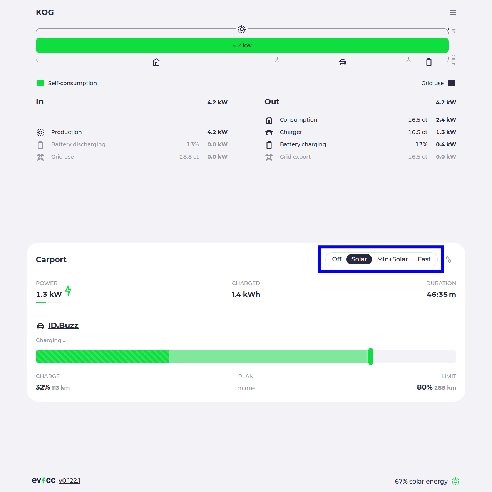

# Charging modes

---
**What you'll learn**: in this chapter we introduce you to the different charging modes, to lay the groundwork for understanding the inner-workings of evcc. A basic introduction can also be found in the [charging guide](/docs/guides/charging).

---

With evcc you can use one of the following three modes to charge your vehicle:

- `Fast` mode enables charging with the highest amount of power possible, without consideration of PV surplus. This mode basically replicates what the typical charger is already able to do on its own.
- `Solar` mode is where the magic happens: based on available surplus, evcc starts and stops the charging process and adapts the amount of power. If you have a battery you can set priorities between battery and EV charging.
- `Min+Solar` mode charges continuously with the minimum power needed by the charger, regardless of surplus. If more surplus is available, evcc will adapt the amount of power.

In all three modes, charging will be stopped once the set charge limit is reached. As additional option, charging plans set a time when a certain charge limit shall be reached and combine the `Solar` and `Fast` modes: the vehicle is charged with surplus and at the latest possible time `Fast` mode is activated to meet the targeted charge limit.

The following screenshot shows the selection of the charging modes:

In the next chapter will take a closer look at the inputs and settings that define the behavior of mostly the `Solar` mode, but also the other charging modes.