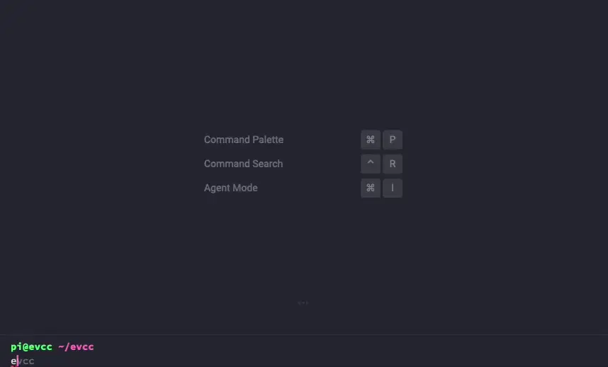

import Tabs from "@theme/Tabs";
import TabItem from "@theme/TabItem";

# Einrichtung

Nach der Installation von evcc kannst du deine Geräte und Einstellungen konfigurieren.
Der empfohlene Weg ist die Konfiguration über die Weboberfläche.
Für fortgeschrittene Nutzer steht auch die dateibasierte Konfiguration zur Verfügung.

## über Weboberfläche

:::tip Empfohlen
Die Weboberfläche ist der einfachste und schnellste Weg, evcc einzurichten.
:::

### Erste Schritte

1. **evcc starten**: Nach der [Installation](../installation) starte evcc gemäß der Anleitung für dein System
2. **Browser öffnen**: Gehe zu `http://<deine-ip>:7070` (z.B. `http://evcc.local:7070` oder `http://192.168.1.50:7070`)
3. **Administrator-Passwort setzen**: Beim ersten Start wirst du aufgefordert, ein Passwort zu vergeben
4. **Einrichtung**: Folge den Anweisungen auf der Willkommensseite

### Geräte hinzufügen

Im Konfigurationsbereich kannst du folgende Komponenten einrichten:

- **Laden & Heizen** (erforderlich): Wallboxen und Wärmepumpen – mindestens ein Gerät muss konfiguriert werden
- **Netzanschluss** (empfohlen): Hauszähler und Stromtarife – wichtig für korrektes Energiemanagement
- **PV & Batterie** (optional): Solaranlagen und Batteriespeicher
- **Fahrzeuge** (optional): Fahrzeugintegrationen für Akkugröße und Ladestand, ermöglicht intelligenteres Laden

### Integrationen

Zusätzlich kannst du verschiedene Dienste und Protokolle einbinden:

- **MQTT**: Datenaustausch mit anderen Systemen im Netzwerk
- **Benachrichtigungen**: Push-Nachrichten und E-Mail-Benachrichtigungen
- **InfluxDB**: Datenexport für Langzeitauswertungen
- **EEBus**: Kommunikation mit anderen EEBus-Geräten
- **OCPP Server**: Verbindung mit OCPP-fähigen Wallboxen
- **Lastmanagement**: Stromkreisüberwachung und -steuerung
- **Modbus-Proxy**: Mehrfachzugriff auf Modbus-Geräte
- **Sunny Home Manager**: Integration via SEMP-Protokoll
- **HEMS**: Externe Steuerung und §14a EnWG-Integration

### Sichern & Wiederherstellen {#backup}

Die Weboberfläche bietet integrierte Funktionen für Datensicherung:

- **Sichern**: Datenbank herunterladen zur Datensicherung
- **Wiederherstellen**: Daten aus einer Sicherungsdatei wiederherstellen
- **Zurücksetzen**: Konfiguration oder Ladehistorie löschen

## über Konfigurationsdatei

:::info Traditionelle Methode
Diese Methode nutzt eine `evcc.yaml` Datei und erfordert Kenntnisse im Umgang mit der Kommandozeile und YAML-Dateien. Einige neue Funktionen sind nur über die Weboberfläche konfigurierbar.
:::

### Manuell erstellen

Du kannst die `evcc.yaml` Datei auch manuell erstellen.
Hier findest du eine minimale Vorlage, die du als Ausgangspunkt nutzen kannst.

#### Erstellen

Kopiere den Inhalt in eine neue `evcc.yaml` Datei.

```yaml title="evcc.yaml"
## minimal configuration example

site:
  title: Home # display name for UI
  meters:
    grid: my_grid
    pv:
      - my_pv
    battery:
      - my_battery

# define your loadpoints according your needs
# see https://docs.evcc.io/en/docs/reference/configuration/loadpoints
loadpoints:
  - title: Garage # display name for UI
    charger: my_charger # charger
    vehicle: my_car # default vehicle

# meter definitions
# name can be freely chosen and is used as reference when assigning meters to site and loadpoints
# for documentation see https://docs.evcc.io/docs/devices/meters
meters:
  # replace with your real grid meter
  - name: my_grid
    type: template
    template: demo-meter
    usage: grid
    power: -1000 # 1 kW feed-in
  # replace with your real pv system
  - name: my_pv
    type: template
    template: demo-meter
    usage: pv
    power: 4000 # 4 kW production
  # replace with your real battery
  - name: my_battery
    type: template
    template: demo-battery
    usage: battery
    power: -1000 # 1 kW battery charging
    soc: 50 # 50 % state of charge

# replace with your real charger
# see https://docs.evcc.io/docs/devices/chargers
chargers:
  - name: my_charger
    type: template
    template: demo-charger
    status: C # charging
    power: 2000 # 2 kW charging power
    enabled: true # optional

# replace with your real vehicle (optional)
# see https://docs.evcc.io/docs/devices/vehicles
vehicles:
  - name: my_car
    type: template
    template: offline
    title: blue e-Golf
    capacity: 50 # in kWh

# enter your real grid tariff and feed-in price
# see https://docs.evcc.io/docs/tariffs
tariffs:
  currency: EUR
  grid:
    type: fixed
    price: 0.29 # EUR/kWh
  feedin:
    type: fixed
    price: 0.10 # EUR/kWh
```

Mit dieser Datei kannst du evcc starten.
Nutze dafür die jeweilige Anleitung für dein System.

#### Testen

Starte evcc neu und öffne deinen Browser unter `http://<evcc-ip>:7070`.
Überprüfe, ob die Werte plausibel sind.
Solltest du eine Fehlermeldung erhalten, überprüfe deine Angaben.

Oft sind es auch Einrückungs- oder Tippfehler.
Die Datei ist im [YAML Format](https://wikipedia.org/wiki/YAML) verfasst.
Mit dem Online-Tool [YAML Lint](https://www.yamllint.com/) kannst du prüfen ob deine Datei das richtige Format einhält.

#### Anpassen

Die Datei beinhaltet lediglich Demo-Geräte (`demo-charger`, `demo-meter`, `demo-battery`, `offline`).
Diese haben feste Werte.
Gehe die Datei nun Stück für Stück durch und passe die Werte an dein Setup an:

- Ersetze die Demo-Geräte durch deine eigenen [Zähler](../devices/meters), [Wallboxen](../devices/chargers) und [Fahrzeuge](../devices/vehicles).
- Hast du keine Batterie, kannst du den entsprechenden Abschnitt komplett entfernen.
- Hast du mehrere PV-Anlagen, kannst du die entsprechenden Abschnitte duplizieren.
- Hast du mehrere Wallboxen, kopiere den Loadpoint- und Charger-Abschnitt und passe die Namen an.

Beachte, dass die einzelnen Einträge sich gegenseitig referenzieren.
Im `site` Eintrag (`meters`), werden die Zähler (`grid`, `pv`, `battery`) ihren Rollen zugeordnet.
Hierfür wird immer das `name` Feld benutzt.
Namen müssen daher eindeutig sein.

Führe diese Änderungen möglichst Schritt für Schritt durch.
Starte nach jeder Änderung evcc neu und überprüfe die Ausgaben im Browser.
Dann bemerkst du schnell, wenn du einen Fehler gemacht hast.

#### Weitere Informationen

Die [evcc.dist.yaml](https://github.com/evcc-io/evcc/blob/master/evcc.dist.yaml) im Hauptprojekt beinhaltet eine vollständige Liste aller möglichen Konfigurations-Optionen.
Ausführlichere Erklärungen zu den Optionen findest du unter [Referenz → evcc.yaml](../reference/configuration).

Willst du eine dynamische Demo sehen kannst du dir auch den Inhalt der Datei [demo.yaml](https://github.com/evcc-io/evcc/blob/master/cmd/demo.yaml) ansehen.
Diese Datei beinhaltet JavaScript-basierte Demo-Geräte, die eine eingeschränkte Funktionalität simulieren.
Sie wird auch für [demo.evcc.io](https://demo.evcc.io) genutzt.

Willst du deine eigene Installation im Demomodus ausführen, dann starte evcc mit dem Parameter `--demo`.
Weitere Informationen findest du unter [CLI Referenz](/docs/reference/cli/evcc).

Die dateibasierte Konfiguration über `evcc.yaml` ermöglicht maximale Kontrolle über alle Einstellungen. Du kannst die Datei entweder mit dem Assistenten erstellen oder manuell schreiben.

### Mit Assistenten

Über den `evcc configure` Befehl kannst du dir eine Konfigurationsdatei über einen Terminal-basierten Assistenten erstellen lassen.
In einem Frage-Antwort-Dialog kannst du deine jeweiligen Geräte konfigurieren.

:::warning
Der `evcc configure` Assistent ist veraltet und wird in einer der kommenden Versionen entfernt. Wir empfehlen die Konfiguration über die Weboberfläche.
:::

#### Voraussetzungen

Um den Assistenten nutzen zu können, muss evcc auf deinem System installiert sein.
Zudem musst du den `evcc` Befehl mit der Kommandozeile (Terminal, Shell, Eingabeaufforderung) ausführen können.

#### Assistent ausführen

Starte die Konfiguration und folge den Anweisungen im Terminal Fenster:

```sh
evcc configure
```

Du solltest eine Ausgabe wie die folgende sehen:



Nach Abschluss der Konfiguration wird eine `evcc.yaml` Datei im aktuellen Verzeichnis erstellt.

:::note
Mit `--advanced` kannst du den Assistenten auch in einem erweiterten Modus starten.
Dann bekommst du zusätzliche Einstellungsmöglichkeiten.
Für deine erste Konfiguration ist das aber nicht notwendig.

```sh
evcc configure --advanced
```

:::

### Mit Assistenten via Docker

Du kannst den Konfigurationsassistenten auch in einem Docker Container ausführen.
Praktisch, wenn du das evcc Binary nicht direkt auf deinem Rechner laufen lassen willst oder kannst.

#### Vorbereitung

Erstelle eine leere `evcc.yaml` Datei:

```sh
touch evcc.yaml
```

#### Assistent ausführen

Führe den Konfigurationsassistenten direkt in Docker aus:

```sh
docker run -v $(pwd)/evcc.yaml:/app/evcc.yaml -it evcc/evcc:latest evcc configure
```

Folge den Fragen des Assistenten.
Am Ende wird die Konfiguration in die erstellte `evcc.yaml` Datei geschrieben.

## Testen

Teste, ob die Konfiguration funktioniert:

```sh
evcc -c evcc.yaml
```

Öffne einen Browser und gib die URL ein: `http://<deine-ip>:7070` (z.B. `http://evcc.local:7070`).
Die evcc Oberfläche sollte nun mit den eigenen Geräten zu sehen sein.

Wenn alles funktioniert, kannst du deine `evcc.yaml` an die Stelle verschieben, die für deine Installation notwendig ist.

## Fehlersuche

Sollten Fehler auftreten, kannst du dir mit folgenden Befehlen weitere Informationen anzeigen lassen.

- Syntaxprüfung

  ```sh
  evcc -c evcc.yaml checkconfig
  ```

- Zähler (Netz, PV, Batterie)

  ```sh
  evcc -c evcc.yaml -l debug meter
  ```

- Fahrzeuge

  ```sh
  evcc -c evcc.yaml -l debug vehicle
  ```

- Wallboxen

  ```sh
  evcc -c evcc.yaml -l debug charger
  ```

Überprüfe die Ausgaben der jeweiligen Befehle auf Plausibilität.

Du kannst `evcc configure` auch erneut ausführen und deine Angaben korrigieren.
Beachte, dass der Assistent immer eine komplett neue Konfiguration erstellt.
Ein gezieltes Verändern einer bestehenden Konfiguration ist nicht möglich.
Nutze dafür die manuelle Konfiguration.
