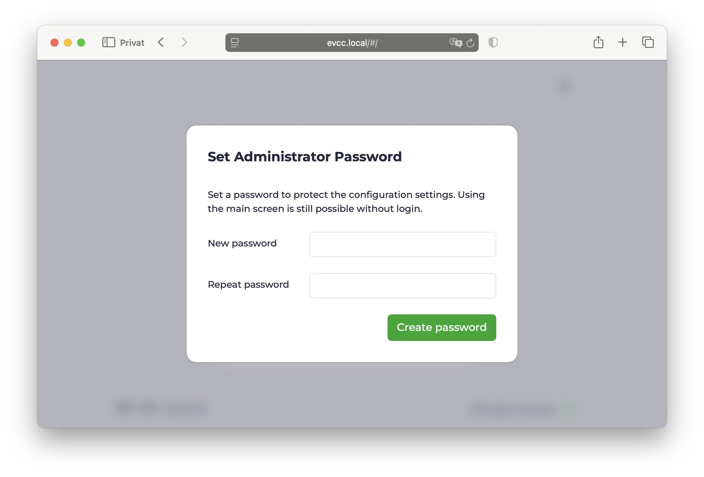
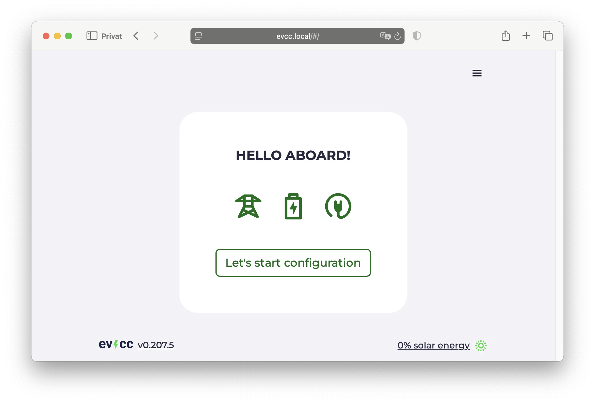
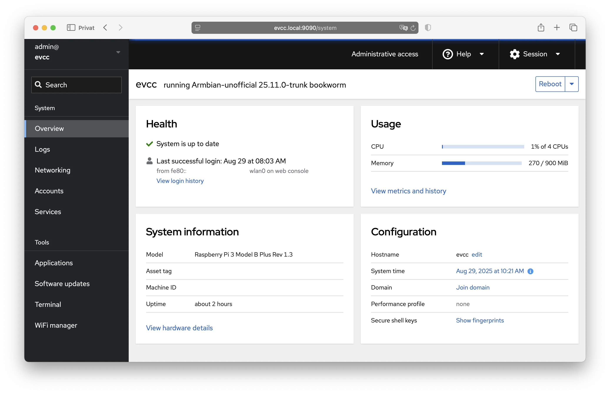

# Raspberry Pi & Co.

Die einfachste Art, evcc auf einem Raspberry Pi oder ähnlichen Kleincomputern zu installieren.
Fertig vorkonfiguriert und einfach über die Web UI einzurichten!

## Schnellstart

### Datei herunterladen

Gehe zu den **[evcc Linux Images](https://github.com/evcc-io/images/releases)** und lade die neueste Version für Raspberry Pi herunter (`armbian_evcc-{version}_rpi4b.img.zip`).

### SD-Karte beschreiben

Falls noch nicht vorhanden: **[balenaEtcher herunterladen](https://etcher.balena.io/)**

- SD-Karte in den Computer stecken
- balenaEtcher öffnen
- **Flash from file** → heruntergeladene Datei wählen
- **Select target** → deine SD-Karte wählen
- **Flash!** → warten bis fertig

:::tip Alternative
Statt „Datei herunterladen & SD-Karte beschreiben“ kann man auch mit Hilfe des **[Raspberry Pi Imager](https://www.raspberrypi.com/software/)** die SD-Karte entsprechend vorbereiten.

Das evcc Image findet man unter

- choose OS
- other specific-purpose OS
- home assistance and home automation
- evcc
  :::

### Raspberry Pi starten

- SD-Karte in den Raspberry Pi stecken
- Netzwerkkabel anschließen (empfohlen) - alternativ [WLAN einrichten](#wifi)
- Netzteil anschließen
- Warten bis gestartet

### evcc Web UI

- Browser öffnen
- **[https://evcc.local/](https://evcc.local/)** eingeben
  - Zertifikatmeldung muss akzeptiert werden (normal, Verbindung ist verschlüsselt)
  - Alternativ via IP-Adresse, z.B. `https://192.168.1.123/` (IP im Router ermitteln)
- Administrator-Passwort vergeben (beim ersten Start)
- Geräte einrichten (Wallbox, PV-Anlage, Hausbatterie, Fahrzeuge)
  - Hinweis: Mindestens ein Ladepunkt muss angelegt werden, damit evcc läuft.
  
Weitere Details zur Einrichtung findest du in der [Konfigurationsanleitung](../configuration).

**Fertig!** 🎉

Systemkonfiguration und Updates funktionieren über [Cockpit](#cockpit).
Melde dich dort einmal an, um das Standard-Linux-Passwort zu ändern.

## WLAN einrichten {#wifi}

Falls kein Netzwerkkabel vorhanden ist, erstellt der Raspberry Pi einen WLAN-Hotspot für die Ersteinrichtung.

- Am Smartphone nach WLAN **"evcc-setup"** suchen
- Verbinden (kein Passwort nötig)
- Dein Heim-WLAN aus der Liste auswählen
- WLAN-Passwort deines Heimnetzwerks eingeben
- Raspberry Pi beendet den Hotspot und verbindet sich mit deinem Heim-WLAN
- Weiter mit [evcc Web UI](#evcc-web-ui)

Die WLAN-Konfiguration kann auch später über [Cockpit](#cockpit) vorgenommen werden.

## Systemverwaltung via Cockpit {#cockpit}

Cockpit ist eine grafische Systemverwaltung für Linux.
Hier kannst du dein System konfigurieren, Updates installieren und Netzwerkeinstellungen ändern.

- URL: [https://evcc.local:9090/](https://evcc.local:9090/)
- Benutzer: `admin`
- Passwort: `admin` (initial)

Beim ersten Login wirst du aufgefordert, das Standard-Passwort zu ändern.
Wähle ein sicheres Passwort für die Systemverwaltung.
Falls du es vergisst, musst du die SD-Karte neu flashen.
Es gibt keine "Passwort vergessen" Funktion.

**Wichtige Funktionen:**

- **System:** Übersicht über CPU, Speicher und Festplatte
- **Logs:** Systemprotokolle einsehen
- **Networking:** Netzwerk und WLAN konfigurieren
- **Terminal:** Zugriff auf die Kommandozeile
- **Software Updates:** System aktualisieren

:::note
Das Linux-Benutzerpasswort und das evcc Administrator-Passwort sind unterschiedlich.
Das eine ist für die Linux-Systemverwaltung, das andere für evcc.
:::

## Hardware-Empfehlungen

evcc läuft auf verschiedenen Kleincomputern und braucht nur wenig Ressourcen.
Bereits 1 GB RAM reichen völlig aus.

**Unterstützte Geräte:**

- Raspberry Pi 3, 4 und 5 - alle Modelle funktionieren gleich gut
- Raspberry Pi Zero 2 W - funktioniert gut
- NanoPi R3S - kompakt, günstig und kommt mit Gehäuse und integriertem eMMC-Speicher

**Speicher:**
Mindestens 16 GB SD-Karte oder eMMC.
Für längere Lebensdauer empfehlen wir eMMC statt SD-Karte (z.B. beim NanoPi).
SD-Karten können durch häufige Schreibvorgänge verschleißen.
Siehe auch [Armbian Empfehlungen](https://docs.armbian.com/User-Guide_Getting-Started/#what-do-i-need).

**Netzteil:**
Original-Netzteil des jeweiligen Herstellers verwenden.

**Netzwerk:**
Kabelverbindung wird stark empfohlen.
WLAN ist möglich, aber oft weniger stabil.

## Über das evcc Linux Image

Das evcc Linux Image basiert auf [Armbian](https://www.armbian.com/) und bietet einige praktische Funktionen:

**Updates:**

- Betriebssystem: Sicherheitsupdates werden automatisch installiert
- evcc: Updates können über [Cockpit](#cockpit) durchgeführt werden

**Zugriff per SSH:**
Du kannst dich via SSH mit dem `admin` Benutzer verbinden (gleiche Zugangsdaten wie [Cockpit](#cockpit)).

**Alternative Zugänge:**

- Verschlüsselt: https://evcc.local/ (empfohlen)
- Unverschlüsselt: http://evcc.local:7070/ (falls Zertifikatmeldung stört)

**OCPP Server:**
Der OCPP Server läuft auf `ws://evcc.local:8887/<station-id>` für die Verbindung mit OCPP-fähigen Wallboxen.

Weitere technische Details findest du im [GitHub Repository](https://github.com/evcc-io/images).

## Nächste Schritte

Im Bereich [Funktionen](/docs/features/solar-charging) kannst du alle Möglichkeiten von evcc kennenlernen.
Lade dir auch die [iOS/Android App](/docs/features/app) herunter.
