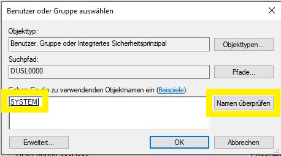
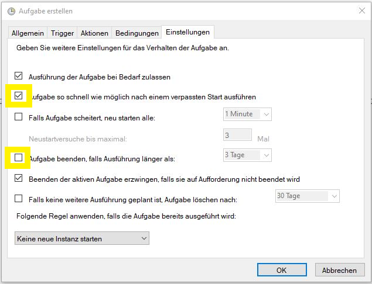

import Tabs from "@theme/Tabs";
import TabItem from "@theme/TabItem";

# Manuell (inkl. Windows)

Diese manuelle Installation erfordert fortgeschrittene PC Kenntnisse, vor allem auch im Umgang mit einem Terminal/Eingabeaufforderung.

## Erstinstallation

- Öffne im Browser die Release Webseite unter [https://github.com/evcc-io/evcc/releases/latest](https://github.com/evcc-io/evcc/releases/latest)
- Wähle die für dein System passende Version nach dem hier angegebenen Namens-Schema: 

  <Tabs groupId="manual">
    <TabItem value="linux" label="Linux" default>

      - 64-Bit Intel CPU: evcc_X.XX_linux_amd64.tar.gz
      - 64-Bit ARM CPU: evcc_X.XX_linux_arm64.tar.gz
      - 32-Bit ARM CPU (e.g. Raspberry Pi 32-Bit OS): evcc_X.XX_linux_armv6.tar.gz
    </TabItem>
    <TabItem value="macos" label="macOS" default>

      - 64-Bit ARM oder Intel CPU: evcc_X.XX_macOS_all.tar.gz
    </TabItem>
    <TabItem value="windows" label="Windows" default>

      - 64-Bit Intel CPU: evcc_X.XX_windows_amd64.zip
    </TabItem>
  </Tabs>
- Lade die entsprechende Datei auf dein System herunter
- Entpacke die heruntergeladene Datei (z.B. per Doppelklick auf die Datei)
- Es gibt nun einen neuen Ordner mit der dem Programm `evcc`.
- Öffne ein Terminal/Eingeabeaufforderung und gehe in den Ordner mit dem Programm `evcc`
- Starte die Konfiguration und folge den Anweisungen im Terminal Fenster:

  ```sh
  evcc configure
  ```

  :::note
  Fortgeschrittene Anwender (z.B. mit evcc Erfahrung oder technischem Know-How) können auch alternativ folgenden Aufruf verwenden:
  
  ```sh
  evcc configure --advanced
  ```

  Dieser Modus bietet weitere (technisch fortgeschrittene) Einstellmöglichkeiten.
  :::
## Aktualisierung/Downgrade

Führe die obigen Schritte aus und ersetze die evcc Programmdatei mit der neuen bzw. vorherigen Version. Die Konfiguration muss nicht erneut durchgeführt werden.

## evcc als Service

Sobald die Konfiguration und das Testen erfolgreich abgeschlossen sind, kann die Installation von evcc nun abgeschlossen werden. Folge diesen Schritten um evcc als Systemdienst einzurichten, welcher dafür sorgt dass evcc beim Start des Computers ausgeführt wird und im Fehlerfall ebenfalls automatisch neu startet.

### Linux

:::note
Diese Dokumentation geht davon aus, dass Linux `systemd` unterstützt.
:::

- Führe folgenden Befehl aus um einen Editor mit einer neuen Datei für den Dienst zu erstellen und zu öffnen:

  ```sh
  sudo nano /etc/systemd/system/evcc.service
  ```

- Kopiere den folgenden Inhalt in die Datei
  ```
  [Unit]
  Description=evcc
  Requires=network-online.target
  After=syslog.target network.target network-online.target
  Wants=network-online.target
  StartLimitIntervalSec=10
  StartLimitBurst=10

  [Service]
  ExecStart=/usr/local/bin/evcc
  Restart=always
  RestartSec=5

  [Install]
  WantedBy=multi-user.target
  ```

  Passe den Pfad der `evcc` Datei in `ExecStart` an, falls die Datei in einem anderen Verzeichnis abgelegt ist.
  Dies geht auch davon aus, dass die Konfigurationsdatei `evcc.yaml` in `/etc/evcc.yaml` zu finden ist. Falls dies nicht der Fall ist, muss in `ExecStart` am Ende der Text `-c /yourpath/evcc.yaml` hinzugefügt werden. Der Text `yourpath` muss mit dem entsprechenden Verzeichnis ersetzt werden.

- Teste den Dienst:

  ```sh
  sudo systemctl daemon-reload
  sudo systemctl start evcc
  sudo systemctl status evcc
  ```

  Die Ausgabe sollte bei Erfolg folgenden Text beinhalten `Active: active (running)`.

- Konfiguriere den Dienst so, dass er beim Rechnerstart automatisch startet:

  ```sh
  sudo systemctl enable evcc.service
  ```

- Fertig :)

evcc läuft nun als Systemdienst im Hintergrund. Mit folgenden Befehlen kann dieser Dienst in Zukunft gesteuert werden.

```sh
sudo systemctl status evcc # zeigt den Status
sudo systemctl start evcc # startet den Dienst
sudo systemctl stop evcc # stoppt den Dienst
sudo systemctl restart evcc # startet den Dienst neu
sudo systemctl enable evcc # aktiviert den Dienst
sudo systemctl disable evcc # deaktiviert den Dienst
```

**Achtung:** Bei Umstellung auf die `evcc` Releases über `apt` *muss* der angelegte Service wieder entfernt werden. Anderenfalls kommt es zu Konflikten und Fehlern beim Start von `evcc`.

### Windows 10

:::note
Diese Dokumentation geht davon aus, dass evcc in `c:\evcc` liegt.
:::

- Beginnt in der Suchleiste von Windows 10 mit der Eingabe des Wortes `Aufgabenplanung`. Bereits nach wenigen Buchstaben sollte diese als Treffer mit der höchsten Übereinstimmung angezeigt werden und kann auf der rechten Seite mit `Als Administrator ausführen` gestartet werden:


- Nach dem starten der Aufgabenplanung obliegt es Euch, ob Ihr den neuen Service in einem eigenen Ordner oder der allgemeinen Aufgabenplanungsbibliothek anlegt. Für dieses Beispiel wird ein eigener Ordner `evcc` angelegt. Hierzu muss zunächst der Ordner "Aufgabenplanungsbibliothek angewählt werden um dann mit der rechten Maustaste das PopUp Menü zu starten. Hier wählen wir `Neuer Ordner` und benennen diesen evcc:


- Nun wählen wir den neuen Ordner `evcc oder die allgemeine Aufgabenplanungsbibliothek` aus und öffnen erneut mit der rechten Maustaste das PopUp Menü, dort wählen wir nun `Aufgabe erstellen`:


- Als Name `evcc` und zur besseren Zuordnung sollte eine kurze Beschreibung mit angegeben werden. Da wir den Service als Systemdienst laufen lassen, öffnen wir die Userverwaltung über 'Benutzer oder Gruppe ändern' und tippen dort `system`. Nach einem Klick auf `User überprüfen`, sollte der Account angezeigt und der Dialog kann mit OK geschlossen werden:

  

- Einstellungen des Reiters: `Trigger`
- Aufgabe starten ändern auf "Beim Start" und prüfen, dass die Aufgabe aktiviert ist:


- Einstellungen des Reiters: `Aktionen`
- "Programm starten" belassen und über Durchsuchen die Datei "evcc.exe" auswählen. Es empfiehlt sich den Pfad zusätzlich in `Starten in` anzugeben, somit wird die dort abgelegte Konfigurationsdatei direkt gefunden:


- Einstellungen des Reiters: `Bedingungen`
- Diese Einstellungen können im Default belassen werden. Da evcc länger laufen sollte als es der Akkubetrieb gewährleisten würde.
- `Tipp`: Da z.B. der SMA Home Manager über WLAN Probleme bereiten kann, sollte optional der Haken bei `Netzwerk` gesetzt und eine entsprechende Verbindung ausgewählt werden.


- Einstellungen des Reiters: `Einstellungen`
- Den Haken bei `Aufgabe so schnell wie möglich ...` setzen.
- Unbedingt den Haken bei `Aufgabe beenden, falls Ausführung länger als:` entfernen, sonst wundert ihr Euch, das evcc auf einmal nicht mehr läuft.



- Fertig :-)

- Die Aufgabe kann nun manuell gestartet oder über einen Reboot getestet werden. Zur Kontrolle mit dem Browser von einem anderen System auf `IP des Windows 10 Rechners:7070` zugreifen.
