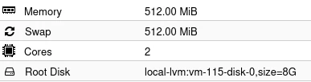

import Tabs from "@theme/Tabs";
import TabItem from "@theme/TabItem";
import Screenshot from "../../src/components/Screenshot";

# Proxmox

:::note
Proxmox ist eine Virtualisierungs-Platform, welche ein sehr einfaches evcc Hosting ermöglicht.
Die folgende Installation wurde mit Ubuntu 24.4 getestet!
:::

## Installation

1. Falls auf deinem System noch nicht vorhanden, lade ein aktuelles Ubuntu Template auf deinen Server.
2. Erstelle einen Debian basierten LX container, der nur mit minimalen Ressourcen konfiguriert wird.
   (8G disk und 512MB RAM sind genügend Ressourcen)

   Siehe Screenshot:
<!---
    <Screenshot
      name="screenshots/Screenshot_proxmox_ct_ressource"
      caption="Screenshot der Proxmox Ressourcen."
    />
--->
   

3. Installiere evcc wie in der Anleitung für Debian basierte Linux Systeme beschrieben [Debian, Ubuntu Installation](./linux).

## Aktualisierung 

Aktualisierung über die Debian, Ubuntu Paketverwaltung.

