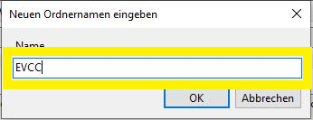
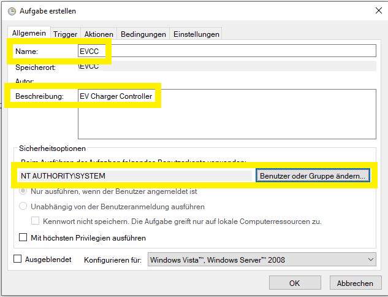
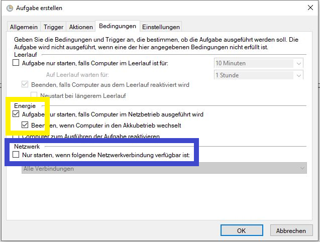
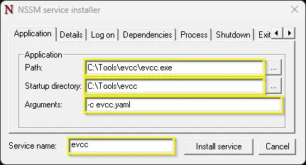
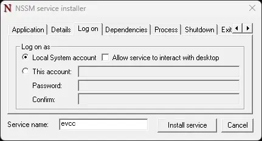
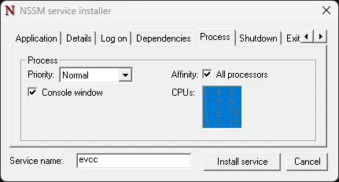
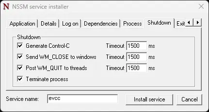
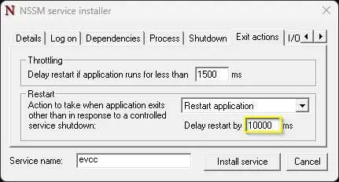
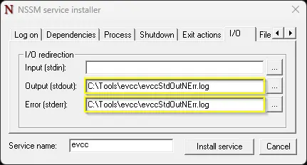

# Windows

Hier findest du Anweisungen für die manuelle Installation von evcc auf Windows.

:::important
Diese manuelle Installation erfordert fortgeschrittene PC Kenntnisse, vor allem auch im Umgang mit einem Terminal/Eingabeaufforderung.

Es ist auch möglich evcc auf Windows zu installieren.
Allerdings wird evcc typischerweise in einer Linux-Umgebung (z.B. Raspberry Pi) verwendet.
:::

## Installation

- Lade die entsprechende Datei für dein System herunter
  - 64-Bit Intel CPU: [evcc_X.XX_windows_amd64.zip](https://github.com/evcc-io/evcc/releases/latest)
- Entpacke die heruntergeladene Datei (z.B. per Doppelklick auf die Datei)
- Es gibt nun einen neuen Ordner mit dem Programm `evcc`.
- Öffne ein Terminal/Eingabeaufforderung und gehe in den Ordner mit dem Programm `evcc`
- Prüfe die Installation mit folgendem Befehl:

  ```sh
  evcc -v
  ```

- Du solltest nun die aktuelle Version von evcc sehen (z.B. `evcc version 0.xxx.y`).

## Konfiguration

evcc kann auf zwei Arten konfiguriert werden:

### Weboberfläche (empfohlen)

Starte evcc ohne weitere Parameter:

```sh
./evcc
```

Öffne dann deinen Browser unter [http://localhost:7070](http://localhost:7070):

- Du wirst aufgefordert ein Administrator-Passwort zu vergeben
- Anschließend kannst du deine Geräte direkt über die Weboberfläche einrichten
- Die Einstellungen werden automatisch in der Datenbank gespeichert

### Konfigurationsdatei (traditionell)

Alternativ kannst du eine `evcc.yaml` Konfigurationsdatei verwenden.
Details zur Erstellung der Konfigurationsdatei findest du unter [Einrichtung](./configuration).

Starte evcc mit:

```sh
./evcc -c evcc.yaml
```

## Aktualisierung/Downgrade

Führe die obigen Schritte aus und ersetze die evcc Programmdatei mit der neuen bzw. vorherigen Version.
Die Konfiguration muss nicht erneut durchgeführt werden.

## Hintergrunddienst

### Aufgabenplanung {#task-scheduler}

:::note
Diese Dokumentation geht davon aus, dass evcc in `c:\evcc` liegt.
Diese Anweisungen wurden mit Windows 10 erstellt.
:::

- Beginne in der Suchleiste von Windows 10 mit der Eingabe des Wortes `Aufgabenplanung`.
  Bereits nach wenigen Buchstaben sollte diese als Treffer mit der höchsten Übereinstimmung angezeigt werden und kann auf der rechten Seite mit `Als Administrator ausführen` gestartet werden:


- Nach dem Start der Aufgabenplanung obliegt es dir, ob du den neuen Service in einem eigenen Ordner oder der allgemeinen Aufgabenplanungsbibliothek anlegst.
  Für dieses Beispiel wird ein eigener Ordner `evcc` angelegt.
  Hierzu muss zunächst der Ordner „Aufgabenplanungsbibliothek" angewählt werden, um dann mit der rechten Maustaste das Kontextmenü zu öffnen.
  Hier wählst du `Neuer Ordner` und benennst diesen evcc:


- Nun wählst du den neuen Ordner `evcc` oder die allgemeine Aufgabenplanungsbibliothek aus und öffnest erneut mit der rechten Maustaste das Kontextmenü.
  Dort wählst du `Aufgabe erstellen`:



- Als Name `evcc` und zur besseren Zuordnung sollte eine kurze Beschreibung mit angegeben werden.
  Da du den Service als Systemdienst laufen lässt, öffnest du die Userverwaltung über „Benutzer oder Gruppe ändern" und tippst dort `system`.
  Nach einem Klick auf `User überprüfen` sollte der Account angezeigt werden und der Dialog kann mit OK geschlossen werden:

 

- Einstellungen des Reiters `Trigger`:
  Aufgabe starten ändern auf „Beim Start" und prüfen, dass die Aufgabe aktiviert ist:


- Einstellungen des Reiters `Aktionen`:
  „Programm starten" belassen und über Durchsuchen die Datei `evcc.exe` auswählen.
  Es empfiehlt sich den Pfad zusätzlich in `Starten in` anzugeben, somit wird die dort abgelegte Konfigurationsdatei direkt gefunden:


- Einstellungen des Reiters `Bedingungen`:
  Diese Einstellungen können im Default belassen werden.

  :::info
  Da z. B. der SMA Home Manager über WLAN Probleme bereiten kann, sollte optional der Haken bei `Netzwerk` gesetzt und eine entsprechende Verbindung ausgewählt werden.
  :::



- Einstellungen des Reiters `Einstellungen`:
  Den Haken bei `Aufgabe so schnell wie möglich ...` setzen.
  Unbedingt den Haken bei `Aufgabe beenden, falls Ausführung länger als:` entfernen, sonst wunderst du dich, dass evcc auf einmal nicht mehr läuft.


Die Aufgabe kann nun manuell gestartet oder über einen Reboot getestet werden.
Zur Kontrolle mit dem Browser auf `http://localhost:7070` zugreifen.

### NSSM {#windows-service}

:::note
Diese Dokumentation geht davon aus, dass evcc in `c:\Tools\evcc` liegt.
Diese Anweisungen wurden mit Windows 11 erstellt.
:::

Als Alternative zur Aufgabenplanung kannst du evcc als Windows Dienst betreiben.
Ein Dienst läuft ohne Benutzeranmeldung und bietet bessere Steuerungsmöglichkeiten für Neustart und Fehlerbehandlung.

Da evcc die Windows-Service-Schnittstelle nicht direkt unterstützt, kann [_nssm_](https://nssm.cc/download) (_Non-Sucking Service Manager_) als Service Wrapper verwendet werden.

- Lade _nssm_ von [nssm.cc](https://nssm.cc/download) herunter und entpacke die ZIP-Datei nach `C:\Tools\nssm\`.
- Öffne eine Eingabeaufforderung (`cmd.exe`) und wechsle in den `win64`-Ordner:

  ```sh
  cd /D C:\Tools\nssm\nssm-2.24\win64
  ```

- Installiere den Dienst:

  ```sh
  nssm install evcc
  ```

- Gehe die Reiter des Dialogs durch.
  Die folgenden Einstellungen sind Empfehlungen.
  - **Application**:

    
    - _Path_: Pfad zur `evcc.exe`.
    - _Start directory_: Arbeitsverzeichnis für evcc.
    - _Arguments_: Parameter für evcc, z. B. `-c evcc.yaml`.
      Optional: `--database evcc.db` um den Datenbankpfad explizit zu setzen.
      Ohne diese Option liegt die Datenbank im Benutzerprofil des ausführenden Accounts.
      Beim _System_-Account wäre das `%SystemRoot%\system32\config\systemprofile\.evcc\evcc.db` — ein anderer Ort als bei interaktivem Start.
      Mit `--database` stellst du sicher, dass immer dieselbe Datenbank verwendet wird.
      Das ist relevant beim [Passwort zurücksetzen](/docs/faq#password-reset).

  - **Details**:

    
    - _Display Name_: Name des Dienstes in der Diensteverwaltung (am besten identisch mit _Service Name_).
    - _Startup type_: _Automatic_ für Autostart beim Booten.

  - **Log on**:

    

    Standard: Dienst läuft unter dem _System_-Account.
    Details: [nssm-Dokumentation](https://nssm.cc/usage).

    :::important
    Der hier gewählte Account bestimmt, wo evcc seine Datenbank `evcc.db` anlegt (siehe _Arguments_ oben).
    :::

  - **Dependencies**:

    

    `NlaSvc` als Abhängigkeit stellt sicher, dass das Netzwerk bereit ist, bevor evcc startet.

  - **Process**:

    

    Standardeinstellungen beibehalten.

  - **Shutdown**:

    

    Standardeinstellungen beibehalten.
    nssm versucht evcc zuerst per `Strg`+`C` zu stoppen, dann per `WM_CLOSE`/`WM_QUIT`, und beendet den Prozess notfalls nach Timeout.

  - **Exit actions**:

    

    Empfehlung: _Restart application_ mit 10 Sekunden Verzögerung, damit evcc nach einem Absturz oder Neustart über die Weboberfläche automatisch wieder startet.

  - **I/O**:

    

    Optional: `stdout` und `stderr` in Log-Dateien umleiten.
    Achte darauf, das Log-Level von evcc nicht zu hoch zu setzen, da die Dateien sonst schnell wachsen.

  - **File rotation**:

    

    Optional: Log-Rotation aktivieren, um die Grösse der Log-Dateien zu begrenzen.

  - **Environment**:

    

    Standardeinstellungen beibehalten.

Klicke auf _Install Service_ um den Dienst einzurichten.
Der Dienst kann anschliessend in der Windows-Diensteverwaltung gestartet und gestoppt werden.
Zur Kontrolle mit dem Browser auf `http://localhost:7070` zugreifen.
