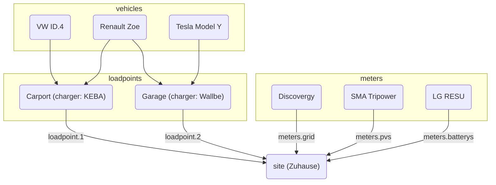

# Grundlagen

evcc benötigt eine Konfigurationsdatei in der die Installation beschrieben wird. Ohne diese Datei kann evcc nicht genutzt werden. Die Datei selbst ist im [YAML](https://de.wikipedia.org/wiki/YAML) Format geschrieben. Dieses Format definiert eine Syntax wodurch eine strukturierte Datenstruktur in Textform erstellt werden kann.

Zur Bearbeitung bzw. Erstellung der Konfigurationsdatei empfehlen wir einen Texteditor zu verwenden, welcher die YAML Synthax beherrscht und damit Fehler aufzeigen kann, z.B. [VS Code](https://code.visualstudio.com) mit der [YAML Erweiterung](https://marketplace.visualstudio.com/items?itemName=redhat.vscode-yaml).

Die Konfigurationsdatei hat standardmäßig den Namen `evcc.yaml` und ist entweder im gleichen Verzeichnis wie das Programm selbst abzulegen, oder unter Linux-System auch unter `/etc/evcc.yaml`.

Wenn die Konfigurationsdatei nicht gefunden wird, kann diese über einen Parameter beim Aufruf evcc übergeben werden: z.B. `evcc -c /home/evcc.yaml`

### Struktur

Die Konfigurationsdatei von evcc besteht aus mehreren Bereichen. Um von einem Bereich auf Elemente eines anderen Bereichs zu verweisen, haben einzelne Geräte einen `name` Parameter, den man frei mit einem Text vergeben kann. Der vergebene Text dient der Identifikation und Referenzierung.

Hier ein Überblick über die Beziehungen der wichtigsten Bestandteile der Konfiguration:

### Site

Eine _Site_ beschreibt den Standort mit den vorhandenen und benötigten Geräten der Hausinstallation und ist für das Regeln der verfügbaren Leistung zuständig.

[Weiterlesen...](site)

### Loadpoints

_Loadpoints_ (Ladepunkte) beschreiben die Ladeinfrastruktur und kombinieren vorhandene _Charger_ (Wallboxen), _Vehicle_ (Fahrzeuge) und alles weitere was ein Ladepunkt benötigt.

[Weiterlesen...](loadpoints)

### Chargers

_Chargers_ (Wallboxen) beinhaltet eine Liste von Wallboxen und deren Eigenschaften, z.B. wie sie angesprochen werden.

[Weiterlesen...](chargers)

### Meters

_Meters_ (Hausinstallation) ist eine Liste von Geräten welche verschiedene Stromflüsse messen. Dazu gehören:

- Eingekaufter, Verkaufter Strom
- PV erzeugte Ströme
- Ladestrom des EV (falls die Wallbox dies nicht direkt unterstützt)
- Ströme der Hausbatterie(n)

[Weiterlesen...](meters)

### Vehicles

Um die Ladung auf einen bestimmten Ladestand (SoC) in EVs zu begrenzen, können hier die vorhandenen Fahrzeuge und Online Zugangsdaten angegeben werden.

[Weiterlesen...](vehicles)

### HEMS

evcc kann die Ladepunkte und deren Ladeströme an ein anderes Home Energy Management System (HEMS) weitergeben, damit dieses die Informationen z.b. zur Steuerung der Hausbatterie nutzen kann.

[Weiterlesen...](hems)

### Messaging

In diesem Bereich können Ereignisse definiert werden, bei welchen man informiert werden will. Zur Informationsübermittlung werden eine Reihe von unterschiedlichen Systemen unterstützt.

[Weiterlesen...](messaging)
