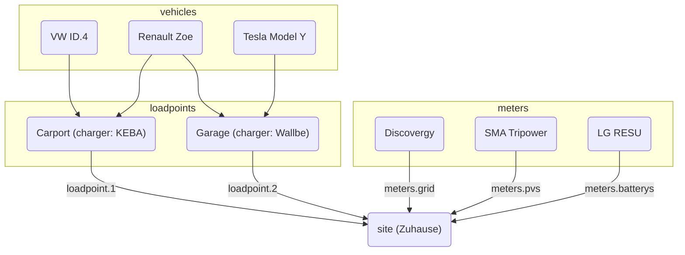

# Konfiguration

evcc kann auf zwei Arten konfiguriert werden:

**1. UI-Konfiguration (empfohlen)**

Die Konfiguration erfolgt über die Weboberfläche unter **Konfiguration**.
Die Einstellungen werden automatisch in der Datenbank gespeichert.
Weitere Informationen findest du unter [Einrichtung](/docs/installation/configuration).

**2. Dateibasierte Konfiguration**

Die Konfiguration über die `evcc.yaml` Datei wird weiterhin unterstützt.
Dieser Bereich dokumentiert die YAML-basierte Konfiguration.

:::info Parallele Nutzung
Beide Konfigurationsmethoden können parallel genutzt werden.
Geräte (Ladepunkte, Zähler, PV-Anlagen, Batterien, Fahrzeuge) werden aus beiden Quellen zusammengeführt.
Bei anderen Einstellungen hat die UI-Konfiguration Vorrang.
Details findest du in der [FAQ](/docs/faq#ui-migration).
:::

## Dateibasierte Konfiguration (evcc.yaml)

Die Konfigurationsdatei ist im YAML Format geschrieben und hat standardmäßig den Namen `evcc.yaml`.
Sie liegt entweder im gleichen Verzeichnis wie das Programm oder bei Linux-Systemen unter `/etc/evcc.yaml`.

Abweichende Pfade können beim Start angegeben werden: `evcc -c /pfad/zur/evcc.yaml`

### Struktur

Die Konfigurationsdatei besteht aus mehreren Bereichen.
Um zwischen Bereichen zu referenzieren, haben Geräte einen `name` Parameter zur Identifikation.

Eine Beispieldatei mit vielen Parametern findet man hier: https://github.com/evcc-io/evcc/blob/master/evcc.dist.yaml

Hier ein Überblick über die Beziehungen der wichtigsten Bestandteile der Konfiguration:

### Wie funktioniert evcc? (Ein Blick ins Innere)

Wichtig für die Funktionalität ist ein Netzanschlusszähler (`grid` Zähler). Dieser ermittelt die aktuelle Überschussleistung.
Die Messung der Erzeugungsleistung hat in diesem Fall keinen funktionalen Einfluss.
Ein Betrieb ist aber auch ohne Netzanschlusszähler möglich. Mehr dazu findest du [hier](/docs/faq#einrichtung).

Die Überschussleistung wird mit der Mindestladeleistung verglichen. Ist diese erreicht, startet die Ladung.

Die Mindestladeleistung ergibt sich aus den im Loadpoint definierten Werten [`minCurrent`](/docs/reference/configuration/loadpoints) und [`phases`](/docs/reference/configuration/loadpoints).

Beispiel: `phases: 1` und `minCurrent: 8`

1 (phases) x 8A (minCurrent) x 230V (Netzspannung) = 1840W (Mindestladeleistung)

#### Manipulationsmöglichkeiten

Normalerweise entspricht die Überschussleistung der verfügbaren Ladeleistung. Die verfügbare Ladeleistung kann jedoch individuell durch mehrere Parameter verändert werden. Diese sind:

- Site: `residualpower`
- Site: `prioritySoc`
- Site: `bufferSoc`
- Site: `aux`
- Loadpoint: `enable: threshold`
- Loadpoint: `disable: threshold`

Die Einstellmöglichkeiten bitte der Beschreibung der jeweiligen Parameter entnehmen.

### Site

Eine _Site_ beschreibt den Standort mit den vorhandenen und benötigten Geräten der Hausinstallation und ist für das Regeln der verfügbaren Leistung zuständig.

[Weiterlesen...](./configuration/site)

### Loadpoints

_Loadpoints_ (Ladepunkte) beschreiben die Ladeinfrastruktur und kombinieren vorhandene _Charger_ (Wallboxen), _Vehicle_ (Fahrzeuge) und alles weitere was ein Ladepunkt benötigt.

[Weiterlesen...](./configuration/loadpoints)

### Chargers

_Chargers_ (Wallboxen) beinhaltet eine Liste von Wallboxen und deren Eigenschaften, z. B. wie sie angesprochen werden.

[Weiterlesen...](./configuration/chargers)

### Meters

_Meters_ (Hausinstallation) ist eine Liste von Geräten welche verschiedene Stromflüsse messen. Dazu gehören:

- Eingekaufter, Verkaufter Strom
- PV erzeugte Ströme
- Ladestrom des EV (falls die Wallbox dies nicht direkt unterstützt)
- Ströme der Hausbatterie(n)

[Weiterlesen...](./configuration/meters)

### Vehicles

Um die Ladung auf einen bestimmten Ladestand (Soc) in EVs zu begrenzen, können hier die vorhandenen Fahrzeuge und Online Zugangsdaten angegeben werden.

[Weiterlesen...](./configuration/vehicles)

### HEMS

evcc kann die Ladepunkte und deren Ladeströme an ein anderes Home Energy Management System (HEMS) weitergeben, damit dieses die Informationen z.b. zur Steuerung der Hausbatterie nutzen kann.

[Weiterlesen...](./configuration/hems)

### Messaging

In diesem Bereich können Ereignisse definiert werden, bei welchen man informiert werden will. Zur Informationsübermittlung werden eine Reihe von unterschiedlichen Systemen unterstützt.

[Weiterlesen...](./configuration/messaging)
