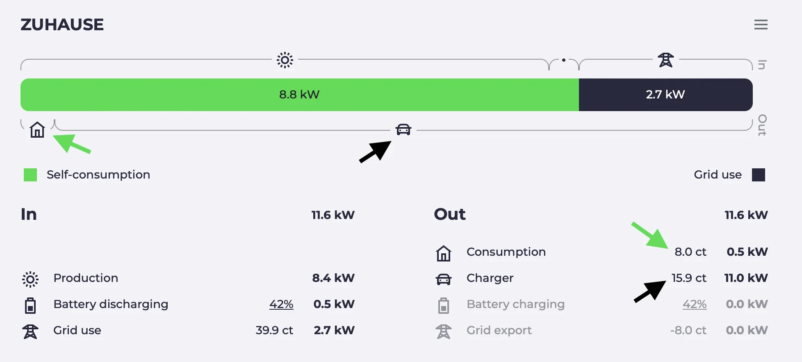

import Video from "../../../../src/components/Video";
import batterysettingsVideo from "./batterysettings.mp4";
import batterysettingsPoster from "./batterysettings.webp";
import chargingplanVideo from "./chargingplan.mp4";
import chargingplanPoster from "./chargingplan.webp";
import chargingsessionsVideo from "./chargingsessions.mp4";
import chargingsessionsPoster from "./chargingsessions.webp";
import dynamicpricesVideo from "./dynamicprices.mp4";
import dynamicpricesPoster from "./dynamicprices.webp";
import minsocVideo from "./minsoc.mp4";
import minsocPoster from "./minsoc.webp";
import sessionvaluesVideo from "./sessionvalues.mp4";
import sessionvaluesPoster from "./sessionvalues.webp";

Since the last blog post, a lot has happened. We have added many new features and fixed some bugs. In this article we will highlight some of the new features.

## Charging planner visualization

The charging planner has been around for a while at evcc.
You specify when your vehicle should have a desired state of charge and evcc finds the best time slots.
Since a few releases the algorithm is no longer a black box, as we visualize the planning result.

<Video src={chargingplanVideo} poster={chargingplanPoster} />

How does the algorithm work?

5. Surplus solar energy is prioritized
6. Times with cheap grid electricity (if [dynamic electricity tariff](/docs/reference/configuration/tariffs/#type-awattar) exists)
7. Times with clean grid electricity (if [CO₂ interface](/docs/reference/configuration/tariffs/#co2) is configured)
8. Time windows shortly before departure

**Outlook:** We are currently experimenting with PV forecast data from [Solcast](https://solcast.com/).
This allows the algorithm to make even better decisions.
For example, if the charging target is during the day, it may make sense not to charge the vehicle completely with cheap night-time electricity, but to leave room for surplus energy during the day.

## UI adjustable minimum charge

The minimum charge function has been around at evcc for ages.
It is helpful if you come home with only a few percent and want to make sure you always have enough range for an unexpected event.

Until now, it could only be set via the configuration file or via API.
Now you can also do this via the UI under **Plan** > **Arrival** > **Min. charge %**.

The settings are stored per vehicle and are retained even after a restart or update.

<Video src={minsocVideo} poster={minsocPoster} />

## Smart grid charging

When your own PV surplus is not enough, you can also use grid electricity when it is particularly cheap or clean.
If you click on the grid electricity price or CO₂ emissions in the energy flow diagram, the **Smart Grid Charging** dialog opens.

There you can set a threshold for the price or CO₂ emissions.
If this value is exceeded, evcc temporarily all PV mode loadpoints to fast charging.

<Video src={dynamicpricesVideo} poster={dynamicpricesPoster} />

Prerequisite for this function is that you have configured either a dynamic electricity price or a CO₂ integration.

Another small enhancement is that with most dynamic electricity prices you now have the option to correct the price values from the API with **percentage or fixed charges** (`charges` / `tax`).
Tibber and Octopus Energy (UK) already provide values including charges.
With Awattar, Nordpool Estonia and Energinet you can now add these.

By the way: If you have a dynamic electricity tariff that is not yet supported, but offers an API, please open a GitHub issue.

## Battery settings

A huge advantage that evcc has over other surplus charging solutions is the integration with the home battery.
The configuration value [`prioritySoc`](/docs/reference/configuration/site/#prioritysoc) can be used to control whether surplus solar energy should be **charged into the home battery or the vehicle** first.

In general, evcc tries to prevent the home battery from being unloaded into the vehicle battery in PV mode in order to avoid unnecessary conversion losses.
However, with the value [`bufferSoc`](/docs/reference/configuration/site/#buffersoc) you can consciously **dedicate a portion of the home battery to support charging**.

You can also set the charging process to start automatically as soon as the battery has reached a certain state of charge ([`bufferStartSoc`](/docs/reference/configuration/site/#bufferstartsoc)).
The automatic charging starts even if the sun is not shining.

<Video src={batterysettingsVideo} poster={batterysettingsPoster} />

## Solar %, price, CO₂ per charging session

We also have something for the friends of data analysis.
We now record the share of own solar energy (in %), the price (total and per kWh), the charging time and the average CO₂ emissions per charging session.
You can switch between these values directly at the charging session.

<Video src={sessionvaluesVideo} poster={sessionvaluesPoster} />

## New calculation of solar share

If you have noticed that the share of solar energy has decreased slightly since one of the last versions, this is due to our new calculation.
Until now, evcc has always distributed the ratio of grid and own energy evenly between house consumption and charging sessions.

We have now switched to a new model in which the house consumption first gets the green electricity and the remaining mix goes to the charging sessions.
Thanks to [@MarkusGH](https://github.com/MarkusGH) for the implementation.
You can find more details about the model [in the documentation](/docs/faq#savings-calculation).

## Charging sessions overview

The new values have of course also found their way into the overview of the charging sessions.
Depending on the configuration, prices and CO₂ emissions can now also be seen here.
In addition, we have completely redesigned the display and chosen a **compact table display on a monthly basis**.
It can be **filtered by charging point and vehicle**.

If you need even more flexibility here, you can of course also use the CSV export or get the raw data directly via InfluxDB or MQTT.

<Video src={chargingsessionsVideo} poster={chargingsessionsPoster} />

## Prioritization of charging points and vehicles

If you have multiple charging points, you can use the [`priority`](/docs/reference/configuration/loadpoints/#priority) setting to specify which one should be preferred.
You can also make the prioritization dependent on the detected vehicle or control it via API.
There is currently no configuration via the UI.

The prioritization function is also helpful if you use evcc to control other consumers, for example [a heating rod or heat pump connected via the plugin interface](https://github.com/evcc-io/evcc/pull/9393).
This way you can control them so that they only run when the car is not charging (enough).

## What's next?

Our [backlog](https://github.com/evcc-io/evcc/issues?q=is%3Aopen+is%3Aissue+label%3Abacklog) is well filled.
These are the next big topics we want to tackle:

**Config UI:** All prerequisites are now met.
Currently, vehicles can already be created in 🧪 experimental mode and the jump to network, PV or battery configuration is not far away.
There is still a lot to do here, but the light at the end of the tunnel is visible.

**Better planning:** As mentioned above, we are working on integrating good **PV forecasts** into the planning algorithm and the UI.
We also have a concept for supporting **multiple charging plans**.

**Mode revision:** evcc started as an application for PV surplus charging.
In the meantime, the interaction with the home battery is also playing a major role.
The topic of **grid-friendly charging** based on dynamic electricity tariffs or CO₂ emissions is also gaining momentum.
Therefore, we will revise our charging modes (currently PV and Min+PV) and create more flexibility here.

## Further new features

This was a flyover at high level and from an end user perspective.
Of course, there is also a lot of work going on under the hood.

- 🔌 Support for additional chargers from 22 new manufacturers
- 🌞🔋📟 Support for meter, PV and battery systems from 36 new manufacturers
- 🇬🇧 Website and documentation in English language. Thanks [duckfullstop](https://github.com/duckfullstop) & [carygravel](https://github.com/carygravel) 💚

If you want even more details, you are welcome to go through the [release notes](https://github.com/evcc-io/evcc/releases) of the last 49(!) releases since the beginning of the year.

**Thanks for your support of evcc!** 
evcc Core Team 
[@andig](https://github.com/andig), [@premultiply](https://github.com/premultiply) and [@naltatis](https://github.com/naltatis)
