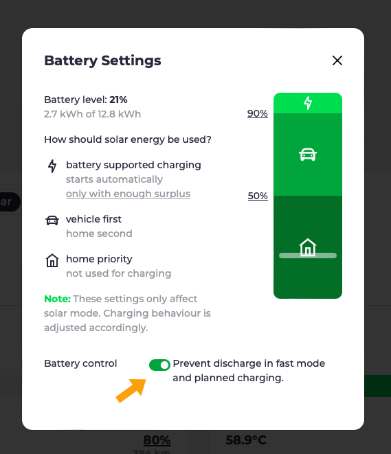
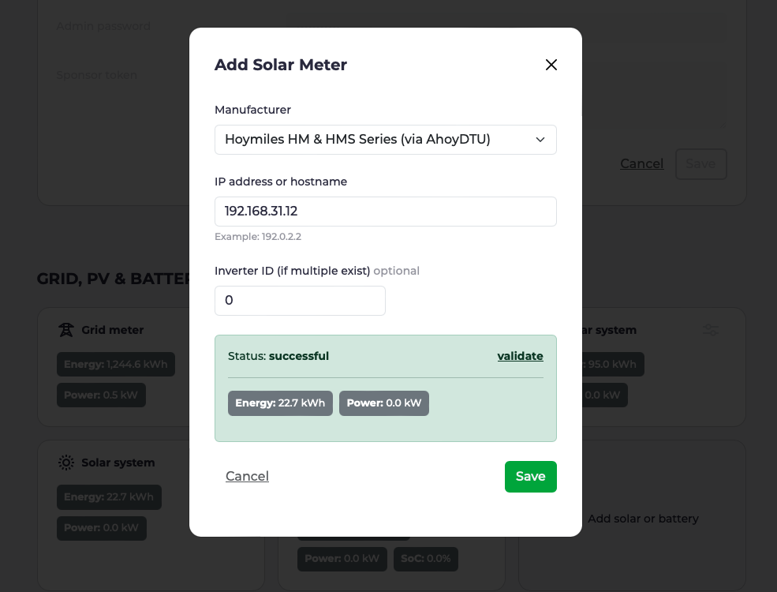

The days are getting longer and solar charging is starting to be fun again.
A good time for a short update on the latest developments at evcc.

## New Tesla Integration

In [October](https://www.notateslaapp.com/news/1653/tesla-creates-official-apis-for-third-party-services-to-start-charging-for-usage) Tesla introduced a new [official API](https://developer.tesla.com/docs/fleet-api).
In addition, they announced that the old, [unofficial API](https://www.teslaapi.io) will be shut down at the beginning of 2024.

### What does this mean for me?

To use the new API, you need to make two adjustments to the `evcc.yaml`:

1. **New template name:** Since the old API still works for some users today, we have decided to offer both implementations in parallel for the time being. Change the template name from `tesla` to `tesla-command` to use the new API.

2. **Generate new tokens:** With the new API it is now possible to generate the required `accessToken` and `refreshToken` directly in the browser.
   For this we have provided a small website at [tesla.evcc.io](https://tesla.evcc.io).

The configuration should then look like this:

```yaml
vehicles:
 - name: mytesla
   type: template
   template: tesla-command # change `tesla` to `tesla-command`
   accessToken: ... # generetad by tesla.evcc.io
   refreshToken:  ... # generetad by tesla.evcc.io
   ...
```

The tokens generated via [tesla.evcc.io](https://tesla.evcc.io) can **only be used with the official evcc builds** (stable & nightly).
The reason for this is that the tokens from Tesla's new Developer API are always bound to a 3rd-party app.

You can of course still build evcc yourself.
However, you will need your own Tesla Developer Account and have to generate the tokens yourself.
More details can be found in the corresponding [Pull Request](https://github.com/evcc-io/evcc/pull/10802).

### Privacy & Security

As with the old API, the communication for data retrieval (charge level, status, ...) and control (wake up) runs directly between your local evcc instance and the Tesla infrastructure.
Only the token generation runs once via our website.
Tokens are not stored, but only displayed to you in the browser.

For an extended control of the vehicle (start and stop charging directly at the vehicle) an additional signed request to Tesla is required.
Today this affects the users of a Tesla Wall Connector.
Since we cannot and may not pack our private 3rd party app key into the evcc binary, we will probably provide our [own service](https://github.com/evcc-io/evcc/pull/11893) for this application, which signs these requests and forwards them to Tesla.
But more on that in a later release.

### Costs

Tesla is currently offering the new API [free of charge](https://developer.tesla.com/docs/fleet-api#membership-tiers).
However, they have already announced that they will charge fees for using the API in the future.
Unfortunately, we do not yet know how open source friendly this model will be.

It's quite possible that we won't be able to offer token generation for free in the future.
We may link it to the existing evcc sponsorship model.
But more on that when there is new information from Tesla.

## Active Battery Control

A big new feature that comes with the Christmas release is the active battery control.
This function is no longer marked as experimental.
In addition, some new supported battery inverters have been added in recent weeks.
In the documentation you can now see [if your inverter is supported](/docs/devices/meters#features).

### Passive Control

Passive battery control has been available in evcc for some time now.
Here evcc regulates the solar charging so that the house battery is not discharged unintentionally.
Last year we introduced a [configuration dialog](/blog/2023/10/05/feature-highlights-10-2023#battery-settings) where you can set the priority between vehicle and house battery charging.
This model works very well for solar charging.
evcc knows the current state of charge of the house battery and only regulates the charging power of the vehicle.
However, this mechanism does not work for fast charging.
An active battery control is required for this.

### Prevent discharge during fast charging

By default, the house battery tries to cover the entire energy consumption of the house (including charging stations).
Depending on the current electricity price or expected PV generation, however, it may be desirable to obtain the energy for **fast vehicle charging** directly from the grid and not from the house battery.
This way the collected solar energy remains in the house battery and can be used for the house consumption at night, for example.

This is our first use case for active battery control.
If your inverter supports this feature, a corresponding option will appear in the battery settings dialog.



When this option is active, the house battery is put into a lock mode during fast charging.
In this time it is neither discharged nor charged.
This lock is also active during [scheduled charging](/blog/2023/10/05/feature-highlights-10-2023#charging-planner-visualization) and [smart grid charging](/blog/2023/10/05/feature-highlights-10-2023#smart-grid-charging).

### Next step: Charging the battery with cheap grid power

The next stage of development for active battery control is the possibility to charge the house battery with cheap grid power.
This is especially interesting for users of dynamic electricity tariffs on darker days.
The goal here is to fill the house battery with energy from the grid during low price phases and then use this energy in-house during high price phases.
We have already implemented the necessary hardware integrations.
Therefore we expect this feature to be available in one of the next releases.

## Update: Migration to browser configuration

evcc is a very flexible and powerful system for your own energy optimization.
Our biggest challenge is still to combine this flexibility with an easy setup process.
In the last months we have made great progress in the area of configuration.
Our goal is to enable a pure browser-based commissioning, without `evcc.yaml`.

If you have activated the option "Show experimental UI features" in the settings dialog, you can see our current development progress under "🧪 Device Configuration".
Currently you can add and edit vehicles, grid meters, PV and battery systems there.
Charging stations and tariffs will follow in the next iteration.
Even though this is still a "work in progress", we look forward to your feedback.



## Small improvements and bug fixes

As always, this release also contains a number of smaller improvements and bug fixes.
For more details, have a look at the [Release Notes](https://github.com/evcc-io/evcc/releases/tag/0.124.0).

All the best<br/>
your evcc core team
