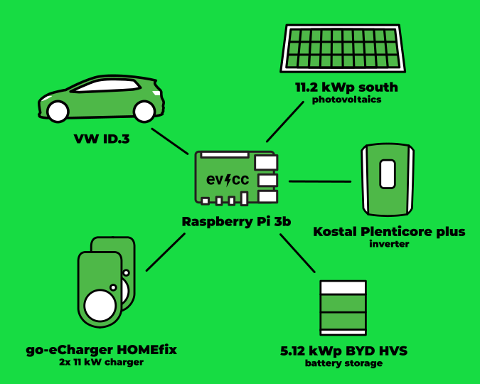
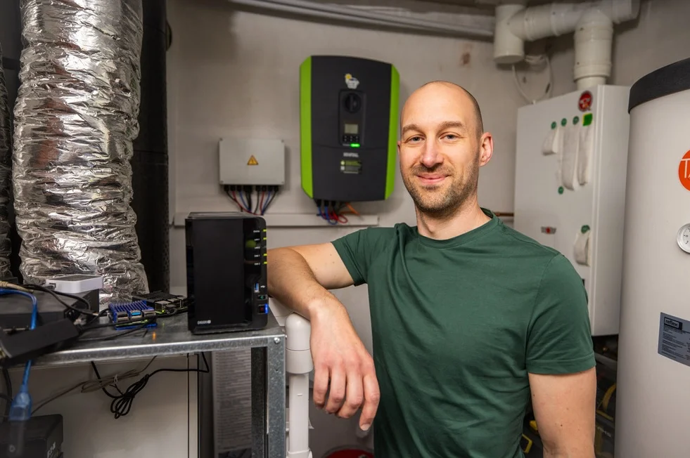
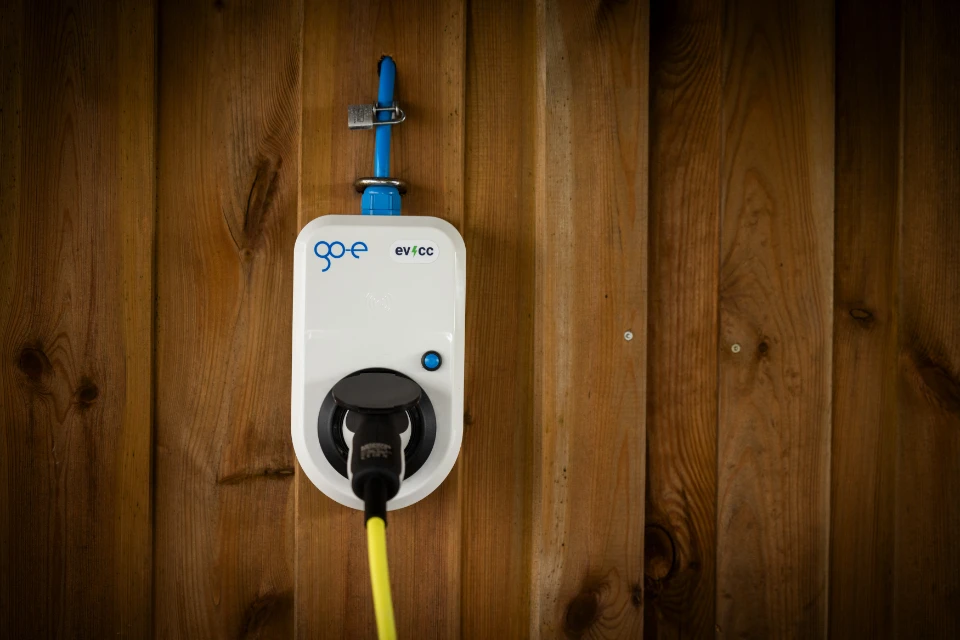

A couple of weeks ago, [Detlef Heese](https://hee.se) from Osnabrück contacted us.
He is a renowned photographer, electric car driver and owns a photovoltaic system.
He offered to support the evcc project and provide us with professional photos.
Therefore, at the end of last year, we started a [call on GitHub](https://github.com/evcc-io/evcc/discussions/10285) to find interested users who would like to present themselves and their evcc setup for a community portrait.

## The path to electric mobility
 
**Michael:** Hi Arne, thank you for taking the time for this interview.
Can you tell us a bit about yourself and how you got into electric mobility?

**Arne:** Hi Michael, I'm Arne and I live in the small town of Gifhorn.
I live there with my wife and two children in a single-family house.
Due to the German wallbox subsidy in 2021, we started to get interested in electric mobility.
Back then, we had two EV chargers installed cost-effectively and with a little DIY.
True to the motto: "Having is better than needing!"
Even before the wallboxes were installed, we had already decided to replace one of our two combustion engine cars with an electric vehicle.
Certainly the possibility of subsidies also played an important role.

Shortly afterward, we ordered an ID.3 Pure, which was delivered in the same year.
And while we were waiting for the ID.3, we rounded off the package and also ordered an 11.2 kWp PV system, which was then installed at the beginning of 2022.
Last year, we added a small BYD storage system to the PV system, which was mainly purchased for household consumption and is only used to a limited extent for charging the electric car.

**Michael:** That sounds like a great set up.
How did you come across evcc and the topic of PV surplus charging?

**Arne:** Even before the PV system was installed, we knew that we wanted a way to charge with as much electricity from our own roof as possible.
At first, I had the idea to use my own small script to start charging when enough surplus is available.
After a bit of research, I came across the fact that there already is something like this: evcc.

## Technical insights

**Michael:** Can you give us some technical details about your setup?

**Arne:** Certainly, here are the most important technical details:

| Component     | Details                                            |
| -------------- | -------------------------------------------------- |
| **Auto**       | VW ID.3 pure                                       |
| **Charger**  | 2x go-eCharger HOMEfix 11 kW                       |
| **Inverter** | Kostal Plenticore plus 10 Kostal Smart Energy Meter |
| **Solar modules**   | 28x Trina Vertex S 400Wp (total 11.2 kWp) nearly perfect south orientation on a 45° roof |
| **Battery storage**      | BYD HVS 5.1 (5.12 kWh)                          |
| **Energy management**    | evcc on a Raspberry Pi 3b                      |

In addition, I also operate an ioBroker instance, which is not involved in the charging control.

## What do you like about evcc?

**Michael:** This looks like a well-rounded setup. Why did you decide to use evcc and what do you like about the project?

**Arne:** I did not expect that we could actually increase our self-sufficiency so much with evcc.
We are currently at a self-sufficiency rate of over 80% (as of early August).
It just fits perfectly with our situation: we partly work from home, and have an additional car in the household, mostly used for short distances.
We can leave our electric car standing at home during the day so it can solar charge.
The car is simply always connected to the EV charger at home and thanks to the automatic detection, evcc starts charging as soon as enough surplus is available.
As a result, the car is always charged and ready for use.
In everyday life, we hardly have to worry about the charge level.
Thanks to the minimum charge feature there is always enough energy during the winter months for daily trips.
It couldn't be easier and more convenient.
This certainly made it easier for my wife to switch to electric mobility.

**Michael:** That sounds really great! Thank you for sharing your experiences with us.

---

Also thanks to Detlef for the great photos. We look forward to sharing more stories from our community in future blog posts.

If you are interested in presenting your evcc setup in a community portrait, feel free to leave your details [here in the form](https://airtable.com/appDI3xIiev1DOpMY/shrW1zGH26KElfZOK).
Especially if you don't live in or near Germany.