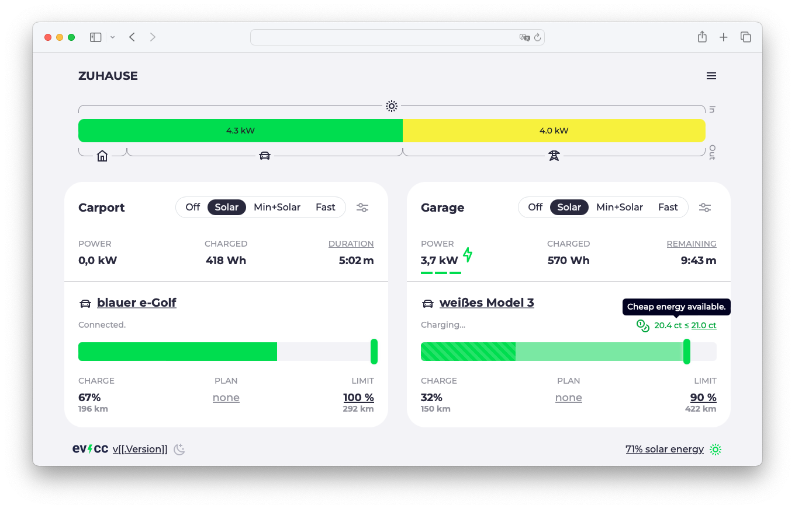

:::warning work in progress
This page needs to be translated from German to English.
:::

Heute ist Version 0.130 von evcc erschienen.
Da der letzte "Release" Blogartikel schon etwas her ist, ist hier ein Überblick über die Highlights der letzten Releases.

## Lastmanagement & §14a EnWG

Vor ein paar Releases haben wir Lastmanagement als experimentelles Feature eingeführt.
Damit ist es möglich, eine Leistungs- und/oder Stromgrenze für das gesamte Haus festzulegen.
evcc regelt die Wallboxen so, dass diese Grenzen nicht überschritten werden.
Für komplexere Installationen gibt es auch die Möglichkeit, Unterschaltkreise mit eigenen Grenzen und Zählern zu konfigurieren.
Mehr dazu findest du in der [Dokumentation](/docs/features/loadmanagement).

### Steuerbare Verbraucher

In Deutschland ist §14a des Energiewirtschaftsgesetzes (EnWG) derzeit ein prominentes Thema.
Hier geht es darum, dass der Netzbetreiber bei hoher Netzauslastung große Verbraucher, wie zum Beispiel Wallboxen, herunterregeln kann.
Entscheidet sich der Kunde für diese Regelung profitiert er im Gegenzug von reduzierten Netzentgelten.

Spannend ist hier die technische Umsetzung.
Der Netzbetreiber greift nicht direkt auf die Wallbox zu, sondern kommuniziert das Signal zum Herunterregeln über das Smart Meter Gateway (SMGW).
Das Energiemanagementsystem im Haus muss dann die relevanten Verbraucher herunterregeln.

evcc ist in der Lage diese Anforderung (Dimming) zu erfüllen, und zwar, für alle bereits heute unterstützten Wallboxen und das ohne sie, bspw. über einen potentialfreien Kontakt, einfach abschalten zu müssen.
Die Ladepunkte können in dem Zeitraum weiter mit ihrer Mindestleistung (z.B. 4,1 kW) betrieben werden.
Damit kann jede von evcc unterstützte Wallbox in diesem Szenario eingesetzt werden und benötigt selbst keine spezielle Unterstützung für eine Kommunikation mit SMGW oder Steuerbox.

### Funktionsweise

Kommt es zu einer Überlastung im Netz, sendet der Netzbetreiber ein Signal an das SMGW.
Das SMGW selbst bietet allerdings keine sinnvolle Möglichkeit mit dem Heimnetzwerk zu kommunizieren.
Dies findet über eine sogenannte Steuerbox statt, die hinter dem SMGW angeschlossen ist.
Diese zertifizierte Box leitet das Signal über EEBus an die jeweiligen Geräte weiter.
evcc hat die EEBus Schnittstelle zur Steuerbox implementiert.
Kommt ein Reduzierungssignal rein, wird evcc aktiv und regelt die Wallboxen entsprechend herunter.

Ein alternativer Weg zu EEBus ist die Kommunikation über einen einfachen Schaltkontakt der Steuerbox.
Dieser kann dann bspw. über einen GPIO-Pin an evcc angeschlossen werden.
Empfängt die Steuerbox ein Reduzierungssignal, wird der Kontakt geschlossen, evcc erkennt dies und regelt die Wallboxen herunter.

Diese, deutlich simplere Kontaktlösung, lässt sich auch mit bereits vorhandenen (Funk)Rundsteuerempfängern (FRSE) einsetzen.
Im Rahmen des §14a EnWG sind diese nicht vorgesehen, werden aber als Übergangslösung gedultet.

In der Praxis fehlt es für die Nutzung dieses Features noch an im Feld verbauten Steuerboxen.
Diese werden in den kommenden Monaten ausgerollt.
Falls du schon ein solches Gerät hast, dann melde dich gerne bei uns.

## Hausbatterie mit Netzstrom laden

Im letzten Release-Blogartikel haben wir mit "Entladesperre beim Schnellladen" die erste Funktion vorgestellt, bei der evcc den Hausspeicher aktiv steuert.
In Version 0.130 haben wir die Batteriesteuerung weiter ausgebaut.
Jetzt gibt es auch die Möglichkeit, den Hausspeicher gezielt mit Netzstrom zu laden.

Diese experimentelle Funktion ist verfügbar, wenn dein Wechselrichter die aktive Batteriesteuerung unterstützt  (siehe Dokumentation) und du einen dynamischen Stromtarif hast.
In diesem Fall kannst du eine Preisgrenze festlegen.
Wird diese unterschritten, lädt evcc den Hausspeicher mit Netzstrom.

Diese Funktion kann vor allem in den Wintermonaten praktisch sein.
Ist über Tag wenig Sonnenstrom zu erwarten, kann der Speicher bspw. nachts mit günstigem Netzstrom geladen werden.
Somit kannst du Zeiträume mit hohem Strompreisen überbrücken.

Die aktuelle Umsetzung über ein fixes Preislimit ist bewusst simpel und nur der erste Schritt in das Thema.
Möchtest du nicht regelmäßig über die Web UI das Limit prüfen und anpassen kannst du dir, darauf aufbauend, über die entsprechende API heute schon smartere Lösungen (bspw. zeit- oder prognosebasiert) bauen.

## Elli Charger: Status Update

Eine relativ verbreitete Wallbox ist der Elli Charger aus dem VW-Konzern.
Dieser wird auch unter den Namen "VW ID. Charger", "Skoda iV Charger", "Cupra Charger" oder "Audi Wallbox" verkauft und kommt, je nach Marke, in unterschiedlichen Varianten die mit "Connect", "plus", "Pro", "Connect+" oder "pro" enden.

Die Unterstützung dieser Wallbox war über die letzten Jahre leider kein Quell der Freude.
[DerAndereAndi](https://github.com/DerAndereAndi) hat hier jede Menge Leidenschaft und Zeit investiert.
Vielen Dank dafür 🙌!
Die Qualität der Firmware ist relativ schlecht und es gibt viele Bugs.
Das ist bei Software und neuen Produkten erst einmal nicht völlig ungewöhnlich.
Problematisch ist allerdings, dass dieses Produkt schon mehrere Jahre am Markt ist und der Hersteller keinerlei ernsthafte Anstrengungen zeigt diese Bugs mit Updates zu beheben.

In [diesem Post sind die konkreten technischen Probleme](https://github.com/evcc-io/evcc/discussions/15367), die beim Steuern und Auslesen der Wallbox auftreten, zusammengefasst.
Eine permanente Fehlerquelle waren und sind die unzuverlässigen Zählerdaten.
Im aktuellen Release haben wir daher die Unterstützung für den eingebauten Zähler entfernt und empfehlen allen Besitzern dieser Wallbox einen vorgeschalteten, separaten Zähler zu verwenden.

Wenn du planst eine Wallbox zu kaufen, die bspw. mit evcc steuerbar sein soll, können wir von diesen Produkten leider nur abraten.
Elli hat inzwischen ein überarbeitetes Produkt, den [ElliCharger 2](https://www.elli.eco/de/privatkunden/produkte/wallbox) angekündigt.
Nach Allem, was wir bislang wissen, handelt es sich dabei um ein deutlich ausgereifteres Gerät.
Das ändert allerdings nichts daran, dass die Wallboxen der ersten Generation, die auch heute noch aktiv verkauft werden, in puncto Schnittstellenqualität absolut indiskutabel sind.

Solltest du so eine Wallbox besitzen und von oben beschrieben Problemen betroffen sein, empfehlen wir dir dich an den Elli Kundensupport zu wenden.
Wir haben zwar wenig Hoffnung, das es doch noch Softwareupdates geben wird.
Allerdings finden wir das Vorgehen, eine technisch gute Hardware durch eine Neue zu ersetzen, nur weil die Software nicht mehr gepflegt wird, nicht wirklich nachhaltig.

Wir würden uns auch über einen direkten technischen Kontakt zu Elli freuen.
Aktuell sind unsere Versuche allerdings alle ins Leere gelaufen.

## Status am Ladepunkt

Eine visuelle Änderung, die kürzlich Einzug in evcc gehalten hat, ist die überarbeitung der Statusanzeige.
Bislang wurde hier immer ein Text wie "Überschuss verfügbar, starte in 1:22 min..." oder "Ladeplan aktiv. Starte um 23:12 Uhr." angezeigt.

Mit der wachsenden Anzahl von Funktionen ist diese Anzeige etwas unflexibel geworden und parallele Zustände, wie PV-Timer, Ladeplan und gesetzte Preisgrenze, konnten nicht gleichzeitig angezeigt werden.
Daher haben wir die Anzeige überarbeitet.
Der Zustand des Ladepunkts wird weiter als kurzer Text ("Verbunden", "Ladevorgang aktiv", ...) angezeigt.
Weitere Informationen wie PV-Timer, Ladeplan, Preisgrenze, Klimatisierung oder das Fahrzeuglimit werden jetzt, sofern relevant, als Icon mit erklärendem Tooltip angezeigt.
Dadurch wir die Anzeige übersichtlicher und flexibler.

Hier eine Übersicht der neuen Icons und Tooltips:

## OCPP: Stabilität, Funktionen & Sponsoring

Die Möglichkeit evcc als OCPP-Server zu betreiben gibt es schon relativ lange.
In den letzten Monaten haben wir das Thema wieder in den Fokus genommen und [viel Arbeit](https://github.com/evcc-io/evcc/pulls?q=is%3Apr+is%3Amerged+sort%3Aupdated-desc+ocpp) in die Stabilität und den Funktionsumfang unserer Implementierung gesteckt.
So waren bisher für einige Wallboxen spezielle Konfigurationsparameter in der Einrichtung erforderlich.
Diese sind nun, bis auf ganz wenige Ausnahmen, alle obsolet.
Funktionen wie Zählerdaten, Abfrageintervalle, Ping- und Heatbeatsignale werden jetzt automatisch konfiguriert.
Da es auch weiterhin Wallboxen gibt, die sich nicht zu 100% an den Standard halten, gibt es einige gerätespezifische Sonderlocken in der Implementierung.
Diese sind für den Nutzer nun transparent.

### RFID und Autorisierung

Die größte Änderung bzw. Neuerung aus Nutzersicht ist standardkonforme Unterstützung von Autorisierung.
Damit ist jetzt auch die [Fahrzeugerkennung via RFID](/docs/features/vehicle#erkennung-via-rfid) möglich.
Ein sofortiges Laden ohne Autorisierung geht natürlich weiterhin.
Dafür muss das jeweilige Feature in der Wallbox ("Autostart", "Freies Laden", "Free Vending", oder ähnlich) aktiviert sein.
Sollte deine Wallbox diese Einstellung nicht haben (was eher selten ist), kannst du über den `remotestart: true` Parameter auch das bisherige evcc Verhalten wiederherstellen.
Dann startet evcc die Ladung auch ohne Freigabe vom Gerät.

### Viele Wallboxen getestet

Wir haben die Funktionen an vielen unterschiedlichen Geräten erfolgreich getestet und in der Dokumentation [diese Wallboxen](/docs/devices/chargers) hinzugefügt.
Die Liste ist aber sicher nicht vollständig.
Sollte deine OCPP-Wallbox nicht dabei sein, aber sauber mit evcc funktionieren, dann freuen wir uns [über eine Rückmeldung](https://github.com/evcc-io/evcc/issues/new/choose) damit wir die Dokumentation für andere Nutzer ergänzen können.
Sollte deine Wallbox wider Erwarten nicht funktionieren interessiert uns das natürlich auch 😉.

### Sponsoring erforderlich

Mit der Version 0.130 wird die OCPP-Unterstützung zu einem Feature für das ein 💚 Sponsoring erforderlich ist.
Uns ist bewusst, dass diese Änderung für Nutzer, die evcc bisher kostenlos genutzt haben vielleicht unerfreulich ist.
Wir haben uns dennoch dazu entschieden, diese Änderung vorzunehmen.
Dafür gibt es vor allem zwei Gründe:

1. Bei vielen neuen, kommerziellen Wallboxen ist OCPP zum Kommunikationsprotokoll der Wahl geworden und oft auch die einzige Steuerschnittstelle. Dementsprechend halten wir es, den Nutzern anderer Wallboxen gegenüber, für fair, dass auch die OCPP-Unterstützung ein Sponsoring erfordert und damit das gesamte Projekt unterstützt wird.

2. Wie oben beschrieben, haben wir sehr viel Energie und Zeit in die Verbesserung der Implementierung gesteckt und würden das auch gerne weiterhin tun um die Stabilität und Funktionalität zu gewährleisten.  Hier hilft uns eure finanzielle Unterstützung die nötigen Ressourcen dafür aufzubringen.

Wir hoffen, ihr habt Verständnis für diese Änderung.

## Weitere Verbesserungen

- **Log UI:** Logs können jetzt direkt in der Web UI eingesehen, gefiltert und exportiert werden.
- **Sprachen:** Inzwischen unterstützt evcc 27 Sprachen. Ein großes Dankeschön an alle Übersetzer.
- **Config UI:** Hier sind in den letzten Releases viele Funktionen, die für die Ablösung der `evcc.yaml` notwendig sind, hinzugekommen. Mehr dazu in einem späteren Blogartikel.
- **Bugfixes:** Wie immer haben wir viele Fehler behoben und die Stabilität verbessert.
- **Neue Geräte:** Wir bauen die Liste der unterstützten Wallboxen, Wechselrichter, Zähler und Tarife stetig aus.

Für mehr Details kannst du natürlich auch immer in die [Changelogs der Releases](https://github.com/evcc-io/evcc/releases) und die darin verlinkten Pull Requests und Diskussionen schauen.

## Neue Sponsoren

An dieser Stelle möchten wir uns auch noch mal bei euch allen, die das Projekt durch Sponsoring unterstützen, bedanken.
An einem Open-Source Projekt arbeiten zu können, das zum allergrößten Teil direkt von der Community und den Nutzern finanziert wird, ist eine ziemlich coole Nummer.

Auch in der Unternehmenswelt stellen wir fest, dass evcc inzwischen ernst genommen wird.
Das drückt sich dadurch aus, dass Hersteller teilweise direkt Kontakt zu uns suchen um eine gute Integration ihrer Geräte zu gewährleisten.

Als finanzielle Firmensponsoren konnten wir [CUBOS](https://www.cubos.com), ein Unternehmen aus dem Bereich Photovoltaik und gewerbliche Ladeinfrastruktur, [lekker Energie](https://www.lekker.de), ein Energieversorger aus Berlin und die Firma [Victron Energy](https://www.victronenergy.com), ein Hersteller von modularen Wechselrichtern und Ladestationen, gewinnen.

**Viele Grüße** 
Das evcc Team 
Michael, Andi & Uli