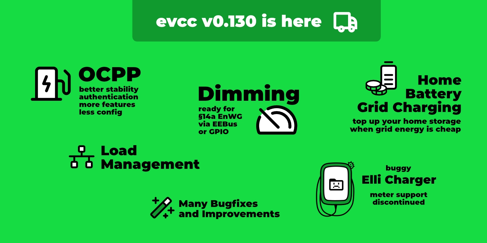
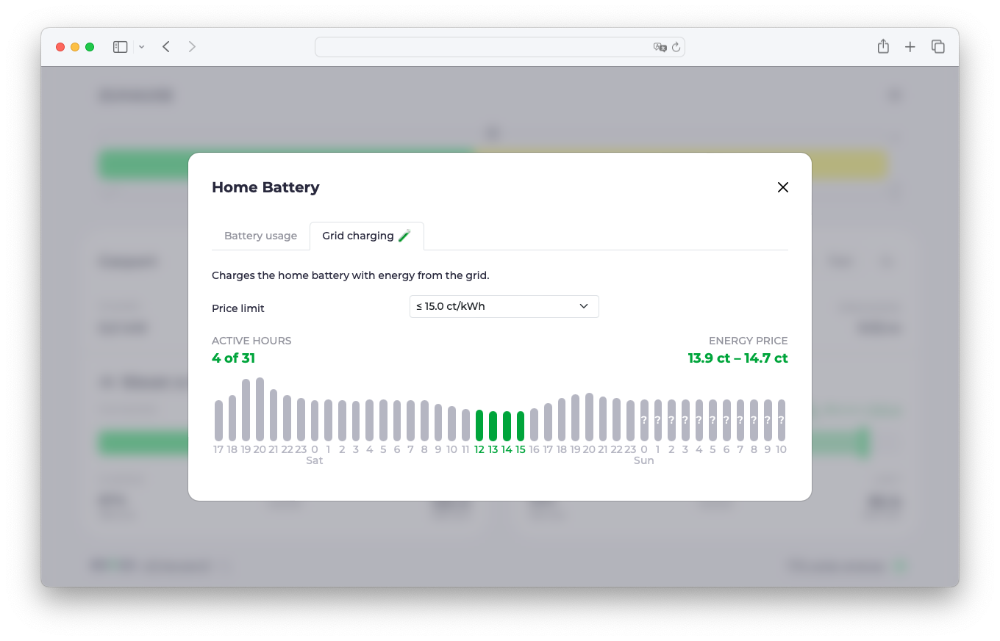

Today, [version 0.130](https://github.com/evcc-io/evcc/releases) of evcc was released.
Since it's been a while since the last release blog post, here's an overview of the highlights from the recent releases.

{/* truncate */}

## Load Management & § 14a EnWG

A few releases ago, we introduced load management as an experimental feature.
This allows you to set a power and/or current limit for the entire house.
evcc controls the EV chargers so that these limits are not exceeded.
For more complex installations, there is also the possibility to configure sub-circuits with their own limits and meters.
You can find more information in the [documentation](/docs/features/loadmanagement).

### Controlleable Consumers

In Germany § 14a of the Energiewirtschaftsgesetzes (EnWG) is currently a prominent topic.
It allows grid operators to reduce the power consumption of large consumers, such as EV chargers, in case of high grid load.
If the customer agrees to this regulation, they benefit from reduced grid fees.

The technical implementation is interesting here.
The grid operator does not directly access the EV charger, but communicates the signal to reduce the power via the Smart Meter Gateway (SMGW).
The energy management system in the house then has to reduce the relevant consumers.

With evcc you can meet this requirement (dimming) for all wallboxes today without having to switch them off, for example via a potential-free contact.
The charge points can continue to operate at their minimum power (e.g. 4.1 kW) during this period.
This means that any wallbox supported by evcc can be used in this scenario
No need to buy a new EV charger with special support for communication with SMGW or Steuerbox.

### How it works

In case of a grid overload, the grid operator sends a signal to the SMGW.
The SMGW itself does not offer a meaningful way to communicate with the home network.
This is done via a so-called Steuerbox that is connected behind the SMGW.
This certified box forwards the signal to the respective devices via EEBus.
evcc has implemented the EEBus interface to the Steuerbox.
When a reduction signal comes in, evcc reacts and regulates the EV chargers accordingly.

An alternative way to EEBus is communication via a simple switching contact of the Steuerbox.
This can then be connected to evcc via a GPIO pin, for example.
If the Steuerbox receives a reduction signal, the contact is closed, evcc detects this and reduces the maximum power of the wallboxes.

This simpler contact solution can also be used with existing (Funk)Rundsteuerempfängern (FRSE).
These are not part of § 14a EnWG, but are tolerated as a transitional solution.

In practice, the use of this feature is still lacking Steuerboxen installed in the field.
These will be rolled out in the coming months.
If you already have such a device, feel free to contact us.

### Grid Charging of Home Battery

This is an experimental feature and is available if your inverter supports active battery control ([see documentation](/docs/devices/meters)) and you have a dynamic electricity tariff.
In this case, you can set a price limit.
If this is undercut, evcc charges the home battery with grid power.

This feature can be especially useful in the winter months.
If little solar power is expected during the day, the storage can be charged with cheap grid power at night.
This way you can bridge periods with high electricity prices.

In the current implementation, the fixed price limit is deliberately simple and only the first step into the topic.
If you don't want to regularly check and adjust the limit via the web UI, you can already build smarter solutions (e.g. time- or forecast-based) based on the introduced API.

## Elli Charger: Status Update

A relatively popular EV charger is the Elli Charger from the VW Group.
It is also sold under the names "VW ID. Charger", "Skoda iV Charger", "Cupra Charger" or "Audi Wallbox" and comes in different variants depending on the brand, which end with "Connect", "plus", "Pro", "Connect+" or "pro" ([see overview](https://github.com/evcc-io/evcc/pull/7757#issuecomment-1529477695)).

Supporting this wallbox has unfortunately not been a source of joy over the past few years.
[DerAndereAndi](https://github.com/DerAndereAndi) has invested a lot of passion and time here.
Thank you for that 🙌!
The quality of the firmware is relatively poor and there are many bugs.
This is not entirely unusual for software and new products.
However, the problem is that this product has been on the market for several years and the manufacturer shows no serious efforts to fix these bugs with updates.

[This post](https://github.com/evcc-io/evcc/discussions/15367) summarizes the technical problems that occur when controlling and reading the wallbox.
A permanent source of errors were and are the unreliable meter data.
In the current release, we have therefore removed support for the built-in meter and recommend all owners of this wallbox to use a separate meter upstream.

If you're planning to buy a wallbox that should be controllable with evcc, we can only advise against these devices.
Elli has announced a next generation product, the [ElliCharger 2](https://www.elli.eco/de/privatkunden/produkte/wallbox).
From what we know so far, this is a much more mature device.
However, this does not change the fact that the first generation wallboxes, which are still actively sold today, are absolutely unacceptable in terms of interface software quality.

If you own such a wallbox and are affected by the problems described above, we recommend contacting Elli customer support.
We have little hope that there will be software updates.
However, we think their approach of replacing technically good hardware with a newer one just because the software is no longer maintained is not really sustainable.

We would also appreciate direct technical contact with Elli.
So far, however, all our attempts have been unsuccessful.

## Status indicators at the charge point

A visual change that has recently been introduced to evcc is the revision of the status texts.
Until now, a messages like "Surplus available. Start in 1:22 min..." or "Charging plan active. Start at 23:12." were shown above the charge level bar.

With the growing number of functions, this display has become somewhat inflexible and parallel states, such as PV timer, charging plan, and price limit, could not be displayed simultaneously.
Therefore, we have revised the area.
The charger state is still displayed as a short text ("Connected", "Charging", ...).
Additional information such as PV timer, charging plan, price limit, air conditioning, or the in-vehicle limit are now displayed as an icon with an explanatory tooltip if relevant.

Here is an overview of the new icons and tooltips:

## OCPP: Stability, Features & Sponsoring

OCPP-suppport has been a feature of evcc for a long time.
In recent months, we have focused on this topic again and [put a lot of work](https://github.com/evcc-io/evcc/pulls?q=is%3Apr+is%3Amerged+sort%3Aupdated-desc+ocpp) into the stability and functionality of our implementation.
Until now, special configuration parameters were required for some wallboxes during setup.
These are now, with very few exceptions, all obsolete.
Functions such as meter data, query intervals, ping and heartbeat signals are now configured automatically.
Since there are still wallboxes that do not fully comply with the standard, we had to implement some device-specific special handling.
These are now transparent to the user.

### RFID and Authorization

The biggest change or innovation from the user's point of view is the standard-compliant support of authorization.
This now also enables [vehicle recognition via RFID](/docs/features/vehicle#detection-via-rfid).
Immediate charging without authorization is still possible.
For this, the respective feature in the EV charger ("Autostart", "Freies Laden", "Free Vending", or similar) must be activated.
If your wallbox does not have this setting (which is rather rare), you can also restore the previous evcc behavior via the `remotestart: true` parameter.
Then evcc starts the charging without approval from the device.

### Many Wallboxes Tested

We've successfully tested the implementation with a variety of devices and added them to the [documentation](/docs/devices/chargers).
The list is certainly not complete.
If your OCPP wallbox is not in there, but works well with evcc, we'd love to [hear from you](https://github.com/evcc-io/evcc/issues/new/choose) so we can add it to the documentation for other users.
If your charger doesn't work as expected, we'd like to know that too 😉.

### Sponsoring required

With version 0.130, OCPP support becomes a feature that requires 💚 sponsoring.
We are aware that this change may be unpleasant for users who have used evcc for free so far.
Nevertheless, we have decided to make this change.
There are mainly two reasons for this:

1. In many new, commercial wallboxes, OCPP has become the communication protocol of choice and often the only control interface. That's why we think it's fair, especially for users of other wallboxes, that OCPP support requires sponsoring and thus supports the entire project.

2. As described above, we have put a lot of energy and time into improving the implementation and would like to continue to do so to ensure stability and functionality. Your financial support helps us to provide the necessary resources for this.

We hope you understand this change.

## Further Improvements

- **Log UI:** Logs can now be viewed, filtered, and exported directly in the web UI.
- **Languages:** evcc now supports 27 languages. A big thank you to all translators.
- **Config UI:** In the last few releases, many features necessary for replacing the `evcc.yaml` have been added. More on this in a later blog post.
- **Bugfixes:** As always, we have fixed many bugs and improved stability.
- **New devices:** We are constantly expanding the list of supported wallboxes, inverters, meters, and tariffs.

For more details, you can always check the [changelogs of the releases](https://github.com/evcc-io/evcc/releases) and the pull requests and discussions linked there.

## New Sponsors

We'd also like to thank all of you who support the project through sponsoring.
Being able to work on an open-source project that is funded almost entirely by the community and users is pretty cool.

As we can see, evcc is now being taken seriously in the corporate world as well.
This is reflected in the fact that manufacturers sometimes contact us directly to ensure good integration of their devices.

We were able to win [CUBOS](https://www.cubos.com), a company in the field of photovoltaics and commercial charging infrastructure, [lekker Energie](https://www.lekker.de), an energy supplier from Berlin, and [Victron Energy](https://www.victronenergy.com), a manufacturer of open and modular inverter, battery, and charging systems, as financial corporate sponsors.

**Happy charging!** 
the evcc team 
Michael, Andi & Uli
