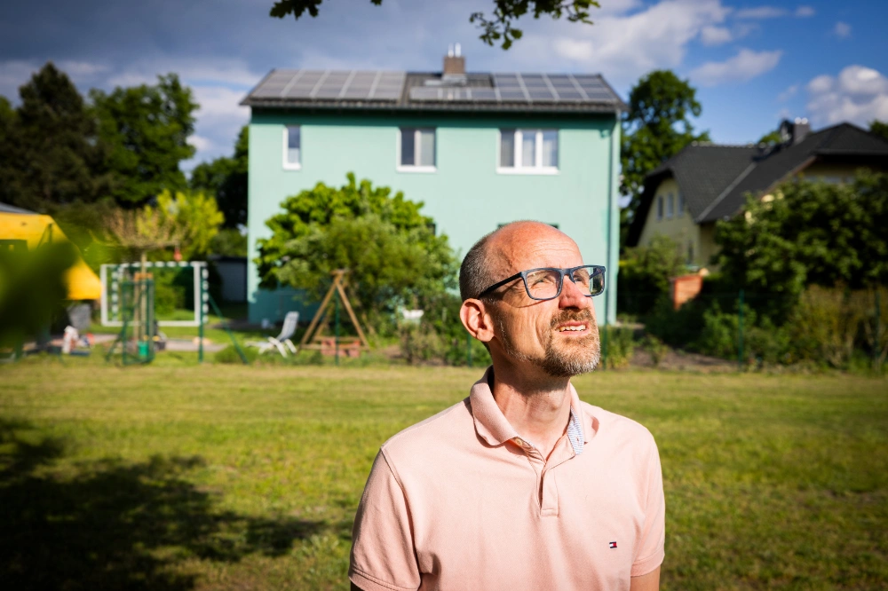
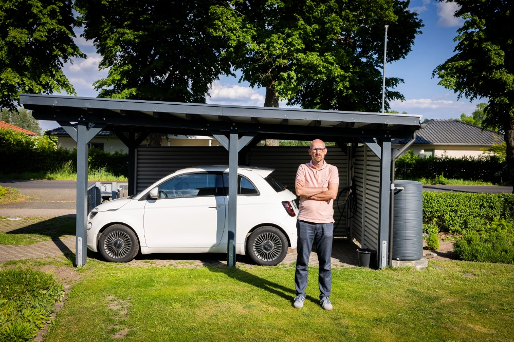
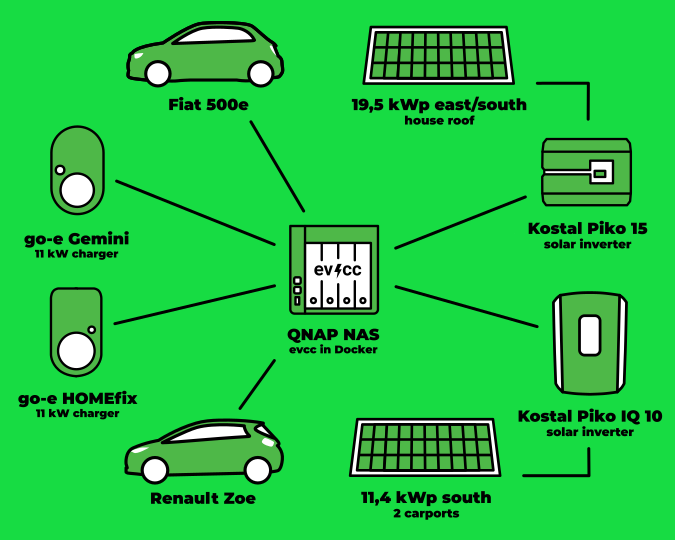
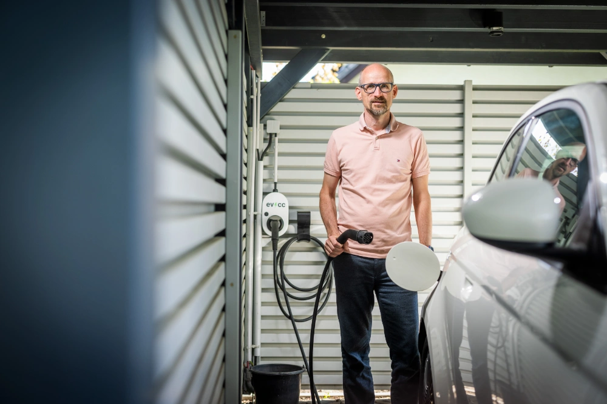

This is the second post in our series of community portraits.
Photographer [Detlef](https://hee.se) visited Christian from Trebbin this time and took some great photos.

{/* truncate */}

## Trebbin: A house, three generations

**Michael:** Hello Christian, thank you for taking the time.
Can you tell us a bit about yourself, your family and your living situation?

**Christian:** Hello Michael, I'm Christian.
I live with my wife, our two children and my mother-in-law in Trebbin in a house that was originally built in 1980.
We extended and energetically renovated it in 2009 to create more space and reduce energy consumption.
We live here as a three-generation family and have done a lot recently towards electric mobility and our own energy production.

**Michael:** Can you tell us more about your journey to electric mobility?

**Christian:** Our journey into electric mobility began in 2019 when I had to commute to work by car due to a change of employer.
That's when we decided on a used Smart ED.
Since everyone always wanted to drive the Smart, we replaced our combustion engine car with a Renault Zoe, which was delivered in November 2020.
Since then, we've been completely electric.

**Michael:** Funny, I've heard that effect before: that the electric second car becomes the family's favorite and the combustion engine car is left standing.
And how does it look today?
Is the Smart still in use?

**Christian:** No, the Smart has found a new owner.
Earlier this year, we sold it and replaced it with a Fiat 500e Icon.
So now we drive the Fiat and the Renault Zoe.
Both cars are charged with electricity from our own photovoltaic systems.

## On the road with small electric cars

**Michael:** How do you use the electric cars in your daily life?
What role does your charging infrastructure play?

**Christian:** Our daily mobility is well organized.
My wife commutes to Berlin by train for work, while I use one of the cars for my trips.
The children's hobbies involve a lot more driving, so we are quite a lot on the road with the cars, but mostly with solar power.
With the two go-e chargers installed at the carports, we can charge at any time and ensure that the cars are ready for use.
We simply plug in the cars after the trip, and when we need them, they are charged again.
The chargers are powered by the PV systems, so we can use the electricity directly from the roof.
The first PV system on the house roof has 19.47 kWp and the second system on the carports has 11.4 kWp.
The systems are dimensioned so that we can produce the electricity for the cars and the household largely ourselves.

**Michael:** How did evcc integrate into this setup?

**Christian:** With the first PV system came the desire to charge only with PV electricity in an automated way.
evcc was the only project that offered the possibility of running in a Docker container.
This meant that I didn't have to buy new hardware, as there was already a NAS running for backup and data storage in the household.
For us, it was particularly important to keep an eye on the power consumption and charging status of the cars.
In use, the very high WAF (Woman Acceptance Factor) in the family proved to be an advantage.
So my wife uses evcc very intensively, and my mother-in-law also likes to check if there is enough power available.
Thanks to evcc, we manage to draw about 85% of the required electricity for the cars from our own PV system on average over the year.
This has increased our energy self-sufficiency to 73%, all without the use of a home storage system.

## High self-sufficiency without a home battery

**Michael:** 73% energy self-sufficiency without a home storage system is really impressive.
That's a value many dream of.
How did you manage that?

**Christian:** The large dimensioning of the PV system in combination with the east/west orientation helped us.
This way, we produce the energy distributed over the day.
This is particularly useful for us, as we can charge the cars during the day.
evcc then takes care of the control of the charging processes, so we don't have to worry about it.
For us, it was the right decision, and we are satisfied with the result.

**Michael:** Thank you for the insights into your setup.

---

Also, thanks to Detlef for the great photos.
After the [first blog post](/blog/2024/08/09/portrait-arne-gifhorn), some more community members have already contacted us to share their stories.
So there will be even more exciting insights into different installations. 🤩
