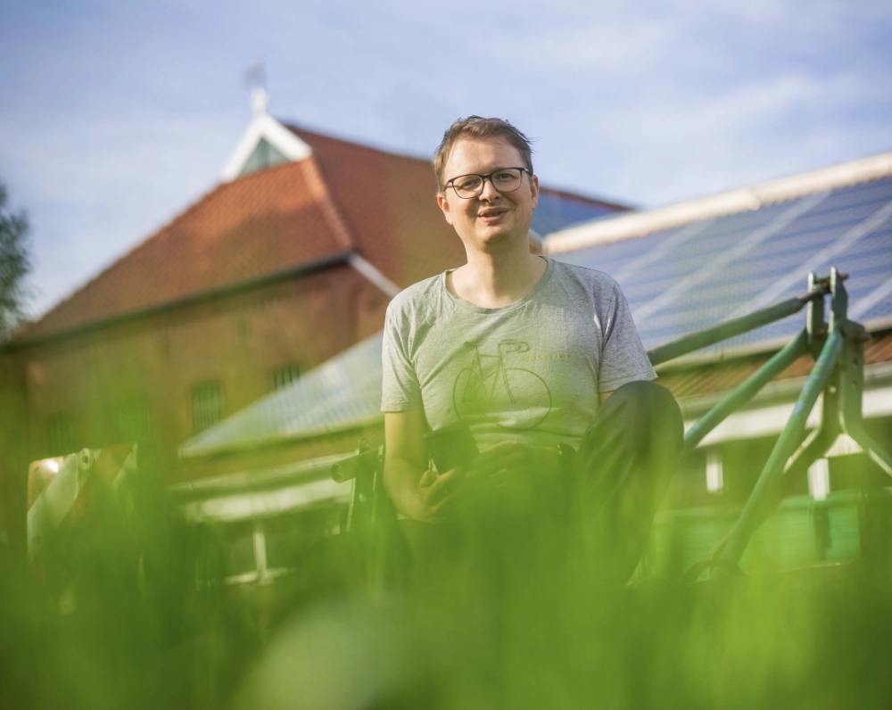
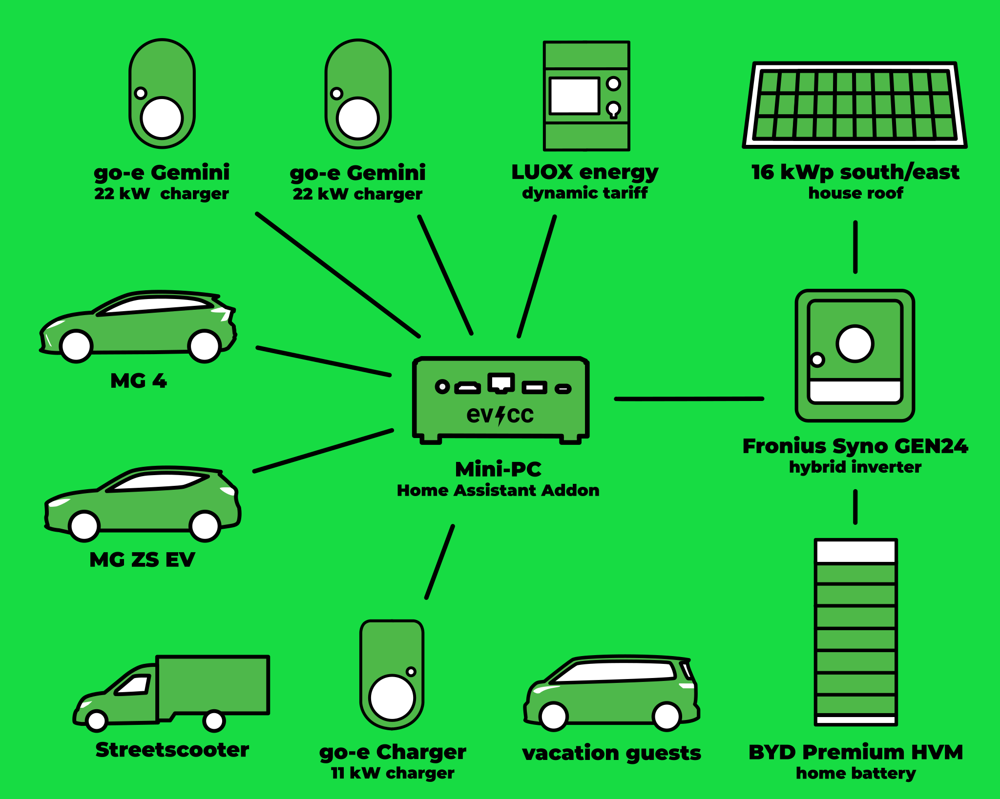
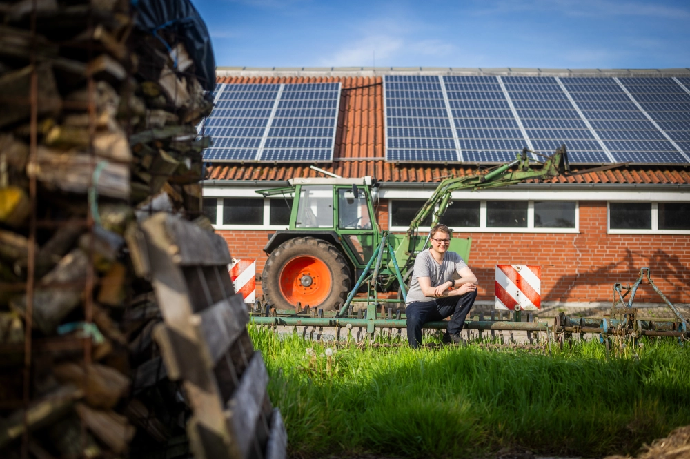

This is the third post in our series of community portraits.
Photographer [Detlef](https://hee.se) visited Tjarko from Großefehn at the [Gröönlandhof](https://www.groeoenlandhof.de).
In addition to great photos, there are also interesting insights.

{/* truncate */}

## Multi-Generational Plus Energy Farm Project

**Michael:** Hello Tjarko, great that you are taking the time for a community portrait.
Your farm, the Gröönlandhof, was featured in the [PV Magazine](https://www.pv-magazine.de/2021/01/15/selbst-ist-der-groeoenlandhof-wallbox-ladesteuerung-selbst-gebaut/) a few years ago, and some users might have heard the name before.
Maybe you can start by telling us about yourself?

**Tjarko:** Yes, gladly.
Six years ago, we converted the heritage-protected, parental farm into a multi-generational plus-energy farm project, the Gröönlandhof.
Since then, we've been living here together with other people and, among other things, we also run a Community Supported Agriculture project.
On the farm, we have an electric delivery van, the Streetscooter, and two electric passenger cars.
We started with a Renault Zoe, which has since been replaced by an MG ZS and an MG 4.
The whole setup is powered by several PV systems.

## 4 PV Systems, 3 Charging Points, 3 Electric Cars, and Vacation Guests

**Michael:** PV systems are a good keyword.
Perhaps we can delve into the technical details here.
What does your setup look like?

**Tjarko:** Well, as I mentioned, we have two full feed-in systems that will soon be converted to self-consumption, and a 16 kWp PV system with a south-east orientation that we already use for our own needs.
We're also planning another 16 kWp PV system with a south-west orientation.
The whole setup is distributed via a Fronius Symo inverter and a large home storage system from BYD with 22 kWh.
We have three charging points at various locations on the farm: two Go-e Chargers with 22 kW and one Go-e Charger with 11 kW.
We've limited the charging points to a maximum of 22 kW in total through the integrated load management.
We've created RFID chips for all vehicles, so you can easily track the charging processes with evcc.
Since more and more guests (farm visitors, vacation guests, etc.) are coming with electric cars, there's also an RFID chip for guest vehicles.
In the past two years, we've managed to cover 45% of our charging power with solar energy!

In terms of hardware, I initially ran evcc for testing on a Synology NAS with Docker, but now it runs on a micro PC as an add-on in Home Assistant.
I find this easier and more comfortable, and it offers even more possibilities for automation through Home Assistant.
Additionally, all farm residents can easily manage it through the Home Assistant app.

| Component                 | Details                                                                 |
|---------------------------|-------------------------------------------------------------------------|
| **Cars**                  | MG 4, MG ZS, Streetscooter, vacation guests' cars                       |
| **Wallboxes**             | go-e Charger (11 kW, 2x 22 kW)                                          |
| **Hybrid inverter**       | Fronius Symo GEN24 10.0 Plus                                            |
| **Solar system**          | 16 kWp South/East orientation                                           |
| **Storage**               | BYD Premium HVM (22.1 kWh)                                              |
| **Control**               | evcc on Mini-PC as Home Assistant Add-On                                |
| **Dynamic tariff**        | LUOX energy (formerly Lumenaza)                                        |
| **Planned**               | 16 kWp South/West (new system) 27 kWp system (full feed-in to self-consumption) 25 kWp system (full feed-in to self-consumption) |

We have a dynamic electricity tariff from LUOX energy (formerly Lumenaza), as they also accept small photovoltaic systems for direct marketing.

The only thing left on the to-do list now is the integration of the Homematic wireless thermostats, to raise the room temperature during the heating period with evcc when there's a solar surplus.
As two more PV systems (27 kWp and 25 kWp) will be converted from full feed-in to self-consumption in the coming years, this will make for a well-rounded setup.

**Michael:** That's really impressive, it sounds like many aspects of your daily life are integrated into a sustainable energy supply, not just charging a car.
Can you tell us a bit about your background? Why did you get involved with this topic? How did you come across evcc?

**Tjarko:** I myself am an engineer for Renewable Energy Systems and have been dealing with the topic of energy generation, storage, and management for a long time, both privately and professionally.
As a researcher, I have published Open Data and Open Source projects myself, so I'm generally very enthusiastic about the topic.
I came across evcc directly on GitHub and quickly saw its potential.
Above all, the fact that evcc could take into account the charging status of vehicles long before many other solutions was a big plus for me.

## Cloud-based solutions will never be able to do this to this extent

**Michael:** Tjarko, you've been an evcc user from the very beginning - what fascinates you about the project? And what would you perhaps wish for in the future?

**Tjarko:** evcc has always been at the forefront of integrating as much hardware as possible while keeping all functions very understandable in operation.
The biggest advantage for me in the future is that it runs locally on the network and can therefore control many storage systems.
In addition to the already implemented feature "discharge lock at low electricity prices", it has recently become possible to "charge the storage from the grid".
Cloud-based solutions will never be able to do this across manufacturers to the extent that evcc can.

My biggest wish is that the **configuration** is fully possible via the web interface and that there are also one and several companies that distribute evcc together with hardware, so that many more users can benefit from evcc.

**Michael:** Well, let's see how quickly this wish comes true.
Thank you very much for your time and all the best!
