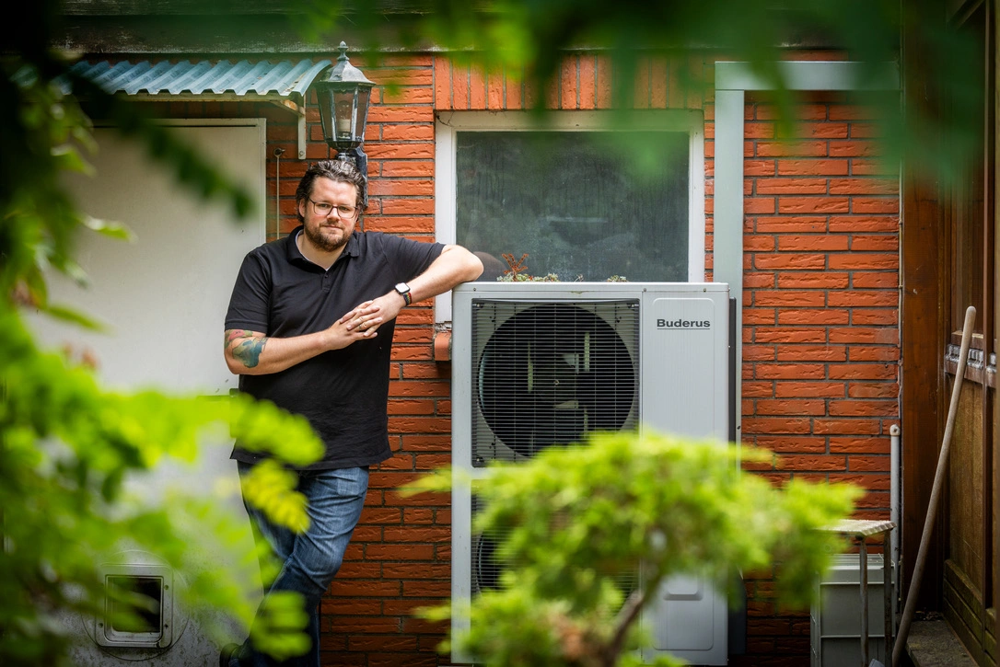
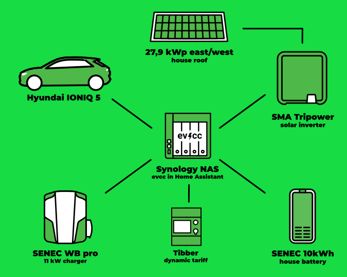
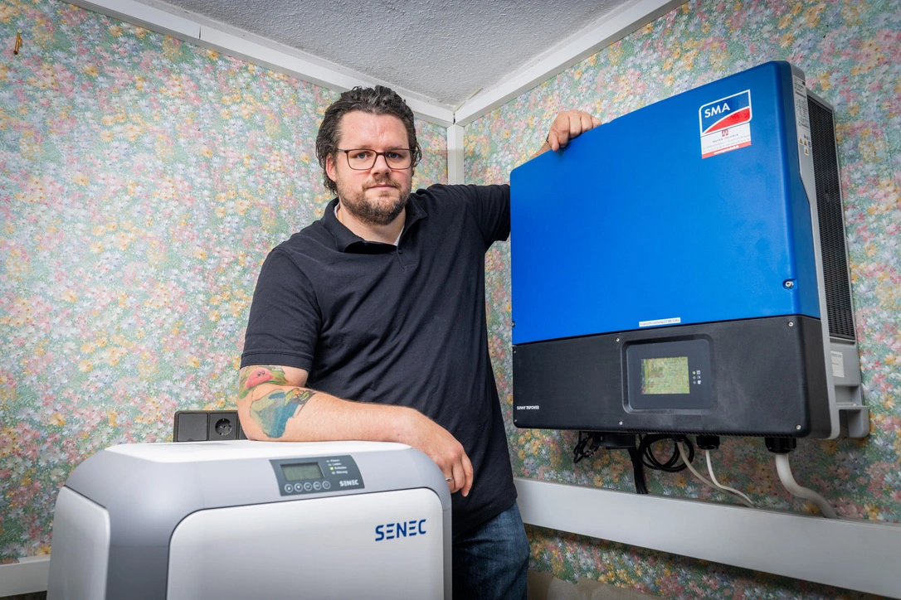
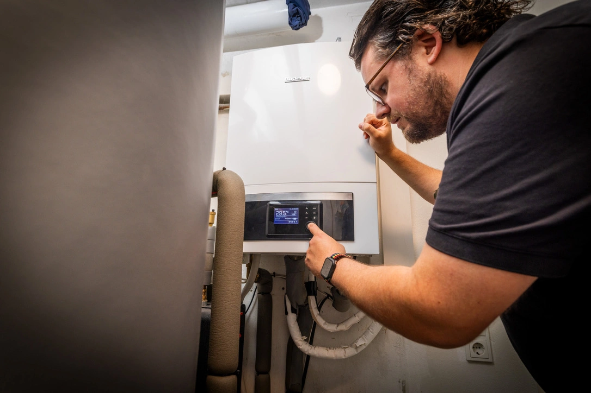

In our series of community portraits, photographer [Detlef](https://hee.se) recently visited Bastian from Alhorn, Großenkneten.

{/* truncate */}

## „Now is the time!“

**Michael:** Hello Bastian, how nice to meet you.
Tell us a little about yourself and how you got into electric cars and surplus charging.

**Bastian:** Yes, gladly.
My name is Bastian and I live with my wife and two children in the municipality of Großenkneten in the district of Oldenburger Land.
The location was perfect for us because we are close to larger cities (Vechta, Oldenburg, Bremen), but the house was still affordable.
The infrastructure of the place also has everything within walking distance that we need, including two grocery stores, all types of schools, and a kindergarten.
After we moved into our house from 1978, I relatively quickly started dealing with the topic of PV systems.
The roof surfaces in a bungalow with a pitched roof are just perfect for it.
And electricity was, in my opinion, already too expensive at that time.
"Now is the time" was the motto, so that you can get as much out of it as possible.
So very soon we installed a large PV system on the east and west roof.

## 28 kWp Solar + Dynamic Electricity Tariff = 💚

**Michael:** Using the roof for electricity generation is always a great idea.
Then came the electric car?

**Bastian:** Yes, exactly, last year my employer announced that they would start an electric car leasing, which was then the decisive point for us to enter the exciting field of electric mobility.
Since we can make a lot of electricity through the large roof surfaces, it made sense for us to charge the car exactly with it.
When searching for solutions, I quickly came across evcc on the internet.
That, and the integration of Frigate, were also the reason for me to switch from ioBroker to Home Assistant.
In the beginning of January we also switched to Tibber, so that we can also charge cheaply in the winter.
Two years ago, we installed a heat pump which, especially in winter, uses almost all of our PV electricity.
So there's not much left, but with Tibber I'm able to charge cheaply at night.

## Synology, Home Assistant and evcc

**Michael:** That makes sense.
Especially in winter, you can save a lot with a dynamic electricity tariff.
How does your current technical setup at home look like?

**Bastian:** Here's an overview of the components that work with evcc at my home:

| **Component** | **Details** |
|----------------|-------------|
| **Hardware**   | Synology DS923+ |
| **Software**   | Home Assistant with evcc Addon |
| **Car**       | Hyundai IONIQ 5 |
| **Battery**   | SENEC.Home 2.1 10kWh |
| **Wallbox**    | SENEC.Wallbox pro |
| **Inverter** | SMA Tripower STP 25000TL-30 |
| **PV**         | 27,88 kWp, AXITEC X HC 340 82 Module (40 Ost, 42 West) |
| **Electricity**      | Tibber |

**Michael:** That's quite a few different components at work.
You had already mentioned that you use Home Assistant.
Are there any more integrations into other systems?

**Bastian:** I'm currently only using Home Assistant.
With evcc, I mainly want to track my daily electricity costs.

**Michael:** You mentioned that you found evcc through an internet search.
What was the reason for you to choose the system?

**Bastian:** I came across evcc pretty quickly.
I first tried the Senec components, but their system was not able to offer PV-surplus charging.
So I then came across evcc.
Since January, I'm using price-sensitive charging with Tibber, which enabled my to charge cheaply in the winter.

**Michael:** Which evcc feature do you like best?

**Bastian:** That's a tough question, but I think I like the automatic charging at cheap times the most.
I also like that evcc is very user-friendly and comes with a very clear UI.

## Next Goal: Heat Pump

**Michael:** Do you have any wishes for the future development?

**Bastian:** I'm following the project on GitHub and am already looking forward to when the charging in combination with the PV forecast will arrive.
Also charging with a more sophisticated planner would be great.
Especially the latter will bring me better through the winter.

My next goal is then to integrate my heat pump.
I'm still unsure whether I should do this directly in evcc or in an EMS system and if so, which one.
First, I need to be able to reach my heat pump.
That's not so easy with Buderus/Bosch…

**Michael:** Das klingt doch perfekt.
Better integration for heat pumps is also on our agenda.
Thank you very much for sharing this with us and all the best for the future!

