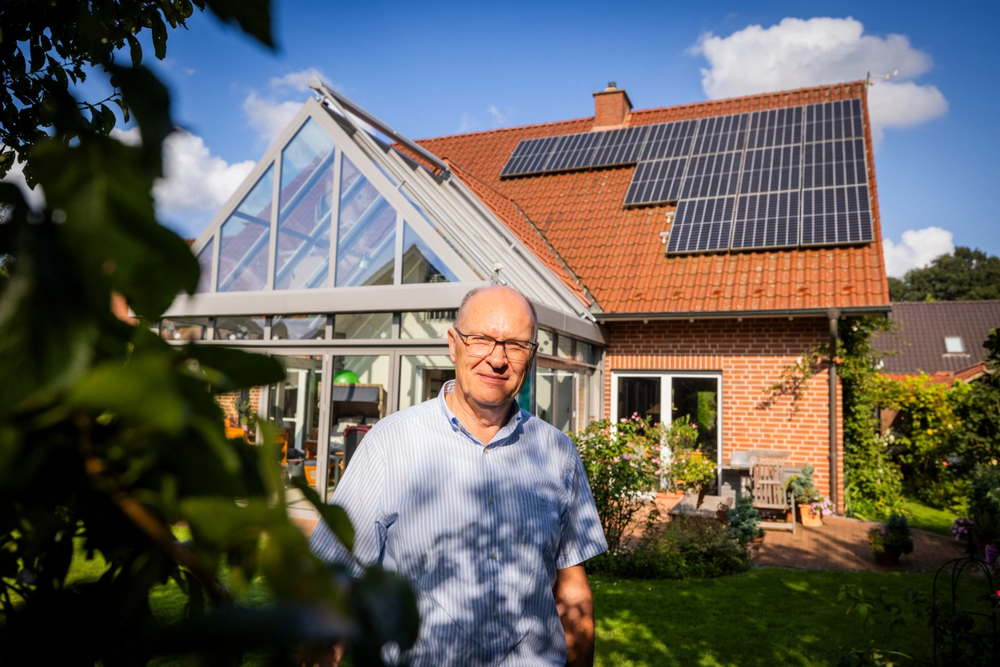
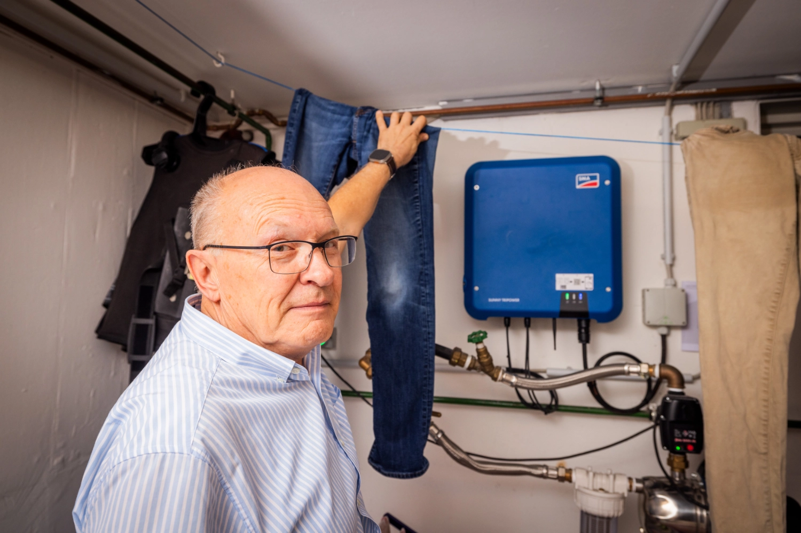
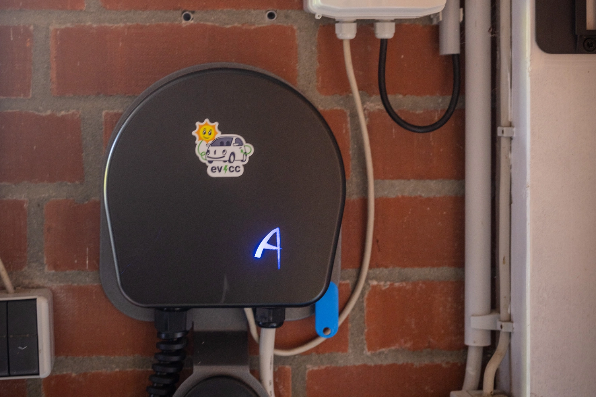
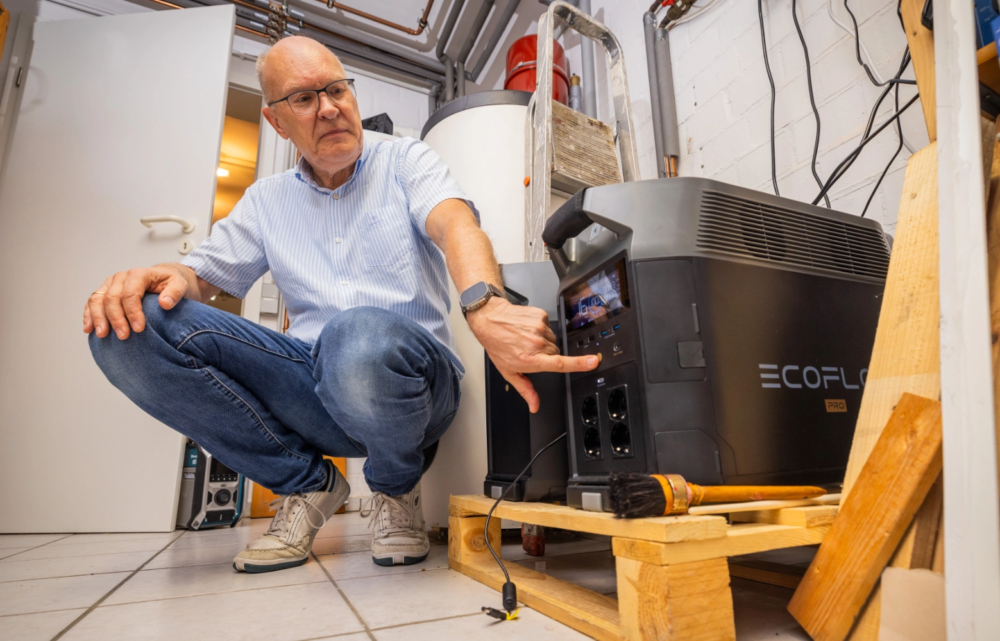
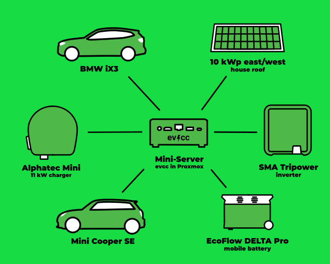
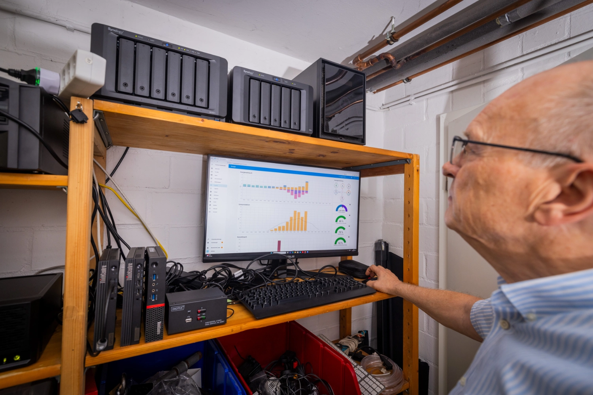

In our series of community portraits, photographer [Detlef](https://hee.se) visited Andreas in Wettringen in the Münsterland region.

{/* truncate */}

## Fascinated by IT and kept going

**Michael:** Hello Andreas, nice to meet you.
Tell me a little bit about yourself and how you got into electric cars and solar charging.

**Andreas:** Yes, hello Michael.
I'm a pharmacist by profession.
I've been the manager of the Sonnen-Apotheke in Wettringen for 35 years.
I'm married, have two, now grown-up children and we live in a single-family house on the countryside.
I've sold the pharmacy at the beginning of this year, but the IT in the pharmacy, 10 workstations, 5 virtual servers, Windows and Linux, I've always managed myself.
This knowledge I could take with me.
I've been dealing with IT since my discharge from the Bundeswehr.
With the severance pay, I purchased my first computer, a Tandy TRS 80.
Since then I've been fascinated by IT and I've stayed with it.

**Michael:** Wow, you have a lot of technical background knowledge and a good overview of what it takes to run a business with all that.
How did you get into electric cars and solar charging?

**Andreas:** Three years ago, I bought a Mini SE out of interest in the technology.
The car replaced a combustion engine Mini Cooper.
At the time, wallboxes were still scarce, so I took the one the installer recommended.
I had no knowledge what a good solution would be.
Two months later, the 10kWp PV system was installed.

One half of the modules is oriented to the east (4.6 kWp), the other half to the west (5.4 kWp).
Since I had no storage at that time, I wanted to use the surplus of the PV system directly to charge the Mini.

## The Manual was no Longer a Solution

**Michael:** Okay, you were so early on the topic that there were not many experience values and you made your own.
Did it work with the Mini and charging as you imagined?

**Andreas:** Well, there was no control logic in my installation.
Every morning, when the sun was up, I went to the car and plugged it in.
This manual process became tedious quickly, so I started looking for automations.
Since I've been dealing with Open Source for a long time, I looked a bit on GitHub and came across evcc.
An installation on a running Linux server was quickly made.
The different components like inverter, EV charger and car were quickly integrated.

## Wallbox-Debugging, but now it's running

**Michael:** That sounds like a good start.
How did you proceed?

**Andreas:** Everything worked, only the wallbox, an Alphatec Mini, was not controllable.
After a little research in the forum, it quickly became clear that the EV charger did not work as it should.
There was no proper description of the control commands either.
But [Premultiply](https://github.com/premultiply) can probably say more about that.
After my contact with the manufacturer, it went quickly, Premultiply received a test box and the firmware of the control board was updated.
I sent the board to the manufacturer and got the new firmware installed.
Now evcc can talk to the wallbox.
Thanks to this solution, the problem was not only fixed for me, but also for all new Alphatec users.
Open Source at its best!

A step-by-step adjustment of the charging power from 6 to 16 A was finally possible.
Since the box does not allow switching between single-phase and three-phase, a load switch was added to the sub-distribution.
Normally I charge with one phase, since I mostly don't have more surplus.
If I need a faster charge, I manually switch to three phases.
The fun with evcc could begin.

**Michael:** Ah, then you have optimized and adapted your first setup.
How did it affect the usage?

**Andreas:** After a year of operation of the system, I could see that I, despite the electric car, feed about 4,500 kWh into the grid.
So, a second electric car would fit perfectly.
The old family car, also a diesel, was replaced by an electric one.
Now two cars are charged with evcc, one car is always connected to the charging station.

Optimal for our situation.
To be able to continue to operate at least one or other device in case of a temporary power outage, I bought an EcoFlow DELTA Pro with additional battery, a total of 7.2 kWh storage.
With some scripts in Home Assistant, these are charged when there is a surplus.
A part of the storage is then used during the night to reduce the power consumption, the rest as a reserve.

| **Component**        | **Details**                              |
|----------------------|------------------------------------------|
| **Cars**             | Mini SE, BMW iX3                         |
| **EV Charger**       | Alphatec Mini                            |
| **Inverter**         | SMA Tripower 10                          |
| **Solar System**     | 10 kWp (4.6 kWp East, 5.4 kWp West)      |
| **Storage**          | EcoFlow DELTA Pro (7.2 kWh)              |
| **Control**          | evcc on Ubuntu Server under Proxmox      |
| **Integrations**     | Home Assistant                           |

## Home automation and media server

**Michael:** That sounds like an exciting journey.
What does your homelab setup look like?
Do you use integrations into other systems?

**Andreas:** Oh yes, I've been fascinated by home automation for a long time.
Originally I started with Homematic home automation.
And more and more components came along.
Since I also tried other manufacturers, I quickly wanted to manage all components together.
Home Assistant was my integration.

I've also been running a media server for two decades.
My children have always managed to damage the music tapes and CDs so much that they were no longer usable.
So I started early to digitalize the analog media and make it available centrally.

First with applications that ran on a NAS, later as virtual servers on a hypervisor.
Currently, various homelab applications are running under Proxmox: evcc on an Ubuntu Server; Plex as a media server, eBlocker, paperlessNGX, Home Assistant.

## Meets all my needs

**Michael:** After the initial challenges and optimizations, it sounds like you now have a solution that works well.
Do you have any wishes or suggestions for the future development of evcc?

**Andreas:** For me, evcc meets all my needs.
I'm happy with the available feature set.
It covers all the requirements I have.

**Michael:** Thank you for the conversation, Andreas.
It was great to hear about your setup and your experiences.
I wish you all the best for the future.

