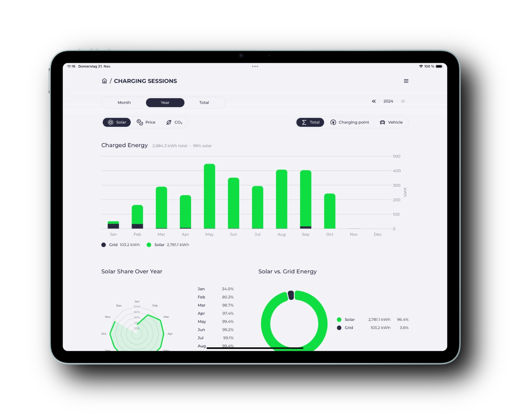

The days are getting shorter.
A good reason to give a small update on what has been done since the [last article in August](/blog/2024/08/17/highlights-14a-enwg-ocpp-loadmanagement-elli).


{/* truncate */}

## Visualization of charging sessions

The overview of [charging sessions](/docs/features/sessions) has been available for a while.
Besides the basic data like energy consumption, charging times, vehicle and odometer readings, we have been collecting information about the share of self-produced solar energy, real prices and CO₂ emissions for some time now.

Previously, this data was only available as a table or CSV export for self-analysis.
Now we've added nice visualizations of your charging energy, solar energy share, costs and CO₂ emissions.



If you have multiple charging stations or vehicles, you can group and compare the data.
In the [documentation](/docs/features/co2) you can find out how to set up the required [CO₂ data sources](/docs/features/co2) and [dynamic prices](/docs/features/dynamic-prices).


## Battery Boost

The first version of the often requested [Battery Boost](/docs/features/battery#batterie-boost) has made it into the release as an experimental feature 🧪.
This function supplements the classic PV surplus charging.
When activated, the home battery's stored energy is also used to charge the vehicle in addition to the available solar energy.
The system automatically determines the maximum charging power that the storage system can provide.


The boost can be activated per charging station and will automatically turn off when the vehicle is disconnected.

This can be particularly practical on sunny days.
If you want to drive off in the afternoon with your car from home, you can activate the boost before you leave, so that the energy of the fully charged home battery is transferred to the vehicle.
Your vehicle leaves with a higher charge level and your home battery has space left to store the energy of the afternoon sun, which you would otherwise have fed into the grid.

Additional settings like setting charging limits and a more prominent placement in the UI (as a Boost button) are on the agenda for a future release.

## Flexible Tariffs

The list of [different tariffs](/docs/devices/tariffs) is growing steadily.
Especially in the coming years, the topic of dynamic tariffs will gain in importance.

Digital-first providers like Tibber, Awattar, Octopus or Ostrom offer APIs for the current price and price forecasts for the next day.
These prices often already include grid fees and other costs.

For dynamic tariffs, for which the provider does not offer an API, there is the possibility to determine the electricity price based on the day-ahead price at the electricity exchange itself.

A good data source for the spot price is the [Energy Charts](https://api.energy-charts.info) interface of Fraunhofer ISE.
This can be used without prior registration.

Here is an example configuration for the German price zone:

```yaml
tariffs:
  grid:
    type: template
    template: energy-charts-api
    bzn: DE-LU
    charges: 0.22 # fixed surcharge per kWh (e.g. 20ct grid fee, 2ct provider fees)
    tax: 0.19 # percentage surcharge (e.g. 19% VAT)
```

The formula `(price + charges) * (1 + tax)` is used to calculate the final consumer price per kWh.
This formula was previously hard-coded.

For more complex tariffs, e.g. with an upper cost limit, you can now also adjust this formula yourself.
Here is an example for a dynamic tariff with an upper cost limit of 50ct/kWh:

```yaml
tariffs:
  grid:
    type: template
    template: energy-charts-api
    bzn: DE-LU
    charges: 0.22 # fester Aufschlag pro kWh (bspw. 20ct Netzentgelt, 2ct Gebühren)
    tax: 0.19 # prozentualer Aufschlag (bspw. 19% MwSt.)
    formula: math.Min(0.5, (price + charges) * (1 + tax))
```

In addition to the spot price (`price`) and the values for `charges` and `tax`, you also have the power of the [math](https://pkg.go.dev/math) library of Go at your disposal.

## Hybrid inverters with limited AC power

Some hybrid inverters offer a higher DC power than the AC power.
This means they can, for example, handle 10 kW of PV power, but only provide 8 kW of AC power for the house grid.
The remaining 2 kW is stored DC-side in the battery.
This has always caused problems in the surplus regulation, since evcc calculates with the full PV power.
The global configuration option `maxGridSupplyWhileBatteryCharging` (yes, a clumsy name) was an attempt to counteract these unintended side effects.

We have replaced this option with a more stable solution.
All affected [inverter templates](/docs/devices/meters) (e.g. Fronius, Growatt, SMA, Sungrow, ...) now have the extended option `maxAcPower`.
This allows you to define the maximum AC power (e.g. `maxAcPower: 8000` for 8 kW) per inverter.
The surplus regulation now takes this value into account accordingly.

## Sponsor cocharge: make your private charging station public

We are pleased to welcome the Bremen startup [cocharge](https://cocharge.de/evcc) as a new sponsor.


cocharge allows private users to make their charging station public.
Your wallbox then appears in the apps of the major charging card providers, optionally with definable opening hours.
For the electric car owner, charging and billing at your station works just like at any other public charging station.
cocharge takes care of the technical details, claims for THG quotas, roaming agreements and the bureaucracy.
**Your additional income from external charging sessions is paid out monthly.**

The prerequisite for using cocharge is a **certified charger (eichrechtskonform)** that **supports OCPP**.
The charging point must also be **publicly accessible**.
There are no one-time or recurring costs.
cocharge charges only a 15% commission for each charging session.

If you have a [company car](https://cocharge.de/dienstwagen-laden) and a charging card from your employer, this solution can be particularly interesting for you.
You not only save yourself the bureaucracy by automatic billing
You can also earn extra money if you charge with your own solar power or at a dynamic tariff at favorable times.

Using both cocharge and evcc together?
Most certified chargers also have a local interface like Modbus besides OCPP.
You can then make your wallbox public and locally optimize the charging power parallel with evcc.

If this sounds interesting to you and you want to be one of the first users, take a look at [cocharge.de/evcc](https://cocharge.de/evcc).

## Many small improvements

As usual, there were also many small improvements, bug fixes and support for new wallboxes, inverters and other devices.
You can find more details in the [Release Notes](https://github.com/evcc-io/evcc/releases).

💚 A big thank you goes to all who support the project through active participation and financial sponsorship.

**Happy charging!**<br/>
The evcc Team<br/>
Michael, Andi & Uli
